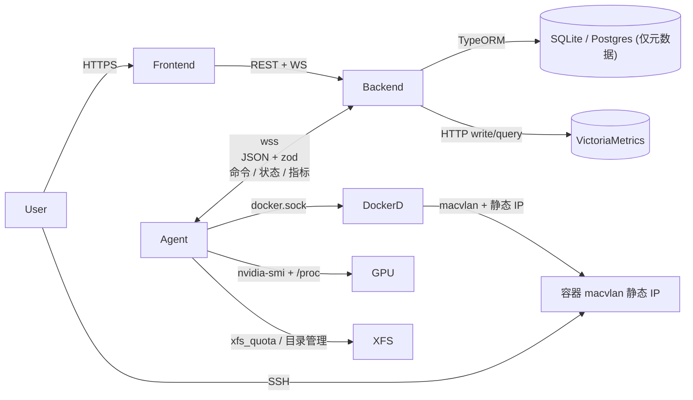
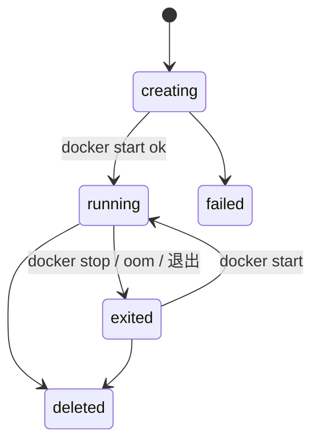

# nyabase 开发容器管理平台 设计方案

## 1. 总体架构



核心约束（按你最新反馈）：
- Agent 与 backend 之间**唯一**通信通道是 WebSocket。指标也走 WS 由 backend 转写到 VM。Agent 不直接访问 VM、不暴露 HTTP。
- Backend DB **不存任何容器相关信息**，包括 IP 分配、容器配置、容器状态、宿主上的资源占用。
- 容器状态/规格/归属/IP 全部以 docker label 形式存在 agent 上（即容器自身）。
- IP 按 CIDR 顺序懒分配，每次创建容器实时算"最小未占用"，删除产生的空隙优先填充。
- 每台主机可挂载多块**数据盘**（多个 XFS 挂载点），UI 展示总量/已用/可用。
- 数据目录由用户在每台机上手动创建，路径约定 `<dataDiskMount>/<userId>/<name>`，同主机不同容器可挂载同一个目录。
- 容器级资源使用（CPU/MEM/NET/DISK/GPU）：实时从 agent 取（WS 请求或 stateReport 中的最新快照），历史从 VM 取。
- 前端使用 shadcn/ui。

## 2. 仓库结构（pnpm workspace）

```
nyabase/
  package.json
  pnpm-workspace.yaml
  tsconfig.base.json
  packages/
    common/        # 协议 + zod + 枚举 + 共享工具（前后 + agent 三端共享）
    backend/       # NestJS + TypeORM + WS 网关 + VM 客户端
    agent/         # node 守护进程：dockerode + ws client + xfs/gpu/metrics
    frontend/      # Vite + React + shadcn/ui
  deploy/
    docker-compose.yml
    agent.systemd.service
```

## 3. `common` 包：协议唯一真源

- [packages/common/src/enums.ts](packages/common/src/enums.ts)：`ContainerStatus`、`AgentStatus`、`Role`、`Permission`、`MetricKind`、docker label key 常量（`nyabase.owner_id`、`nyabase.container_name`、`nyabase.image_id`、`nyabase.cpu_millis`、`nyabase.mem_bytes`、`nyabase.gpu_indices`、`nyabase.ip`、`nyabase.created_at`、`nyabase.data_dirs`(JSON)、`nyabase.spec_version`）。
- [packages/common/src/protocol/ws.ts](packages/common/src/protocol/ws.ts)：Envelope + 消息 union。
- [packages/common/src/protocol/rest.ts](packages/common/src/protocol/rest.ts)：前端 ↔ 后台 DTO。
- [packages/common/src/protocol/schema.ts](packages/common/src/protocol/schema.ts)：所有上面类型的 zod schema；类型由 `z.infer` 反推保证单一真源。
- [packages/common/src/errors.ts](packages/common/src/errors.ts)：错误码。

WS Envelope（带 RPC 配对 id，事件类不带 id）：

```ts
export interface Envelope<K extends string = string, P = unknown> {
  id?: string;
  ts: number;
  kind: K;
  payload: P;
}
```

主要消息：
- agent → backend：`hello`（连接握手，含主机静态信息：内核/CPU/内存/数据盘列表/GPU 列表/macvlan 信息）、`heartbeat`、`stateReport`（容器全量快照：每个容器的 label、status、ip、当前 stats 摘要、xfs project 用量）、`metricsBatch`（host + 每个容器 + 每个 GPU 的时序点）、`commandAck`、`containerEvent`（docker events 透传，filter 后）、`logChunk`（exec/console 流）、`dataDirReport`（用户/数据盘下当前目录列表）。
- backend → agent：`createContainer`、`startContainer`、`stopContainer`、`restartContainer`、`deleteContainer`、`updateUserQuota`、`pullImage`、`execStream`（开 console 或注入 ssh key）、`createDataDir` / `deleteDataDir`、`reconcile`、`fetchContainerStats`（即时拉取容器 stats，区别于周期 metricsBatch）。

## 4. 数据模型（仅元数据，TypeORM）

实体放在 [packages/backend/src/entities/](packages/backend/src/entities/)：
- `User(id, username, passwordHash, displayName, role, status, createdAt)`
- `RefreshToken(id, userId, hash, expiresAt)`
- `ApiToken(id, userId, name, hash, lastUsedAt)`
- `SshPublicKey(id, userId, name, keyText)`
- `Server(id, name, parentIface, ipCidr, gateway, agentTokenHash, lastSeenAt, status)`
- `Gpu(id, serverId, index, uuid, model, totalMemMiB)` — 由 agent `hello` 上报后由 backend upsert，作为 Quota 选项展示用，不视作"容器状态"。
- `DataDisk(id, serverId, mountPoint, label, fsType, totalBytes, addedAt)` — 管理员手动添加，agent 在 `hello` 中校验存在性并定期上报 `totalBytes/usedBytes`（usedBytes 仅缓存到内存或回填该实体的可选字段，是否落库都可，但不视作容器信息）。
- `Quota(id, userId, serverId, diskBytes, cpuMillis, memBytes, gpuCount)` — 用户在某机器上的总额度。
- `Image(id, name, dockerImage, defaultUser, defaultShell, description, isActive)`
- `AuditLog(id, actorId, action, target, payload, ts)` — 仅记录后台收到的操作请求，不是容器状态。

明确 **不在 DB**：容器、容器事件、IP 分配、XfsProject 映射、数据目录列表（数据目录由 agent 根据文件系统实时枚举）。

数据库切换：`DataSource` 工厂读 `DB_DRIVER=sqlite|postgres`，列类型用 `simple-json`、`bigint` 字符串，避免 sqlite/pg 不兼容；TypeORM Migrations。

## 5. 网络与 IP 顺序懒分配

- 创建/编辑 Server 时配置 `parentIface`、`ipCidr`、`gateway`（管理员可改）。CIDR 内默认排除 `.0`、广播、`gateway`，允许管理员配置额外保留集合（如管理网关）。
- agent 启动时若 `nyabase_net` macvlan 网络不存在则创建 `docker network create -d macvlan --subnet=<cidr> --gateway=<gw> -o parent=<iface> nyabase_net`。
- **IP 真相在 docker label**：每个容器创建时写 `nyabase.ip=<x.x.x.x>`，且 macvlan 也持有该 IP。
- 顺序懒分配（在 agent 内执行，并发用 `async-mutex` 串行化）：
  1. `docker network inspect nyabase_net` 拿到当前已用 IP 集合（包含 nyabase 与非 nyabase 的容器，避免冲突）。
  2. 从 CIDR 起始（跳过保留）开始扫描，返回**第一个未占用**的 IP；删除产生的空隙天然被填补。
  3. 返回值用于 `docker create --ip` 与 `nyabase.ip` label，原子性来自 docker daemon 的网络锁；若分配后 docker create 失败，无副作用（label 不会写入）。
- 没有 IpAllocation 表，backend 也无需关心。
- macvlan 限制（宿主默认无法访问容器）写入部署文档。

## 6. 数据盘与数据目录

- DataDisk：管理员在前端"服务器详情"页添加，输入挂载点（如 `/data1`）、可选 label。前端展示 `totalBytes`、`usedBytes`、`fsType`、是否启用 `pquota`，由 agent 周期上报。
- 数据目录路径强约定：`<dataDisk.mountPoint>/<userId>/<dirName>`。dirName 由用户自由命名。
- agent 提供 RPC：
  - `listDataDirs(userId)`：扫描所有 DataDisk 下 `<mount>/<userId>/*`，返回 `{disk, name, path, sizeBytes, fileCount?}`。
  - `createDataDir(userId, diskId, name)`：mkdir + chown 到容器内对应 uid（默认 1000；若 image 指定 default uid 则用之）+ 加入该用户的 XFS project。
  - `deleteDataDir(userId, diskId, name)`：rm -rf（先确认未被任何 running 容器引用，agent 本地基于 stateReport 缓存校验）+ 从 project 移除。
- 容器创建时挂载：用户从 UI 选择若干 `(diskId, dirName)`，agent 校验路径所有权（path 必须以 `<mount>/<userId>/` 开头）后 mount 到容器内用户指定的容器路径（默认 `/data/<dirName>`）。
- 同一目录可被同主机多个容器同时挂载（不加 X 锁）。

## 7. XFS Project Quota（用户/机器共享一份额度）

需求：一个用户在一台机器上，覆盖所有 DataDisk 中其名下的目录 + 该用户所有容器的 overlayfs upper/work，共享同一份 hard limit。

约束：所有 DataDisk 与 `/var/lib/docker`（overlay2 所在）必须为 XFS、`pquota`、且为**同一个文件系统**（部署文档强调）。如果跨文件系统，必须为每个文件系统分别建一个同 `projectId`，limit 之和等于配额（一期建议强制单 fs）。

实现位置：[packages/agent/src/quota/](packages/agent/src/quota/)
- `XfsQuotaManager`：
  - `/etc/projects` 与 `/etc/projid` 是受管 XFS 真实状态；projectId 由稳定 numeric user ID 推导，Agent 不持久化私有映射或恢复文件。
  - 对每个 running 容器（按 nyabase label 过滤）的 GraphDriver upper/work 目录加入对应用户的 project。
  - `xfs_quota -x -c "limit -p bhard=<bytes> <pid>" <fs>` 设置硬限。
  - 用量上报：`xfs_quota -x -c "report -N -p" <fs>` 解析后随 stateReport / metricsBatch 一并发回。
- 配额变更：backend 下 `updateUserQuota`，agent 调整 limit；若新 limit 小于已用量返回错误，由 backend 拒绝并提示 UI。

## 8. 容器生命周期与状态机（状态以 docker 视角为准）



`creating` / `failed` 是 agent 在执行命令期间的瞬态，不写 docker label（label 仅写 spec，不写状态）；状态从 `docker inspect` 的 `State.Status` 派生。

create 流程：
1. backend 收到 REST 请求，校验 RBAC。
2. backend 在 stateReport 缓存中聚合该用户在目标 server 上的当前 cpu/mem/gpu/disk 占用，加上待创建数量与 quota 比较，越限拒绝。
3. backend 经 WS RPC 调用 agent `createContainer(payload)`：image、ownerId、name、cpuMillis、memBytes、gpuCount 或 gpuIndices、dataDirs（相对路径与挂载点）、sshUser、sshPubKeys、containerInternalUserUid。
4. agent：
   - 锁定 IP（见 §5）。
   - 确认 user xfs project 存在并 limit 已设置；mkdir 数据目录（若选用未存在的 name 一次性创建）；将待挂载目录加入 project。
   - `docker create` 带：
     - `--network nyabase_net --ip <ip>`
     - `--cpus`, `--memory`, `--memory-swap=<same>`
     - 共享 GPU：`NVIDIA_VISIBLE_DEVICES=<idx,idx>`，`--runtime=nvidia` 或新版 `--gpus 'device=...'`
     - 多个 `-v <host>:<container>` 数据目录挂载
     - 全部 spec 写入 `--label nyabase.*=...`
   - `docker start` → 拿到 GraphDriver upper/work，加入 project。
   - exec 注入：创建容器内用户（若 image 没提供）→ 写入 authorized_keys（700/600 权限） → 启动 sshd（image 自带）。
   - 返回 commandAck + 触发一次 stateReport 增量。
5. delete：`docker rm`（不带 -v）→ 数据目录保留（不属于该容器，属于用户）→ overlayfs 由 docker 销毁，project 上的引用自动消失（fs 视角） → 触发 stateReport。

stop/start/restart：直通 docker，状态由 stateReport 同步。

## 9. GPU 共享与监控

- 调度（backend 一侧，从 stateReport 缓存里读各 GPU 容器占用计数）：
  - `gpuCount: N`：选当前在该 server 上引用计数最少的 N 个 index。
  - `gpuIndices: [...]`：原样使用（可重叠）。
  - 最终 indices 写入 `nyabase.gpu_indices` label，重启保持稳定。
- agent GPU 监控（[packages/agent/src/gpu/](packages/agent/src/gpu/)）：
  - 每 metricsInterval（默认 10s）跑两次 nvidia-smi：
    - 主机视角：`--query-gpu=index,uuid,utilization.gpu,memory.used,memory.total,temperature.gpu,power.draw --format=csv,noheader,nounits`
    - 进程视角：`--query-compute-apps=pid,used_memory,gpu_uuid --format=csv,noheader,nounits`
  - pid → container：读 `/proc/<pid>/cgroup`，cgroup v2 一行 `0::/system.slice/docker-<id>.scope` 或 `0::/docker/<id>`，正则提取 64 hex；v1 fallback 用任一控制器。
  - 反查 agent 内存中的容器索引（按 docker id），得到 ownerId 与容器名。
- 指标：
  - `nyabase_gpu_util_ratio{server,gpu_index}`
  - `nyabase_gpu_mem_used_bytes{server,gpu_index,container_id?,user_id?}`
  - `nyabase_gpu_proc_count{server,gpu_index}`

## 10. 主机与容器性能监控（全部走 WS）

agent collector ([packages/agent/src/metrics/](packages/agent/src/metrics/))：
- host：`/proc/stat`（cpu）、`/proc/meminfo`、`/proc/diskstats`、`/proc/net/dev`、loadavg。
- 每 DataDisk：通过 statfs 与 `xfs_quota report` 得 `nyabase_disk_total_bytes / used_bytes / quota_used_bytes{user_id}`。
- container：cgroup v2 `cpu.stat`/`memory.current`/`memory.max`/`io.stat` + 容器内/proc/<pid>/net/dev（取 `eth0@<container_pid>` 在主机的 veth 端，或直接读容器命名空间）；docker stats API 作为 fallback。
- gpu：见上。

发送：每 10s 攒一批 `metricsBatch` envelope 通过 WS 发给 backend；backend 在 [packages/backend/src/metrics/writer.ts](packages/backend/src/metrics/writer.ts) 中转写到 VictoriaMetrics（`/api/v1/import/prometheus` 或 `import/native`）。所有指标标签包含 `server`、`server_name` 与（容器/GPU 相关时）`container_id`、`user_id`。

容器级查询接口（前端用）：
- 实时面板：直接调 backend `/api/containers/:id/stats`，backend 通过 WS RPC `fetchContainerStats(containerId)` 即时拉一次。
- 历史曲线：backend `/api/metrics/query[_range]` 反代 VM；非 admin 强制注入 `user_id="<self>"` label 重写。

## 11. WebSocket 网关与状态缓存

[packages/backend/src/gateway/agent-gateway.ts](packages/backend/src/gateway/agent-gateway.ts)：
- 路径 `/ws/agent`，`Authorization: Bearer <agentToken>`，匹配 `Server.agentTokenHash`。
- `AgentSessionManager`：`Map<serverId, AgentSession>`，重连时踢旧。
- `AgentRpc.send<T>(serverId, kind, payload, timeoutMs)` 维护 pending map，超时拒绝。
- 入站 zod 校验失败立即断连 + 审计。
- **stateCache**（内存，跟随进程生命周期；进程重启等待下一轮 stateReport 即可）：
  - `Map<serverId, ServerSnapshot>`，含每个容器的 spec（来自 label）、status（来自 docker inspect）、最新 stats 摘要、ip、user、xfs project 用量、GPU 占用计数、数据目录列表。
  - agent 启动时全量上报，之后 5s 心跳 + 增量 `containerEvent`，每 60s 一次全量自愈。
  - backend 重启或 agent 重连：要求 `reconcile`（全量）。
- "我的容器"列表 API：在 stateCache 中按 ownerId 过滤聚合，毫秒级。
- 创建/操作命令：fan-out 到具体目标 server，等 ack。

agent 端 [packages/agent/src/ws/](packages/agent/src/ws/)：
- 单一长连接，唯一对外通道。
- 指数退避重连，断连期间命令丢弃（backend 端 ack 超时返回错误）；agent 内部状态/quota/IP 操作仍然依赖 docker label 真相。
- 出站 envelope 自带 uuidv7 id（事件类省略）；命令处理统一接口 `Handler<TPayload, TResult>`。
- Agent 不保存本地业务/协调状态；token 与网络参数来自静态配置，任务恢复只依赖 Backend task 与受管资源真实状态。当前执行架构以 `docs/agent-task-execution.md` 为准。

## 12. 用户与权限

- 角色：`admin`（全权 + 多用户管理 + 全部 quota）、`operator`（管理任意容器与查看监控、不能管用户）、`user`（仅自己资源）。
- 资源限制：`user` 看到的 stateCache 视图按 `nyabase.owner_id == self` 过滤。
- ApiToken 用于脚本调用，等价于该用户身份。

## 13. 前端（shadcn/ui）

技术栈：Vite + React 18 + TS + TanStack Router + TanStack Query + zustand + Tailwind + shadcn/ui + Recharts + xterm.js。

页面（[packages/frontend/src/pages/](packages/frontend/src/pages/)）：
- `/login`
- `/dashboard`：集群概览、agent 在线、各机器水位（CPU/MEM/DISK/GPU）。
- `/servers`：服务器列表 + 详情（基础信息、CIDR/已用 IP 数、GPU 列表、数据盘列表与容量条、当前在线状态）。子页支持添加/删除数据盘。
- `/images`：镜像 CRUD（admin）。
- `/users`：用户、角色、SSH 公钥、quota 矩阵（每用户 × 每机器一格，shadcn `DataTable`）。
- `/containers`：自己的容器列表（所有机器聚合），每行实时 CPU/MEM 进度条；详情页：规格、IP、挂载、GPU、Web Console（xterm.js 经 backend WS exec 转发）、实时图表、历史图表（VM 区间）。
- `/data-dirs`：当前用户在每台机器/每块数据盘下的目录管理（创建/删除/查看大小）。
- `/metrics`：自由 PromQL（admin） / 内置面板。
- `/audit`：审计（admin）。

## 14. 部署

- backend、frontend(nginx)、victoriametrics 用 [deploy/docker-compose.yml](deploy/docker-compose.yml)；可选 postgres。
- agent：每机 systemd 跑 node 进程（不容器化，需要 root 调 nvidia-smi、xfs_quota、操纵 `/var/lib/docker` 与 `/etc/projects`）。配置 `/etc/nyabase/agent.yaml`：

```yaml
backendUrl: wss://platform.example.com/ws/agent
agentToken: "..."
dockerSocket: /var/run/docker.sock
dataDisks:
  - { mountPoint: /data1 }
  - { mountPoint: /data2 }
overlayMount: /var/lib/docker
parentIface: eth0
metricsIntervalMs: 10000
```

> dataDisks 也在 backend 创建 DataDisk 实体时同步要求 agent 已配置；不一致时 agent `hello` 报告差异，backend 标红提示。

## 15. 安全要点

- agent token 创建 server 时一次性显示；DB 仅存 hash。
- WSS 强制；JWT 短期 + refresh；密码 argon2id。
- 容器 sshd：仅 publickey、关闭 root login、关闭密码。
- macvlan 与管理网络物理或 VLAN 隔离，文档强调。
- 删除容器只回收 IP 与 overlayfs；数据目录由用户主动删除。

## 16. 不做 / 二期

- 镜像构建 / 用户上传镜像。
- MIG / 显存硬隔离。
- 跨机迁移、自动调度。
- DHCP / 动态 IP。
- OIDC / LDAP（预留 `AuthProvider` 抽象）。
- 数据目录跨用户共享（强约定路径前缀，二期再开）。
