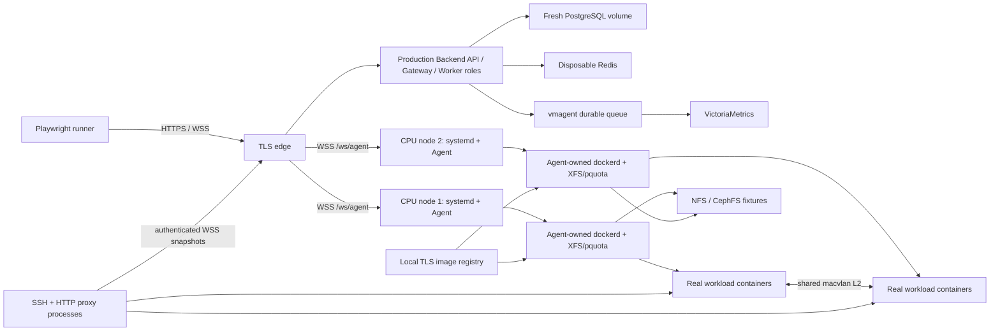

# CPU-only real E2E architecture

Status: implemented framework; current runtime release proof pending

## 1. Objective

Replace the legacy fixed-host/shared-state test system with a self-contained,
CPU-only E2E framework that exercises the current product through real
processes and kernel facilities:

`browser/API -> TLS edge -> Backend roles -> PostgreSQL/Redis/vmagent/VictoriaMetrics -> Agent -> managed dockerd -> container`

The framework must cover every published CPU product surface through an
explicit inventory. Unit tests, typechecks, builds, lint, and conformance checks
remain as lower quality layers; they are not counted as E2E coverage.

## 2. Non-negotiable rules

1. No mocked HTTP routes, fake Agent, fake Docker API, `page.setContent`, visual
   baselines, or snapshot approval workflow.
2. Playwright is the E2E runner because it can drive both real HTTP requests and
   a real browser. Its use does not revive the removed visual framework:
   `page.route`, `context.route`, route fulfilment, and snapshot assertions are
   forbidden by a conformance check. Screenshots are failure diagnostics only.
   Playwright trace and video are disabled because traces retain authorization
   headers/request bodies and browser recordings can retain credential input;
   only explicitly redacted diagnostics may be archived.
3. Every run starts with a fresh, isolated control plane and uniquely named
   runtime resources. Tests do not reuse persistent users, databases, hosts, or
   containers from another run.
4. Missing infrastructure is `BLOCKED`, not `SKIP` or an accepted PASS.
5. GPU discovery, allocation, metrics, and GPU images are outside this project.
   CPU denial of GPU requests remains a security/input case.
6. The default Docker-DinD provider uses real systemd, XFS project quotas,
   cgroup v2, dockerd, mounts, network namespaces, and processes. It shares the
   host kernel and therefore does not prove physical NIC/switch behavior.
7. All secrets are generated per run, stored below a mode-0700 runtime root in
   mode-0600 files, redacted from reports, and destroyed during cleanup.

## 3. Quality layers

| Layer | Purpose | Gate |
| --- | --- | --- |
| L0 static/unit | build, typecheck, lint, package unit tests, protocol/conformance | `bash scripts/check.sh` |
| L1 foundation | images, fresh migration, TLS, two nodes, XFS/pquota, Agent-owned dockerd | E2E `00-foundation` |
| L2 control plane | auth, users, groups, grants, servers, images, durable tasks | E2E `10-*`, `20-*` |
| L3 runtime/data plane | containers, exec/console, storage, quota, network, proxies | E2E `30-*` through `50-*` |
| L4 product acceptance | metrics, audit, settings, every UI route and key UI mutation | E2E `60-*`, `70-*` |
| L5 resilience/security | restart, reconnect, drift, retry, quarantine, race/authorization attacks | E2E `80-*` |
| L6 release evidence | coverage closure, leak audit, reports, cold rerun | E2E `90-*` |

Passing a lower layer never substitutes for a missing higher-layer scenario.

## 4. Runtime topology



### 4.1 Required services

- Backend: the production Docker image built from the current worktree. It
  serves the compiled frontend from the same image.
- Database: one new authoritative PostgreSQL volume with the exact checked-in
  SQL migration ledger; API/Gateway/Worker roles never run competing migrations.
- Cache/transport: Redis carries only bounded cache entries, invalidation and
  wake hints, shared rate-limit windows, and owner-addressed split-role RPC.
  Durable Gateway ownership and every business fact remain in PostgreSQL; no
  Redis presence record participates in routing. Recovery stops, flushes, and
  restarts Redis, proves split-role interactive RPC/readiness fail closed, then
  proves authorization and physical dispatch reconstruct from PostgreSQL and
  fresh Agent/proxy reports.
- Metrics: Backend writes through vmagent's bounded durable disk queue to a
  dedicated VictoriaMetrics container. Recovery measures queue growth/replay
  across a VictoriaMetrics outage and proves a vmagent outage cannot block
  Agent WebSockets or PostgreSQL control dispatch.
- Edge: TLS termination and reverse proxy for `/`, `/api`, and `/ws/*`. Agents
  use `wss://`; the runtime CA is installed into both node trust stores.
- Registry: a local TLS registry containing a per-run, single-push CPU workload
  tag. The harness records the resolved registry digest and verifies both
  managed daemons pulled that exact content. The product Image receives the
  explicit immutable tag required by its API contract, not a digest reference.
- Nodes: two privileged systemd containers with private cgroup namespaces,
  unique machine IDs, one loop-backed XFS filesystem each, `prjquota`, distinct
  bind roots for Docker and local data, current Agent build, and Agent-owned
  dockerd at `/run/nyabase-agent/docker.sock`.
- Full profile storage: real NFS and CephFS fixtures. These are release CPU
  features, not optional success paths. A runner without them reports BLOCKED.
- Full profile proxies: the repository-owned production Rust binaries in
  `tools/ssh-proxy` and `tools/http-proxy`, packaged into run-scoped containers,
  plus real OpenSSH/SFTP/HTTP/HTTPS/WebSocket client traffic. A fixture may
  package those binaries and provide a deterministic workload/client, but it
  must not reimplement either proxy's control protocol or data plane. The SSH
  path is `external OpenSSH/SFTP client -> production SSH proxy -> product
  container Dropbear/SFTP`; the HTTP path is `external HTTP/WebSocket client ->
  production HTTP proxy -> product container workload`. Both proxies connect
  by bearer-authenticated WSS through the per-run TLS edge, acknowledge exact
  snapshot generations, and fail closed when their lease or authorization is
  revoked.

### 4.2 Network and identity allocation

Each run gets a slot-controlled `/24`. The initial Docker provider uses
`172.29.(240 + slot).0/24`; collision detection is mandatory.

| Address | Owner |
| --- | --- |
| `.1` | shared gateway claim |
| `.2` | Backend |
| `.3` | VictoriaMetrics |
| `.4` | TLS edge |
| `.5` | registry |
| `.6`-`.9` | storage/proxy fixtures |
| `.11`, `.12` | node 1 and node 2 outer interfaces |
| `.20` | independent proxy/client probe |
| `.101`-`.199` | product-managed workload claims |

Both Agents share the macvlan CIDR and gateway. Static `reservedIps` ownership
must not overlap: node 1 declares shared infrastructure plus `.11`; node 2
declares only `.12`. Repeating infrastructure reservations on both nodes is a
test configuration error because the Backend network-claim ledger correctly
rejects duplicate ownership.

Every node must have a unique Linux machine ID. The node image clears the build
machine ID so systemd generates it at first boot; the harness verifies distinct
Agent host fingerprints before running product tests.

## 5. Repository structure

```text
e2e/
  README.md
  package.json
  playwright.config.ts
  profiles/
    smoke.yaml
    core.yaml
    full.yaml
    recovery.yaml
  topology/
    provider.ts
    docker-dind/
      compose.yaml
      node.Dockerfile
      edge.conf
    ssh-baremetal/          # same specs, future physical-host provider
  orchestrator/
    e2e.sh
    doctor.sh
    build.sh
    up.sh
    seed.mjs
    health.sh
    run.sh
    diagnose.sh
    down.sh
    coverage-evidence.mjs
  fixtures/live-stack.ts
  support/
    coverage-runtime.ts
    durable-api.ts
    console.ts
    http.ts
    topology-provider.ts
  coverage/
    features.yaml
    validate.mjs
    apply-profile-contract.mjs
    run-evidence.schema.json
  specs/
    00-foundation/
    10-auth-rbac/
    20-servers-images/
    30-containers/
    40-storage-quota/
    50-proxies-network/
    60-metrics-audit-settings/
    70-browser/
    80-recovery-security/
    90-cleanup-evidence/
  .runtime/                 # ignored, one directory per runId
```

Specs use `<surface>.<group>.<feature>.<expectation>` names, for example
`api.auth.login.valid`. Tags describe execution properties only:
`@smoke`, `@serial`, `@destructive`, `@recovery`, and `@slow`.

## 6. Profiles and grouping

| Profile | Purpose | Required groups |
| --- | --- | --- |
| `smoke` | fast local trust check | foundation, login, both Agents online, one image/container/exec/delete, leak audit |
| `core` | pull-request CPU gate | smoke plus auth/RBAC, admin resources, all Agent task kinds reachable in core flows, local storage/quota, macvlan, metrics/audit, key UI journeys |
| `full` | main/release functional gate | every CPU feature, every route/task/WS/UI inventory row, NFS, CephFS, HTTP/SSH proxy traffic |
| `recovery` | destructive isolated stack | Agent/dockerd/Backend restart, disconnect, drift, retry, quarantine, races, fail-stop and cleanup |

Every profile is serial inside one shared real topology lease. Tests mutate
global control-plane state, the same two Agents, and one XFS project-quota
filesystem; multiple Playwright workers would make otherwise-correct quota,
container, and settings journeys race each other. Parallelism is therefore at
the run level: independent run IDs occupy independent subnet slots and fresh
stacks. Full and recovery are separate fresh runs so destructive state cannot
leak into functional cases.

## 7. Coverage contract

`e2e/coverage/features.yaml` is the generated exact coverage ledger. Feature
ownership stays coarse enough to navigate, while closure is case-level. A
representative row is:

```yaml
- id: api.auth.login
  layer: 10-auth-rbac
  group: auth
  httpSurfaces: [auth/auth.controller.ts|POST|/api/auth/login]
  cases:
    - caseId: api.auth.login.valid
      kind: behavioral
      status: implemented
      profiles: [smoke, core, full]
      persona: administrator
      assertions: [valid credentials establish the expected identity]
      specTestIds: [api.auth.login.valid]
      httpSurfaces: [auth/auth.controller.ts|POST|/api/auth/login]
  specs: [specs/10-auth-rbac/api.auth.login.spec.ts]
  owner: backend
```

The validator derives the actual source inventory and fails on an unmapped,
duplicated, or stale row. The current source baseline is:

- 151 HTTP method decorators across 28 Backend controllers;
- 20 frontend route files;
- 14 `AgentTaskKind` values;
- 4 WebSocket paths (`agent`, `console`, `ssh-proxy`, `http-proxy`).

Inventory mapping alone is not coverage. An implemented case must bind to an
explicit `caseId/specTestId` marker. During a run, tracked API contexts emit the
exact normalized HTTP surfaces observed for that case. Profile closure then
requires an all-green current-run Playwright report, matching runtime events,
current-worktree build provenance, and a post-down clean manifest. A journey
may cover several related surfaces, while security-sensitive routes still need
separate positive, negative, ownership, and revocation cases.

Profile membership is also case-level. The minimal smoke contract can close
without pretending that all endpoints in its feature families are complete;
the remaining cases stay `pending` for core/full. `maturity` is a derived report
from case status and current evidence, never a manually editable family flag.

The browser group visits every route under the correct persona and performs at
least one real state-changing journey for each UI capability family. API tests
remain authoritative for exhaustive validation and permission combinations.

## 8. Personas and data ownership

Every run creates random credentials for:

- bootstrap admin;
- delegated capability administrator;
- ordinary user A and ordinary user B;
- group-inherited user;
- no-access user;
- API-token user.

Resources are named `<runId>-<workerId>-<testId>-<slug>`. Tests own the exact
IDs they create and register cleanup immediately. Cross-test lookup by display
name, reliance on execution order, and persistent shared fixtures are forbidden.
The Docker provider currently fixes `workerId` to the sole in-stack worker;
future worker-level parallelism requires a separate topology lease per worker,
not merely raising Playwright's worker count.

Core fault cases require the narrow `agent-inventory-faults` provider
capability. It permits only run-owned Agent service transitions, local
DataDirectory orphan fixtures, and conflicting network-identity fixtures.
The broader `fault-injection` capability remains unavailable until every
Recovery action (including Backend/dockerd restart, stale-session fencing and
quarantine control) is implemented; a partial Core fault controller must not
unblock the Recovery profile.

Tests first delete resources through product APIs and assert durable tasks
settle. Out-of-band Docker/DB inspection is evidence and leak detection, never
a shortcut for the behavior under test.

## 9. Orchestration lifecycle

1. `doctor`: verify trusted Linux, Docker, privileged containers, cgroup v2,
   XFS/loop/mount support, required space, tools, free slot/subnet, and no stale
   resources for this run.
2. `build`: build current common/backend/frontend/Agent outputs, the production
   Rust SSH/HTTP proxies for Full, and immutable runtime images. Record Git SHA,
   dirty diff digest, image IDs, JS dist hashes, proxy binary hashes, and a
   source digest that includes `tools/**`.
3. `certs`: generate a per-run CA, edge/registry certificates, and random
   product secrets without printing them.
4. `control-plane up`: start PostgreSQL, disposable Redis, telemetry, Backend,
   edge, and registry. Backend has only a healthy-PostgreSQL startup
   prerequisite; wait for public settings, successful admin login, and fresh
   migration proof without treating Redis/telemetry health as Backend
   readiness.
5. `register`: create two Server rows through the public admin API and write the
   returned tokens only to 0600 Agent config files.
6. `nodes up`: create XFS/pquota roots, install the runtime CA, start both
   Agents, and wait for online status, self-check, exact managed dockerd
   identity, full state readiness, and macvlan identity.
7. `fixtures up`: start full-profile storage/proxy fixtures and publish the
   deterministic CPU workload image.
8. `run`: seed personas through public APIs and execute the selected groups.
9. `diagnose`: on failure capture redacted reports, service logs, systemd,
   Docker, mount, quota, cgroup, network, and database metadata.
10. `down`: product cleanup, physical cleanup, infrastructure teardown, and a
    zero-leak proof even when an earlier phase failed.

Provider services are real network/filesystem participants, not product
substitutes: the NFS and CephFS fixtures export actual filesystems, and the
production Rust proxies accept real client connections and forward bytes to
real workloads. Provider fixtures may supply only packaging, deterministic
client/workload processes, run-scoped credentials, and closed evidence
adapters; they may not reimplement a production proxy, synthesize Backend
state, short-circuit a product API, or report traffic that did not occur.
Fixture identity, process/container ownership, acknowledged snapshot
generations, counters, and teardown are all retained as current-run evidence.

The orchestrator installs signal/exit cleanup before its first mutation.

## 10. Failure and evidence model

Every failure is exactly one of:

- `HARNESS`: invalid fixture/orchestrator logic;
- `READINESS`: service or current-build identity never became trustworthy;
- `PRODUCT_API`: public API/UI behavior is wrong;
- `PRODUCT_RUNTIME`: Agent/dockerd/mount/proxy behavior is wrong;
- `SECURITY`: authorization, isolation, or secret handling is wrong;
- `TIMEOUT`: bounded convergence did not complete;
- `CLEANUP`: product or physical resource leakage remains.

Retries are allowed only for bounded eventual-state polling. Retrying a failed
test body and then calling it PASS is forbidden.

Artifacts include JSON and JUnit results, coverage closure, build provenance,
redacted service logs, Docker/systemd/mount/quota diagnostics, and failure-only
screenshots. Playwright trace and video stay disabled because they retain request
credentials, tokens, and input values. Raw tokens, passwords, private keys, and
complete database contents must never be artifacts.

## 11. Cleanup contract

Cleanup is manifest- and label-driven and may touch only the current `runId`.

1. Remove containers, data directories, grants, images, users, groups, remote
   mounts, and server rows through public APIs where the product permits.
2. Stop proxy/storage fixtures and inner workload containers.
3. Stop each Agent and its managed dockerd.
4. Unmount remote filesystems, data-root binds, and XFS; detach the exact loop
   devices recorded in the run manifest.
5. Remove outer containers, networks, volumes, images, certificates, and the
   run runtime directory.
6. Prove zero prefixed/labelled outer and inner Docker resources, zero mounts,
   zero matching loop backing files, no live PIDs, and no listening run ports.

A cleanup failure fails the complete run even when every behavioral spec passed.

## 12. Provider boundary

Specs consume a `TopologyProvider`; they never call Docker directly. The first
provider is `docker-dind`. A future `ssh-baremetal` provider can run the same
specs on physical CPU hosts for switch/NIC, real boot/systemd, and kernel matrix
certification. Provider-only assertions are isolated in `00-foundation`.

DinD results must be described as real local kernel/runtime evidence, not proof
of physical port security, VLAN policy, MTU, firmware, or bare-metal boot.

## 13. Implementation sequence

### Phase 0 — replacement boundary

- Add this design, `e2e/README.md`, and the initial coverage ledger/validator.
- Delete the complete tracked and ignored legacy `test/` framework.
- Remove `test:functional`, fixed-host dev flows, legacy ignore rules, GPU
  fixtures, and stale conformance references.
- Preserve L0 unit/build/type/lint gates and the removed visual suite deletion.

### Phase 1 — trustworthy substrate

- Implement `doctor/build/up/health/down` for Backend, TLS, metrics, registry,
  two CPU DinD nodes, XFS/pquota, current Agents, and leak proof.
- Acceptance: two consecutive cold smoke runs pass and clean to zero.

### Phase 2 — core product

- Add personas and groups 10 through 40: auth/RBAC, admin resources, image and
  container lifecycle, exec/console, local data, CPU/memory/disk quota, and
  cross-node macvlan.

### Phase 3 — complete CPU feature surface

- Add NFS, CephFS, SSH/HTTP proxies, metrics/audit/settings, all UI routes, and
  coverage validator closure.

### Phase 4 — recovery and release

- Add restart/disconnect/drift/retry/quarantine/security/upgrade/soak groups,
  CI profiles, two consecutive cold full runs, and independent review.

## 14. Product/harness risks to resolve, not hide

- Resolved during implementation: Agent-generated systemd units previously
  assumed `/usr/bin/dockerd`, while Debian's `docker.io` package installs
  `/usr/sbin/dockerd`. `DaemonManager` now discovers the installed binary and
  writes that exact path into the unit; product and E2E unit-contract tests
  guard this behavior. The harness does not install a masking symlink.
- Building the standalone Agent currently requires Cargo and its packaging
  toolchain. The build must move into a pinned builder image instead of relying
  on host Cargo.
- Resolved during the PostgreSQL cutover: every run binds source migration
  bytes, checksums, the exact applied ledger, and the required
  schema/table/constraint/index inventory. Missing, extra, reordered, drifted,
  or unsupported migration DDL fails closed before runtime evidence is accepted.
- There is no dedicated Backend health/build-identity endpoint. Until one is
  added, readiness must combine public-settings/login probes with container
  image ID and build provenance.
- Resolved during implementation: both production Rust proxies now consume
  mode-0600 token files and an explicit private CA, connect to the per-run WSS
  edge, and shut down established traffic on revocation. The HTTP proxy has a
  bounded bidirectional RFC6455 relay. Full exercises the real SSH, SFTP, HTTP,
  and WebSocket paths rather than accepting control-channel readiness alone.
- Resolved during implementation: real Full storage uses a run-owned Ganesha
  NFSv4.2 server and a CephFS cluster with MON, MGR, one BlueStore OSD, MDS,
  private client keyring, and two kernel clients. The doctor blocks Full when
  the trusted runner lacks the required loop, kernel, memory, or privilege
  support; neither filesystem is silently skipped.
- A completely offline NFS server combined with an initial `hard` mount can
  leave `mount(8)` inside a non-interruptible kernel operation past the Agent's
  30-second physical-mutation deadline. The Agent correctly fails stop and
  restarts behind the process-group fence, but that is not an ordinary failed
  task and may replay until the server returns. Full tests recoverable mount
  failure with an explicit foreground `retry=0` soft policy; Recovery must
  evaluate the hard-mount outage and operator-recovery boundary separately.
- Resolved during implementation: `retry=` is a `mount.nfs` helper policy and
  is absent from `/proc/mounts`. NFS physical-identity comparison now excludes
  that helper-only key while retaining every kernel-persistent requested
  option, preventing a real successful mount from being misclassified as a
  foreign identity.

## 15. Framework acceptance criteria

The replacement is complete only when:

- no tracked or ignored legacy framework files, fixed remote hosts, GPU E2E
  fixture, visual baseline, or old test command remains;
- the coverage validator reports zero missing/stale HTTP, route, task, and WS
  mappings;
- `full` and `recovery` pass from post-change cold stacks with current-build
  provenance;
- `full` passes twice consecutively without test-body retry;
- independent review confirms layering, maintainability, security, evidence,
  and zero resource leakage;
- every requirement is reconciled as done, failed, or concretely blocked.

## 16. Implemented status (2026-07-17)

The replacement framework is implemented as the only product E2E system. Its
current executable inventory contains 236 implemented cases with no pending
case: 216 behavioral cases, eight run-bound fixture cases, and 12 evidence
cases. The static validator maps exactly 153 Backend HTTP surfaces across 29
controllers, 20 frontend routes, 14 Agent task kinds, and four WebSocket paths.
This is `STATIC CONTRACT ONLY`; it does not certify runtime behavior.

Current-source release evidence is **PENDING**. No aggregate
`e2e/.runtime/*-release-proof.json` currently binds two consecutive cold Full
runs and one Recovery run to the final product source and coverage ledger.
Retained Core, Full, and Recovery directories are historical evidence from
earlier source/ledger snapshots. They remain useful for framework diagnostics,
but none is a release certificate for the current worktree.

Release acceptance requires one uninterrupted
`e2e/orchestrator/run-full-release.sh` chain after the final source change. The
proof must bind Full A candidate exit 75, Full B closure exit 0, Recovery exit
0, identical source and ledger fingerprints, distinct cold identities and
volumes, all-green non-flaky/non-skipped reports, credential audits, and clean
post-down manifests.

Destructive container fixtures use a task-aware quiescence barrier before fault
injection. A single converged API read is insufficient because SSH convergence
can be committed asynchronously from an earlier Agent report. The barrier
requires the running view and its complete resource-scoped task history to
remain successful and unchanged for 12 seconds, spanning at least two E2E Agent
report intervals. The post-run lifecycle probe applies the same rule after
create, start, and restart.

The Full teardown records the semantic `host-nfsd-systemd-v2` snapshot before
and after each run and requires exact Ceph loop-device cleanup. These are
mandatory proof fields for the pending current-source chain; prior historical
values are not promoted into current evidence. The validator must not report
`EVIDENCE-VERIFIED` until the aggregate release proof exists.

Once produced for the final source, that proof certifies CPU behavior on the
local DinD provider using real kernel namespaces, cgroup v2, XFS pquota,
systemd, dockerd, NFSv4.2, CephFS, TLS/WSS, and production proxy binaries. It
does not certify a physical NIC or switch, firmware, bare-metal
boot/provisioning, or a kernel/distribution matrix; those remain the
responsibility of a future provider that reuses the same product specs.

## 17. Final evaluation

| Dimension | Verdict | Evidence |
| --- | --- | --- |
| Layering and maintenance | PASS | ordered product groups, case-level ownership, four profiles, typed topology/provider operations, and one fail-closed validator |
| Released CPU behavior | CONDITIONAL runtime proof | static inventory is 236/236 cases with exact 153 HTTP, 20 route, 14 task-kind, and four WebSocket mappings; acceptance additionally requires a matching current-source aggregate proof |
| Runtime realism | CONDITIONAL current-source run | the provider implements production Backend/Agents/dockerd and real kernel facilities; only a matching retained release proof certifies a particular worktree |
| Recovery behavior | CONDITIONAL current-source run | the destructive Recovery contracts are implemented, including process, dockerd, session, task-wire, drift, quarantine, authorization, and retention controls; a matching proof decides acceptance |
| Evidence and security | CONDITIONAL aggregate proof | release requires same-source receipts, per-run TLS, no test retry, credential scans, exact physical deletion probes, and post-down evidence |
| Isolation and cleanup | CONDITIONAL aggregate proof | release requires distinct cold identities/volumes, exact loop and mount cleanup, a stable host-NFS semantic snapshot, and zero residue |
| Physical-site certification | NOT CLAIMED | no physical NIC/switch/VLAN/firmware/bare-metal boot or kernel/distribution matrix |

The static framework implementation is complete, but the CPU-only local release
gate remains pending until its aggregate proof is generated for the final
source. Two known risks remain outside the intended claim: a completely offline
hard NFS mount needs an explicit
operator-recovery experiment because the kernel may hold `mount(8)`
uninterruptibly; and a dedicated Backend build-identity/health endpoint would
simplify current provenance-based readiness. Full is a release lane rather
than a fast per-change smoke lane.
