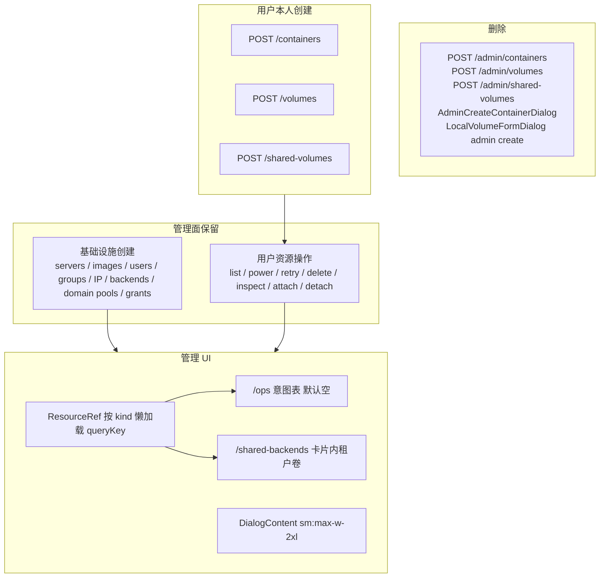
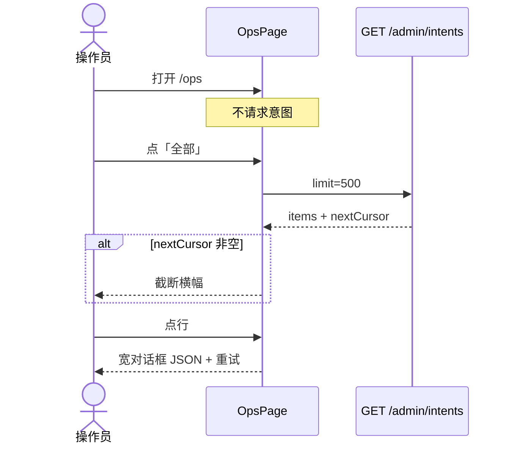

# Nyabase 管理控制台：取消代建、运维表、资源名、共享存储合并、加宽对话框

| 字段 | 值 |
| --- | --- |
| 状态 | Draft |
| 日期 | 2026-09-08 |
| 产品 | Nyabase（未发布，无兼容义务） |
| 范围 | 管理控制台五件事：禁止代建用户资源、运维页改表、名称而非 UUID、共享卷并入共享存储、默认对话框加宽 |
| 回滚 | git revert 本栈 PR；不做 dual-write / flag / 别名 |
| 实验室 | `lab/20260907-uitest` 保持 UP；本设计不改 lab、不提交 |

---

## Overview

管理控制台今天仍能**代替用户创建**容器、本地卷、共享卷（POST 带 `ownerId`），运维页一进就拉 pending 意图并分页、还叠了一张机器状态表，若干管理面把 UUID 当主文案，共享卷租户列表和共享后端登记拆成两个导航。本设计一次性收口这五件事：

1. **代建消失。** 用户所有资源（容器、本地卷、共享卷）只能由用户本人在用户面创建。管理面保留列表 / 电源 / 重试 / 删除 / 检查 / 挂载卸载，不保留任何 `ownerId` 创建路径。
2. **运维页变成意图工作台。** 默认空态、一次请求不分页、去掉机器状态表、行点开宽对话框。
3. **管理面显示名称。** 通用 `ResourceRef` 用现有 list/catalog/DTO 名字段解析，解析不到才截断 id。
4. **「共享卷管理」并入「共享存储」卡片。** 旧路由不重定向；删除文件路由后 `/manage/shared-volumes` 为 TanStack 默认 Not Found（仍在 `AppLayout` 内），不是静默空 Outlet。
5. **对话框默认加宽到 `sm:max-w-2xl`。** 移动端仍全宽；更大覆盖必须带 `sm:` 前缀。`ConfirmDialog` 增加可转发的 `className`，窄确认可传 `sm:max-w-lg`。

GPU 仍是 `extensions/nvidia-gpu`，核心不引入 GPU 字段。本地卷 / 共享卷产品分裂保持。协议可直接删字段（未发布）；**不改写 `000001_initial.sql`**（本切无需 CHECK）。中文文案。

---

## Background & Motivation

### 1. 代建用户资源

管理面今天有三条「替用户 POST、写 `ownerId`」的路径，且明确绕过用户额度：

| 资源 | UI | API | 服务 |
| --- | --- | --- | --- |
| 容器 | `packages/frontend/src/pages/manage-containers-page.tsx` `AdminCreateContainerDialog`，「代建容器」，文案「不消耗该用户的存储额度」 | `POST /admin/containers` → `AdminContainersController.create` | `ContainerControlService.createForAdmin` → `createInternal(..., true)`，`ownerId` 必填；`admin` 时 `access = null`，不走 `resolveContainerCreateAccessInTransaction` |
| 本地卷 | `server-storage-tab.tsx`「新建数据卷」+ `LocalVolumeFormDialog` `plane === 'admin'`，手填「所有者 UUID」 | `POST /admin/volumes` → `AdminVolumesController.create`，`!ownerId` → 400 | `VolumesService.createForAdmin` → `createVolume(..., 'admin')` → `assertCapacityForDeltaForAdmin`（物理池，不是用户磁盘额度） |
| 共享卷 | **无管理面创建 UI**（`SharedVolumeFormDialog` 只 POST `/shared-volumes`） | `POST /admin/shared-volumes` → `AdminSharedVolumesController.create`，`!ownerId` → 400 | `VolumesService.createSharedForAdmin` |

用户面已经拒绝 `ownerId`：`VolumesController.create`、`SharedVolumesController.create`、`createInternal` 非 admin 分支都抛 `User … creation cannot specify ownerId`。

**保留的管理面操作（不是代建）：**

- 容器：`GET /admin/containers`、电源 / 删除 / 限额 / 系统盘 / 扩展 / 控制台 / stats / 意图
- 卷：`GET/PATCH/DELETE /admin/volumes`、`GET/PATCH/DELETE /admin/shared-volumes`、catalog inspect
- 挂载：`POST/DELETE /admin/containers/:id/volumes` 与 `.../shared-volumes`（`attachForAdmin` / `detachForAdmin`）。这是把**已有**卷绑到**已有**容器，请求体无 `ownerId`，不算代建。
- 基础设施创建：服务器、镜像、用户、组、IP 池、共享**后端**、域名池、授权。

e2e 大量把代建当夹具，且**不能**直接换成今天的三个 persona helper（签名不够）：

| 夹具 | 现状 | 现有用户 helper 缺口 |
| --- | --- | --- |
| `volume-ops.createRunningContainer(api, seed, prefix, serverId?)` | `POST /api/admin/containers` + `ownerId: adminUserId`；可选 `serverId`（worker / gpu / live） | `persona.createUserContainer` 写死 `seedState.server.id`、`extensions: {}`、无 `volumes` |
| `createRunningContainerWithVolumes` | 同上 + `zCreateContainerRequest.volumes`；`createInternal` 仍调 `bindCreateTimeVolumes` | 无 volumes 参数 |
| `nvidia-gpu-lifecycle.spec.ts` `createAdminContainer`、`gpu-pci.spec.ts` 内联 POST | `extensions: { 'nvidia-gpu': { pciAddresses } }`、`serverId: gpuServer.id` | 无 `extensions` / `serverId` |
| `createLocalVolumeOnServer(api, seed, serverId, poolId, name)` | `POST /api/admin/volumes`，任意池 | `createUserVolume` 写死 `storagePools.dirQuotaOnline.id` |
| `storage.shared-lifecycle.spec.ts` dummy/kick 卷 | 在 **Incus 被挡住**时对 `worker.id` / `worker.dirPoolId` 建卷，打 unreachability | seed 只给 admin 用户 grant 了 `registeredDir` 与 GPU peer dir 池（`seed.mjs` ~1316–1352），**没有** worker dir 池。admin create 走 `createVolume(..., 'admin')` 跳过用户池 grant；用户面 `createForUser` 会 403 |
| `createSharedVolume` | `POST /api/admin/shared-volumes` + `ownerId: adminUserId` | `createUserSharedVolume` 可用，但 seed **没有** `shared-backend-grants` |
| `grants.spec.ts` ~153 | 唯一「owner 不是 admin」的代建：`ownerId: backendOnly.userId`。该用户有共享后端 grant、**无** server grant（本地卷 POST 已断言 403）。容器只为了让 `backendApi.post(/api/containers/${id}/shared-volumes)` 证明过期后 attach 403 | 若改 `adminApi` `POST /api/containers`，owner 变成 admin，断言语义变了 |

用户面创建 **本来就不传 `ownerId`**：`create-container-dialog.tsx` 组 `{ serverId, imageId, name, rootSizeBytes, cpuMillis, memBytes, extensions, powerIntent }`，`createForUser` 设 `owner = userId`。schema 删掉 `ownerId` 后多传变 400；用户对话框不用改 payload。

覆盖账本 `e2e/coverage/features.json` 把 `POST|/api/admin/containers`、`POST|/api/admin/volumes`、`POST|/api/admin/shared-volumes` 列进 inventory。今日计数（`features.json` `inventory` + `ledger.contract.test.mjs`）：

| 钉 | 今日 | 删三条 POST 后 |
| --- | --- | --- |
| `httpDecoratorCount` | 203 | 200 |
| `httpSurfaceCount` | 201 | 198 |
| `canonicalHttpSurfaceCount` | 201 | 198 |
| validate 输出 / `ledger.contract.test.mjs` `/201 mapped \/ 0 unmapped/` | 201 mapped | **198 mapped / 0 unmapped** |

`validate.mjs` 断言 `inventory.httpSurfaceCount === canonicalSurfaces.size` 且 `httpDecoratorCount === httpDeclarations.length`。只改两个 named 字段会红。以 `validate.mjs` 扫控制器为准；若还多/少一条 decorator，跟扫描结果走，不要死守 −3。禁止 skip-as-pass。`recovery.spec.ts` 只走 `volume-ops` helper，改 helper 即可，不要 skip。

隔离门闩 `packages/backend/src/access/user-admin-isolation.surface.test.ts` 和 `packages/frontend/src/lib/user-admin-isolation.surface.test.ts` 目前**断言** `createForAdmin` / `createSharedForAdmin` 存在，以及 admin 表单走 `/admin/volumes`。删代建后这些断言要改成「admin 控制器不再 create」。

### 2. 运维页

`packages/frontend/src/pages/ops-page.tsx` 现状（已核实）：

- `useState<StatusSegment>('pending')`，挂载即 `useInfiniteQuery` `GET /admin/intents?limit=50&status=pending`
- 「加载更多」走 `nextCursor`
- `canManageServers` 时渲染「机器状态」表（`GET /admin/servers`：名称 / 状态 / 最近观测 / 最近错误 / 指标），点击进 `/servers/$id?tab=activity`
- 意图用 `IntentRow`（`components/containers/intents-panel.tsx`）：类型 + 状态 + 一行 `resource · server · requestedBy原始id · 时间 · 尝试`，无独立列、无详情对话框
- 路由 `routes/ops/index.tsx`：`RequireAnyCapability(ADMIN_INTENT_CAPABILITIES)`（六项，见 `packages/common/src/enums.ts`）
- 文案：「意图与机器状态」

后端：

- `GET /admin/intents`、`GET /admin/intents/:intentId`、`POST /admin/intents/:intentId/retry` 均在 `AdminIntentsController`（`packages/backend/src/runtime/intents.controller.ts`）
- `IntentDto` 已有 `requestSummary`、`baseline`、`requestedBy`、`resourceId`、`serverId`、`failure`、`failureCode`、`attemptCount`（`packages/common/src/protocol/rest.ts`）
- `zIntentListQuery.limit` 默认 50、max = `MAX_INTENT_LIST_PAGE_SIZE` = **100**（`packages/common/src/constants.ts`）；`IntentRepository.list` 的 `MAX_PAGE_SIZE` 同样是 100。前端写死 50，协议上限是 100 不是 50。
- `filterVolumeIntents` 在分页之后按 `ManageVolumes` / `ManageSharedVolumes` 丢掉无权的 volume 意图——分页时会静默少行。

lane-d 门闩 `packages/frontend/src/lib/lane-d-product.surface.test.ts` 断言 ops 含 `status', 'pending'`、`加载更多`、`ManageServers`，且 Operators **不含** `ManageVolumes` / `ManageSharedVolumes`。本切改 ops 文案/分页时必须改这条，**不得**给 Operators 加 cap。

### 3. 管理面 UUID

已核实的主文案 UUID：

| 位置 | 显示 |
| --- | --- |
| `manage-shared-volumes-page.tsx:64` | `font-mono` 的 `ownerId` |
| `local-volume-table.tsx:113` | admin 列「所有者」= `volume.ownerId` |
| `intents-panel.tsx:47` `IntentRow` | `intent.requestedBy ?? '系统'`（原始 UUID） |
| `ops-page.tsx` `serverLabelFor` | 无 `ManageServers` 时直接 `intent.serverId` |
| `certificate-card.tsx:178` | `trust.serverId` |
| `local-volume-form-dialog.tsx:183-185` | admin 锁定服务器时 options 为 `[serverId, serverId]` |
| `manage-containers-page.tsx:99` / `container-row.tsx:44` | 已优先 `ownerName`，缺了才 UUID |
| `canonical-grant-panel.tsx` | 已从 list 取名（`server?.name ?? grant.serverId`） |

DTO 已有的名字段（无需新 identity 服务）：

- `ContainerDto.ownerName?`、`serverName`、`imageName?`、`name`（`container-control.service.ts` `toDtos` 填 `ownerName`）
- `VolumeDto.name`、`poolName`；**没有** `ownerName`
- `SharedVolumeDto.name`、`sharedBackendName`；**没有** `ownerName`
- `VolumeAttachmentSummaryDto.containerName`
- `UserDto.displayName` / `username`
- `ServerDto.name`

Catalog（不要扩 AnyCaps）：

- `GET /admin/catalog/users`：`ManageUsers | ManageGroups | ManageGrants`（`AdminCatalogController`）
- `GET /admin/catalog/groups`：`ManageGroups | ManageGrants`
- `GET /admin/catalog/grant-servers`：仅 `ManageGrants`

Operators（`groups.service.ts` `ensureSystemGroups`）有 `ManageGrants` + `ManageContainersAny` + `ManageServers` + `ManageImages`，因此**能**打 `GET /admin/catalog/users` 以及 servers/images list。纯 `ManageContainersAny`、没有 Users/Groups/Grants 的自定义组不能打 catalog；只能靠已加载的 `ContainerDto.ownerName` 回填。

列表 cap（已核实）：

- `GET /admin/catalog/users`：`ManageUsers | ManageGroups | ManageGrants`
- `GET /admin/users`：`ManageUsers | ManageGrants`
- `GET /admin/servers`：类上 `ManageServers`，`list()` 覆盖为 `@RequireAnyCaps(ManageServers, ManageGrants)`（`admin-servers.controller.ts`）。ResourceRef / ops 筛选仍可保守地只在 `ManageServers` 时拉服务器（与今日 ops 一致）；不要写成「只有 Grants 的人不能 list servers」。

Catalog 行是 `{ id, username, displayName, status }`，**没有** `name`。ResourceRef 用户显示 `displayName || username`。共享后端显示 `displayName ?? name`。

不存在 `packages/frontend/src/components/refs/`。

### 4. 共享卷 vs 共享存储

| | 共享存储 | 共享卷管理 |
| --- | --- | --- |
| 导航 | `app-layout.tsx` `/shared-backends`，「共享存储」，`ManageSharedBackends` | `/manage/shared-volumes`，「共享卷管理」，`ManageSharedVolumes` |
| 路由 | `routes/shared-backends/index.tsx` `RequireCapability(ManageSharedBackends)` | `routes/manage/shared-volumes/index.tsx` `RequireCapability(ManageSharedVolumes)` |
| 页 | `shared-backends-page.tsx`：登记后端、执行端、删除。文案「用户共享卷在「共享卷管理」」。**不含** `ManageSharedVolumes`、不含 `/manage/shared-volumes`（lane-d 断言） | `manage-shared-volumes-page.tsx`：按 `ownerId` 分组列出全部 `GET /admin/shared-volumes`，行上「排障：检查 catalog」 |
| 后端 list | `GET /admin/shared-backends`：`ManageSharedBackends \| ManageGrants` | `GET /admin/shared-volumes`：`ManageSharedVolumes`。`listSharedForAdmin` 只支持 `attachableOnServerId`，**不能**按 `sharedBackendId` 过滤；`SharedVolumeDto.sharedBackendId` 可前端过滤 |
| Operators | 两者都没有 | 两者都没有 |

用户面 `/shared-volumes`（`shared-volumes-page.tsx`）保留，那是用户自己的共享卷。

`createRouter` 无 `notFoundComponent`（`packages/frontend/src/main.tsx`），也没有 `routes/manage.tsx` 布局。删除 `routes/manage/shared-volumes/index.tsx` 后 `/manage/shared-volumes` **unmatched**：TanStack 默认 Not Found 画在根 outlet 里（已登录用户仍包在 `AppLayout` 下）。这满足「无 redirect 别名」。**不要**承诺空白页，也**不要**加一个 null 路由组件（那是 alias）。

### 5. 对话框过窄

`DialogContent`（`packages/frontend/src/components/ui/dialog.tsx:83`）桌面默认 `sm:max-w-lg`（32rem）；移动端 `inset-x-4` 全宽。`ConfirmDialog` 走 `AlertDialogContent`（`alert-dialog.tsx:66`）**另一套**默认 `max-w-lg`（无 `sm:`，全尺寸居中）。

现有 `DialogContent className=` 覆盖（均无 `sm:` 前缀；落地前再 grep 一次）：

- `create-container-dialog.tsx`、`servers-page.tsx`、`ip-pools-page.tsx`：`max-w-2xl`
- `users-page.tsx`、`groups-page.tsx`：`max-w-3xl`（授权面板）
- `shared-volume-catalog-inspect.tsx`、**`audit-page.tsx:240`**：`max-w-4xl`

`ConfirmDialog`（`confirm-dialog.tsx`）**不接受、不转发** `className`，写死 `<AlertDialogContent data-testid={testId}>`。`confirm-dialog.test.tsx` 只测 pending/preventDefault，无宽度断言。默认加宽 AlertDialog 后，全站确认框都变成 42rem，调用点目前无法缩回。

`cn` = `twMerge(clsx(...))`。`sm:max-w-lg`（默认）与无前缀 `max-w-3xl` **不冲突**：sm 以上仍是 32rem。所以授权对话框今天在桌面实际被默认 `sm:max-w-lg` 卡住。默认改成 `sm:max-w-2xl` 后，真正要 3xl/4xl 的调用点必须改成 `sm:max-w-3xl` / `sm:max-w-4xl`，否则会被新默认盖住。

---

## Goals & Non-Goals

### Goals

1. 删除所有管理面「替用户创建」的 UI 与 unpublished API。用户资源创建只走用户面 POST（owner = 当前用户）。
2. 管理容器页变成只读/操作列表，无「新建/代建」。
3. 运维页：默认不请求意图；一次 `GET` 上限 500；无「加载更多」；无机器状态表；意图表 + 宽详情对话框。
4. 管理面资源/用户引用走通用 `ResourceRef`，主文案是名称。
5. 删除「共享卷管理」导航与页，把租户卷列表放进每个共享后端卡片；catalog 排障留在卷行。旧 URL 不 redirect。
6. 默认对话框加宽，移动端仍全宽。
7. 中文文案。lane-d、isolation、e2e 覆盖账本与代建夹具一并改。

### Non-Goals

- 改写 `000001_initial.sql` 或任何 CHECK（本切不需要）。
- dual-write、feature flag、旧 URL redirect、旧 POST 别名。
- 给 Operators 增加 `ManageVolumes` / `ManageSharedVolumes` / `ManageSharedBackends`。
- 扩展 `GET /admin/catalog/users` 的 AnyCaps 到 `ManageContainersAny`。
- 新建后端 identity 服务或给 `IntentDto` 加 `requestedByName`（现有 list 不够时截断 id）。
- 核心 GPU 字段；`nvidia-gpu` 仍是扩展。e2e GPU 用例只改创建夹具平面。
- 合并本地卷与共享卷产品。用户面 `/volumes` 与 `/shared-volumes` 不动。
- 去掉管理面挂载/卸载、删除、电源、重试、inspect。
- 用户面意图列表改分页策略（容器详情仍 `limit=50`）。
- 提交 git；动 lab。

---

## Proposed Design



### 1. 取消代建

#### API / 服务

删除：

- `AdminContainersController.create`（`POST /admin/containers`）
- `AdminVolumesController.create`（`POST /admin/volumes`）
- `AdminSharedVolumesController.create`（`POST /admin/shared-volumes`）
- `ContainerControlService.createForAdmin` 以及 `createInternal` 的 `admin` 分支（owner 校验、跳过 grant）
- `VolumesService.createForAdmin` / `createSharedForAdmin`
- 创建请求里的 `ownerId`：`zCreateContainerRequest`、`zCreateVolumeRequest`、`zCreateSharedVolumeRequest`（`.strict()`，多传即 400）

`createInternal` 收成只服务 `createForUser`：owner = `userId`，始终走 `resolveContainerCreateAccessInTransaction`。`createVolume` / `createSharedVolume` 的 `'admin'` **创建**分支删除；**PATCH/DELETE 的 admin 容量路径留下**（`assertCapacityForDeltaForAdmin` 仍给管理员改已有卷）。

`bindCreateTimeVolumes(..., 'admin')` 只从 `createInternal` 的 `admin` 旗走进来（`container-control.service.ts` ~568）。create 收成用户面后，这个 `'admin'` 实参变死码；同 PR 删掉，改成只走 `'user'`（或去掉 `access` 参数），避免 isolation/surface grep 还匹配到 create-time admin bind。之后的 `attachForAdmin` 不动。

用户面拒绝 `ownerId` 的代码在字段删除后可去掉（schema 已拦）。用户对话框本来就不传 `ownerId`，payload 不用改。

**挂载保留。** `AdminContainerVolumesController` / `AdminContainerSharedVolumesController` 的 POST attach 不是代建。

**404 而非 405。** 未发布，不留空 POST 处理器（class-level JWT 不会跑到无 handler 的方法上）。Nest 未匹配 POST = 404。

`persona-and-unauthorized.spec.ts`：

- 匿名/伪造 `POST /api/admin/containers` 今日期望 `[401, 403]` → 无路由后是 **404**。改打仍存在的管理突变：`POST /api/admin/containers/:id/actions/stop`（需一个已有容器）或 `PUT /api/admin/users/.../server-grants/...`。
- 正常用户 `POST /api/admin/containers` 今日 403 → **404**。
- **保留** `POST /api/containers` 的 401 探测。

#### UI

- `manage-containers-page.tsx`：去掉「代建容器」按钮、`createOpen`、`AdminCreateContainerDialog`。页头说明改为「全部用户的容器。创建请到用户面「容器」。」电源/删除仍走 `ContainerRow admin`。
- `server-storage-tab.tsx`：去掉「新建数据卷」；`LocalVolumeFormDialog` 仅在编辑已有卷时打开（`volume` 有值）。无卷时空态不再提供创建 CTA。
- `local-volume-form-dialog.tsx`：删除 `ownerId` state、admin 创建分支、`plane === 'admin' && !ownerId` 校验、`volumeCollectionPath` 的 POST。`plane === 'admin'` 仍用于 PATCH/DELETE 路径与容量文案（物理剩余）。admin 锁定服务器的 Select 用 `ResourceRef`/服务器名，不再 `[serverId, serverId]`。

#### 测试

| 文件 | 改法 |
| --- | --- |
| `user-admin-isolation.surface.test.ts`（backend） | 断言 **没有** `createForAdmin` / `createSharedForAdmin`；admin 控制器无 create POST |
| `user-admin-isolation.surface.test.ts`（frontend） | admin 表单不再 POST `/admin/volumes` 创建；仍可 PATCH `/admin/volumes/:id` |
| `container-api-contract.test.ts` | **拆开**：只有 `ContainersController` 断言 `create: '/'`；`AdminContainersController` 不再有 `create` |
| `protocol.test.ts` | `zCreateContainerRequest` / volume 请求不再接受 `ownerId` |
| `volumes.capacity.pg.test.ts` | 「createForAdmin does not require grant」删除；保留 createForUser 要 grant |
| `volumes.shared.pg.test.ts` | `createSharedForAdmin` 用例改为用户面 + grant，或断言 admin POST 不存在 |
| `e2e/coverage/features.json` + `ledger.contract.test.mjs` | 从**拥有这些表面的 case**里删掉三条 admin create POST；**不要**改挂到已有用户 POST owner（见下）。inventory **三**个数一起改：`httpDecoratorCount` 203→200、`httpSurfaceCount` 201→198、`canonicalHttpSurfaceCount` 201→198。`ledger.contract.test.mjs` 的 `httpDecoratorCount === 203`、`canonicalHttpSurfaceCount === 201` 以及 `/201 mapped \/ 0 unmapped/` 同步改成 200 / 198 / `198 mapped / 0 unmapped`。以 `validate.mjs` 扫描为准 |
| e2e 夹具 | 见下：扩展 helper，不是 drop-in 换三个函数 |

#### e2e：扩展用户面 helper，再 retarget

原则：**retarget，不 skip。不是**「调用现有 `createUserContainer` / `createUserVolume` / `createUserSharedVolume` 三个函数就完」。先扩展 helper，再改调用点。用户 POST **永不带 `ownerId`**。

**Helper 必须支持的选项**（放在 `persona.ts` 和/或 `volume-ops.ts` 用户面实现上）：

| 函数 | 必加选项 | 行为 |
| --- | --- | --- |
| 容器 create（替换 `createRunningContainer` / `createAdminContainer`） | `serverId`、`extensions`、`volumes`、`powerIntent`、`namePrefix` | `POST /api/containers`（无 ownerId）；poll `GET /api/containers/:id`（同一 token 即 owner）。`volumes` 仍走用户 schema + `bindCreateTimeVolumes(..., 'user')` |
| 本地卷 create（替换 `createLocalVolumeOnServer`） | `serverId`、`poolId`、`name`、`sizeBytes` | `POST /api/volumes` + `scope: { kind: 'local', serverId, poolId }` |
| 共享卷 create（替换 `createSharedVolume`） | `name`、`sizeBytes`、`sharedBackendId` | `POST /api/shared-volumes` |

GPU 规格：同一 helper，`POST /api/containers` + `extensions: { 'nvidia-gpu': { pciAddresses } }` + `serverId: gpuServer.id`。seed 已把 nvidia-gpu PCI 写进 admin 用户对该 GPU 机的 `server-grants`。核心无 GPU 字段。

**Seed（PR 3 验收项，不是建议）：**

1. `PUT /api/admin/users/${adminUserId}/shared-backend-grants/${sharedBackendId}`（fixture backend 一条额度）。
2. 对 `createLocalVolumeOnServer` 会打到的**每个 lab dir 池**写 `storage-pool-grants`，至少包括 worker `dirPoolId`（`storage.shared-lifecycle.spec.ts` dummy/kick）。今日只 grant 了 `registeredDir` 与 GPU peer dir。
3. 现有 extra lab node 的 `server-grants` 循环保留。

**`grants.spec.ts` 唯一「替别人建」：** 给 `backendOnly` `upsertServerGrant`，然后 `createUserContainer(backendApi, ...)`（owner = 该用户）。不要用 admin JWT 建完再改 owner。这不削弱「无 server grant 时本地卷 403」——那条断言仍然用未授予 disk/server 的另一 persona。过期后 attach 403 仍用 `backendApi`。

**覆盖账本（拥有表面的 case，不要改挂）：**

| 删掉的表面 | 今日 owner case | 不要改挂到 |
| --- | --- | --- |
| `POST\|/api/admin/containers` | `container-intent-exec-ssh` | `POST\|/api/containers`（`persona-normal-user-happy-path`） |
| `POST\|/api/admin/volumes` | `storage-capability-families` | `POST\|/api/volumes`（`user-volume-grow-success`） |
| `POST\|/api/admin/shared-volumes` | `shared-cephfs-storage` | `POST\|/api/shared-volumes`（该 case **已经**拥有用户 POST，只删 admin 行） |

`recovery.spec.ts` 只调用 `volume-ops.createRunningContainer`；helper 改用户面即可，不要 skip。内联 POST 的 spec：`30-containers/*.spec.ts`（含 `nvidia-gpu-lifecycle.spec.ts` 本地 `createAdminContainer`）、`40-storage/*.spec.ts`、`20-servers-images/multi-server.spec.ts`、`50-access/grants.spec.ts`、`10-auth-rbac/persona-and-unauthorized.spec.ts`。

删除/电源/inspect 仍用 `/api/admin/...`。

### 2. 运维页

#### 默认空、显式加载

- 初始 `segment = null`（或 `'idle'`），意图 `useQuery` 的 `enabled: segment != null`。挂载**不** GET。
- 空态：「选择『全部』『进行中』或『失败』加载意图。」三个分段都是 enable 控件（不是只有「全部」；进行中/失败不是加载后的次级过滤）。
- 点过之后：`kind` / `resourceType` / `serverId` 变化会 refetch；`refetchInterval` 15s 仅在已加载后启用。
- **不要**用 `QueryView` 包未启用的 query（`isQueryIdle`：`data === undefined && isPending && !isFetching` 会渲染 `null`）。未加载时只渲染上述空态。

#### 一次请求、不分页

- 前端：`useQuery` 单次，默认 `limit=500`，去掉 infinite query、「加载更多」、cursor UI。允许客户端传更小 `limit`，不允许第二页。
- 协议：新增 **仅管理全局列表** 的上限，**不要**抬高全局 `MAX_INTENT_LIST_PAGE_SIZE`：
  - `ADMIN_INTENT_LIST_MAX = 500`（`packages/common/src/constants.ts`）
  - `zAdminIntentListQuery`：同 `zIntentListQuery` 但 `limit.max(500).default(500)`
  - **`adminIntentListOptions` 必须 parse `zAdminIntentListQuery`**（今日它 parse `zIntentListQuery`；只导出新 schema 却不改这个 helper → 前端 `limit=500` 直接 400）
  - `listOptions` 与容器/卷/镜像/服务器意图控制器仍用 `zIntentListQuery`（max 100, default 50）
  - `intents.controller.test.ts`：`admin.list({}, actor)` 与 `adminIntentListOptions({ resourceType, serverId, status })`（无 `limit`）今日期望 `limit: 50`，改默认后必须是 **500**。`listOptions(...)` 仍 50。可另加 `{ limit: 50 }` 证明管理全局列表仍接受更小客户端 limit。
  - `IntentRepository.MAX_PAGE_SIZE` 提到 500（实现上限）。Worker `listPending({ limit: 100 })` 仍合法。
- `nextCursor != null` 时横幅，**禁止静默丢行**，也**不要**藏第二页：「仅显示最近 500 条，结果已截断。请缩小类型或服务器筛选。」`filterVolumeIntents` 在 `intents.list` **之后**跑，cursor 可能偏大；Operators 没有卷 cap，碰不到这个过滤。有 cursor 就横幅。
- 载荷：每条 `requestSummary`/`baseline` 理论上各最多 `INTENT_MAX_REQUEST_SUMMARY_BYTES`（16KiB）。500 行 × 15s 轮询偏重；本切不加新的 JSON 字节 cap，靠默认空态 + 截断横幅 + 可选更小 `limit`。不把 `MAX_INTENT_LIST_PAGE_SIZE` 改成 500。

#### 去掉机器状态

删除「机器状态」section 与服务器状态表。`GET /admin/servers` **仍可**在 `ManageServers` 时拉，供筛选下拉和 `ResourceRef` 名称，不渲染健康/指标。点意图里的服务器名可链到 `/servers/$id`。

页头：「运维」/「按筛选查看意图；默认不加载。」

#### 意图表

列（中文）：时间、类型、状态、资源类型、资源名称、服务器、请求人、尝试、失败码。

- 时间：`createdAt` `toLocaleString()`
- 类型 / 资源类型 / 状态：现有 `intentKindLabel` / `intentResourceTypeLabel` / `intentStatusLabel`
- 资源名称：`ResourceRef`（见 §3），`image_assignment` 用 `requestSummary.imageId` 解析镜像名
- 服务器：`ResourceRef kind=server`；`serverId == null` 显示「—」
- 请求人：`requestedBy == null` →「系统」，否则 `ResourceRef kind=user`
- 尝试：`formatIntentAttempt`
- 失败码：`failureCodeLabel`，无则「—」

行可点。运维不再用 `IntentRow` 紧凑行。容器详情「意图历史」**仍用** `IntentRow`：PR 2 把其中的 `requestedBy` 换成 `ResourceRef`（见 §3），避免管理面意图历史继续把 UUID 当主文案。

#### 详情对话框

点行打开 `DialogContent className="sm:max-w-3xl"`。列表 DTO 已含字段，不必默认再 GET；打开时可 `GET /admin/intents/:id` 刷新。内容：

- 类型、状态、时间、尝试、`nextAttemptAt`
- 资源类型 + `ResourceRef` + 原始 id 放 `title`
- 服务器、请求人
- `requestSummary`、`baseline`：`<pre>` JSON
- `failure`：code / message / details JSON
- `isRetryableIntent` 时「重试」→ 现有 `retryIntent(id, true)`

文案：「意图详情」。



### 3. `ResourceRef`

新目录 `packages/frontend/src/components/refs/`：

- `types.ts` — `ResourceKind`
- `resource-ref.tsx` — 展示组件（内部 `useQuery`）
- `truncate-id.ts` — 截断（UUID 取前 8 位）+ 测试

**不要**在 `AppLayout` 挂 prefetch provider。已登录壳包含用户面 `/containers`；按 cap `enabled` 拉 `GET /admin/containers|volumes|shared-volumes|users|servers|images` 会把每次进管理页（含运维空态）变成全量库存下载，这些 list 都无分页。react-query 已经按 `queryKeys` 共享缓存——**渲染到某个 kind 时再 `useQuery` 该 key**，同页 N 个 `ResourceRef kind=user` 仍是一次 GET。

```tsx
<ResourceRef kind="user" id={ownerId} name={container.ownerName} />
```

渲染顺序：

1. `name` prop（调用点已有 DTO 名字段则**不发** list 请求）
2. 已有 query cache 命中（含下面的 ownerName 回填）
3. 当前 actor 对该 kind 有 cap 时 `useQuery` 现有 key
4. 截断 id，`title={id}`，`font-mono text-xs`
5. 空 id →「—」

用户显示名：catalog / `UserDto` 用 **`displayName || username`**，不是 `row.name`。共享后端：`displayName ?? name`。

回填：容器 list **已经**在某页加载时，用 `queryClient.setQueryData` 把 `ownerId → ownerName` 写进 user 名缓存，给没有 catalog 的 `ManageContainersAny` 操作员解析运维请求人中的那一部分。不要为了回填去额外 GET `/admin/containers`。

Catalog AnyCaps **不扩展**。

| kind | 优先 DTO / prop | 仅当 name 缺失且有 cap 才 GET | cap（enabled） | catalog | 禁止 |
| --- | --- | --- | --- | --- | --- |
| `user` | `ContainerDto.ownerName`；catalog `displayName \|\| username` | `GET /admin/catalog/users`（优先，更瘦）或 `GET /admin/users` | catalog：Users\|Groups\|Grants；users list：Users\|Grants | 有 | 不把 catalog 扩到 `ManageContainersAny` |
| `group` | `GroupDto.name` | `GET /admin/groups` 或 `GET /admin/catalog/groups` | Groups\|Grants | 有 | `queryKeys.catalog` 今日只有 `users`，groups 用 `groups.admin` 或现加 `catalog.groups` |
| `server` | `ContainerDto.serverName` 等 | `GET /admin/servers` | **保守：`ManageServers`**（ops 今日如此）。list 实际 AnyCaps 含 Grants，本切不靠 Grants 拉服务器名 | `grant-servers` 仅 Grants，不为 ref 去扩 | 无 cap 时只用 DTO/`title` |
| `container` | `name` / `containerName` | `GET /admin/containers` | `ManageContainersAny` | 无 | 运维空态不渲染这些 cell，故不 GET |
| `volume` | `VolumeDto.name` | `GET /admin/volumes` | `ManageVolumes` | 无 | 不加 `ownerName` 到 schema |
| `shared-volume` | `SharedVolumeDto.name` | `GET /admin/shared-volumes` | `ManageSharedVolumes` | 无 | |
| `image` | `imageName` / `AdminImageDto.name` | `GET /admin/images` | `ManageImages` | 无 | |
| `pool` | `VolumeDto.poolName` | 不扫全站池 | 随服务器详情已拉的 pools query | 无 | |
| `shared-backend` | `sharedBackendName`；list `displayName ?? name` | `GET /admin/shared-backends` | `ManageSharedBackends \| ManageGrants` | 无 | |

替换点（管理面主文案 UUID）——**含** `IntentRow`：

1. `manage-shared-volumes-page.tsx` 分组头 → `ResourceRef kind="user"`（PR 5 迁进后端卡片后仍用）
2. `local-volume-table.tsx` 所有者列
3. 运维表请求人 / 服务器 / 资源名
4. **`intents-panel.tsx` `IntentRow`**：`requestedBy` 用 `ResourceRef kind="user"`（`null` →「系统」）。容器详情意图历史走这里，管理面不能留下 UUID 主文案。用户面 `admin=false` 时：若 `requestedBy ===` 当前用户，传 session `displayName`；无 catalog cap 则不 GET admin catalog
5. `certificate-card.tsx` `trust.serverId`（服务器详情已有 `server.name` 时当 `name` prop，避免再拉全表）
6. `manage-containers-page.tsx` / `container-row.tsx` 的 `ownerName ?? ownerId` 回退
7. `canonical-grant-panel.tsx` 的 `serverId` / `poolId` / `sharedBackendId` 回退（list 未命中时）
8. 审计 `SnapshotPanel`（`audit-page.tsx:352`）：主行 `snapshot.name`；**删掉** name 下的 `font-mono` id 行，id 只放在主行 `title`（与 Open Question 4 / Key Decision 一致）

不改：Ceph FSID、identity key、CIDR、SSH 指纹、用户名 `@username`、路径。

**不加** `VolumeDto.ownerName` / `IntentDto.requestedByName`。解析不到就截断。

### 4. 共享卷并入共享存储

- 删 `adminNavItems` 的 `/manage/shared-volumes`。
- 删 `pages/manage-shared-volumes-page.tsx`、`routes/manage/shared-volumes/index.tsx`。**不设 redirect、不加 null 路由。** 旧 URL unmatched → TanStack 默认 Not Found（已登录仍在 `AppLayout` 内）。
- 路由仍只 `RequireCapability(ManageSharedBackends)`。仅有 `ManageSharedVolumes`、没有后端 cap 的账号失去独立入口——接受（Open Question 1）。不扩 Operators。
- `shared-backends-page.tsx`：每张后端卡片在执行端列表下增加「租户共享卷」块：
  - **`canManageSharedVolumes` 才渲染整块**；否则不出现（含空态）
  - `GET /admin/shared-volumes` **`enabled: canManageSharedVolumes`**。backends-only 操作员今日看不到卷页，合入后也不能在后端页吃 403
  - 客户端 `volumes.filter(v => v.sharedBackendId === backend.id)`（`listSharedForAdmin` / `zListSharedVolumesQuery` 只有 `attachableOnServerId`）
  - 行：名称、`ResourceRef` 所有者、容量/已用（`formatObservedUsage`，禁止 `usedBytes ?? 0`）、生命周期、挂载数、`ResourceIntentHistory`、`排障：检查 catalog`（`SharedVolumeCatalogInspectDialog`，只读）
  - 无卷：「该后端还没有用户共享卷。」
- 页描述改为「登记 CephFS 后端、执行端，并查看各后端上的用户共享卷。」去掉「用户共享卷在「共享卷管理」」。
- 用户面 `/shared-volumes` 不动。

**lane-d / isolation 必须在同一 PR 反转，否则 vitest 红：**

今日 `lane-d-product.surface.test.ts`：

- **禁止** `shared-backends-page.tsx` 匹配 `ManageSharedVolumes`、`/manage/shared-volumes`、`查看 catalog`
- **要求** `manage-shared-volumes-page.tsx` 含 `formatObservedUsage`、排障、`SharedVolumeCatalogInspectDialog`
- 导航要求 `/manage/shared-volumes` + `Capability.ManageSharedVolumes`

PR 5 改为：

- 布局：**不再**匹配 `to: '/manage/shared-volumes'`
- backends 页：**改为要求** `ManageSharedVolumes`、`formatObservedUsage`、排障、`SharedVolumeCatalogInspectDialog`、`/admin/shared-volumes`、`enabled: canManageSharedVolumes`（或等价）；仍**禁止**用户面 `GET /shared-volumes` 与 mutate catalog
- isolation：`manage-shared-volumes-page stays on admin shared-volumes API` 迁到读 `shared-backends-page.tsx`（admin GET + cap 包裹，仍无用户 `/shared-volumes`）
- Operators cap 列表断言**一字不改**

### 5. 加宽对话框

`DialogContent` 默认 `sm:max-w-lg` → `sm:max-w-2xl`（42rem）。移动端规则不动。

`AlertDialogContent` 默认 `max-w-lg` → `sm:max-w-2xl`（ConfirmDialog 跟随）。

`ConfirmDialog` **今日不能**传 `className`。PR 1 给它加可选 `className` 并转到 `AlertDialogContent`（与 `data-testid` 并列）。默认吃 2xl；真正要窄的确认再传 `sm:max-w-lg`。不把全站确认逐个改窄——没传就 2xl。

覆盖（因 twMerge 必须带 `sm:`；落地前再 `rg 'DialogContent className='`）：

| 调用点 | 现有 | 改为 |
| --- | --- | --- |
| create-container / server onboarding / ip-pool | `max-w-2xl` | 删 class（吃默认） |
| users/groups 授权 | `max-w-3xl` | `sm:max-w-3xl` |
| catalog inspect | `max-w-4xl` | `sm:max-w-4xl` |
| **`audit-page.tsx:240` 审计详情** | `max-w-4xl` | `sm:max-w-4xl` |
| 意图详情（新，PR 4） | — | `sm:max-w-3xl` |

不要逐个表单改宽度。`confirm-dialog.test.tsx` 无宽度断言，不必为 2xl 加测；若加 `className` 可测转发。

---

## API / Interface Changes

未发布，直接删，不留别名。

| 方法 | 路径 | 变化 |
| --- | --- | --- |
| POST | `/admin/containers` | **删除** |
| POST | `/admin/volumes` | **删除** |
| POST | `/admin/shared-volumes` | **删除** |
| GET | `/admin/intents` | 管理全局 `limit` max/default **500**；资源级意图仍 max 100 |
| GET | `/admin/intents/:id` | 不变 |
| POST | `/admin/intents/:id/retry` | 不变 |
| GET | `/admin/shared-volumes` | 不变（前端按 `sharedBackendId` 过滤） |
| GET | `/admin/catalog/users` | **AnyCaps 不扩展** |

协议：

- 从 `zCreateContainerRequest` / `zCreateVolumeRequest` / `zCreateSharedVolumeRequest` 删除 `ownerId`
- 新增 `zAdminIntentListQuery` + `ADMIN_INTENT_LIST_MAX = 500`；**`adminIntentListOptions` 改用它**；`listOptions` / `zIntentListQuery` 仍 max 100
- `IntentRepository` `MAX_PAGE_SIZE`：100 → 500（`listPending({ limit: 100 })` 仍合法）
- 不抬高 `MAX_INTENT_LIST_PAGE_SIZE`

前端路由：删除 `/manage/shared-volumes`；`/ops`、`/shared-backends`、`/manage/containers` 仍在。

---

## Data Model Changes

**无。** 不改 `000001_initial.sql`。意图、卷、容器表已有 name/owner 列；本切只改 API 面与 UI。`owner_id` 列保留（用户创建仍写入）。

---

## Alternatives Considered

### A. 代建改为「必须有用户 grant」而不是删除

管理员仍可填 owner，但走 `createForUser` 额度。拒绝：需求是「必须由用户本人创建」；留下 POST + ownerId 就是代建。未发布应删除。

### B. 运维继续 cursor 分页，只把默认 limit 提到 100

拒绝：明确「无分页、无加载更多」。100 仍可能截断且无横幅。单次 500 + 横幅更简单，也避开 `filterVolumeIntents` 与 cursor 的静默丢行。

### C. 给 `IntentDto` 加 `requestedByName` / `resourceName` / `serverName`

一次 join 就能让无 catalog 的操作员看见名字。拒绝作为本切范围：要求不新建 identity 服务、能用现有 list 就用 list；不够则截断。若 500 行里大量请求人无法解析，可作为后续小协议增量，仍不必动 schema。

### D. 共享卷页 redirect 到 `/shared-backends`，或留 null 路由当空白 Outlet

拒绝：禁止 alias/redirect。删文件路由后走 TanStack 默认 Not Found。null 组件也是 alias。

### E. 合并页 `RequireAnyCaps(ManageSharedBackends, ManageSharedVolumes)`

仅有共享卷 cap 的人还能看到卷。拒绝：明确路由维持 `ManageSharedBackends`；Operators 不扩 cap。卷块用 cap 包裹即可。

### F. 只给意图对话框加宽，不改 Dialog 默认

拒绝：表单 JSON 普遍被 `sm:max-w-lg` 卡住；默认改一处覆盖大多数。ConfirmDialog 补 `className` 后，窄确认才能传 `sm:max-w-lg`；不补则全站确认接受 2xl，文档不得假装调用点已经能缩。

---

## Security & Privacy

- 代建删除后，管理员不能再绕过用户 server/pool/shared-backend grant 开资源。容量仍受物理池约束（admin PATCH/DELETE）。
- Catalog AnyCaps 不扩大：`ManageContainersAny` 不能枚举全站用户。运维请求人能解析当且仅当已有 Users/Groups/Grants，或**已经加载**的容器 list 回填了 `ownerName`。ResourceRef 不在 AppLayout 预拉全量 admin list。
- `ResourceRef` 的 `title={uuid}` 便于排障，不是主文案。
- 意图详情 JSON 可能含内部路径；仅 `ADMIN_INTENT_CAPABILITIES` 可见，与现网一致。
- 挂载仍校验 admin cap 与卷/容器存在性（`attachVolume`）；不引入跨 owner 的新创建。
- 旧 `/manage/shared-volumes` 不 redirect，避免把仅有卷 cap 的人送进后端页后 403。unmatched Not Found 可接受。
- `GET /admin/shared-volumes` 仅在 `ManageSharedVolumes` 时 enabled，backends-only 操作员不会在共享存储页吃 403。

---

## Observability

- 无新指标。
- 运维默认不打 `GET /admin/intents`，减少空闲轮询。
- 截断横幅是操作员可见的完整性信号；不要只打 console。
- e2e 覆盖账本必须与控制器 POST 删除一致，否则 `validate.mjs` 失败。

---

## Rollout Plan

未发布单栈。顺序见 PR Plan。每 PR 可独立 revert。

1. 合入后跑 frontend vitest（lane-d、isolation、protocol）、backend surface/pg 中与 create/intents 相关的测试。
2. e2e 在 PR 3（删代建）后必须全绿。验收含：扩展后的用户面 helper、seed 的 shared-backend grant + 全部 lab dir 池 grant、`grants.spec.ts` 用 backendOnly 本人创建、coverage 计数、无 skip。
3. lab `20260907-uitest` 保持 UP；不在本设计里重启/重建。
4. 回滚 = `git revert` 对应 PR。不留 flag。

---

## Open Questions

1. **仅有 `ManageSharedVolumes`、没有 `ManageSharedBackends` 的自定义组**在删独立页后无处看租户卷。是否接受？本设计接受（不扩 Operators、不改路由 cap）。
2. **管理面 attach/detach** 是否也算「替用户做事」？本设计视为操作工具并保留。若产品要禁，需另开 PR（e2e 挂载证明会大改）。
3. **意图 500 仍截断**时是否允许点横幅后再拉下一页？本设计不允许（无分页）。可把筛选做强。
4. **审计页 UUID 次行**是排障需要还是也要藏？**已决：藏。** `SnapshotPanel` 主行 name，id 仅 `title`，删除 `font-mono` 次行（PR 2）。
5. ~~seed 是否写 `shared-backend-grants`？~~ **已决：必须写。** PR 3 验收：fixture backend grant + 每个 lab dir 池（含 worker `dirPoolId`）的 storage-pool grant。不是建议。

---

## References

- `packages/frontend/src/pages/ops-page.tsx`
- `packages/frontend/src/pages/manage-containers-page.tsx`
- `packages/frontend/src/pages/manage-shared-volumes-page.tsx`
- `packages/frontend/src/pages/shared-backends-page.tsx`
- `packages/frontend/src/components/ui/dialog.tsx`、`alert-dialog.tsx`
- `packages/frontend/src/components/layout/app-layout.tsx`
- `packages/frontend/src/lib/lane-d-product.surface.test.ts`
- `packages/backend/src/containers/admin-containers.controller.ts`
- `packages/backend/src/volumes/volumes.controller.ts`、`shared-volumes.controller.ts`
- `packages/backend/src/runtime/intents.controller.ts`、`intent.repository.ts`
- `packages/backend/src/catalog/admin-catalog.controller.ts`
- `packages/backend/src/groups/groups.service.ts` `ensureSystemGroups`
- `packages/common/src/protocol/rest-schema.ts`、`constants.ts`、`enums.ts`
- `e2e/support/volume-ops.ts`、`e2e/support/persona.ts`
- `e2e/coverage/features.json`、`e2e/coverage/validate.mjs`
- `packages/backend/src/persistence-pg/migrations/000001_initial.sql`（本切不改）

---

## Key Decisions

1. **代建定义 = POST 且写入 `ownerId`。** 删除 `POST /admin/containers|volumes|shared-volumes` 及对应 `createForAdmin` / `createSharedForAdmin` / UI。管理面 list/power/retry/delete/inspect/**attach/detach** 保留。用户创建只走 `POST /containers|volumes|shared-volumes`。
2. **创建请求去掉 `ownerId`。** unpublished + `.strict()`，不留字段。
3. **不改 `000001`。** 无新 CHECK。回滚 = git revert。
4. **运维默认不 fetch。** `segment` 初始空；点「全部」/「进行中」/「失败」才 GET。空态：「选择『全部』『进行中』或『失败』加载意图。」不把 idle query 包进 `QueryView`。
5. **管理全局意图一次最多 500 条。** `adminIntentListOptions` parse `zAdminIntentListQuery`（max/default 500）；`listOptions` / 资源级仍 `zIntentListQuery` max 100。有 `nextCursor` 就横幅，无第二页，不抬全局 `MAX_INTENT_LIST_PAGE_SIZE`。`listPending({ limit: 100 })` 仍合法。
6. **运维去掉机器状态表。** 有 `ManageServers` 仍可拉服务器做名称/筛选，不渲染健康表。任何 PR 都**不**改 Operators cap 列表（lane-d 锁死）。
7. **`ResourceRef` 懒加载现有 queryKey，不挂 AppLayout prefetch。** 优先 `name` prop；catalog 用户字段是 `displayName || username`。不扩 catalog AnyCaps，不加 identity 服务，不加 `requestedByName`。解析不到：截断 id + `title=uuid`。`IntentRow.requestedBy` 在本切替换范围内。
8. **共享卷导航删除、无 redirect、无 null 路由。** 旧 URL = 默认 Not Found。卷列表进后端卡片，块与 `GET /admin/shared-volumes` 均 `ManageSharedVolumes` 才 enabled；页路由仍 `ManageSharedBackends`。用户面 `/shared-volumes` 不动。
9. **Dialog / AlertDialog 默认 `sm:max-w-2xl`。** 更大对话框必须 `sm:max-w-*`（含 `audit-page.tsx`）。`ConfirmDialog` 增加 `className` 转发；未传则 2xl。意图详情 `sm:max-w-3xl`。
10. **e2e：扩展用户面 helper（`serverId` / `extensions` / `volumes` / `poolId`），再 retarget。** 禁止 drop-in 三个旧函数。seed **必须**写 shared-backend grant 与全部 lab dir 池 grant。`grants.spec.ts` 用被测用户本人创建。覆盖删 admin POST、不改挂已有用户 POST owner。GPU 只换创建平面。
11. **中文文案。** lane-d / isolation 断言随 UI 改（PR 5 反转 backends 禁则）。lab 保持 UP。不提交。

---

## PR Plan

每个 PR 可独立 review、独立 revert。依赖写在「取决于」；无环。

### PR 1 — 对话框默认加宽

**取决于：** 无。

**描述：** `DialogContent` / `AlertDialogContent` 默认 `sm:max-w-2xl`。已有 `max-w-2xl` 删冗余 class；`max-w-3xl` / `max-w-4xl` 改 `sm:` 前缀。`ConfirmDialog` 增加 `className` 并转发。移动端 Dialog 全宽不变。落地前再 grep `DialogContent className=`。

**文件：**

- `packages/frontend/src/components/ui/dialog.tsx`
- `packages/frontend/src/components/ui/alert-dialog.tsx`
- `packages/frontend/src/components/layout/confirm-dialog.tsx`（`className` 可选）
- `packages/frontend/src/components/layout/confirm-dialog.test.tsx`（可选：断言 className 转发）
- `packages/frontend/src/components/containers/create-container-dialog.tsx`
- `packages/frontend/src/pages/servers-page.tsx`
- `packages/frontend/src/pages/ip-pools-page.tsx`
- `packages/frontend/src/pages/users-page.tsx`
- `packages/frontend/src/pages/groups-page.tsx`
- `packages/frontend/src/pages/audit-page.tsx`（`sm:max-w-4xl`）
- `packages/frontend/src/components/storage/shared-volume-catalog-inspect.tsx`（`sm:max-w-4xl`）

**验收：** 默认桌面 42rem；授权 3xl、audit/catalog 4xl；ConfirmDialog 默认可 2xl，传入 `sm:max-w-lg` 能缩。

### PR 2 — `ResourceRef` 并替换管理面 UUID 主文案

**取决于：** 无（必须在 PR 4/5 之前）。

**描述：** `ResourceRef` 在渲染时 `useQuery` 现有 key（`enabled` 看 cap），**不**在 AppLayout prefetch。优先 `name` prop。catalog 用户 = `displayName || username`。替换共享卷/本地卷所有者、容器 owner 回退、证书 serverId、授权回退、**IntentRow.requestedBy**、审计 SnapshotPanel（id 改 `title`，删 mono 次行）。不扩 catalog caps，不加 DTO 字段。`queryKeys.catalog` 今日只有 `users`，不必为 groups 新键除非要用 catalog/groups。

**文件：**

- `packages/frontend/src/components/refs/resource-ref.tsx`（新）
- `packages/frontend/src/components/refs/truncate-id.ts`（新）+ `*.test.ts`
- `packages/frontend/src/pages/manage-shared-volumes-page.tsx`（若 PR 5 未删）
- `packages/frontend/src/pages/manage-containers-page.tsx`
- `packages/frontend/src/components/storage/local-volume-table.tsx`
- `packages/frontend/src/components/containers/container-row.tsx`
- `packages/frontend/src/components/containers/intents-panel.tsx`
- `packages/frontend/src/components/servers/certificate-card.tsx`
- `packages/frontend/src/components/grants/canonical-grant-panel.tsx`
- `packages/frontend/src/pages/audit-page.tsx`
- `packages/frontend/src/lib/query-keys.ts` 仅当新增 `catalog.groups`；现有 `catalog.users` 够用则不动

**不改：** `app-layout.tsx`（无 provider）。

**验收：** 有 DTO/list 时见名称；无 cap 见截断 id + title；Operators 因 Grants 能解析用户；打开 `/containers` 不触发 admin 全量 list；IntentRow 管理面不再把 requestedBy UUID 当主文案。

### PR 3 — 删除管理面代建（UI + API + e2e）

**取决于：** 无（可与 1/2 并行）。e2e 风险最高，**不要**与 PR 4/5 抢同一轮实验室。

**描述：** 删除三条 admin create POST 与 `createForAdmin*` / createInternal admin 分支 / `bindCreateTimeVolumes` 的 `'admin'` 实参。schema 去掉 `ownerId`（用户对话框本就不传）。管理容器页去掉代建；存储 tab 去掉新建。

e2e：**先扩展**用户面 helper（`serverId`、`extensions`、`volumes`、`poolId`），再 retarget。seed **必须**写 shared-backend grant + 每个 lab dir 池 grant（含 worker）。`grants.spec.ts`：`upsertServerGrant(backendOnly)` + `createUserContainer(backendApi)`。GPU：`POST /api/containers` + 同一 extension bag。覆盖：从 `container-intent-exec-ssh` / `storage-capability-families` / `shared-cephfs-storage` 删 admin POST，**不**改挂到已有用户 POST owner。inventory 三计数 lockstep：`httpDecoratorCount` 203→200、`httpSurfaceCount` **与** `canonicalHttpSurfaceCount` 201→198；`ledger.contract.test.mjs` 的 `/201 mapped \/ 0 unmapped/` 改为 `/198 mapped \/ 0 unmapped/`，并改 `httpDecoratorCount === 203`。以 `validate.mjs` 扫描为准。匿名探测改打仍存在的管理突变，保留 `POST /api/containers` 401。`recovery.spec.ts` 走 helper，不 skip。

**文件：**

- `packages/backend/src/containers/admin-containers.controller.ts`
- `packages/backend/src/containers/container-control.service.ts`
- `packages/backend/src/volumes/volumes.controller.ts`
- `packages/backend/src/volumes/shared-volumes.controller.ts`
- `packages/backend/src/volumes/volumes.service.ts`（`createVolume` / `createSharedVolume` 的 admin 创建分支）
- `packages/common/src/protocol/rest-schema.ts`
- `packages/common/src/__tests__/protocol.test.ts`
- `packages/backend/src/access/user-admin-isolation.surface.test.ts`
- `packages/backend/src/containers/container-api-contract.test.ts`（只给 `ContainersController` 留 `create`）
- `packages/backend/src/volumes/volumes.capacity.pg.test.ts`
- `packages/backend/src/volumes/volumes.shared.pg.test.ts`
- `packages/frontend/src/pages/manage-containers-page.tsx`
- `packages/frontend/src/components/servers/server-storage-tab.tsx`
- `packages/frontend/src/components/storage/local-volume-form-dialog.tsx`
- `packages/frontend/src/lib/user-admin-isolation.surface.test.ts`
- `e2e/support/volume-ops.ts`
- `e2e/support/persona.ts`
- `e2e/orchestrator/seed.mjs`（**必改** grants）
- `e2e/specs/30-containers/*.spec.ts`（含 `nvidia-gpu-lifecycle.spec.ts` 本地 `createAdminContainer`、`gpu-pci.spec.ts`）
- `e2e/specs/40-storage/*.spec.ts`
- `e2e/specs/20-servers-images/multi-server.spec.ts`
- `e2e/specs/50-access/grants.spec.ts`
- `e2e/specs/10-auth-rbac/persona-and-unauthorized.spec.ts`
- `e2e/specs/80-recovery/recovery.spec.ts`（helper 即可）
- `e2e/coverage/features.json`
- `e2e/coverage/ledger.contract.test.mjs`（`httpDecoratorCount` 200、`canonicalHttpSurfaceCount` 198、**`httpSurfaceCount` 198**、`/198 mapped \/ 0 unmapped/`）

**验收：** 无三条 POST；用户 POST 无 `ownerId` 仍 202/201；无 grant 失败；admin GET/PATCH/DELETE/actions/attach 仍在；seed 后 admin 用户能在 worker dir 池与共享后端上用户面创建；coverage validate + ledger 计数通过；无 skip-as-pass。Operators cap 列表不动。

### PR 4 — 运维表 + 对话框 + 默认空 + 无机器表 + 无分页

**取决于：** PR 1（宽对话框）、PR 2（名称列，含 IntentRow）。

**描述：** ops 默认不请求；点「全部」/「进行中」/「失败」后单次 `GET /admin/intents?limit=500`。`adminIntentListOptions` 改 parse `zAdminIntentListQuery`；`listOptions` 不动。无加载更多、无第二页、无机器状态表。表 + `sm:max-w-3xl` 详情。`nextCursor` 横幅。lane-d ops 断言去掉 `加载更多` 与默认 pending fetch；**Operators 六项 cap 列表一字不改**。协议测试：新 max 500 与旧 max 100 并存。`intents.controller.test.ts`：`admin.list({})` / 无 `limit` 的 `adminIntentListOptions` 期望从 `limit: 50` 改为 **500**；`listOptions` 仍 50；可选 `{ limit: 50 }` 证明管理全局仍接受更小 limit。

**文件：**

- `packages/common/src/constants.ts`（`ADMIN_INTENT_LIST_MAX`）
- `packages/common/src/protocol/rest-schema.ts`（`zAdminIntentListQuery`）
- `packages/common/src/__tests__/protocol.test.ts`（500 vs 100）
- `packages/backend/src/runtime/intent.repository.ts`（`MAX_PAGE_SIZE` 500；`listPending(100)` 仍合法）
- `packages/backend/src/runtime/intents.controller.ts`（**`adminIntentListOptions`**）
- `packages/backend/src/runtime/intents.controller.test.ts`（`admin.list({})` 默认 `limit: 50`→**500**；`listOptions` 默认仍 50）
- `packages/frontend/src/pages/ops-page.tsx`
- `packages/frontend/src/lib/query-keys.ts`
- `packages/frontend/src/lib/lane-d-product.surface.test.ts`
- 可选：`packages/frontend/src/components/intents/intent-detail-dialog.tsx`

**验收：** 挂载无 intents 请求；空态提到三个分段；点「全部」一条 GET limit=500（更小 limit 也可）；无「加载更多」/机器表；截断有横幅；失败行可重试；`limit=500` 打资源级意图列表仍 400；`admin.list({})` 单测期望 `limit: 500`。

### PR 5 — 共享卷管理并入共享存储卡片

**取决于：** PR 2（所有者名）。与 PR 4 无代码依赖。

**描述：** 删除导航与 `/manage/shared-volumes` 页/路由，无 redirect、无 null 路由。卡片内按 `sharedBackendId` 列卷；块与 query 均 `enabled: canManageSharedVolumes`。lane-d **反转** backends 禁则，isolation 改读 backends 页。用户面 `/shared-volumes` 不动。Operators cap 列表不动。

**文件：**

- `packages/frontend/src/components/layout/app-layout.tsx`
- `packages/frontend/src/pages/shared-backends-page.tsx`
- `packages/frontend/src/pages/manage-shared-volumes-page.tsx`（删）
- `packages/frontend/src/routes/manage/shared-volumes/index.tsx`（删）
- `packages/frontend/src/routeTree.gen.ts`（生成）
- `packages/frontend/src/lib/lane-d-product.surface.test.ts`（反转）
- `packages/frontend/src/lib/user-admin-isolation.surface.test.ts`

**验收：** 无「共享卷管理」导航；有卷 cap 时卡片出列表与排障；无卷 cap 时无块、无 `/admin/shared-volumes` 请求；`/manage/shared-volumes` 为默认 Not Found（无 redirect）；lane-d / isolation 绿。

### 建议落地顺序

1 → 2 → 4 与 5（可并行）→ 3 可与 1/2 并行但 e2e 最险，单独一轮实验室。全栈 revert 顺序与合入相反。任何 PR 都不改 `groups.service.ts` Operators cap 数组。
