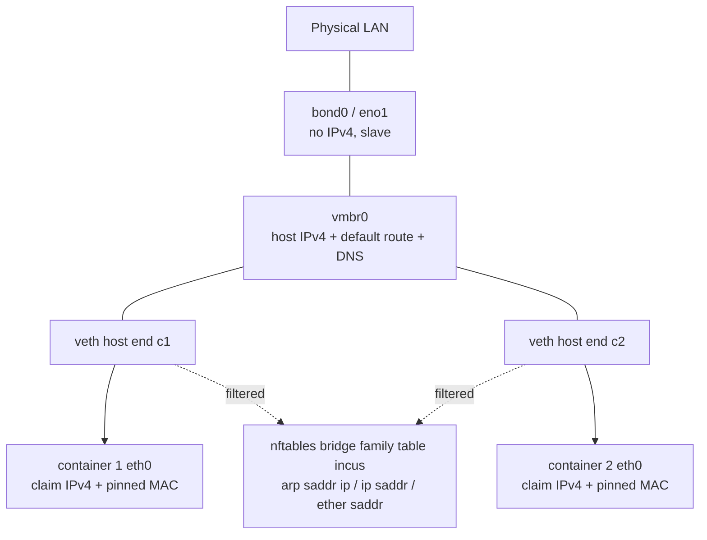
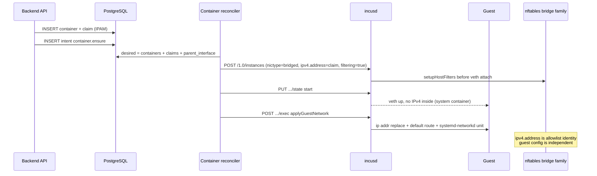

# nyabase on Incus: Switch Instance NIC from macvlan to Unmanaged Linux Bridge (PVE `vmbr`)

| Field | Value |
| :--- | :--- |
| Author | TBD |
| Date | 2026-08-27 |
| Status | **Implemented.** Canonical product text is `plans/incus-architecture.md` §2.2 N1 / §9. Host layouts were amended after the design loop: (A) PVE-style IPv4 on `vmbr0`; (B) dedicated container uplink, host IPv4 on a non-slave iface, reason `preflight_host_ip_not_in_pool`. Do not treat KD20 in this file as current. |
| Product | nyabase (unpublished; clean cutover, no tenant compatibility) |
| Related | `plans/incus-architecture.md` §9 / N1–N6; `.codex/skills/harness/docs/incus-refactor/research/bridged-nic.md` |

---

## Overview

nyabase currently attaches every system container NIC as Incus `nictype=macvlan` (`mode=bridge`) against a host physical/bond interface stored in `infra.servers.parent_interface`. That model matches the original N1 decision — no host network mutation — but it structurally cannot do two things the product now wants: **host↔guest L2 reachability** (kernel macvlan parent isolation) and **host-side ARP/IPv4 anti-spoofing** (macvlan has no `security.ipv4_filtering`).

This design switches the product NIC to Incus `nictype=bridged` on an **operator-owned unmanaged Linux bridge** (`vmbr0`), the same shape as Proxmox VE:

```
LAN
 │
bond0          ← no IP, uplink slave of the bridge
 │
vmbr0          ← host IP / gateway / DNS live here
 ├── veth@c1   ← container 1
 └── veth@c2   ← container 2
```

**Hard constraint:** `vmbr` is a host installation prerequisite. nyabase MUST NOT create the bridge, enslave `bond0`, or move the host IP. Preflight discovers and fail-closes, then tells the operator the missing command. After the code lands, the operator (this session, on the local machine) performs one atomic host cutover and then runs tests.

Control-plane IPAM (`control.container_network_claims` + drain window) and guest `exec` address injection stay. Incus `ipv4.address` becomes **filter identity only**. Every NIC sets `security.ipv4_filtering=true` and `security.mac_filtering=true`. The JSON field `parentInterface` keeps its name but its **value becomes the bridge** (`vmbr0`), not `eno1`/`bond0`.

This is a one-shot product cutover: no dual-path `macvlan|bridged`, no compatibility aliases, no leftover `macvlan_*` identifiers.

---

## Background & Motivation

### Current product NIC (verified in code)

`buildDesiredInstanceSpec` in `packages/backend/src/incus/instance-spec.ts` emits:

```ts
eth0: {
  type: 'nic',
  nictype: 'macvlan',
  mode: 'bridge',
  parent: parentInterface,   // infra.servers.parent_interface, e.g. eno1 / bond0
  name: 'eth0',
  hwaddr: deriveInstanceHwaddr(containerId),
}
```

Incus macvlan **rejects** `ipv4.address`. The control plane allocates from `control.container_network_claims`; after the instance is Running, `applyGuestNetwork` (`packages/backend/src/runtime/guest-network.adapter.ts`) `exec`s:

```
ip link set eth0 up
ip addr replace <addr>/<prefix> dev eth0
ip route replace default via <gateway> dev eth0
```

and persists a systemd-networkd unit so Incus last-state restart restores L3.

`compareManagedFields` (`packages/backend/src/incus/compare-managed-fields.ts`) fail-closes if `eth0.nictype !== 'macvlan'` with `INVALID_MANAGED_NETWORK_TYPE` ("The managed Incus network device is not macvlan"). The unit test `returns a typed managed failure for unsafe managed networking` currently treats `nictype: 'bridged'` as that failure. `container-reconciler.test.ts` (`fails closed when eth0 is not macvlan and never writes Incus`) does the same for `nictype: 'routed'`.

Protocol currently **rejects** a server-create body that carries `nictype: 'bridged'` — `packages/common/src/__tests__/protocol.test.ts` (`rejects bridge-era network fields and unknown server fields`). That test is about keeping nictype **out of the server DTO** (it is derived in the spec builder), not about forbidding bridged NICs on instances. The cutover keeps that rejection.

### Pain points the product accepted under N3

Documented in `plans/incus-architecture.md` §9.3 and `deploy/OPERATIONS.md`:

1. **Host cannot reach its own macvlan children** (kernel). SSH/HTTP proxies must not assume localhost on the Incus parent can open `:22` / HTTP to guest addresses. e2e compensates with `e2e/orchestrator/ssh-proxy-macvlan-reachability.sh` (sibling macvlan in a netns) and skips host TCP probes in `e2e/support/wait-for-ssh.ts`.
2. **No host-side anti-spoofing.** IP uniqueness is claims + drain window only. Topology capability `fib-anti-spoof` is permanently `BLOCKED` in `e2e/topology/incus/provider.ts`.
3. Preflight `networkPrerequisites` is currently just `Boolean(parentInterface)` (`preflight-checks.adapter.ts`). forwarding / rp_filter / FIB are diagnostic and **must not fail first admission**. `nftables` is `environment.firewall === 'nftables'` from `GET /1.0` — the Incus firewall driver always reports nftables even when the `nft` binary is missing (research: `firewall_load.go` warns, does not fail).

### Why now

The user has accepted the PVE `vmbr` topology. Deep Incus research at `.codex/skills/harness/docs/incus-refactor/research/bridged-nic.md` (Incus `010dd793`, CONFIRMED-SRC) shows `nictype=bridged` on an **unmanaged** host bridge:

- `parent` is an existing Linux bridge. Do **not** `incus network create`.
- `security.ipv4_filtering=true` + `ipv4.address=<addr>` works unmanaged. No DHCP, no managed network.
- Generated nftables **`bridge` family** rules bind ARP sender protocol address, IPv4 saddr, and MAC. This is ARP binding / anti-IP-fraud.
- `security.ipv4_filtering` implicitly enables MAC filtering; we still set `security.mac_filtering=true` for intent-clarity.
- `ipv4.address` on a **system** container is host-side filter identity — it does **not** configure the guest. Guest injection remains `exec`.
- Missing `nft` degrades to a log warning; filtering silently fails. Preflight must empirically verify nft.
- `br_netfilter` is **not** required for IPv4/MAC filtering (only IPv6).
- IP filtering is mutually exclusive with NIC `vlan`/`vlan.tagged`. VLANs terminate on the host (`bond0.100` → `vmbr100`).
- `ipv4.address` / `security.ipv4_filtering` are hot-updatable. `hwaddr`, `parent`, `security.port_isolation` are not.
- Rogue DHCP server from inside a container is **not** blocked.
- Unmanaged parent ⇒ `CanMigrate()` false. Product already forbids Incus clustering (`plans/incus-architecture.md` §1.2).

---

## Goals & Non-Goals

### Goals

1. One clean product cutover from `nictype=macvlan` to `nictype=bridged` on an unmanaged Linux bridge.
2. `infra.servers.parent_interface` / API `parentInterface` stores the **bridge name** (`vmbr0`), not the physical/bond NIC.
3. Keep control-plane IPAM and guest `exec` injection.
4. Pin `hwaddr` via existing `deriveInstanceHwaddr` (SHA-256 of container UUID, locally-administered unicast).
5. Enable `security.ipv4_filtering` + `security.mac_filtering` on every instance NIC. Fail closed if nft cannot be proven.
6. Preflight discovers: parent exists, is a Linux bridge, is **unmanaged**, host IPv4 ∈ at least one bound pool `cidr` on **any** host iface (layout A on `vmbr0`, layout B on a non-slave management NIC), `nft` works, probe instance starts, guest address applies, guest can ping that host IPv4. Missing host work is reported as the operator command; never executed.
7. e2e proves (a) parent is a bridge, (b) instance NIC is bridged, (c) guest address still applied, (d) **host can reach guest** (new vs macvlan; this is the proxy-on-host proof), (e) anti-spoof evidence (nft rules for the claim address exist; spoofed second IP / ARP does not leave the veth). Preflight’s L2 check is **guest→host** (`guestCanReachHost`); it does not substitute for (d).
8. Frontend/admin copy: any "macvlan parent" / "父网卡" / "父接口" becomes "LAN 网桥 (vmbr)".
9. Update `plans/incus-architecture.md` network decisions **N1, N2, N3, N5** and §8.2 / §9 / §9.8 / §15.6 / §16.1. **N6 stays** (no IP-change UI); §9.8 is rewritten only to replace the stale routed `UpdatableFields` claim.
10. Document the exact atomic host cutover recipe as an **ops prerequisite**. Product code does not execute it.

### Non-Goals

- Creating, renaming, or deleting host bridges from nyabase. No `incus network create`. No `ip link add`. No netplan write.
- Moving the host IP from `bond0`/physical onto `vmbr0`. Operator-only.
- `nictype=routed`. User rejected; not real L2; host proxy-ARP.
- Dual-path macvlan+bridged compatibility, aliases, or feature flags.
- An in-product macvlan→bridged instance converter. Leftover `nyc-*` are deleted by the operator; `validateEth0` fail-closes on actual non-bridged and **never writes** Incus (see Cutover of leftover instances).
- IPv6 addressing or `security.ipv6_filtering` (product IP pools are IPv4-only: `zIpv4Cidr` / `zIpv4Address` in `rest-schema.ts`).
- In-guest cloud-init for this cutover. Keep `exec`.
- Tenant L2 isolation (`security.port_isolation`). Default **off**.
- Blocking rogue DHCP from inside a container (`security.acls` / extra nft). Accepted gap; not this change.
- Renaming DTO `routedIp` / DB `routed_ip` (see Key Decisions).
- Incus cluster live migration (already out of product scope).
- Changing IPAM, drain window, SSH/HTTP proxy snapshot shape, or IP pool schema.

---

## Proposed Design

### Target topology



Illegal (rejected by preflight, not by product mutation): host IPv4 still on `bond0` **and** containers on a `vmbr` whose slave is `bond0`. Linux cannot put an L3 address on a bridge slave.

### Desired Incus device (the whole product NIC)

Replace the macvlan document in `buildDesiredInstanceSpec`:

```ts
eth0: {
  type: 'nic',
  nictype: 'bridged',
  parent: parentInterface,                 // vmbr0, not bond0
  name: 'eth0',
  hwaddr: deriveInstanceHwaddr(containerId),
  'ipv4.address': container.routedIp,      // filter identity, NOT guest config
  'security.ipv4_filtering': 'true',
  'security.mac_filtering': 'true',
}
```

Dropped keys vs today: `mode: 'bridge'` (macvlan-only). Never set `network=`, `vlan`, `vlan.tagged`, `ipv4.routes*`, `security.port_isolation`, `security.ipv6_filtering`.

**Glossary (one address, three names):** the claim IPv4 is `container.routedIp` on the wire, `eth0['ipv4.address']` in Incus (**nft allowlist only**), and the address `applyGuestNetwork` writes. Never pass CIDR (CIDR form is OCI-only). Keep rejecting `nictype` / `bridgeParent` on the **server** DTO (`zCreateServerRequest.strict()` + protocol test `rejects bridge-era network fields`).

`applyManagedFields` already **replaces** `eth0` wholesale (`compare-managed-fields.ts` lines 326–331). Update the comment: `ipv4.address` is now required on the desired device; still drop leftover `mode` and routed-only `ipv4.host_address`. Do not merge extra actual keys into eth0.

### `validateEth0` (unsafe type vs repairable keys)

`container-reconciler.service.ts` (lines 382–393) calls `compareManagedFields` **before** `applyManagedFields` / `readModifyWriteInstance`. On `kind === 'managed_failure'` it returns the failure and **never writes Incus**. The current unit test `fails closed when eth0 is not macvlan and never writes Incus` is that contract. After cutover the unsafe type is anything other than `bridged`.

| Check | actual | desired | On mismatch |
| :--- | :--- | :--- | :--- |
| device present, `type=nic` | required | required | `MISSING_MANAGED_NETWORK_ADDRESS` (keep this code **only** for missing/non-nic eth0 — do not overload it). **No write.** |
| `nictype` | must be `bridged` | must be `bridged` | `INVALID_MANAGED_NETWORK_TYPE` ("is not bridged"). **No write.** Leftover macvlan/routed sticks until the operator deletes the instance. This is the only actual-device fail-closed-no-write besides missing eth0. |
| `parent`, `name=eth0`, `hwaddr` | **not** fail-closed | **required** (non-empty; `name` exactly `eth0`) | Desired omit → `INVALID_MANAGED_NETWORK_TYPE` with details naming the key (spec-builder bug; `buildDesiredInstanceSpec` must always pin them). Actual omit or different value on an already-bridged NIC → ordinary `diff`; `applyManagedFields` wholesale-replaces eth0 (device stop/start for `parent`/`hwaddr`/`name`, already documented). Today `validateEth0` does **not** require `hwaddr`; keep that repair path so a volatile-only MAC gets `deriveInstanceHwaddr`. |
| `ipv4.address` (bare IPv4), `security.ipv4_filtering=true`, `security.mac_filtering=true` | **not** fail-closed | **required** | Desired omit → `INVALID_MANAGED_FILTER_IDENTITY` (spec-builder bug). Actual omit on an already-bridged NIC → ordinary `diff`; these keys **are** Incus `UpdatableFields`. |

Do **not** return `MISSING_MANAGED_NETWORK_ADDRESS` for a missing filter key. That code today means "eth0 device missing" (`incus-errors.ts`). The reconciler copy at ~266–274 ("no macvlan network address, parent interface, or IP pool gateway") is about **claims/gateway in PostgreSQL**, not Incus device keys — change the string to "LAN bridge / claim / gateway", keep the same failure code.

Guest injection is **unchanged**: `applyGuestNetwork` after Running, same script. Reconciler still validates `routed_ip` + `network_key` + `gateway` + `parent_interface` before building the spec.

### Cutover of leftover instances (no in-product converter)

Unpublished / no tenants. **Option (a):**

1. `validateEth0` fail-closes on actual `nictype !== 'bridged'`. Reconcile will **not** PUT bridged onto a macvlan NIC, will **not** bounce the device, will **not** attach it to `vmbr0`.
2. Ops recipe, **before workers start on the new spec:** `incus list` / `incus delete --force` every leftover `nyc-*` and `nyabase-preflight-*`. Skip reconcile until the node is empty of managed instances (or accept those leftovers as `INVALID_MANAGED_NETWORK_TYPE` until deleted).
3. New creates use the bridged document only.

Do **not** treat actual macvlan as a repairable `diff`. A nictype swap is a device-driver change (`hwaddr`/`parent`/`nictype` are not in bridged `UpdatableFields`) and we are not shipping a converter. Workers will never PUT a bridged NIC against a non-bridge parent: either the instance is gone, or it is already bridged, or reconcile fail-closes without writing.

Create-container gate (`container-control.service.ts` ~346–350) currently: "The server has no parent interface for macvlan". Change to "LAN bridge". Still require `preflight_status = passed`. Image gate `network_managed_externally` stays: platform owns addressing; guest must not run DHCP/NM.

### `parentInterface` semantics (not a rename)

| Layer | Name | After cutover |
| :--- | :--- | :--- |
| SQL | `infra.servers.parent_interface` | Unmanaged Linux bridge (`vmbr0`). Column name stays — `migrator.test.ts` already forbids `macvlan` and `bridge_parent` as identifiers. Comment only. |
| API JSON | `parentInterface` | Same. Maps 1:1 to Incus device `parent`. |
| UI | currently "父接口" / "父网卡" | **"LAN 网桥 (vmbr)"**. Placeholder `eth0` → `vmbr0`. |
| Incus | `devices.eth0.parent` | Bridge ifname. |

Do **not** introduce `bridgeParent` / `lanBridge` / `nictype` on the server DTO. `zCreateServerRequest` stays strict. The existing protocol test that rejects `bridgeParent` and `nictype: 'bridged'` on the **server** body remains valid; rename the test to "rejects unknown extra server fields".

`routedIp` stays everywhere (ContainerDto, SSH/HTTP proxy snapshots, e2e). It is the allocated LAN IPv4, not a routed NIC.

### Control-plane vs Incus vs guest



Re-address (still no UI, N6 unchanged): `ipv4.address` **is** in Incus `UpdatableFields` for bridged, unlike routed. A future live re-address can PATCH the filter allowlist without device remove/add, then `exec` the guest. Ordering hazard remains (old address dropped immediately). Not in this cutover. Drain window + claims stay the uniqueness source; Incus `checkAddressConflict` is a node-local second line.

### Preflight (discover, fail-closed, never mutate host)

Current admission (`server-preflight-reconciler.service.ts` + `preflight-checks.adapter.ts`):

| Check | Today | After |
| :--- | :--- | :--- |
| `parentInterface` | field non-empty | **GET `/1.0/networks/{parent}`** exists, `type=bridge`, `managed=false`. Else fail with operator recipe. |
| `forwarding` | node-exporter sysctl on parent; diagnostic | **Remove from report schema.** L2 switching does not need `net.ipv4.conf.<if>.forwarding`. |
| `rpFilter` | diagnostic; macvlan does not require it | **Remove from report schema.** Anti-spoof is nft bridge-family, not rp_filter. |
| `nftables` | `environment.firewall === 'nftables'` | **Empirical.** See below. `GET /1.0` firewall string is supporting only. |
| `networkPrerequisites` | `Boolean(parentInterface)` | Conjunction of parent-is-unmanaged-bridge + host IPv4 on bridge + nft available. |
| `routedAddress` | probe identity after `applyGuestNetwork` | **Rename to `guestAddress`.** Same exec path. |
| (new) `ipv4Filtering` | n/a | After probe Running, second OpenMetrics pull has `nyabase_node_network_bridge_filter_address{address=<probeAddress>}=1`. Not the coarse unlabeled gauge. |
| (new) `guestCanReachHost` | n/a | Probe `exec ping -c 1 -W 3 <host IPv4 on parent>`. **Guest→host only.** Host→guest is e2e claim (d), not this check. |

Add Incus client methods (today `IncusClientPort` has no network endpoints):

```ts
getNetwork(name: string, options?: IncusRequestOptions)
  : Promise<IncusResponse<IncusSchema<'Network'>>>;
getNetworkState(name: string, options?: IncusRequestOptions)
  : Promise<IncusResponse<IncusSchema<'NetworkState'>>>;
```

`GET /1.0/networks/{name}` → `Network.type === 'bridge'` and `Network.managed === false`. Managed `true` means someone ran `incus network create`; reject with "parent must be an operator-owned unmanaged bridge; do not use `incus network create`".

**Incus 404 is not a complete fallback.** Split type/slaves from host-IP proof:

| GET | Result | Type / slaves | KD 20 host IPv4 + ping target |
| :--- | :--- | :--- | :--- |
| `/1.0/networks/{parent}` 404 | Exporter `is_bridge{parent}=0` or missing | `preflight_lan_bridge_missing` / `preflight_parent_not_bridge` | n/a |
| `/1.0/networks/{parent}` 404 | Exporter `is_bridge{parent}=1` | Treat as unmanaged Linux bridge; slaves from `bridge_slave` / `brif` | Scan other Incus network states for a pool-CIDR host IPv4 (`preflight_host_ip_not_in_pool` if none). |
| `/1.0/networks/{parent}` 200, then `/state` 404 | Type already known from the network object | Slaves from exporter `brif` if `upper_devices` absent | Same: ping target from any host iface in a bound `cidr`, not only the parent. |
| both 200 | `type=bridge`, `managed=false` | `NetworkState.bridge.upper_devices` preferred | Parent addresses preferred; if the bridge has no IPv4 (layout B), use another iface. |

Do **not** add `nyabase_node_network_ipv4_address{interface,address}`. Failing closed on missing Incus state is simpler and safer than a second address family.

`GET /1.0/networks/{name}/state` (success) → pick `family=inet` `scope=global` addresses (exclude `127.0.0.0/8` and `169.254.0.0/16`). Membership is `isUsableHostInCidr(pool.cidr, address)` (`packages/common/src/utils.ts`) against **at least one** bound pool’s `cidr` (`infra.ip_pools.cidr`, **not** `allocation_cidr`). Do not use `cidrToIps`. The first matching address is the `guestCanReachHost` ping target.

**Host IPv4 rule (KD 20, amended):** `listIpPoolNetworks(serverId)` → `{ gateway, cidr, prefixLength }[]`. Empty → `preflight_ip_pool_missing`. Proof is `isUsableHostInCidr` against **any** host inet/global Incus `NetworkState` address (parent preferred, then other ifaces). Two layouts: (A) address on `vmbr0`; (B) address on a non-slave management NIC, bridge and slaves have no global IPv4. Missing everywhere → `preflight_host_ip_not_in_pool`. Do not require `allocation_cidr`.

Illegal-topology check (host IPv4 still on a slave): for every slave name, `nyabase_node_network_ipv4_present{interface=<slave>}` must be 0. Slave names from Incus `upper_devices` if present, else exporter `nyabase_node_network_bridge_slave{bridge=<parent>,interface=...}=1` (from `/sys/class/net/<parent>/brif/`). Gauge omitted → `preflight_slave_ipv4_unproven`. Gauge 1 → `preflight_host_ip_still_on_uplink`. No slave list → `preflight_bridge_has_no_uplink`.

Probe instance NIC (replace macvlan block at `server-preflight-reconciler.service.ts` ~809–816):

```ts
eth0: {
  type: 'nic',
  nictype: 'bridged',
  name: 'eth0',
  parent: parentInterface,
  hwaddr: deriveInstanceHwaddr(probeHardwareId(server.id)),
  'ipv4.address': probeOptions.probeAddress,
  'security.ipv4_filtering': 'true',
  'security.mac_filtering': 'true',
}
```

`probeAddress` is **both** the guest-exec target and Incus `ipv4.address` filter identity (same dual use as `routedIp` on real containers).

Then `applyGuestNetwork` as today. Then:

1. Call `nodeMetrics.pull` a **second** time after the probe is Running (`NodeMetricsPullPort.pull`, same path as the existing preflight pull at the start of `runPreflight`). Do **not** wait for `NodeMetricsScrapeService` / `NODE_METRICS_SCRAPE_INTERVAL_MS` (15s). Do not add a sleep. Do not invent a new scrape architecture. Do **not** add a second HTTP dump surface; `/metrics` stays OpenMetrics-only (`renderOpenMetrics` / `parseOpenMetrics`).
2. `nftables` check: `nyabase_node_network_nft_available=1`.
3. `ipv4Filtering` check: among the second pull’s samples, require `nyabase_node_network_bridge_filter_address{address: probeAddress}=1`. The unlabeled `nyabase_node_network_bridge_filter_present` is **alerting only** (any leftover chain can set it to 1). No nft dump in `reportEvidence`.
4. `guestCanReachHost`: `incus exec ping -c 1 -W 3 <host IPv4 in pool CIDR>`. Parent `/networks` or `/state` 404 is not fatal if another iface supplies the ping target; none → `preflight_host_ip_not_in_pool` (no ping). The preflight image (`incus.preflightImageAlias` / fingerprint) **must contain `ping`** (`iputils-ping`), same class of contract as today’s `wget` egress. If exec return is 127 / `ping: not found`, fail `preflight_probe_ping_missing`. If ping is present and fails: `preflight_guest_cannot_reach_host` (topology **or** host firewall; see hints).
5. Existing `checkEgress` wget stays.

`zRunPreflightRequest.probeHostAddress` is documented "ignored for macvlan". **Delete it** (dead optional).

Failure reasons (structured `PREFLIGHT_FAILED` details, shown in admin UI):

| Reason | Operator hint (text only) |
| :--- | :--- |
| `preflight_lan_bridge_missing` | Parent ifname not in `/sys/class/net`, or Incus `/1.0/networks/{parent}` 404 **and** exporter `is_bridge=0`. Recipe: create `vmbr0` (OPERATIONS.md). |
| `preflight_parent_not_bridge` | Ifname exists but is not a Linux bridge (still a bond/physical). |
| `preflight_parent_is_managed` | `incus network show` reports `managed: true`. Delete the managed network; keep the kernel bridge. |
| `preflight_ip_pool_missing` | No pool bound to the server. Bind an IP pool first (unchanged). |
| `preflight_host_ip_not_in_pool` | No host inet/global address in any bound pool `cidr` (parent or other ifaces). Layout A: put the host IP on `vmbr0`. Layout B: keep it on the management NIC; do not put it on a slave. |
| `preflight_host_ip_still_on_uplink` | A bridge slave still has a global IPv4. Illegal topology. |
| `preflight_slave_ipv4_unproven` | Slave listed but `ipv4_present` omitted (`ip -4 addr` failed). Fix exporter collection, do not move IPs. |
| `preflight_bridge_has_no_uplink` | No slaves in Incus `upper_devices` and no exporter `brif` entries. Enslave `bond0`/NIC. |
| `preflight_nft_unavailable` | `nft` missing, permission denied, or collect timed out. `apt install nftables`. Exporter unit must have `AmbientCapabilities=CAP_NET_ADMIN` (not sudoers). |
| `preflight_ipv4_filter_not_applied` | Second pull has no `bridge_filter_address{address=probeAddress}=1`. |
| `preflight_probe_ping_missing` | Probe image has no `ping`. Install `iputils-ping` in the preflight image; do not rebuild vmbr. |
| `preflight_guest_cannot_reach_host` | `ping` ran and failed. Check host IP on `vmbr0`, then host firewall: `ufw status` / `ufw route allow in on vmbr0` / firewalld zone for the bridge (research Q7.6). nyabase does not configure host firewall. |

### First admission vs re-run (exact predicates)

Replace today’s early throw (`server-preflight-reconciler.service.ts` 670–681: only when `preflight_status !== 'passed'` and `networkPrerequisites !== true`) and `successReport` special-cases (`1090–1094`: `forwarding`/`rpFilter` always count as ready).

**`networkPrerequisites` after cutover** is the conjunction of: parent is unmanaged Linux bridge, host IPv4 ∈ some bound `cidr` on any host iface, no global IPv4 on slaves, nft binary/capability available (`nft_available=1`). It does **not** include probe-time `ipv4Filtering` / `guestCanReachHost` (those need the probe).

**Early throw (before probe), always — including when the server previously `passed`:**

- `parent_interface` empty
- parent not unmanaged bridge
- `preflight_ip_pool_missing`
- host IPv4 not on bridge / still on uplink / no uplink
- `nft_available=0`

A previously passed server whose exporter lost nft or whose host IP left `vmbr0` becomes `preflight_status=failed`, `controlReady=false`, and **create-container is blocked**. Do not record a failing report while leaving status `passed`.

**After probe, always fail-closed** (same `preflight_status=failed`): `simplestreamsImage`, `guestAddress`, `ipv4Filtering` (probe-address-specific), `guestCanReachHost`, `egress`.

**`successReport` `controlReady`:**

```
gpuRuntime: pass | not_applicable
nodeMetrics: pass | warn     // the only remaining flake-tolerant check
every other remaining key: pass
```

Do **not** resurrect forwarding/rpFilter exceptions. There are no such keys. `ipv4Filtering` and `guestCanReachHost` **gate** `controlReady`.

**`failureReport` checklist** must drop `forwarding`/`rpFilter`/`routedAddress` and include `ipv4Filtering`, `guestCanReachHost`, `guestAddress`.

### Sysctl / nft / bridge checks (exact)

| Check | Instrument | Fail-closed? | Rationale |
| :--- | :--- | :--- | :--- |
| Parent exists | Incus `GET /1.0/networks/{parent}` or exporter `is_bridge` | Yes | Incus start error `Parent device %q doesn't exist` is too late. |
| Parent is Linux bridge | Incus `type=bridge` **or** exporter `/sys/class/net/<if>/bridge/` ( **do not** use sysfs `type`; ARPHRD_ETHER is shared) | Yes | Bridged NIC `ip link set veth master <parent>` requires a bridge. |
| Unmanaged | Incus `managed=false`; Incus 404 + exporter `is_bridge=1` counts as unmanaged | Yes | Managed bridge puts Incus in charge of the LAN. |
| Host IPv4 in pool CIDR | Any host Incus `NetworkState` inet/global + `isUsableHostInCidr`. Parent 404 is not fatal if another iface proves membership (`preflight_host_ip_not_in_pool`) | Yes | Layout A or B; ping target. |
| No IPv4 on slaves | exporter `ipv4_present{slave}=0` for every slave from Incus `upper_devices` or exporter `brif` | Yes | Illegal topology. No slave list → `preflight_bridge_has_no_uplink`, not a skip. |
| `nft` binary + list | exporter `nyabase_node_network_nft_available` | Yes | Silent filter loss is the highest operational risk in the research. |
| Filter rules after probe | `nyabase_node_network_bridge_filter_address{address=probeAddress}=1` on the second pull | Yes | Coarse `bridge_filter_present` is alerting only. |
| `net.ipv4.conf.<parent>.forwarding` | drop | No | L2 bridge does not route. |
| `rp_filter` on parent or slaves | drop as admission | No | Not the anti-spoof path. Optional leftover diagnostic in exporter is fine; not in PreflightReport. |
| FIB `fib saddr . iif oif missing drop` | drop | No | Routed-NIC artefact. Stop looking for it. |
| `br_netfilter` / `bridge-nf-call-ip6tables` | do not check | n/a | IPv6 filtering out of scope. Incus will not load it for IPv4. |
| `net.ipv4.ip_forward` | do not require | n/a | Same-subnet L2. |

Node-exporter (`packages/node-exporter/src/collector.ts` `collectNetworkEvidence`):

Keep walking `/proc/sys/net/ipv4/conf/*` for **diagnostic** forwarding/rp_filter. Keep emitting `nyabase_node_network_fib_rule_present` as a leftover diagnostic (do not delete it from the allowlist so tests do not drop it accidentally); it is **not** in PreflightReport and **not** fail-closed.

Add to the **closed** metric contract (`packages/common/src/constants.ts` `NODE_METRIC_NAMES`, `packages/common/src/enums.ts` `NodeMetricName`, `packages/common/src/protocol/node-metrics.ts` `NODE_METRIC_DEFINITIONS`). Unknown names are a TypeScript error and/or a silent drop in `packages/backend/src/metrics/metrics-writer.ts`. Collector tests call `validateNodeMetricSample`.

| Name | Type | Labels | Value |
| :--- | :--- | :--- | :--- |
| `nyabase_node_network_is_bridge` | gauge | `interface` | 1 iff `/sys/class/net/<if>/bridge/` exists. **Do not** use sysfs `type` (ARPHRD_ETHER is shared with ethernet). |
| `nyabase_node_network_ipv4_present` | gauge | `interface` | 1 iff a **scope global** IPv4 exists, excluding `127.0.0.0/8` and `169.254.0.0/16`. Secondary global addresses count. |
| `nyabase_node_network_bridge_slave` | gauge | `bridge`, `interface` | 1 for each name in `/sys/class/net/<bridge>/brif/`. Lets preflight see slaves when Incus `upper_devices` is missing. |
| `nyabase_node_network_nft_available` | gauge | _(none)_ | 1 iff `nft list table bridge incus` is runnable (exit 0 **or** “No such table” — binary + CAP work). 0 on ENOENT, EACCES, timeout. |
| `nyabase_node_network_bridge_filter_present` | gauge | _(none)_ | **Coarse** alerting-only signal: table `bridge incus` contains some `arp saddr ip` **and** `ip saddr` drop. Any leftover chain can set this to 1. **Not** the preflight admission check. |
| `nyabase_node_network_bridge_filter_address` | gauge | `address` | 1 for each allowlisted **bare IPv4** parsed from `nft list table bridge incus` (from `{ 203.0.113.10/32 }` / `{ 203.0.113.10 }` sets on `arp saddr ip` and `ip saddr` rules). Strip `/32`; skip non-IPv4 tokens. Extend `validateLabelValue` in `node-metrics.ts` so `address` must be `isIP(value)===4` (same as `zIpv4Address`); dotted IPv4 already matches `STABLE_ID_PATTERN`. Extra labels still throw `OpenMetricsSchemaError`. |

**`ipv4_present` data source:** one `ip -4 -o addr show` (not sysctl, not `/proc/net/fib_trie`). Parse lines like `inet A.B.C.D/NN … scope global`. Emit the gauge for **every** scanned iface (union of `/proc/sys/net/ipv4/conf/*` names, `/sys/class/net/*`, and every `brif` slave) so slaves are visible even when Incus 404s.

**nft argv:** replace today’s `nft list ruleset` with **exactly** `nft list table bridge incus`. Do not also call `nft list tables`. The collector parses stdout **locally** and emits OpenMetrics samples only — no dump field, no extra HTTP route (`AuthenticatedNodeMetricsPullAdapter` / `parseOpenMetrics` stays as-is; unknown families still throw).

Interpret:

- exit 0 → `nft_available=1`; set coarse `bridge_filter_present` if any ARP+IP drop pair exists; emit `bridge_filter_address{address}=1` for each unique bare IPv4 in those allow-sets.
- stderr matches missing table → `nft_available=1`, `bridge_filter_present=0`, no address samples.
- missing binary / permission / timeout → `nft_available=0`; **do not** silently omit (today’s `catch { return samples }` becomes an explicit 0).

**Timeouts:** node-exporter HTTP collect timeout is `DEFAULT_COLLECTION_TIMEOUT_MS = 1_000` (`packages/node-exporter/src/server.ts`); backend pull is `NODE_METRICS_REQUEST_TIMEOUT_MS = 2_000`. Cap the nft command at 400ms and `ip -4 -o addr show` at 250ms so both fit in the 1s collect budget (today’s `nft list ruleset` already consumes up to 1s). Product still does not run nft itself.

### nft privilege (was Q1) — CAP_NET_ADMIN, no sudoers

Current unit (`deploy/nyabase-node-exporter.service`): `User=nyabase-node`, `NoNewPrivileges=true`, no `AmbientCapabilities`, `ProtectSystem=strict`. OPERATIONS.md already says nft is omitted when unprivileged. **Sudoers cannot work** with `NoNewPrivileges=true`.

**Chosen model:**

```
NoNewPrivileges=true
AmbientCapabilities=CAP_NET_ADMIN
CapabilityBoundingSet=CAP_NET_ADMIN
```

Drop any sudoers recipe. Keep the unprivileged user. **Document honestly:** `CAP_NET_ADMIN` is broader than `nft list` (it can change host network config, not only list tables). Bounding set is only this capability; `NoNewPrivileges` still blocks sudo/setuid. This is a unit-file change in the **same** PR as the collector.

`NODE_EXPORTER_PARENT_INTERFACE` comment: "Optional macvlan parent" → "Optional LAN bridge name (vmbr0) used only as a fallback if `/proc/sys/net/ipv4/conf` cannot be listed". Prefer scanning all interfaces so slaves are visible.

### Guest address injection (keep)

`buildGuestNetworkScript` is correct for bridged too: the guest still has no address until exec. systemd-networkd persistence still needed so host reboot + Incus last-state start does not wait for the next reconcile.

Do **not** pass CIDR `ipv4.address` expecting Incus to configure a system container — `nicOCIStaticNetworkConfig` returns nil unless OCI.

DNS: existing `dns_servers` on the server, written by the same script. Unchanged.

### `security.port_isolation`: off

Kernel `IFLA_BRPORT_ISOLATED` blocks traffic only between two ports that are **both** isolated; isolated ports still talk to the uplink and the bridge. The product model is PVE `vmbr`: containers are first-class LAN peers and may talk to each other. There is no current product requirement for tenant L2 isolation (multi-container tenants would also break). Default **unset/false**. Not in the desired spec. Not in UpdatableFields, so toggling later would bounce the NIC.

### VLANs

If the LAN is tagged, operator terminates on the host (`bond0.100` enslaved to `vmbr100`) and sets `parentInterface=vmbr100`. Product NICs never set `vlan` / `vlan.tagged` (mutually exclusive with IP filtering). Out of this cutover's host recipe except a one-line warning.

### Frontend / admin

| File | Change |
| :--- | :--- |
| `packages/frontend/src/pages/servers-page.tsx` | Onboarding field label `父接口` → `LAN 网桥 (vmbr)`; placeholder `eth0` → `vmbr0`. JSON key `parentInterface` unchanged. |
| `packages/frontend/src/lib/display-labels.ts` | `parentInterface: '父网卡'` → `'LAN 网桥'`; drop `forwarding`/`rpFilter`; `routedAddress` → `guestAddress: '容器 IP'`; add `ipv4Filtering: 'IPv4 防伪'`, `guestCanReachHost: '容器可达宿主'`. |
| `packages/frontend/src/pages/server-detail-page.tsx` | Preflight card description currently "检查网络转发、nftables…". Rewrite: "检查 LAN 网桥、nftables 防伪、探针实例与容器→宿主连通". |

No container-detail change for `routedIp` label ("容器 IP" is already correct).

### Architecture doc flips (`plans/incus-architecture.md`)

| Decision | Today | After |
| :--- | :--- | :--- |
| N1 | `nictype=macvlan`, parent = physical NIC. Do not build a bridge. | **`nictype=bridged`**, parent = **unmanaged** `vmbr*`. Operator owns the bridge. Still not `routed`. Product still does not create the bridge. |
| N2 | macvlan rejects `ipv4.address`; guest exec writes it. `routedIp` is historical. | Bridged **accepts** `ipv4.address` as **filter identity**. Guest exec **still** writes the address. `routedIp` stays historical. |
| N3 | No host anti-spoof; claims + drain; host cannot reach children. | Host-side nft ARP/IPv4/MAC bind. Claims + drain remain IPAM uniqueness (cluster-wide). **Host can reach guests.** Rogue DHCP still open. |
| N4 | Control-plane claims + drain. | Unchanged. Incus is not IPAM. |
| N5 | "已确认**不需要**广播/组播/独立 MAC/容器内 DHCP 客户端。routed 是 L3 转发，这些都不可用" | **Copy-paste replacement row:** 容器是局域网上一等 L2 对等体（独立 MAC、ARP、广播）。**不因此打开容器内 DHCP。** 镜像必须 `network_managed_externally=true`；地址由控制面 `exec` 写入。禁止容器内 DHCP 客户端 / NetworkManager 冲掉该地址。 |
| N6 | No UI to change IP. Text currently claims routed `ipv4.address` is not hot-updatable. | **N6 stays (no IP-change UI).** §9.8 is rewritten **only** to replace the stale routed `UpdatableFields` claim with: bridged filter identity (`ipv4.address`) **is** hot-updatable; guest still needs `exec`; still no UI. |

Rewrite §8.2 sample `eth0` (the snippet still says `nictype: "routed"` — that is already stale vs the implemented macvlan spec). Rewrite §9 entirely (device shape, anti-spoof, ops prerequisite, sysctl). Rewrite §15.6 and §16 item 1. Drop §17 row "⚠️ nft 缺失导致 FIB 那一层静默消失" / "无广播/组播"; replace with nft-silent-fail on bridged filters and rogue-DHCP gap. §9.6 currently celebrates "不需要建网桥" — invert: bridge **is** required, but **outside the product**.

`plans/incus-control-plane-fixes.md` still says "macvlan + guest exec" and "don't switch to routed". Add a pointer that N1 is now bridged; do not resurrect routed.

### SSH / HTTP proxies

`deploy/OPERATIONS.md` currently requires proxies on a **different machine or netns** because the Incus parent cannot reach macvlan children. After cutover that requirement **lifts**: proxies may run on the Incus host and TCP to guest `:22` / HTTP. Snapshot field remains `routedIp`. `e2e/orchestrator/ssh-proxy-macvlan-reachability.sh` is deleted or reduced to a no-op comment; `run-full-pipeline.sh` must not create a sibling macvlan.

---

## API / Interface Changes

### Server DTO (no key rename)

`CreateServerRequest` / `PatchServerRequest` / `ServerDto.parentInterface` unchanged at the wire level. Semantics: Linux bridge ifname matching `NETWORK_INTERFACE_RE` (`^[A-Za-z0-9_.:-]+$`, max 64).

### Preflight report (`zPreflightReport` in `rest-schema.ts`)

Before:

```
api, parentInterface, gpuRuntime, forwarding, nftables, rpFilter,
networkPrerequisites, storagePool, simplestreamsImage, routedAddress,
egress, nodeMetrics
```

After:

```
api, parentInterface, gpuRuntime, nftables, ipv4Filtering, guestCanReachHost,
networkPrerequisites, storagePool, simplestreamsImage, guestAddress,
egress, nodeMetrics
```

`zPreflightReport.superRefine` still requires `controlReady` ⇒ `networkPrerequisites === 'pass'`. `successReport` additionally requires every other remaining check `pass` except `gpuRuntime` (`pass|not_applicable`) and `nodeMetrics` (`pass|warn`). `zRunPreflightRequest`: drop `probeHostAddress`.

### Incus client

Add `getNetwork` / `getNetworkState`. Do not add `createNetwork`. Every test fake of `IncusClientPort` used by preflight must grow these two methods.

### Errors

| Code | Change |
| :--- | :--- |
| `INVALID_MANAGED_NETWORK_TYPE` | Message: "is not bridged". Actual leftover macvlan/routed. **No Incus write.** |
| `MISSING_MANAGED_NETWORK_ADDRESS` | **Unchanged meaning:** eth0 device missing / not `type=nic`. Do not use for omitted filter keys. PostgreSQL claim/gateway miss at reconciler ~266 keeps this code but updates the human string. |
| `INVALID_MANAGED_FILTER_IDENTITY` | **New** Incus failure code: **desired** eth0 omits bare `ipv4.address` or security filter keys (spec-builder bug). Actual omit on a bridged NIC is a repairable `diff`. |
| `PREFLIGHT_FAILED` | New `reason` values listed above. Keep one FailureCode enum value; structured `details.reason`. |

`container-control.service.ts` user-facing strings that mention macvlan.

---

## Data Model Changes

**No migration.** Unpublished repo; `000001_initial.sql` is rewritten in place per A5, and `parent_interface` already exists.

```sql
-- infra.servers.parent_interface
-- Unmanaged Linux bridge ifname used as Incus NIC parent (e.g. vmbr0).
-- Not a physical/bond NIC. nyabase never creates this device.
parent_interface text,
```

`control.container_network_claims` unchanged (`UNIQUE (network_key, address)`, releasing + `reusable_at` drain). `control.container_ssh_routes.routed_ip` unchanged.

`migrator.test.ts` continues to forbid `\bmacvlan\b` and `\bbridge_parent\b` in SQL. Do not rename the column to `lan_bridge` — that would be a cosmetic churn against a test that already accepted `parent_interface` as the Incus parent.

---

## Alternatives Considered

### 1. Stay on macvlan (status quo)

**Pros:** No host cutover risk; no chance of SSH lockout; current e2e/netns workaround already works; N1 as written.

**Cons:** Host cannot reach guests; no nft ARP/IP bind; proxies cannot live on the Incus parent; `fib-anti-spoof` forever blocked. User rejected this for the present change.

### 2. Incus `nictype=routed`

**Pros:** Stronger structural anti-spoof (no shared L2, rp_filter + FIB); Incus writes the address into the guest; rogue DHCP impossible by construction.

**Cons:** Not real L2; host proxy-ARPs; independent MAC/broadcast/LAN-peer semantics the user wants (PVE `vmbr`) are gone. Explicitly rejected. Do not implement. Existing leftover comments that still say routed in §8.2 must be corrected as part of the architecture rewrite, not as a product option.

### 3. Incus managed bridge (`incus network create`)

**Pros:** Incus DHCP could hand out `ipv4.address`; `CanMigrate()` true in a cluster we do not run.

**Cons:** Puts Incus in charge of the LAN bridge and (typically) DHCP. Conflicts with "vmbr is operator-owned, like PVE". Validation branch requires managed-network DHCP semantics. Preflight would have to *create* a network — forbidden. Rejected.

### 4. Dual-stack macvlan + bridged compatibility

**Pros:** Rolling cutover on a fleet with production tenants.

**Cons:** Unpublished repo, no tenants. Dual-path in `instance-spec`, compare, preflight, e2e, and UI is exactly the compatibility tax the architecture forbids. Rejected. One desired document.

---

## Security & Privacy Considerations

| Threat | Severity | Mitigation |
| :--- | :--- | :--- |
| Guest spoofs another container or LAN host IPv4 / ARP | High (why we are cutting over) | nft `bridge` family: `ip saddr`, `arp saddr ip`, `ether saddr`, `arp saddr ether`. Filter identity = claim IPv4 + pinned MAC. Fail-closed if nft unproven. |
| Silent loss of filters (`nft` missing) | High | Incus only warns. Preflight empirical + runtime exporter metric. Do not treat `environment.firewall` as proof. |
| Control plane omits `ipv4.address` | High | Unmanaged + filtering requires it (Incus 400). Spec builder always sets it from the claim; `validateEth0` on **desired** uses `INVALID_MANAGED_FILTER_IDENTITY`. Empty Incus allowlist would block all IPv4 rather than allow all. |
| `ipv4.routes` / `ipv4.routes.external` widen the allowlist | High if tenant-controlled | Product never sets them; compareManagedFields desired map does not include them; applyManagedFields replaces eth0 so leftovers drop. |
| Rogue DHCP server in a container | Medium | **Not blocked** by `security.ipv4_filtering`. Accepted gap. Follow-up: `security.acls` default-drop UDP/67 sport, or operator nft on `vmbr0`. Do not pretend this cutover closes it. |
| Host cutover lockout (IP move) | High, ops | Out of product. Console/IPMI required. Documented recipe uses one declarative apply (`netplan apply` / `ifreload -a` / networkd reload), not interactive `ip` over SSH. |
| Illegal topology (IP on bond0 + vmbr on bond0) | High, connectivity | Preflight fail-closed; product does not "fix" it. |
| PUT dropping `volatile.*` re-MACs the NIC | High, already known | Still pin `hwaddr` explicitly. Still RMW + If-Match. Unchanged. |
| Guest uses a different address than `ipv4.address` | Medium | Packets dropped; connectivity dies rather than spoofing. Reconciler re-applies guest address on every running pass. |
| IPv6 RA / NDP spoof | Low for this product | No IPv6 assignment. Host should still set `accept_ra` on `vmbr0` conservatively (ops note). |
| Port isolation off ⇒ tenant L2 | Accepted | Same as PVE default `vmbr`. IPAM uniqueness + nft bind are the security model. |

Authn/z unchanged (Incus mTLS, server grants). No new secret material. nft rules contain assigned IPs and MACs — already in claims.

---

## Observability

| Signal | Source | Use |
| :--- | :--- | :--- |
| `nyabase_node_network_is_bridge` | node-exporter | Preflight parent type. |
| `nyabase_node_network_ipv4_present` | node-exporter | Host IP on bridge / leftover IP on slave. |
| `nyabase_node_network_bridge_slave` | node-exporter | Slave list when Incus state is missing. |
| `nyabase_node_network_nft_available` | node-exporter | Binary + CAP_NET_ADMIN. |
| `nyabase_node_network_bridge_filter_present` | node-exporter | **Coarse** alerting-only (not per-NIC, not admission). |
| `nyabase_node_network_bridge_filter_address{address}` | node-exporter | Preflight `ipv4Filtering`: require `{address: probeAddress}=1` after the second pull. |
| PreflightReport.checks.* | `infra.servers.preflight_report` | Admin UI. |
| Intent failure `PREFLIGHT_FAILED` + `reason` | `control.intents.failure_json` | Attributable admission failure. |
| Reconciler `INVALID_MANAGED_NETWORK_TYPE` | intent failure | Leftover or hand-edited non-bridged NIC; operator deletes, no converter. |

Alerting (ops, not code in this cutover):

- Preflight `nftables` or `ipv4Filtering` fail on a previously passed server (`preflight_status` becomes `failed`; create-container blocked).
- Exporter `bridge_filter_present=0` while any `nyc-*` instance is Running (coarse; cannot attribute to a veth).
- `ipv4_present` =1 on a `bridge_slave` of `vmbr0` (illegal topology regression).

Logging: do not log full nft dumps at info; log pass/fail + interface name. Guest exec already audited via `auditIncusMutate` on `/exec`.

---

## Rollout Plan

Repo is unpublished. No feature flag. No dual-path. Sequence for **this session**:


**One sequence everywhere** (PR Description, mermaid, numbered list):

1. Stop backend/workers. Do **not** start them on the new spec while leftover macvlan `nyc-*` exist or while `parentInterface` still names a non-bridge.
2. Delete leftover managed instances: `incus delete --force` every `nyc-*` and `nyabase-preflight-*`. **No in-product converter.** `validateEth0` will fail-close (no Incus write) if any macvlan leftover is still present after start.
3. Operator atomic vmbr cutover (below). Out of product.
4. Deploy the **single** PR (protocol + product + **exporter unit file** + OPERATIONS.md + all e2e). Fold unit install into this step: tree on disk → `systemctl daemon-reload` → enable/restart `nyabase-node-exporter` (now with `AmbientCapabilities=CAP_NET_ADMIN`) **before** `systemctl start` backend. Then set `parentInterface=vmbr0` (PATCH or re-seed).
5. Start backend. Run preflight. Create a **new** container. Prove **host** `ping` (e2e claim d) and `bridge_filter_address{address}` for that claim.
6. Run e2e (including `20-servers-images` preflight keys and `70-network`).

Workers stay **stopped** across steps 1–4. There is no independently mergeable increment that leaves the backend running on today’s `eno1`/`bond0` macvlan host. Do **not** merge/deploy first while workers are up.

Rollback: revert the single PR (macvlan spec returns). Host rollback of vmbr is operator (`netplan` previous config) — also lockout-risky; keep console. No dual-stack drain.

Do **not** claim workers will PUT bridged onto a non-bridge parent. They will not: leftover macvlan never reaches `applyManagedFields`.

Changing `parentInterface` on a server with running containers: `parent` is **not** hot-updatable (Incus device stop/start). Accept a brief L2 blip. Do not auto-rewrite parent while preflight is failed.

### Operator prerequisite — atomic host cutover

**Do this on console/IPMI, not over the in-band SSH address being moved.** One declarative apply. Fail-closed preflight will not run any of these commands.

Verify before:

```
ip -d link show bond0          # or eno1
ip -4 addr show dev bond0      # record CIDR, GW, DNS
ip route show default
which nft && nft list tables
ls /sys/class/net/vmbr0 && echo 'vmbr0 already exists'
```

**netplan** (typical Ubuntu; `bond0` already exists as a bond):

```yaml
network:
  version: 2
  renderer: networkd
  bonds:
    bond0:
      interfaces: [eno1, eno2]
      parameters:
        mode: 802.3ad
        lacp-rate: fast
        mii-monitor-interval: 100
      dhcp4: false
      accept-ra: no
  bridges:
    vmbr0:
      interfaces: [bond0]
      addresses: [<HOST_IPV4>/<PREFIX>]
      routes:
        - to: default
          via: <GATEWAY>
      nameservers:
        addresses: [<DNS>, ...]
      parameters:
        stp: false
        forward-delay: 0
      dhcp4: false
```

Apply atomically: `netplan try` (automatic rollback if you lose the console session) then `netplan apply`.

**systemd-networkd:**

```
# /etc/systemd/network/20-bond0.network
[Match]
Name=bond0
[Network]
Bridge=vmbr0
# no Address=

# /etc/systemd/network/30-vmbr0.netdev
[NetDev]
Name=vmbr0
Kind=bridge

# /etc/systemd/network/30-vmbr0.network
[Match]
Name=vmbr0
[Network]
Address=<HOST_IPV4>/<PREFIX>
Gateway=<GATEWAY>
DNS=<DNS>
ConfigureWithoutCarrier=yes
```

`networkctl reload` (or reboot). Do not `ip addr del` on `bond0` as a separate SSH step.

**ifupdown** (Debian/PVE style):

```
auto bond0
iface bond0 inet manual
    bond-slaves eno1 eno2
    bond-miimon 100
    bond-mode 802.3ad

auto vmbr0
iface vmbr0 inet static
    address <HOST_IPV4>/<PREFIX>
    gateway <GATEWAY>
    dns-nameservers <DNS>
    bridge-ports bond0
    bridge-stp off
    bridge-fd 0
```

`ifreload -a` (ifupdown2) or a reboot. `ifdown bond0 && ifup vmbr0` as two steps **will** drop the session.

Single-NIC (no bond): enslave `eno1` the same way `bond0` is enslaved; `eno1` must have no IPv4 after apply.

VLAN: `bond0.100` → `vmbr100`; set nyabase `parentInterface=vmbr100`.

Verify after:

```
ip -d link show vmbr0          # type bridge
bridge link show               # bond0 master vmbr0
ip -4 addr show dev vmbr0      # host IPv4
ip -4 addr show dev bond0      # empty
ip route show default          # dev vmbr0
nft list table bridge incus    # may be empty until a filtered instance starts
ufw status || true             # if active: allow in/route on vmbr0; see linuxcontainers.org firewalld/ufw note
```

Then nyabase preflight. Product never issues these commands. If nft table + guest ping fail, check ufw/firewalld **before** rebuilding vmbr (`preflight_guest_cannot_reach_host`).

---

## Testing

### Unit (must change)

| Test | File | Change |
| :--- | :--- | :--- |
| `builds a complete deterministic macvlan container document` | `instance-spec.test.ts` | Expect `nictype: 'bridged'`, no `mode`, `ipv4.address`, both security keys. Keep the `not.toMatch(/runtimeId\|docker\|routed\|169\.254/)` assertion (bridged JSON does not contain `routed`). Rename the test. |
| `returns a typed managed failure for unsafe managed networking` | `compare-managed-fields.test.ts` | Actual `nictype: 'macvlan'` or `routed` → `INVALID_MANAGED_NETWORK_TYPE`. Actual bridged missing `hwaddr` / `parent` / `ipv4.address` is a `diff`, not that failure. Desired omitting filter keys → `INVALID_MANAGED_FILTER_IDENTITY`; desired omitting `hwaddr`/`parent`/`name` → `INVALID_MANAGED_NETWORK_TYPE`. |
| `fails closed when eth0 is not macvlan` | `container-reconciler.test.ts` | Rename; still asserts **no Incus write** on actual macvlan/routed. Add a case: actual bridged missing `hwaddr` or security keys **does** call `readModifyWriteInstance`. |
| Probe create body | `server-preflight-reconciler.test.ts` ~937 | Bridged + `ipv4.address` + filtering. Reason `preflight_macvlan_parent_missing` → `preflight_lan_bridge_missing`. |
| `keeps forwarding and rp_filter diagnostic` | `preflight-checks.adapter.test.ts` | Replace with bridge/nft/ipv4_present conjunction. Missing parent still fails. |
| Protocol `rejects bridge-era network fields` | `protocol.test.ts` | Keep rejecting extra `nictype` / `bridgeParent` / `lanCidr` on the **server** body. Update `zPreflightReport` fixtures: drop `forwarding`/`rpFilter`, rename `routedAddress` → `guestAddress`, add `ipv4Filtering` + `guestCanReachHost`. |
| Node-exporter network samples | `collector.test.ts` | Bridge sysfs + `brif` + `ip -4 -o addr` fixture; nft stdout with `{ 192.0.2.10/32 }` → `bridge_filter_address{address="192.0.2.10"}=1`; `validateNodeMetricSample` for every new name. Keep fib_rule_present emission. No dump-in-report assertion. |
| Metric allowlist | `constants.ts` / `enums.ts` / `node-metrics.ts` | Six new names: `is_bridge`, `ipv4_present`, `bridge_slave` (`bridge`,`interface`), unlabeled `nft_available` + `bridge_filter_present`, `bridge_filter_address` (`address`). Keep `fib_rule_present`. |
| Preflight ipv4Filtering | `server-preflight-reconciler.test.ts` | After second `pull`, samples include `bridge_filter_address{address: probeAddress}`. Parent 404 is not fatal if another iface proves a pool-CIDR host IPv4; none → `preflight_host_ip_not_in_pool`. |
| Preflight schema `controlReady` | `protocol.test.ts` | Still requires `networkPrerequisites`. `nodeMetrics=warn` still allowed. |
| Live preflight keys | `e2e/specs/20-servers-images/servers-images.spec.ts` | Drop `forwarding`/`rpFilter`/`routedAddress`; expect new keys. |

### e2e (honest capability)

Rename capability `macvlan-parent` → `lan-bridge` in `e2e/topology/provider.ts`, `incus/provider.ts`, profiles, `coverage/validate.mjs`, `features.yaml`. Replace blocked `fib-anti-spoof` with **available** `bridge-ipv4-filter` (inputs: parent, subnet, `E2E_INCUS_SPOOF_ADDRESS`). Drop `rp-filter` as an admission capability (optional leftover observation only).

Rewrite `e2e/specs/70-network/macvlan.spec.ts` → `bridged.spec.ts` (caseId `bridged-lan-cleanup`):

| Claim | How | Honest limit |
| :--- | :--- | :--- |
| (a) parent is a bridge | `ip -d link show $E2E_INCUS_PARENT_INTERFACE` contains `bridge`; `bridge link` shows an uplink slave | Harness is `host-kernel`; this is real. |
| (b) instance NIC is bridged | `incus config device get <name> eth0 nictype` == `bridged`; `security.ipv4_filtering` == `true` | Real. |
| (c) guest address applied | `incus exec … ip -4 addr show dev eth0` contains claim | Same as today. |
| (d) host can reach guest | **`ping -c 1 -W 3 $address` from the Incus host** | **New.** Will fail if vmbr cutover did not move host IP. Do not skip. |
| (e) anti-spoof | Host: `nft list table bridge incus` contains `arp saddr ip` and `ip saddr` bound to the claim. Guest: `ip addr add $E2E_INCUS_SPOOF_ADDRESS/32 dev eth0` then `ping -I $SPOOF -c 1 -W 2 $gw` fails; optional `tcpdump -i vmbr0 -c 4 arp` while `arping -s $SPOOF` shows no foreign sender on the bridge | nft list requires root (orchestrator has it). Ping-fail alone is not sufficient (could be routing); combine with nft dump. If nft list fails, **fail the test**, do not skip. |

`e2e/orchestrator/doctor.sh`: `pass lan-bridge` iff parent is a bridge **and** has IPv4 (today it passes a physical macvlan parent with IPv4). Fail if parent is not a bridge. Stop requiring `mode=macvlan` in network-ownership.

`e2e/orchestrator/provision-incus.sh`: **must not create vmbr** (product constraint applies to the test harness for host L3 as well — the session operator creates vmbr before tests). Provision only records ownership `mode=bridged` / `parent_interface=vmbr0`. Delete macvlan nft FORWARD chains that were compensating for host policy; bridged L2 does not need SNAT. If provision currently installs routed FIB/SNAT when `mode != macvlan`, keep that branch **dead**.

`e2e/specs/20-servers-images/servers-images.spec.ts` (lines 96–115) currently asserts `forwarding`, `rpFilter`, `routedAddress`. Update in the **same** PR as `zPreflightReport`.

`e2e/specs/30-containers/containers.spec.ts` and `40-storage/storage.spec.ts`: comments about macvlan isolation; after cutover, host `incus exec` remains the primary guest proof, but host TCP to `routedIp:22` becomes a valid extra assertion when SSH proxy runs on the host.

`wait-for-ssh.ts`: stop skipping host TCP **as a policy**. Optionally add a host `nc -z $routedIp 22` once `ssh.ready` is true. Keep Incus-exec SSH readiness as the reconciler's proof (sshd inside the guest).

Coverage `features.yaml` network list:

```
LAN bridge parent (vmbr)
shared LAN IP pool
guest static address via reconciler
host↔guest L2 reachability
nft ipv4/ARP anti-spoof evidence
cleanup after bridged probe
```

---

## Risks

| Risk | Severity | Mitigation |
| :--- | :--- | :--- |
| Atomic IP move locks operator out | High | Console required; `netplan try`; product does not perform the move. |
| nft permission gap on exporter | High | Fail-closed; `CAP_NET_ADMIN` on the unit (not sudoers). |
| Workers start while leftover macvlan `nyc-*` exist | High | Fail-close without write; delete leftovers first. |
| Workers start before vmbr exists | High | Stop backend across merge+cutover; preflight cannot pass on a non-bridge parent. |
| Rogue DHCP | Medium | Documented gap; not this PR. |
| Changing server parent on live containers bounces NIC | Medium | Document; parent not hot-updatable. |
| e2e `E2E_INCUS_PARENT_INTERFACE` still pointing at `eth0` after code lands | High for tests | Operator cutover + env update before e2e. Doctor fail-closes if not a bridge. |
| Incus `GET /1.0/networks/{name}` or `/state` 404 | Medium | Type/slaves may still come from exporter `is_bridge`/`brif`. Host IPv4 is scanned from all host `NetworkState`s; none in a bound `cidr` → `preflight_host_ip_not_in_pool`. |

---

## Open Questions

1. **Follow-up: rogue DHCP.** `security.acls` on unmanaged parent is UNCERTAIN in research. Not blocking this cutover.
2. **Follow-up: live re-address** using hot-updatable `ipv4.address` + union via `ipv4.routes` during transition. Out of scope; N6 stays "no UI".

Q1 (sudoers vs CAP_NET_ADMIN) and Q2 (host IPv4 ∈ pool `cidr`) are **Key Decisions 19–20**, not open.

No unresolved question on nictype, leftover conversion, parent meaning, IPAM, guest exec, port_isolation, IPv6, nft privilege, host-IP membership, PR split, or whether the product creates the bridge.

---

## References

- `plans/incus-architecture.md` §1.1 goals 7–8, §2.2 N1–N6, §8.2, §9, §15.6, §16.1, §17, §18
- `.codex/skills/harness/docs/incus-refactor/research/bridged-nic.md` (Incus `010dd793`, Q1–Q8)
- `packages/backend/src/incus/instance-spec.ts` (`buildDesiredInstanceSpec`, `deriveInstanceHwaddr`)
- `packages/backend/src/incus/compare-managed-fields.ts` (`validateEth0`, `applyManagedFields`)
- `packages/backend/src/runtime/guest-network.adapter.ts`
- `packages/backend/src/runtime/container-reconciler.service.ts`
- `packages/backend/src/runtime/server-preflight-reconciler.service.ts`
- `packages/backend/src/runtime/preflight-checks.adapter.ts`
- `packages/backend/src/containers/container-control.service.ts`
- `packages/backend/src/incus/incus-errors.ts`
- `packages/common/src/protocol/rest-schema.ts` (`zCreateServerRequest`, `zPreflightReport`, `zRunPreflightRequest`)
- `packages/common/src/constants.ts` / `enums.ts` / `protocol/node-metrics.ts` (closed metric allowlist)
- `packages/common/src/__tests__/protocol.test.ts`
- `e2e/specs/20-servers-images/servers-images.spec.ts` (live preflight keys)
- `deploy/nyabase-node-exporter.service`
- `packages/backend/src/persistence-pg/migrations/000001_initial.sql` (`infra.servers.parent_interface`, `control.container_network_claims`)
- `packages/node-exporter/src/collector.ts` (`collectNetworkEvidence`)
- `deploy/OPERATIONS.md` (macvlan proxy placement; node-exporter nft)
- `e2e/specs/70-network/macvlan.spec.ts`
- `e2e/orchestrator/{doctor.sh,provision-incus.sh,ssh-proxy-macvlan-reachability.sh}`
- Incus `internal/server/device/nic_bridged.go` (via research): unmanaged branch, `setFilters`, `UpdatableFields`, `CanMigrate`

---

## Key Decisions

1. **NIC type is `bridged` on an unmanaged host bridge.** Not macvlan, not routed, not `incus network create`. Parent value is `vmbr0` (or `vmbr100` if VLAN-terminated on the host).
2. **Product never mutates host networking.** Preflight fail-closes and prints the missing command. Host cutover is an operator prerequisite documented in OPERATIONS.md.
3. **One desired document, no dual-path, no converter.** Unpublished repo; delete macvlan from spec, compare, preflight probe, e2e, copy. Leftover actual macvlan is `INVALID_MANAGED_NETWORK_TYPE` (no Incus write). Operator deletes `nyc-*` before workers start.
4. **Keep `parentInterface` / `parent_interface` names.** Semantics change to "LAN bridge". Do not add `bridgeParent`. Do not put `nictype` on the server DTO.
5. **Keep DTO `routedIp`.** Historical name for allocated LAN IPv4. Blast radius: protocol, SSH/HTTP snapshots, frontend, e2e, DB. Renaming does not help the cutover.
6. **Keep control-plane IPAM + drain window.** Incus duplicate-IP check is node-local only.
7. **Keep guest `exec` injection.** `ipv4.address` is nft allowlist identity for system containers.
8. **Always set `security.ipv4_filtering=true` and `security.mac_filtering=true` on the desired spec.** Fail closed if nft cannot be proven empirically (`bridge_filter_address{address=probeAddress}=1` on the second OpenMetrics pull, not `environment.firewall`, not a raw dump). Actual missing filter keys on an already-bridged NIC are a repairable `diff`.
9. **`security.port_isolation` default off.** PVE-style shared LAN; no product requirement for L2 tenant isolation.
10. **No IPv6 filtering.** Product does not assign IPv6; `br_netfilter` not required.
11. **No NIC `vlan`/`vlan.tagged`.** VLANs terminate on the host.
12. **Pin `hwaddr`** with existing UUID digest. Immune to PUT volatile loss.
13. **Drop forwarding and rp_filter from PreflightReport.** Keep emitting those exporter metrics (and `fib_rule_present`) as diagnostics. Replace admission with bridge identity, host IPv4 ∈ pool CIDR (any iface), nft, `ipv4Filtering`, `guestCanReachHost`.
14. **Rename preflight `routedAddress` → `guestAddress`.** Small protocol surface; avoids implying nictype=routed. L2 check is `guestCanReachHost` (guest→host). Host→guest is e2e-only.
15. **SSH/HTTP proxies may run on the Incus host** after cutover. Delete the e2e macvlan netns workaround.
16. **Rogue DHCP remains an accepted gap.**
17. **N1, N2, N3, N5 flip in `plans/incus-architecture.md`.** N4 (IPAM) and N6 (no IP-change UI) stay. N5 replacement row keeps `network_managed_externally` (no in-guest DHCP client). §9.8 only replaces the stale routed `UpdatableFields` sentence.
18. **Architecture §8.2 sample device is corrected** from the stale `nictype: routed` snippet to the bridged document above.
19. **node-exporter nft privilege is `CAP_NET_ADMIN`.** `AmbientCapabilities=CAP_NET_ADMIN` + `CapabilityBoundingSet=CAP_NET_ADMIN`, keep `NoNewPrivileges=true`. No sudoers (it cannot work with that unit). Document that CAP_NET_ADMIN is broader than `nft list`. Collector argv is exactly `nft list table bridge incus`.
20. **Host IPv4 must be `scope=global` `family=inet` inside at least one bound pool `cidr`** (not `allocation_cidr`), proven from **any** Incus host `NetworkState` via `isUsableHostInCidr`. Layout A: address on `vmbr0`. Layout B: address on a non-slave management NIC; slaves and the bridge have no global IPv4. No pool bound → `preflight_ip_pool_missing`. None matching → `preflight_host_ip_not_in_pool`.
21. **Single PR** containing protocol + product + exporter unit + OPERATIONS.md + all e2e that touch preflight/network. Not independently mergeable as two PRs on this host.

---

## PR Plan

**One PR.** A protocol/preflight split is not independently mergeable on this host: PR-product-only would fail preflight (`parentInterface` still a physical NIC), break `e2e/specs/20-servers-images/servers-images.spec.ts` (old `zPreflightReport` keys), and leave OPERATIONS.md describing macvlan proxies. The user asked for one refactor then host cutover + test.

### PR 1 — Switch Incus NIC from macvlan to unmanaged bridged `vmbr`

- **Title:** `net: switch Incus NIC from macvlan to unmanaged bridged vmbr`
- **Depends on:** none
- **Description:** Single desired eth0 document (`nictype=bridged`, `ipv4.address` as filter identity, both security filters, pinned `hwaddr`). `validateEth0` fail-closes on actual non-bridged (no converter, no Incus write); actual missing `hwaddr`/`parent` on bridged is a repairable `diff`. Preflight fail-closes on unmanaged bridge + Incus-state host IPv4 ∈ any bound `cidr` (`isUsableHostInCidr`) + `bridge_filter_address{address=probeAddress}` after a second OpenMetrics pull. Guest exec unchanged. `parentInterface` means `vmbr0`. `routedIp` unchanged. Exporter unit gets `CAP_NET_ADMIN`. No host `ip`/`netplan`/`incus network create`. **Rollout (same as mermaid):** stop workers → delete leftover `nyc-*` → atomic vmbr cutover → deploy this PR (code + unit, `daemon-reload` exporter) → set `parentInterface=vmbr0` → start backend → preflight → e2e.
- **Files / components:**
  - Protocol: `packages/common/src/protocol/rest-schema.ts`, `rest.ts`, `__tests__/protocol.test.ts`
  - Metric allowlist: `packages/common/src/constants.ts`, `enums.ts`, `protocol/node-metrics.ts`
  - Spec/compare: `packages/backend/src/incus/instance-spec.ts`, `instance-spec.test.ts`, `compare-managed-fields.ts`, `compare-managed-fields.test.ts`, `incus-errors.ts`
  - Incus client: `packages/backend/src/incus/incus-client.ts` (`getNetwork`, `getNetworkState` on `IncusClientPort`); **every** `IncusClientPort` mock/fake that implements the full port (notably `packages/backend/src/runtime/server-preflight-reconciler.test.ts`, `reconcile-worker.service.test.ts`)
  - Runtime: `container-reconciler.service.ts` + `.test.ts`, `server-preflight-reconciler.service.ts` + `.test.ts`, `preflight-checks.adapter.ts` + `.test.ts`, `guest-network.adapter.ts` (comments only if needed)
  - Control: `packages/backend/src/containers/container-control.service.ts` (error copy)
  - SQL comment: `packages/backend/src/persistence-pg/migrations/000001_initial.sql`
  - Exporter: `packages/node-exporter/src/collector.ts`, `collector.test.ts`, `config.ts`, `server.test.ts` if metric names appear
  - Unit: `deploy/nyabase-node-exporter.service` (`AmbientCapabilities` / `CapabilityBoundingSet`)
  - Frontend: `packages/frontend/src/pages/servers-page.tsx`, `server-detail-page.tsx`, `lib/display-labels.ts`
  - Docs: `plans/incus-architecture.md` (§2.2 N1–N5 flip, N6 stays + §9.8 rewrite, §8.2, §9, §15.6, §16.1, §17, §18); `plans/incus-control-plane-fixes.md` (pointer: N1 is now bridged, do not resurrect routed); `deploy/OPERATIONS.md` (proxy-on-host, atomic vmbr recipe, CAP_NET_ADMIN, ufw/firewalld hint)
  - e2e: `e2e/specs/20-servers-images/servers-images.spec.ts` (preflight keys); `e2e/specs/70-network/macvlan.spec.ts` → `bridged.spec.ts`; `e2e/coverage/features.yaml`, `validate.mjs`; `e2e/topology/provider.ts`, `incus/provider.ts`; `e2e/profiles/{smoke,core,full,recovery}.yaml`; `e2e/orchestrator/doctor.sh`, `provision-incus.sh`, `run-full-pipeline.sh`, `seed.mjs`, `server-registration.mjs`; **delete** `e2e/orchestrator/ssh-proxy-macvlan-reachability.sh`; `e2e/support/wait-for-ssh.ts`; comments in `e2e/specs/30-containers/containers.spec.ts`, `e2e/specs/40-storage/storage.spec.ts`
