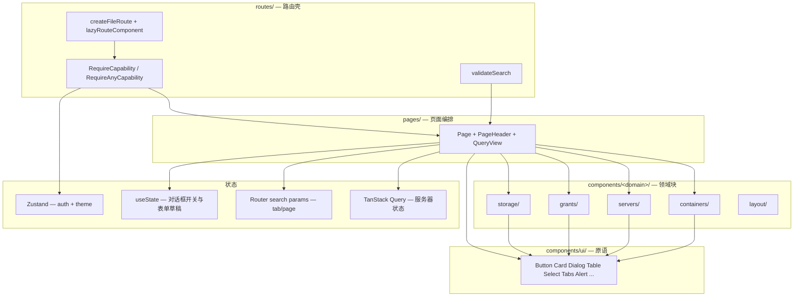
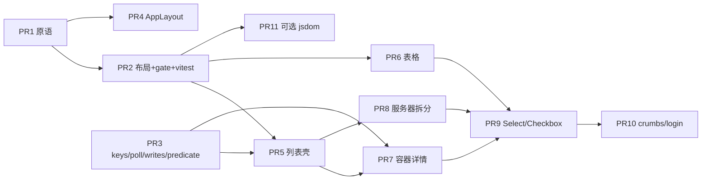

# Nyabase 前端架构与视觉系统优化

| 字段 | 值 |
| :--- | :--- |
| 文档标题 | Nyabase 前端架构与视觉系统优化 |
| 作者 | TBD |
| 日期 | 2026-08-28 |
| 状态 | Draft |
| 范围 | `packages/frontend`（不改后端契约、不改 e2e API 层） |
| 约束 | 功能零回归；增量可合并 PR；优先组件库原生组件；禁止大爆炸重写 |

---

## Overview

Nyabase 前端是 Incus 控制面的运营控制台：服务器接入、容器/数据卷生命周期、IAM/授权、SSH/HTTP 代理、系统设置。功能已经可用，但页面壳、表格、表单、空态、确认框几乎全部在各 page 里用一次性 Tailwind 拼出来。已安装的 Radix 包（Select / Tabs / ScrollArea / Avatar）没有 shadcn 包装；已包装的 Tooltip / DropdownMenu / Progress 页面零引用。结果是布局密度不齐、原生 `<select>` / `<table>` / `<input type="checkbox">` 到处复制、容器详情/服务器详情变成 800–1000 行的上帝组件。

本方案**不换栈**。继续使用 React 19 + Vite 6 + TanStack Router 1 + TanStack Query 5 + Zustand 5 + Radix + 现有 shadcn-style 包装 + Tailwind 3。先补齐缺失原语并引入一层很薄的页面组合组件（`Page` / `PageHeader` / `QueryView` / `EmptyState` / `ConfirmDialog` / `FormField`），再按页面族增量迁移。服务端状态继续走 Query；会话/主题继续走 Zustand；过滤器、分页、详情 Tab 以 URL search params 为真源。不引入 XState、不引入 Playwright、不改动鉴权状态机。

**不改 `Card` 默认 padding/Title 字号。** 密度通过 `Page` / `SectionCard` / `ResourceList` 落地，避免一次改 `card.tsx` 打穿 Login / ErrorBoundary / KPI 卡片。

---

## Background & Motivation

### 当前栈（已核实）

| 层 | 现状 |
| :--- | :--- |
| 运行时 | React 19.1、Vite 6.3、TanStack Router 1（file-based，`TanStackRouterVite`）、TanStack Query 5 |
| 会话 / 主题 | Zustand 5 persist：`src/store/auth.ts`、`src/store/theme.ts` |
| UI | Radix primitives + `src/components/ui/*`（CVA + `cn`）+ Tailwind 3 + lucide-react + recharts + xterm |
| 路由 | `src/routes/` 文件路由；绝大多数是 `lazyRouteComponent` + `RequireCapability` 薄包装，真正 UI 在 `src/pages/` |
| 测试 | 根 `docs/testing/README.md` 写明「Frontend has no test suite」。e2e（`/root/nyabase/e2e`）是 Node `fetch` API 测试，**禁止 Playwright / 浏览器**。前端 package.json 无 `test` script、无 jsdom、无 Testing Library。当前 `packages/frontend/src` 下无 `*.test.ts` |

已安装但**没有** shadcn 包装的 Radix 包：

- `@radix-ui/react-select`
- `@radix-ui/react-tabs`
- `@radix-ui/react-scroll-area`
- `@radix-ui/react-avatar`

已包装但页面**零引用**（除自身文件外）：

- `src/components/ui/tooltip.tsx`
- `src/components/ui/dropdown-menu.tsx`
- `src/components/ui/progress.tsx`（本方案不强制找消费者；见 2.1）

### 痛点（来自真实源码）

1. **页面壳复制粘贴。** 16 个页面用 `className="space-y-5 px-4 py-4 md:px-6"`。另 **5** 个写成 `px-4 py-4 md:px-6 space-y-5 w-full`：`profile-page.tsx`、`audit-page.tsx`、`http-proxy-ops-page.tsx`、`system-settings-page.tsx`、**`ssh-proxy-page.tsx`**。标题一律手写 `h1.text-2xl.font-semibold.tracking-tight` + `p.text-sm.text-muted-foreground`。没有 `Page` / `PageHeader`。
2. **加载态把页头一起吃掉。** 下列文件在 `isLoading` 时直接 `return <QueryLoadingState />`：
   - `users-page.tsx:63`
   - `groups-page.tsx:43`
   - `dashboard-page.tsx:34`
   - `manage-containers-page.tsx:52`
   - `storage-pools-page.tsx:69`
   - `container-detail-page.tsx:257`
   - `server-detail-page.tsx:244`
   - `group-detail-page.tsx:94`
   - `routes/containers/index.tsx:42`（用户容器列表）
   
   `servers-page.tsx` / `volumes-page.tsx` / `images-page.tsx` 则保留页头、只替换内容区。两种模式并存。
3. **原生控件复刻 Input 的 class 字符串。** `<select>` **14** 处（含 `create-container-dialog.tsx:293` 本地 `NativeSelect`）。裸 checkbox **7** 处：`gpu-picker.tsx`、`ip-pools-page.tsx`、`group-detail-page.tsx` 能力勾选、`container-detail-page.tsx` 只读挂载、`image-form-dialog.tsx` 网络、`http-proxy-ops-page.tsx` 的 enabled / httpsEnabled。手写 `<table>` 9 处。容器详情 Tab 是一排 `Button variant={tab===key?'default':'ghost'}`，不是 Tabs。
4. **确认框语义混乱。** 镜像删除 / 授权删除 / 公钥删除 / 证书轮换等走 `AlertDialog`（Radix Action **点击即关**，pending 文案来不及显示）。用户/组/数据卷/HTTP 绑定/IP 池/共享后端/域名池/存储池取消登记/容器停重启删除卸载走受控 `Dialog`，失败时留在框内。两套 UX。完整清单见 2.2 ConfirmDialog。
5. **列表密度与呈现不一致。** 用户/组是纵向大卡片；容器是分组 + `divide-y` 行；服务器/数据卷是卡片网格；审计/存储池/SSH/HTTP ops 是手写 table。
6. **上帝组件。** `container-detail-page.tsx` 1060 行。`server-detail-page.tsx` 856 行。`volumes-page.tsx` 578 行。`canonical-grant-panel.tsx` 468 行。本方案按边界拆分这些文件；**不把「pages/ ≤250 行」当成硬门槛**（`users-page` 393 行四个对话框、`system-settings` 490、`http-proxy-ops` 484、`audit` 427、`ssh-proxy` 386 在本轮不必为行数再拆）。
7. **Query key 目录不完整，且被绕开。** `queryKeys.grants.subject(kind, id)` 今天是 `['grants', kind, id]` **前缀**；真正的四次查询带后缀 `'servers' | 'pools' | 'backends' | 'effective-access'`（`canonical-grant-panel.tsx:61-68`，`subject-grant-summary.tsx` 用 `[...queryKeys.grants.subject(...), 'servers']`）。字面量 key 还出现在 dashboard、audit、group 详情、`['catalog','users']`、`['volume-form', ...]`、`['storage-capacity', serverId]`、`['resource-intent-failures', plane, path]`、`['storage-pools','servers']`、`['incus-client-certificate']`、`['me','access']`、`['public-settings']`。Dashboard 用 `['dashboard','servers','user']`，容器列表用 `queryKeys.servers.user`，同一 GET `/servers` 两套缓存。
8. **已写好的状态机没接到 UI。** `queryPresentationState` 与 `createResourceMutationGate` 在 `src/` 内零引用。硬编码 `refetchInterval: 5_000` 出现在 **四处**：`container-detail-page.tsx:140`、`routes/containers/index.tsx:22`、`manage-containers-page.tsx:32`、`manage-volumes-page.tsx:22`。永久错误不会停轮询。`intentsQuery` **没有** `refetchInterval`（`container-detail-page.tsx:147-151`，仅 `enabled: tab==='intents'`）。
9. **URL 几乎不是 UI 真源。** 只有 login `redirect/reason` 和容器详情 `tab` 用了 `validateSearch`。容器详情还把 tab **同时**放在 local state 和 search params（`useState(initialTab)` + `useEffect` 同步）。共享页面 `ContainerDetailContent` 被两条路由使用，不能在内部 `useSearch()` 绑定单条 `Route`。
10. **主题 token 被一次性颜色打穿。** Login 原因条 `border-amber-200 bg-amber-50 text-amber-800`。系统设置冲突条同样。Dashboard 运行中图标 `text-green-600`。审计 `ACTION_COLORS` 是**有意的**语义色板（含 `dark:`），不要改成 Badge `success`（`bg-green-500`）。`CardTitle` 默认 `text-2xl`（`card.tsx:20`），控制台卡片几乎都覆盖成 `text-base`；Login / ErrorBoundary 依赖更大字号。
11. **侧栏不可响应。** `AppLayout` 固定 `w-56` + `flex h-screen overflow-hidden`。证书过期条手写 destructive tint。导航 `overflow-y-auto` 而不是已装的 ScrollArea。
12. **测试真空 + predicate 死分支。** `isCurrentPrincipalAccessQuery` 认 `'me-access'`，现场唯一 key 是 `['me', 'access']`（`create-container-dialog.tsx:76`）——这条分支从未命中。`function errorMessage` 在 frontend 有 **13** 份副本（不是 14），fallback 都是 `'请稍后重试'`（无句号）；`queryErrorPresentation` 的兜底描述是 `'请稍后重试。'`（有句号），两者不要混用。

这些不是「换个更漂亮的组件库」能解决的。问题是 **缺少页面组合契约**，以及 **已有原语/状态机没有被页面使用**。

---

## Goals & Non-Goals

### Goals

- 所有页面走同一组合：`AppLayout → Page → PageHeader → Toolbar → Content（Table | ResourceList | Card grid | Detail sections）`。
- 表单控件优先用 Radix/shadcn 包装（Select / Tabs / Table / Checkbox / Switch / Textarea / Alert / Skeleton / ScrollArea / Sheet / Breadcrumb）。禁止再复制 `h-10 w-full rounded-md border border-input ...`。
- 加载 / 空 / 错误 / 成功 / stale-error 用显式呈现状态机（已有 `queryPresentationState`），页头在 loading 时仍然可见。
- Query key 成为唯一目录；页面不得再内联字符串 key。**带后缀的 grants 四元组必须保持互不相等。**
- 分页、详情 Tab 以 search params 为真源。列表暂不加空 filter params。
- 上帝组件按 Tab/卡片边界拆分，但每个 PR 行为不变（同一 `data-testid`、同一 API、同一 capability、同一 toast 语义）。
- 为架构关键纯函数恢复 Vitest（node 环境）；不引入浏览器 e2e。

### Non-Goals

- 不换成 Ant Design / MUI / Chakra / shadcn 官方 CLI 生成的另一套主题。
- 不引入 XState / Zustand 页面 store / Redux / react-hook-form / TanStack Form。
- 不改 `src/lib/api.ts`、`src/lib/auth-session.ts`、`src/store/auth.ts` 的会话协议。
- 不改后端 DTO / Intent 契约。
- 不引入 Playwright（含间接依赖）；L4 e2e 继续是 Node `fetch`。
- 不做设计系统品牌重做。Login 只修 token / Alert / FormField。
- **不改 `src/components/ui/card.tsx` 的默认 `p-6` / `pt-0` / `text-2xl`。**
- 不给 `Page` 加 `max-w-7xl`（运维表格保持主区全宽）。
- 不把列表行上的 `needsAttention` Badge 换成 Alert。
- 不在 `packages/common/src/` 留下编译产物（见仓库 `AGENTS.md`）。

---

## Proposed Design

### 1. 分层



规则：

| 层 | 允许 | 禁止 |
| :--- | :--- | :--- |
| `components/ui/` | Radix 包装 + CVA + `cn`。无业务 import | 引用 `@nyabase/common`、`api`、store |
| `components/layout/` | `AppLayout`、`Page`、`PageHeader`、`EmptyState`、`QueryView`、`ConfirmDialog`、`ResourceList`、`SectionCard` | 具体资源 DTO 渲染 |
| `components/<domain>/` | 某一资源的行/卡片/对话框/面板 | 自己写 page padding、自己复制 QueryLoading 分支 |
| `pages/` | 组合：调 query、把数据塞进领域组件 | 在共享页里 `useSearch()` 绑死单条 Route；一个文件里混用原生 select 与 Radix Select |
| `routes/` | 路由定义、capability 闸门、search schema、lazy import、把 search 当 **prop** 传给共享页 | 除 login 外不再放页面实现（今天 `routes/containers/index.tsx` 是例外，要迁走） |

**共享页面组件不得 hook 单条 `Route`。** `container-detail-page.tsx` 被 `/containers/$containerId` 与 `/manage/containers/$containerId` 共用；tab 由各路由文件读 `validateSearch` 后作为 `initialTab`（将改名为 `tab`）prop 传入。

`@/` alias 已在 `vite.config.ts` / `tsconfig.json` 配置，源码零使用。新文件用 `@/`；旧文件随迁移逐步改，不单独开「改 import」PR。

### 2. 视觉系统：组件库优先

#### 2.1 补齐的 ui 原语

全部放 `src/components/ui/`，风格对齐现有 `button.tsx` / `dialog.tsx`（`React.forwardRef` + `cn` + Radix）。**不要**跑 shadcn CLI 覆盖已有文件。**不要改 `card.tsx` 默认值。**

| 组件 | 依赖 | 替代的现状 |
| :--- | :--- | :--- |
| `select.tsx` | 已装 `@radix-ui/react-select` | 14 处原生 `<select>` |
| `tabs.tsx` | 已装 `@radix-ui/react-tabs` | `container-detail-page.tsx:316-327` 的 Button 伪 Tab |
| `scroll-area.tsx` | 已装 `@radix-ui/react-scroll-area` | 侧栏 `overflow-y-auto`、授权 Dialog `overflow-y-auto` |
| `avatar.tsx` | 已装 `@radix-ui/react-avatar` | 侧栏用户区纯文字 |
| `table.tsx` | 纯 HTML + token | 9 处手写 table |
| `checkbox.tsx` | **新增** `@radix-ui/react-checkbox` | 7 处裸 checkbox |
| `switch.tsx` | **新增** `@radix-ui/react-switch` | HTTP 域名池 enabled；系统设置 boolean **字符串草稿**（见 cookbook） |
| `textarea.tsx` | 原生 textarea + Input 同款 class | SSH 公钥、PEM、系统设置长字段 |
| `alert.tsx` | 纯 div + CVA | 证书过期条、详情 needsAttention 条、login 原因条、设置冲突条 |
| `skeleton.tsx` | 纯 div | `audit-page.tsx` 手写 pulse；供后续列表首屏选用 |
| `sheet.tsx` | 复用已装 `@radix-ui/react-dialog` | 无移动侧栏 |
| `breadcrumb.tsx` | 纯 nav | 详情页 ArrowLeft |
| `pagination.tsx` | Button 组合，见下方 API | `audit-page.tsx` 手写 prev/next + pageSize |

**明确不做：**

- 完整 shadcn `Sidebar` 积木。抛光现有 `AppLayout` + Sheet。
- `Command` / combobox。Select 足够。
- `Form` + react-hook-form / TanStack Form。Zod 已在 `@nyabase/common`。
- XState。
- 本方案内给 `Progress` 找强制消费者。包装留着，缩容/意图进度列为 follow-up，不阻塞 11 个 PR。

新增 Radix 依赖只允许：`@radix-ui/react-checkbox`、`@radix-ui/react-switch`。

#### 2.2 页面组合契约（可实现的 TS）

新文件：

- `src/components/layout/page.tsx`
- `src/components/layout/page-header.tsx`
- `src/components/layout/empty-state.tsx`
- `src/components/layout/query-view.tsx`
- `src/components/layout/confirm-dialog.tsx`
- `src/components/layout/form-field.tsx`
- `src/components/layout/resource-list.tsx`
- `src/components/layout/section-card.tsx`
- `src/hooks/use-resource-mutation-gate.ts`（PR 2 落地，PR 7 才接到容器动作）

**`Page`：只做 padding + 垂直节奏，全宽。** 今天主区是 `main.flex-1.overflow-auto`，侧栏 `w-56`，页面 full-bleed。`max-w-7xl` 会让审计（`min-w-[760px]`）、存储池（`min-w-[800px]`）、服务器详情池表在 1920px 上提前横向滚动并出现两侧空白——v1 **不加** max-width。

```tsx
export function Page({
  className,
  testId,
  children,
}: {
  className?: string;
  testId?: string;
  children: React.ReactNode;
}) {
  return (
    <div
      data-testid={testId}
      className={cn('w-full space-y-6 px-4 py-6 md:px-6', className)}
    >
      {children}
    </div>
  );
}
```

相对现状 `py-4 space-y-5`，`py-6 space-y-6` 是**接受的密度变化**。列表/表格 PR 必须附审计 + Dashboard 亮/暗截图。

密度约定（class，不改 `tailwind.config.js` theme 也行）：

| Token | Class | 用途 |
| :--- | :--- | :--- |
| 页面边距 | `px-4 py-6 md:px-6` | `Page` |
| 垂直节奏 | `space-y-6` | 页头与内容 |
| 工具条间距 | `gap-2` | 刷新 / 新建 |
| 列表行 | `px-4 py-3` | `ResourceListRow`（对齐 `container-row.tsx`） |
| 卡片 | 保持 `card.tsx`：Header `p-6`，Content/Footer `p-6 pt-0`，Title `text-2xl` | Login、ErrorBoundary、KPI 不被误伤 |
| 控制台段落标题 | `SectionCard` 内 `CardTitle className="text-base"` | 只在组合组件里覆盖 |
| 表格头 | `h-10 text-xs text-muted-foreground` | `TableHead` |
| 表格行 | `h-12 text-sm` | `TableCell` |

**`PageHeader`：详情页 crumbs 与 `backTo` 互斥。** PR 10 详情用 crumbs，不再并排画 ArrowLeft。

```tsx
export function PageHeader({
  title,
  description,
  crumbs,
  actions,
  backTo,
}: {
  title: React.ReactNode;
  description?: React.ReactNode;
  crumbs?: Array<{ label: string; to?: string; params?: Record<string, string> }>;
  actions?: React.ReactNode;
  backTo?: { to: string; params?: Record<string, string>; label: string };
}) {
  if (crumbs && backTo) {
    throw new Error('PageHeader: pass crumbs or backTo, not both');
  }
  // crumbs → Breadcrumb；backTo → icon Button+Link；列表页两者皆空
}
```

**`EmptyState`：始终渲染 title。** 现状空态是 `py-12 text-center text-sm text-muted-foreground`；升级为 title（`font-medium`）+ 可选 description，避免只有一段 muted 正文。

```tsx
export function EmptyState({
  icon: Icon,
  title,
  description,
  action,
}: {
  icon?: LucideIcon;
  title: string;
  description?: string;
  action?: React.ReactNode;
}) {
  return (
    <Card>
      <CardContent className="flex flex-col items-center gap-3 py-12 text-center">
        {Icon && <Icon className="h-10 w-10 text-muted-foreground/40" />}
        <p className="text-sm font-medium text-foreground">{title}</p>
        {description && <p className="text-sm text-muted-foreground">{description}</p>}
        {action}
      </CardContent>
    </Card>
  );
}
```

**`ResourceList` / `ResourceListRow`：**

```tsx
export function ResourceList({ children }: { children: React.ReactNode }) {
  return (
    <Card>
      <CardContent className="divide-y p-0">{children}</CardContent>
    </Card>
  );
}

export function ResourceListRow({
  children,
  className,
}: {
  children: React.ReactNode;
  className?: string;
}) {
  return (
    <div className={cn('flex flex-wrap items-center justify-between gap-3 px-4 py-3', className)}>
      {children}
    </div>
  );
}
```

用户/组从「每条一张 Card」迁到 ResourceList（与容器列表同骨架）。操作按钮仍在行尾。`data-testid="users-management"` / `groups-management` 留在 `Page` 根上。这是本方案**唯一锁定的中等结构变化**。

**`SectionCard`：** 详情多段布局。自己覆盖 Title 为 `text-base`，不碰全局 Card 默认。

```tsx
export function SectionCard({
  title,
  description,
  actions,
  children,
  testId,
}: {
  title: React.ReactNode;
  description?: React.ReactNode;
  actions?: React.ReactNode;
  children: React.ReactNode;
  testId?: string;
}) {
  return (
    <Card data-testid={testId}>
      <CardHeader className="flex flex-row flex-wrap items-start justify-between gap-3 space-y-0">
        <div className="space-y-1.5">
          <CardTitle className="text-base">{title}</CardTitle>
          {description ? <CardDescription>{description}</CardDescription> : null}
        </div>
        {actions}
      </CardHeader>
      <CardContent>{children}</CardContent>
    </Card>
  );
}
```

**`Pagination`（受控，审计用）：** pageSize 用 **同一 PR 的 Select 包装**（ui 组合 ui，不是页面混用原生 `<select>`）。这样 PR 9 的 `rg "<select"` 门禁不会被 `pagination.tsx` 绊倒。

```tsx
export function Pagination({
  page,
  pageSize,
  total,
  pageSizes = [25, 50, 100] as const,
  onPageChange,
  onPageSizeChange,
}: {
  page: number;
  pageSize: number;
  total: number;
  pageSizes?: readonly number[];
  onPageChange: (page: number) => void;
  onPageSizeChange: (pageSize: number) => void;
}): React.ReactNode;
// 内部：prev/next Button +
// <Select value={String(pageSize)} onValueChange={(v) => onPageSizeChange(Number(v))}>
```

URL 由调用方写（`navigate({ search: { page, pageSize } })`）。组件不读 router。

**`ConfirmDialog`：受控 AlertDialog，点击确认不得自行关闭。**

Radix `AlertDialogAction` 默认关闭。今天受控 `Dialog` 确认（用户删除等）在 `onSuccess` 才 `setTarget(null)`，失败 toast 后面板仍开、按钮仍显示 pending。`images-page.tsx:56-60` 的 `AlertDialogAction` **已经**有「一点击就关、pending 看不见」的 bug。ConfirmDialog 必须 `event.preventDefault()`，只在父级把 `open` 设为 `false` 时关闭。

```tsx
export function ConfirmDialog({
  open,
  title,
  description,
  confirmLabel,
  cancelLabel = '取消',
  pendingLabel,
  confirmVariant = 'destructive',
  pending = false,
  onConfirm,
  onOpenChange,
}: {
  open: boolean;
  title: string;
  description: React.ReactNode;
  confirmLabel: string;
  cancelLabel?: string;
  pendingLabel: string;
  confirmVariant?: 'destructive' | 'default';
  pending?: boolean;
  onConfirm: () => void;
  onOpenChange: (open: boolean) => void;
}) {
  return (
    <AlertDialog
      open={open}
      onOpenChange={(next) => {
        if (pending && !next) return;
        onOpenChange(next);
      }}
    >
      <AlertDialogContent>
        <AlertDialogHeader>
          <AlertDialogTitle>{title}</AlertDialogTitle>
          <AlertDialogDescription>{description}</AlertDialogDescription>
        </AlertDialogHeader>
        <AlertDialogFooter>
          <AlertDialogCancel disabled={pending}>{cancelLabel}</AlertDialogCancel>
          <AlertDialogAction
            className={confirmVariant === 'destructive'
              ? 'bg-destructive text-destructive-foreground hover:bg-destructive/90'
              : undefined}
            disabled={pending}
            onClick={(event) => {
              event.preventDefault();
              onConfirm();
            }}
          >
              {pending ? pendingLabel : confirmLabel}
          </AlertDialogAction>
        </AlertDialogFooter>
      </AlertDialogContent>
    </AlertDialog>
  );
}
```

破坏性确认清单。`pendingLabel` **必传**，抄自现有按钮三元式；今日 pending 时仍显示 confirm 文案的，把同一字符串再传一遍（不要发明「提交中...」）。

ConfirmDialog **只接受受控 `open`**，没有 Trigger 插槽。今日 `AlertDialogTrigger` 站点必须把按钮提成兄弟节点：

```tsx
<Button variant="outline" onClick={() => setRotateOpen(true)} disabled={rotate.isPending}>
  轮换
</Button>
<ConfirmDialog
  open={rotateOpen}
  onOpenChange={setRotateOpen}
  title="轮换 SSH 主机密钥？"
  description="..."
  confirmLabel="确认轮换"
  pendingLabel="确认轮换"
  pending={rotate.isPending}
  onConfirm={() => rotate.mutate()}
/>
```

| 文件 | 动作 | confirmLabel | pendingLabel | 现状 | Owner |
| :--- | :--- | :--- | :--- | :--- | :--- |
| `users-page.tsx` | 停用 | 确认停用 | 处理中... | 受控 Dialog | **PR 5** |
| `users-page.tsx` | 删除 | 确认删除 | 确认删除 | 受控 Dialog | **PR 5** |
| `groups-page.tsx` | 删除组 | 确认删除 | 确认删除 | 受控 Dialog | **PR 5** |
| `group-detail-page.tsx` | 移除成员 | 确认移除 | 移除中... | 受控 Dialog | **PR 5** |
| `group-detail-page.tsx` | 确认摘能力 | 确认移除并保存 | 保存中... | 受控 Dialog | **PR 5** |
| `volumes-page.tsx` | 删除卷 | 确认删除 | 提交中... | 受控 Dialog | **PR 5** |
| `http-proxy-page.tsx` | 删除绑定 | 确认删除 | 删除中... | 受控 Dialog | **PR 5** |
| `ip-pools-page.tsx` | 删除 IP 池 | 确认删除 | 删除中... | 受控 Dialog | **PR 5** |
| `shared-backends-page.tsx` | 删除后端 | 确认删除 | 删除中... | 受控 Dialog | **PR 5** |
| `images-page.tsx` | 删除镜像 | 确认删除 | 提交中... | AlertDialog 点击即关 | **PR 5** |
| `profile-page.tsx` | 删除 SSH 公钥 | 删除 | 删除 | AlertDialog 点击即关 | **PR 5** |
| `canonical-grant-panel.tsx` | 删除授权 | 确认删除 | 删除中... | AlertDialog 点击即关 | **PR 5** |
| `container-row.tsx` | 停止 / 重启 | 确认停止 / 确认重启 | 提交中... | 受控 Dialog | **PR 5** |
| `http-proxy-ops-page.tsx` | 删除域名池 | 确认删除 | 删除中... | 受控 Dialog | **PR 6** |
| `storage-pools-page.tsx` | 取消登记 | 确认取消登记 | 处理中... | 受控 Dialog | **PR 6** |
| `ssh-proxy-page.tsx` | 断开全部会话 | 断开全部 | 断开全部 | 非受控 Trigger | **PR 6** |
| `ssh-proxy-page.tsx` | 轮换主机密钥 | 确认轮换 | 确认轮换 | 非受控 Trigger | **PR 6** |
| `container-detail-page.tsx` | 停止 / 重启 / 删除 | 确认停止 / 确认重启 / 确认删除 | 提交中... | 受控 Dialog | **PR 7** |
| `container-detail-page.tsx` | 卸载卷 | 确认卸载 | 提交中... | 受控 Dialog | **PR 7** |
| `server-detail-page.tsx` | 清除指标 | 确认清除 | 确认清除 | 非受控 Trigger | **PR 8** |
| `server-detail-page.tsx` | 轮换证书 | 确认轮换 | 确认轮换 | 非受控 Trigger | **PR 8** |

创建用户 / 重置密码 / 服务器接入等带字段的 Dialog **不是** ConfirmDialog。`cancelLabel` 今天一律「取消」，保持。PR 8 虽是「拆分不换 select」，但这两处 Trigger **必须**在拆分时改成受控 ConfirmDialog，否则会把点击即关 bug 复制进 5 个 card 文件。

**`FormField`：不把 `id` clone 到 children。** 调用方必须自己设 `id`（Input / `SelectTrigger`）或改用 `orientation="inline"`。

```tsx
export function FormField({
  id,
  label,
  hint,
  error,
  orientation = 'stack',
  children,
}: {
  id: string;
  label: string;
  hint?: React.ReactNode;
  error?: string | null;
  orientation?: 'stack' | 'inline';
  children: React.ReactNode;
}) {
  if (orientation === 'inline') {
    return (
      <div className="space-y-1">
        <div className="flex items-center gap-2">
          {children}
          <Label htmlFor={id} className="text-sm font-normal">{label}</Label>
        </div>
        {error && <p className="text-sm text-destructive">{error}</p>}
      </div>
    );
  }
  return (
    <div className="space-y-1.5">
      <Label htmlFor={id}>{label}</Label>
      {children}
      {hint && !error && <p className="text-xs text-muted-foreground">{hint}</p>}
      {error && <p className="text-sm text-destructive">{error}</p>}
    </div>
  );
}
```

##### 控件替换 cookbook（从本仓库抄）

**Select（空值是校验闸门，不是 Item）。** 现有 `NativeSelect` / `<option value="">选择服务器</option>` 让 `if (!form.serverId) return` 拦住提交。Radix 禁止 `value=""` 的 Item。

```tsx
<FormField id="container-server" label="服务器">
  <Select
    value={form.serverId || undefined}
    onValueChange={(value) => update('serverId', value)}
    disabled={serversLoading || servers.length === 0}
  >
    <SelectTrigger id="container-server">
      <SelectValue placeholder={serversLoading ? '加载可用服务器…' : '选择服务器'} />
    </SelectTrigger>
    <SelectContent>
      {servers.map((server) => (
        <SelectItem key={server.id} value={server.id}>{server.name}</SelectItem>
      ))}
    </SelectContent>
  </Select>
</FormField>
// 提交守卫保持：if (!form.serverId) return;
```

每处转换的 PR checklist：placeholder 文案不变、`disabled` 条件不变、提交 `if (!id)` 仍在。

**Checkbox 行（IP 池绑服务器、组能力、GPU 多选）不是 FormField stack：**

```tsx
<label className="flex items-center gap-2 text-sm">
  <Checkbox
    id={`ip-pool-server-${server.id}`}
    checked={form.serverIds.includes(server.id)}
    onCheckedChange={(checked) => toggleServer(server.id, checked === true)}
  />
  <span className="truncate">{server.name}</span>
</label>
```

**系统设置 boolean 是字符串草稿，不是 boolean state。** `SettingInput` 今天是 `<select value="true"|"false">`（`system-settings-page.tsx:467-479`），写入 `RevisionedServerBackedDraft<Record<string, string>>`。换 Switch 时：

```tsx
<Switch
  id={`setting-${field.key}`}
  checked={value === 'true'}
  disabled={field.source === 'env'}
  onCheckedChange={(checked) => onChange(checked ? 'true' : 'false')}
/>
```

**禁止改** `parseSystemSettingDraft` / `editRevisionedServerBackedDraft`。全部设置控件替换放在 **PR 9**，不拆到 PR 6。

**审计操作色板保留。** `ACTION_COLORS`（`audit-page.tsx:30-60`）是封闭 map + `dark:`，不要改成 Badge `success`/`destructive`。Dashboard `text-green-600`、login `amber-50` 仍要换成 token/`Alert`。

#### 2.3 AppLayout 抛光

保留信息架构（品牌、用户摘要、`userNavItems`、`adminNavItems`、主题、退出）。

1. 侧栏列表改 `ScrollArea`。
2. `<md`：同一导航 **数据**（同一数组 + 同一 capability filter）用 `Sheet` 再呈现一次。宽屏仍是固定 `w-56` aside。窄屏顶栏只含菜单按钮 + 品牌名，**不增加新链接**。Sheet 走 Radix portal，**不要**嵌进 `flex h-screen overflow-hidden` 那一行，避免和 `app-layout.tsx:90` 抢 overflow。
3. 用户摘要：`Avatar` initials + 现有文字。
4. `ThemeToggle` → 已有 `DropdownMenu`（浅色 / 深色 / 系统）。`useThemeStore` API 不变。
5. 证书过期条 → `Alert variant="destructive"`，保留 `data-testid="cert-expiry-banner"`。
6. `TooltipProvider` 挂在 `AppLayout`（已登录壳）。第一个消费者：侧栏 `NavItem` 在文案 truncate 时用 Tooltip。不要在匿名 login 树挂 Provider。
7. Nav 激活算法保持（精确路径 + 前缀）。

授权面板继续 `Dialog max-w-5xl` + `ScrollArea`，**不改 Sheet**。

#### 2.4 内容呈现矩阵

| 模式 | 何时 | 页面 |
| :--- | :--- | :--- |
| **Table** | 列对齐的运维数据 | 审计、存储池、SSH 实例、HTTP 实例/绑定、系统设置「有效配置」 |
| **ResourceList** | 主对象 + 行内操作 | 容器（用户/管理）、数据卷管理、**用户、用户组** |
| **Card grid** | 健康摘要，点进详情 | 服务器目录、用户数据卷、HTTP 发布、IP 池、共享后端、Dashboard 摘要 |
| **Detail sections** | 单资源多职责 | 容器详情、服务器详情、组详情、系统设置、用户中心 |

Dashboard `SummaryCard` → `components/dashboard/summary-card.tsx`（目录今天是空的），SSH/HTTP ops 的 `MetricTile` 复用它。KPI 继续自己写 `CardContent className="p-4"`——Card 默认不变，所以这仍然有效。

**加载 chrome：** QueryView **默认** `QueryLoadingState` spinner + `loadingLabel`（零回归文案）。`skeleton` slot 可选；审计页已有 pulse 行，迁 Table 时可以传入 Skeleton 行。v1 不强制所有列表改骨架屏。

### 3. 架构与状态机

#### 3.1 路由

`routes/` **不获取业务数据**（login 例外）。Capability 继续组件闸门（保留 `AccessDenied` 文案，不用 `beforeLoad` 重定向）。

| 路由 | 现有 | 改为 |
| :--- | :--- | :--- |
| `/login` | `redirect`, `reason` | 保持 |
| `/containers/$containerId`、`/manage/containers/$containerId` | `tab` + 共享页 local state | 各路由 `validateSearch` + 把 `tab` **prop** 传给共享页；删除 `useState`/`useEffect` 同步 |
| `/audit` | local `page`/`pageSize` | search params；`Number.parseInt`，非法回 0 / 50 |
| 列表页 | 无 | **不加**空 filter |

```ts
function parseNonNegativeInt(value: unknown, fallback: number): number {
  if (typeof value === 'number' && Number.isInteger(value) && value >= 0) return value;
  if (typeof value !== 'string') return fallback;
  const parsed = Number.parseInt(value, 10);
  return Number.isInteger(parsed) && parsed >= 0 && String(parsed) === value.trim() ? parsed : fallback;
}

export const Route = createFileRoute('/audit/')({
  validateSearch: (search: Record<string, unknown>) => {
    const pageSizeRaw = parseNonNegativeInt(search.pageSize, 50);
    const pageSize = ([25, 50, 100] as const).includes(pageSizeRaw as 25 | 50 | 100)
      ? (pageSizeRaw as 25 | 50 | 100)
      : 50;
    return { page: parseNonNegativeInt(search.page, 0), pageSize };
  },
});
```

拒绝 `'1e2'`（`Number('1e2')===100` 但 `parseInt` + 原串校验可挡）。

容器详情 `selectTab`：

```ts
void navigate({ search: (prev) => ({ ...prev, tab: next }), replace: true });
```

共享内容读 `tab` **prop**（由路由包装传入，随 `useSearch` 更新），不要 `getRouteApi('/containers/$containerId')`。

不用 route `loader` 预取列表（poll + Intent 是 Query 的工作）。

`routes/containers/index.tsx` 实现迁到 `pages/containers-page.tsx`。空目录 `routes/metrics/`、`manage/nfs/`、`manage/remote-fs/` 不动。

#### 3.2 服务器状态（TanStack Query）

扩展 `src/lib/query-keys.ts`，**现有 tuple 字面量保持不变**，只加包装与缺失项。`grants.subject` 仍是 **invalidate 前缀**；查询走 `subjectList` 带后缀。

```ts
type Plane = 'admin' | 'user';
type GrantKind = 'users' | 'groups';
type GrantSlice = 'servers' | 'pools' | 'backends' | 'effective-access';

export const queryKeys = {
  publicSettings: ['public-settings'] as const,
  meAccess: ['me', 'access'] as const,
  certificate: ['incus-client-certificate'] as const,
  systemSettings: ['system-settings'] as const,
  catalog: { users: ['catalog', 'users'] as const },
  audit: {
    list: (pageSize: number, offset: number) => ['audit', pageSize, offset] as const,
    detail: (id: string) => ['audit-detail', id] as const,
  },
  sshProxy: {
    status: ['ssh-proxy-status'] as const,
    hostKey: ['ssh-proxy-host-key'] as const,
  },
  servers: {
    admin: ['servers', 'admin'] as const,
    user: ['servers', 'user'] as const,
    detail: (serverId: string) => ['server', serverId] as const,
    pools: (serverId: string, admin: boolean) =>
      ['storage-pools', admin ? 'admin' : 'user', serverId] as const,
    gpus: (serverId: string, admin: boolean) =>
      ['server-gpus', admin ? 'admin' : 'user', serverId] as const,
    preflight: (serverId: string) => ['server-preflight', serverId] as const,
  },
  images: {
    admin: ['images', 'admin'] as const,
    userActive: ['images', 'user', 'active'] as const,
    assignments: (imageId: string) => ['image-assignments', imageId] as const,
  },
  users: { admin: ['users', 'admin'] as const },
  groups: {
    admin: ['groups', 'admin'] as const,
    detail: (id: string) => ['group', id] as const,
  },
  containers: {
    adminList: ['containers', 'admin'] as const,
    userList: ['containers', 'user'] as const,
    detail: (plane: Plane, containerId: string) => ['container', plane, containerId] as const,
    stats: (plane: Plane, containerId: string) => ['container', plane, containerId, 'stats'] as const,
    intents: (plane: Plane, containerId: string) => ['container-intents', plane, containerId] as const,
    attachments: (plane: Plane, containerId: string) =>
      ['container-attachments', plane, containerId] as const,
  },
  volumes: {
    user: ['volumes', 'user'] as const,
    admin: ['volumes', 'admin'] as const,
    intents: (volumeId: string, admin: boolean) =>
      ['volume-intents', admin ? 'admin' : 'user', volumeId] as const,
  },
  volumeForm: {
    servers: ['volume-form', 'servers'] as const,
    pools: (serverId: string) => ['volume-form', 'pools', serverId] as const,
    sharedPools: (backendId: string) => ['volume-form', 'shared-pools', backendId] as const,
  },
  sharedBackends: {
    user: ['shared-backends', 'user'] as const,
    admin: ['shared-backends', 'admin'] as const,
  },
  ipPools: { admin: ['ip-pools', 'admin'] as const },
  httpProxy: {
    bindings: ['http-proxy', 'bindings', 'user'] as const,
    domainPools: ['http-proxy', 'domain-pools', 'user'] as const,
    adminStatus: ['http-proxy', 'admin', 'status'] as const,
    adminDomainPools: ['http-proxy', 'admin', 'domain-pools'] as const,
    adminBindings: ['http-proxy', 'admin', 'bindings'] as const,
  },
  storagePools: {
    adminIndex: ['storage-pools', 'admin'] as const,
  },
  storageCapacity: (serverId: string) => ['storage-capacity', serverId] as const,
  resourceIntentFailures: (plane: Plane, listPath: string) =>
    ['resource-intent-failures', plane, listPath] as const,
  grants: {
    subject: (kind: GrantKind, subjectId: string) => ['grants', kind, subjectId] as const,
    subjectList: (kind: GrantKind, subjectId: string, slice: GrantSlice) =>
      ['grants', kind, subjectId, slice] as const,
    targets: {
      servers: ['grant-targets', 'servers'] as const,
      pools: ['grant-targets', 'pools'] as const,
      backends: ['grant-targets', 'backends'] as const,
    },
  },
} as const;
```

测试（node）：四个 `subjectList(..., slice)` 互不相等；`subject(...)` 是它们的公共前缀；`invalidateQueries({ queryKey: subject(...) })` 的匹配语义用 shape 断言，**不要** `toBe` 同一数组引用。

PR 3 必带对照表（节选）：

| 调用点 | 旧 tuple | 新 factory | queryFn |
| :--- | :--- | :--- | :--- |
| `dashboard-page.tsx` | `['dashboard','servers','user']` | `queryKeys.servers.user` | `GET /servers` |
| `dashboard-page.tsx` | `['dashboard','containers','user']` | `queryKeys.containers.userList` | `GET /containers` |
| `canonical-grant-panel.tsx` | `['grants', kind, id, 'servers']` | `queryKeys.grants.subjectList(kind, id, 'servers')` | `GET .../server-grants` |
| 同上 pools / backends / effective-access | 带后缀 | `subjectList(..., slice)` | 对应 grant/access |
| `subject-grant-summary.tsx` | `[...subject(), 'servers']` | `subjectList(..., 'servers')` | 同上 |
| `storage-pools-page.tsx` | `['storage-pools','servers']` | `queryKeys.servers.admin` | `GET /admin/servers` |
| `group-detail-page.tsx` | `['group', id]` | `queryKeys.groups.detail(id)` | `GET /admin/groups/:id` |
| `group-detail-page.tsx` | `['catalog','users']` | `queryKeys.catalog.users` | `GET /admin/users` |
| `create-container-dialog.tsx` | `['me','access']` | `queryKeys.meAccess` | `GET /me/access` |
| `create-container-dialog.tsx` | `['storage-capacity', serverId]` | `queryKeys.storageCapacity(serverId)` | 容量预检 |
| `volumes-page.tsx` | `['volume-form', ...]` | `queryKeys.volumeForm.*` | 表单依赖 |
| `resource-intent-failures.tsx` | `['resource-intent-failures', plane, path]` | `queryKeys.resourceIntentFailures` | 失败意图 |
| `hooks/use-public-settings.ts` | `['public-settings']` | `queryKeys.publicSettings` | 公开设置 |
| `app-layout` / server-detail | `['incus-client-certificate']` | `queryKeys.certificate` | 证书 |
| `system-settings-page.tsx` **`setQueryData`** | `['system-settings']` | `queryKeys.systemSettings` | 保存后写入 |
| `system-settings-page.tsx` **`invalidateQueries`** | `['public-settings']` | `queryKeys.publicSettings` | 保存后失效 |
| `system-settings-page.tsx` **`refetchQueries`** | `['system-settings']` | `queryKeys.systemSettings` | 冲突后重拉 |
| `ssh-proxy-page.tsx` **`setQueryData`** | `['ssh-proxy-host-key']` | `queryKeys.sshProxy.hostKey` | rotate 同步写入 |
| `ssh-proxy-page.tsx` **`invalidateQueries`** | `['ssh-proxy-status']` | `queryKeys.sshProxy.status` | 断开/轮换 |
| `canonical-grant-panel.tsx` **`invalidateQueries`** | `['grants', kind, id]` | `queryKeys.grants.subject(kind, id)` | 前缀仍匹配四 slice |
| `canonical-grant-panel.tsx` **`invalidateQueries`** | `['me', 'access']` | `queryKeys.meAccess` | 授权变更 |
| `storage-pools-page.tsx` **`invalidateQueries`** | `['storage-pools']` 前缀 | `queryKeys.storagePools.adminIndex` **且** `queryKeys.servers.admin` | 发现/登记后；`['storage-pools','servers']` 已迁走，前缀不再打到 servers |
| `server-detail-page.tsx` **`invalidateQueries`** | `['incus-client-certificate']` | `queryKeys.certificate` | 轮换后 |
| `container-detail-page.tsx` **`invalidateQueries`** | `['container-attachments', plane, id]` | `queryKeys.containers.attachments` | 挂载后 |

`isCurrentPrincipalAccessQuery` 必须与目录里所有 **带 user/me 平面标记** 的 key 对齐。access-revision（`auth-session.ts` 调 `resetCurrentPrincipalAccessQueries`）不会走 `clear()`，漏掉的 user 面投影会在授权被收回后继续显示。PR 3 **要扩大** predicate，不是冻结：

```ts
function isCurrentPrincipalAccessQuery(queryKey: readonly unknown[]): boolean {
  const root = String(queryKey[0] ?? '');
  const a = queryKey[1];
  const b = queryKey[2];
  if (root === 'me' && a === 'access') return true;
  if (
    (root === 'servers' || root === 'images' || root === 'containers'
      || root === 'container' || root === 'volumes' || root === 'shared-backends'
      || root === 'storage-pools' || root === 'container-intents'
      || root === 'container-attachments' || root === 'resource-intent-failures'
      || root === 'volume-intents' || root === 'server-gpus')
    && a === 'user'
  ) return true;
  // ['http-proxy', 'bindings' | 'domain-pools', 'user']
  if (root === 'http-proxy' && b === 'user') return true;
  return false;
}
```

PR 3 单测（shape，不是引用）：

| key | 期望 |
| :--- | :--- |
| `queryKeys.meAccess` | true |
| `queryKeys.servers.user` / `containers.userList` / `volumes.user` | true |
| `queryKeys.containers.attachments('user', id)` | true |
| `queryKeys.containers.intents('user', id)` | true |
| `queryKeys.resourceIntentFailures('user', path)` | true |
| `queryKeys.volumes.intents(id, false)` | true |
| `queryKeys.servers.gpus(id, false)` | true |
| `queryKeys.httpProxy.bindings` / `domainPools` | true |
| `queryKeys.servers.admin` / `httpProxy.adminBindings` / `attachments('admin', id)` / `gpus(id, true)` | **false** |

**不**把无平面标记的 key（`storage-capacity`、`volume-form.*`）塞进 predicate——那些 tuple 没有 `user` 段，扩大没有稳定规则。Logout 仍走 `clearPrincipalQueryState`（全清）。

**Dashboard 与列表共享 key，但不要统一 interval。** 容器列表 5s、Dashboard 容器 15s、Dashboard 服务器 30s。两页不会同时挂载；observer 的 `refetchInterval` 以当前页为准。禁止有人「顺手」把 Dashboard 改成 5s。

轮询（全部经 `queryPollInterval`；**禁止**源码里再出现数字字面量 `refetchInterval: 5_000`）：

| 资源 | activeIntervalMs | 现状 | PR |
| :--- | :--- | :--- | :--- |
| 用户容器列表 | 5_000 | 字面量 | PR 3 |
| 管理容器列表 | 5_000 | 字面量 | PR 3 |
| 管理数据卷列表 | 5_000 | 字面量 | PR 3 |
| 容器详情 | 5_000 | 字面量 | PR 3 |
| Dashboard 服务器 | 30_000 | 已用 helper | 只换 key |
| Dashboard 容器 | 15_000 | 已用 helper | 只换 key |
| SSH / HTTP status | 1_000 + backoff | 已用 helper | 只换 key |
| 审计 | 30_000 | 已用 helper | 只换 key |
| 意图历史 | **今天不 poll** | `enabled: tab==='intents'` | PR 7 **显式产品变更**：tab 打开时 5s；不在 PR 3 做 |

乐观更新：Intent 写路径 toast + invalidate；同步 CRUD invalidate；SSH host key rotate 保留 `setQueryData`；授权 invalidate `queryKeys.grants.subject(...)` 前缀。

##### Mutation gate（可实现）

今日工厂只有 `begin/end/has/snapshot`，`useSyncExternalStore` 无从订阅。发布面扩成：

```ts
export interface ResourceMutationGate {
  begin(resourceId: string): boolean;
  end(resourceId: string): void;
  has(resourceId: string): boolean;
  snapshot(): ReadonlySet<string>;
  subscribe(listener: () => void): () => void;
}

export const resourceMutationGate: ResourceMutationGate;
export function resetResourceMutationGateForTests(): void;

export function useResourceMutationPending(id: string): boolean;
export async function runGatedMutation(id: string, fn: () => Promise<void>): Promise<boolean>;
```

`begin`/`end`：**copy-on-write** 替换内部 `Set`，然后 `notify`。`useResourceMutationPending` 订阅 `subscribe`，snapshot 用 `has(id)`。`resetResourceMutationGateForTests` 清空 pending **和** listeners。

模块级**一个**单例（跨 admin/user 平面同一 containerId 也不该并发）。`runGatedMutation`：`begin` 失败立即 `return false`；`fn` 包在 `try/finally` 里 `end`。调用方在 `mutationFn` **外**包一层，不要只在 `onSettled` `end`（漏了会锁死该 id）。

```ts
await runGatedMutation(container.id, () =>
  mutateAsync({ actionName, containerId: container.id }).then(() => undefined),
);
```

`useResourceMutationPending(id)` 用 `useSyncExternalStore`；`begin`/`end` 时 notify。列表里每行订阅自己的 id。v1 不做 per-id 精细订阅（容器数量是几十）。测试必须 `resetResourceMutationGateForTests()`。

`ContainerActionBar` 必须有密度 prop，否则会毁掉其中一面：

```tsx
layout: 'icons' | 'labeled'
// icons  → size="icon" variant="ghost"（container-row）
// labeled → size="sm" variant="outline" + 文字（container-detail ActionButton）
```

#### 3.3 客户端 / 会话状态

Zustand **只**保留 auth + theme。对话框、tab、草稿不进全局 store。系统设置草稿继续 `RevisionedServerBackedDraft`。

#### 3.4 UI 状态机

**查询呈现**用 `queryPresentationState`，loading 输入必须是 TanStack **`isLoading`（`isPending && isFetching`）**。`enabled: false` 不得当 loading。QueryView 默认 spinner；stale-error 横幅只出现在仍有 data 的 poll 页。

**Intent 图是文档，不是运行时。** 前端不比较 actual vs desired。收敛进度以 DTO（`needsAttention`、`actual.status`）+ poll 为准。

**Mutation 政策（实现时只记这 10 行）：**

1. 每资源 `runGatedMutation(id, ...)`；`end` 必在 `finally`。
2. 列表行 `pending = useResourceMutationPending(id)`，禁止把一个 `action.isPending` 传给所有行。
3. 202 / 同步成功：现有 toast 文案 + `invalidateQueries`。
4. 4xx/5xx：toast；ConfirmDialog 保持打开。
5. 不乐观改列表。
6. 行上 `needsAttention` 继续 Badge + `TriangleAlert`（`container-row.tsx:52-63`）。
7. **仅详情页**顶栏用 `Alert variant="destructive"`（容器详情已有 `309-314`）。
8. 不把 Intent mermaid 编成 switch 机器。
9. poll 直到 Query 停（permanent-error）或用户离开。
10. 闸门 begin 失败：无视第二次点击，不二次 toast。

对话框草稿机仍是文档；`CreateUserDialog` 已符合。一次性密码布局可抽 `OneTimeSecretDialog`，逻辑留在 users-page。

#### 3.5 上帝组件拆分

按 Tab/卡片切，不设 250 行 KPI。

`container-detail-page.tsx` → 编排器 + `overview-panel` / `storage-panel` / `spec-panel` / `intents-panel` + 已有 console + `container-action-bar`（`layout` prop）。

`server-detail-page.tsx` → `components/servers/{connect-card,preflight-card,node-metrics-card,pools-card,certificate-card}.tsx`。**PR 8 禁止改 select/checkbox**；允许把两处 `AlertDialogTrigger` 提成受控 ConfirmDialog（见清单 Owner）。

`volumes-page.tsx` 的 `VolumeFormDialog`（约 line 204 起）→ `components/storage/volume-form-dialog.tsx`，**PR 5 抽出、不改 select**；PR 9 再在抽出后的文件里换 Select。

`canonical-grant-panel.tsx` 三个表单可作内部函数组件；select 在 PR 9 替换；删除授权 ConfirmDialog 在 **PR 5**。

### 4. 增量迁移策略

每个迁页面的 PR（5/6/7/8）同一句配方，缺一不可：

> `Page` + `PageHeader` 在 `QueryView` **外面**；禁止 `if (isLoading) return`；`data-testid` 挂在 `Page` 根（loading 时也在）；`loadingLabel` 传该页**现有**中文。

1. 原语先合；页面再迁。
2. 一次迁一族到 `Page` / `QueryView`。
3. 保留 `data-testid`。
4. 不改 API、toast 语义、capability。
5. **同一页面禁止混用原生 select 与 Radix Select。** PR 7 若换挂载 select，该页必须只剩这一处（今天 storage 面板确实只有 `attach-volume` 一个 `<select>`）。创建容器对话框是另一个文件，可留到 PR 9。
6. PR 3 diff：**禁止** className / 文案 / JSX 结构变化；**必须**改所有 queryKey 用法（`queryKey`、`invalidateQueries`、`setQueryData`、`refetchQueries`、`removeQueries`、`cancelQueries`）以及 `refetchInterval` / `retry` / predicate / 测试。
7. `pnpm --filter @nyabase/frontend typecheck` 必须过。

---

## API / Interface Changes

无后端 API 变化。

### QueryView

页头始终在 QueryView **外面**。**禁止嵌套** QueryView；**允许并列**（capability / Tab 分段各一个）。

TanStack Query v5：`enabled: false` 时 `isPending === true`、`isFetching === false`、`data === undefined`。今日页面用的是 **`isLoading`（`isPending && isFetching`）**。QueryView 若把「无 data 且 isPending」当 loading，会把未启用的 query 当成永久 spinner。

```ts
type QueryLike<T> = {
  data: T | undefined;
  isPending: boolean;
  isFetching: boolean; // enabled:false ⇒ false（fetchStatus 'idle'）
  isError: boolean;
  error: unknown;
  refetch: () => unknown;
};

function isQueryLoading(q: QueryLike<unknown>): boolean {
  return q.data === undefined && q.isPending && q.isFetching;
}
```

`queryPresentationState` 同步改成吃 `isLoading`（即 `isPending && isFetching`），**禁止**把 raw `isPending` 当 loading：

```ts
export function queryPresentationState(input: {
  hasData: boolean;
  isLoading: boolean; // 调用方传入 isPending && isFetching，不是 isPending
  isError: boolean;
}): QueryPresentationState;
```

export function QueryView<T>(props: {
  query: QueryLike<T>;
  resourceName: string;
  loadingLabel: string;
  onBack?: () => void;
  empty?: React.ReactNode;
  showEmpty?: boolean;
  skeleton?: React.ReactNode;
  children: (data: T) => React.ReactNode;
}): React.ReactNode;

export function QueryView(props: {
  queries: QueryLike<unknown>[];
  resourceNames: string[];
  loadingLabel: string;
  onBack?: () => void;
  children: () => React.ReactNode;
}): React.ReactNode;
```

`loadingLabel` 在 **两个重载上都是必填**（与 KD 10 一致）。没有运行时默认值——漏传会在 PR 5/6/7/8 丢掉「加载存储池...」「加载服务器...」。抄下面这张表，不要发明新文案。

| 页面 | loadingLabel |
| :--- | :--- |
| dashboard | 加载资源... |
| users | 加载用户... |
| groups / group-detail | 加载用户组... |
| images | 加载镜像... |
| volumes | 加载数据卷... |
| manage-volumes | 加载全局数据卷... |
| manage-containers | 加载全局容器... |
| 用户容器列表 | 加载容器... |
| ip-pools | 加载 IP 池... |
| shared-backends | 加载共享后端... |
| http-proxy | 加载 HTTP 发布... |
| servers / server-detail | 加载服务器... |
| storage-pools | 加载存储池... |
| ssh-proxy status | 加载 SSH 代理状态... |
| ssh-proxy host key | 加载 SSH 主机密钥... |
| http-proxy-ops status | 加载 HTTP 代理状态... |
| http-proxy-ops pools | 加载域名池... |
| system-settings | 加载系统设置... |
| container-detail | 加载容器... |
| container intents 子块 | 加载意图历史... |
| 证书块 | 加载证书... |

组合规则：

- **禁止把 `enabled: false` 的 query 传进 QueryView。** 未授权 / 非当前 Tab 的 query 不要放进 `query` / `queries[]`。
- 多 query 重载 **只**用于始终同时启用、缺一不可的组合：Dashboard（servers+containers）、用户容器列表（servers+containers）、存储池（servers+pools）。**不要**把 capability 闸门或 Tab 闸门的 query 塞进同一个 `queries[]`。
- loading = `isQueryLoading`（无 data **且** `isPending && isFetching`）。`{ data: undefined, isPending: true, isFetching: false }`（idle / disabled）**不得**渲染 spinner；QueryView 返回 `null`，不调用 children。
- 任一「无 data 且 error」→ 该 query 的 `QueryErrorState`（`resourceNames[i]`、`onRetry=refetch`、可选 `onBack`）。先出现的 error 优先。
- 否则 success；若任一 `hasData && isError` → 在 children 上方 stale-error `Alert`。
- **没有隐式 isEmpty。** 审计是 `{ items, total }`。`empty` 只在单 query 且调用方 `showEmpty===true` 时渲染。

capability / Tab 分段用 **并列** QueryView（header 仍在所有 QueryView 外面）。SSH 代理示例（`ViewAudit` 而无 `ManageSystemSettings` 时 host-key 保持 `enabled: false`——根本不传给 QueryView）：

```tsx
<Page>
  <PageHeader title="SSH 代理" actions={...} />
  {canViewStatus && (
    <QueryView query={statusQuery} resourceName="SSH 代理状态" loadingLabel="加载 SSH 代理状态...">
      {(status) => <StatusTiles status={status} />}
    </QueryView>
  )}
  {canManageSettings && (
    <QueryView query={hostKeyQuery} resourceName="SSH 主机密钥" loadingLabel="加载 SSH 主机密钥...">
      {(key) => <HostKeySection hostKey={key} />}
    </QueryView>
  )}
</Page>
```

HTTP 代理运维：status 一个 QueryView；pools+bindings 因同为 `canManagePools` 可用多 query 重载。组详情：**只**把 `groupQuery` 交给页面 QueryView；`usersQuery`（`enabled: canManageGroups`，路由还允许仅 `ManageGrants`）留在添加成员控件里。容器详情页面 QueryView **只**接 `containerQuery`；storage / intents 子块在对应 Tab 内并列 QueryView（未激活 Tab 的 query 不要传入）。证书块同理（`enabled: canViewCertificate`）。

Dashboard：

```tsx
<Page testId="incus-resource-dashboard">
  <PageHeader title="资源概览" description="当前用户可见的服务器与容器状态。" />
  <QueryView
    queries={[serversQuery, containersQuery]}
    resourceNames={['服务器资源', '容器资源']}
    loadingLabel="加载资源..."
  >
    {() => <DashboardBody servers={serversQuery.data ?? []} containers={containersQuery.data ?? []} />}
  </QueryView>
</Page>
```

详情：

```tsx
<QueryView
  query={containerQuery}
  resourceName="容器"
  loadingLabel="加载容器..."
  onBack={() => window.history.back()}
>
  {(c) => <ContainerDetailLoaded container={c} />}
</QueryView>
```

单 query success 时 `data` 已定义，children 用泛型收窄，**不要** `as T`。`QueryLoadingState` 自身仍可有「加载中...」默认，但 **QueryView 调用方必须传入上表文案**。

### Tabs（共享容器详情）

```tsx
export default function ContainerDetailPage() {
  const { containerId } = userRouteApi.useParams();
  const { tab } = userRouteApi.useSearch();
  return <ContainerDetailContent containerId={containerId} admin={false} tab={tab} backTo="/containers" />;
}
```

`ContainerDetailContent` 接收 `tab: DetailTab`，不 `useSearch()`。

### errorMessage

13 个副本收到 `src/lib/api-error.ts`：

```ts
export function errorMessage(error: unknown, fallback = '请稍后重试'): string {
  return error instanceof Error ? error.message : fallback;
}
```

与 13 处现有 fallback **逐字**相同（无句号）。`queryErrorPresentation` 继续用 `'请稍后重试。'`。`httpProxyErrorMessage` 保留。

---

## Data Model Changes

无持久化 schema。变化：

1. Query cache：Dashboard 与列表共享 user 面 key（interval 仍不同）。
2. `/audit?page=0&pageSize=50`。
3. 容器 tab 仍是 `?tab=overview`，去掉 React state 分叉。

persist key 仍是 `nyabase-theme` / `nyabase-auth`。

---

## Alternatives Considered

### A. 换成 Ant Design / MUI Pro Table

否决。换库等于重写。

### B. 上 XState

否决。权威状态机在后端 Intent。

### C. 大爆炸一个 PR

否决。

### D. 路由 loader 作为数据真源

否决（列表/详情）。Login 保持现状。

### E. 把页面实现 colocate 进 `routes/`

否决。把容器列表迁回 `pages/`。

### F. 只做 Page/QueryView/ConfirmDialog，本轮不上 Select/Tabs、不改 Card 默认

- 优点：风险最低，直接打中「缺少页面组合契约」；避开 Card 全局回归（Issue 5）和空值 Select。
- 缺点：14 处原生 `<select>` 没有 typeahead、焦点环与 Input 不一致，class 字符串会继续分叉；容器详情伪 Tab 无键盘左右键。只做壳不能关掉这些缺口。
- **部分接受：** 作为**排序**（壳在 PR 5–6，控件在 PR 7/9）以及 **不改 Card 默认**（全程锁定）。**作为终态否决：** Select/Tabs 必须在本程序内落地，理由是 a11y 与 14 处重复 class，不是「既然都改了」。

---

## Security & Privacy Considerations

| 风险 | 严重度 | 缓解 |
| :--- | :--- | :--- |
| 布局重构误改 capability | **高** | 闸门留在 `routes/` |
| Query key / predicate 漏清缓存 | **高** | PR 3 对齐目录里所有 user/me 平面 key（含 attachments、http-proxy user、intent-failures）；`clearPrincipalQueryState` 调用点不动 |
| 一次性密码 DOM | 中 | 关闭仍清 secret state |
| Sheet 未登录闪现 | 中 | Sheet 只在 `AppLayout`；匿名不挂 AppLayout |
| Select 空值误提交 | 中 | `undefined` + 原 `if (!id)` |
| ConfirmDialog 未 preventDefault 导致失败后面板消失 | **高** | Action `preventDefault`；pending 禁取消/确认 |
| XSS | 低 | 不引入 markdown HTML |

---

## Observability

- `ErrorBoundary` 继续 `console.error`；拆详情时加 `scope`。
- QueryCache 5xx toast 保持。
- `data-testid="cert-expiry-banner"` 保持。
- 不新增分析 SDK。

---

## Rollout Plan

1. 无 feature flag。
2. 每个 PR 可独立上线。同一页面不混 Select。
3. Git revert 单 PR。
4. 用户**会**看见：PR 4 Sheet、PR 5 用户/组 ResourceList、`Page` 的 `py-6`。这些不是「无视觉变化」，必须走截图清单。
5. 手工清单：亮/暗、宽屏/窄屏（PR 4 起）、loading → empty → 数据 → 错误重试、主 CTA、破坏性确认（失败后面板仍开）、`data-testid`。
6. CI：`pnpm --filter @nyabase/frontend typecheck` + `pnpm --filter @nyabase/frontend test`。根 `test:unit` 加上 frontend。L4 不拦布局 PR。

---

## Testing

约束：Frontend 现无套件；L4 Never Playwright。**不要**把 Playwright 加进 frontend 或根依赖。

### PR 2（必须）

`packages/frontend/vitest.config.ts`：`environment: 'node'`。scripts：`"test": "vitest run"`。根 `test:unit` 追加 `pnpm --filter @nyabase/frontend test`。

| 模块 | 断言 |
| :--- | :--- |
| `query-lifecycle.ts` | 永久错误停 poll；backoff 上限 |
| `query-presentation.ts` | 四态真值表；`isLoading: false` + 无 data + 无 error → 不是 loading（disabled/idle） |
| `api-error.ts` `errorMessage` | Error / 非 Error；fallback 无句号 |
| `resource-mutation-gate` + `runGatedMutation` | 二次 begin false；`fn` throw 仍 end；`subscribe` 在 begin/end 触发；reset 清空 pending **和** listeners |
| `query-keys.ts`（可在 PR 3 才加 grants 四元组） | **shape**（JSON 相等），不是引用 `toBe` |

不测 `Page` RTL（无 jsdom）。不测 auth-session。不复活已删页面测试。

### PR 11（可选）

另开 vitest project `environment: 'jsdom'`，只测 `Page` testId、`EmptyState` title、`ConfirmDialog` preventDefault。需要 `@testing-library/react` + jsdom 时才加，且 **不得**带入 Playwright。`docs/testing/README.md` 改为：Frontend L1 = 这些纯函数（+ 可选布局契约）。

---

## Open Questions

已锁定进 Key Decisions，不再挡 PR：

1. 用户/组 **改为** ResourceList。
2. **不改** Card 默认。
3. Sheet **随** AppLayout PR 4 上线。
4. 授权面板 **保持** Dialog + ScrollArea。

仍开放、**不挡本轮 PR：**

5. Dashboard 容器 >12 是否提供「查看全部」。今天 `slice(0,12)` 无入口。产品问题。

---

## Key Decisions

1. **保留 Radix + 现有 shadcn-style + Tailwind，不换组件库。**
2. **不引入 XState。** 查询用 `queryPresentationState`；写操作用 per-id gate + toast + invalidate + poll。Intent mermaid 仅文档。
3. **Zustand 冻结为 auth + theme。**
4. **URL 是 tab/分页真源；列表数据不是。** 不用 route loader。共享页不 hook 单条 Route。
5. **不做完整 shadcn Sidebar。** 同一 nav 数据，aside + Sheet 两种呈现；Sheet portal 不进 `h-screen` 行。
6. **不做 react-hook-form / TanStack Form。** `FormField` + `safeParse`。
7. **Intent 写操作禁止乐观更新。**
8. **Query key 唯一目录。** `grants.subject` 是 invalidate 前缀；查询必须 `subjectList(..., slice)`。Dashboard 与列表共享 user 面 key，**不**统一 5s/15s interval。Predicate 在 PR 3 **扩大**到目录中所有带 `user`/`me` 平面标记的 key（attachments、http-proxy user 切片、resource-intent-failures、volume-intents、**`server-gpus`**），并修 `'me-access'` 死分支。
9. **`routes/` 保持薄。** 容器列表迁回 `pages/`。
10. **页面 loading 不再吃掉页头。** QueryView 只替换内容槽。loading 用 TanStack **`isLoading`（`isPending && isFetching`）**，不用 raw `isPending`。禁止把 `enabled: false` 的 query 传入。多 query 重载仅限始终同时启用的组合；capability/Tab 分段用并列 QueryView。空态由调用方 `showEmpty`。`loadingLabel: string` 必填。详情保留 `onBack`。PR 5/6/7/8 都执行同一句壳配方。
11. **破坏性确认 = 受控 ConfirmDialog。** Action `preventDefault`；只在父级 `open=false`（通常 `onSuccess`）时关；pending 禁用双按钮。`pendingLabel` 必传。清单每行有 Owner PR。Trigger 站点先 lift `open`。
12. **Vitest node 测纯函数；不引入 Playwright。** 布局 RTL 可选、单独 PR。
13. **增量 PR；原语先行；同一页不混 Select。** PR 3 改全部 queryKey **读写**（含 `setQueryData` / `invalidateQueries` / `refetchQueries`），外加 poll/retry/predicate；禁止 JSX/className。
14. **新增 Radix 仅 checkbox + switch。**
15. **用户/组改为 ResourceList**（锁定 Q1）。
16. **不改 Card 默认 padding/Title**（锁定 Q3）。密度走 `Page`/`SectionCard`/`ResourceList`。
17. **Sheet 随 PR 4**（锁定 Q2）。**授权不改 Sheet**（锁定 Q4）。
18. **`Page` 不加 `max-w-7xl`。** `py-6 space-y-6` 是接受的密度。
19. **行内 needsAttention 保持 Badge+icon；Alert 仅详情顶栏。**
20. **系统设置 boolean → Switch 映射 `'true'`/`'false'` 字符串，且整页控件替换在同一个 PR，不碰 draft CAS。**
21. **审计 `ACTION_COLORS` 保留为封闭色板。**
22. **`Progress` 本轮不强制使用。**
23. **不设 pages/ 250 行硬门槛。** 按 Tab/卡片边界拆 container-detail（PR 7）、server-detail（PR 8）、`VolumeFormDialog`（PR 5 抽出、PR 9 换 Select）。

---

## Risks

| 风险 | 严重度 | 缓解 |
| :--- | :--- | :--- |
| Select 空值无法「不选」 | 高 | `undefined` + 原提交守卫 |
| grants 四查询共用一 key | 高 | `subjectList` 后缀；测试四 key 不等 |
| ConfirmDialog 点击即关 | 高 | `preventDefault` + 清单回归「失败后面板仍开」 |
| Query key / predicate 漏清 | 高 | PR 3 对照表含 setQueryData/invalidate；predicate 单测 user vs admin；login/logout + access-revision 手工 |
| Card 全局 padding | 高（已回避） | 不改 `card.tsx` |
| `max-w-7xl` 卡运维表 | 高（已回避） | Page 全宽 |
| 共享页 `useSearch` 绑错路由 | 高 | tab 仅 prop |
| 拆分改坏 mutation 闭包 | 中 | 拆分 PR 禁止改 queryFn/mutationFn |
| Sheet vs `h-screen` | 中 | portal |
| 硬编码 5s poll 漏网 | 中 | PR 3 grep 门禁 |
| QueryView 对 `enabled: false` 用 `isPending` 永久转圈 | 高 | loading = `isPending && isFetching`；禁止传入 disabled query；ops/详情用并列 QueryView |
| 无浏览器 e2e | 中（接受） | 截图清单 + L4 API |

---

## References

- `packages/frontend/src/main.tsx`、`routes/__root.tsx`
- `packages/frontend/src/components/layout/app-layout.tsx`
- `packages/frontend/src/lib/query-presentation.ts`、`query-lifecycle.ts`、`query-keys.ts`、`query-client.ts`、`resource-mutation-gate.ts`
- `packages/frontend/src/components/query-state.tsx`
- `packages/frontend/src/lib/server-backed-draft.ts`
- `packages/frontend/src/lib/auth-session.ts`、`src/store/auth.ts`（不要动）
- `docs/testing/README.md`、`docs/testing/e2e-framework.md`
- 仓库根 `AGENTS.md`

---

## PR Plan

每个 PR 独立可审、可合、可 revert。

### PR 1 — UI 原语补齐（真·无页面行为变化）

- **标题：** `frontend: add Select/Tabs/Table/Alert/Skeleton/Sheet/ScrollArea/Checkbox/Switch/Textarea/Breadcrumb/Pagination wrappers`
- **影响文件：** `packages/frontend/package.json`（checkbox、switch）、`src/components/ui/{select,tabs,table,alert,skeleton,sheet,scroll-area,checkbox,switch,textarea,breadcrumb,pagination,avatar}.tsx`
- **依赖：** 无
- **说明：** 手写包装，不跑 shadcn CLI。**禁止改 `card.tsx`。** 不切换任何页面到新控件。`Pagination` 的 pageSize **用本 PR 的 Select 包装**（ui 组合 ui）。本 PR 无页面调用方。

### PR 2 — 页面组合 + QueryView + ConfirmDialog + mutation gate + Vitest node

- **标题：** `frontend: add Page/QueryView/ConfirmDialog/ResourceList and node vitest`
- **影响文件：** `src/components/layout/{page,page-header,empty-state,query-view,confirm-dialog,form-field,resource-list,section-card}.tsx`；`src/hooks/use-resource-mutation-gate.ts`；`src/lib/resource-mutation-gate.ts`（notify/reset）；`src/lib/api-error.ts`（`errorMessage`）；`packages/frontend/vitest.config.ts`（`environment: 'node'`）；`packages/frontend/package.json` `test`；根 `package.json` `test:unit`；对应 `src/lib/*.test.ts`
- **依赖：** PR 1（Alert、Skeleton、Breadcrumb）
- **说明：** 实现 2.2 / QueryView 重载（`loadingLabel: string` 必填；`QueryLike` 含 `isFetching`；loading = `isPending && isFetching`）。`queryPresentationState` 改吃 `isLoading`。单测：`{ hasData: false, isLoading: false, isError: false }` 不是 `'loading'`；`{ isPending: true, isFetching: false, data: undefined, isError: false }` 的 QueryView **不**渲染 spinner。ConfirmDialog 的 `pendingLabel` 必填。gate 接口含 `subscribe`。不改业务页面。不在本 PR 挂 `TooltipProvider`。

### PR 3 — Query keys + poll + 全部 queryKey 读写 + predicate

- **标题：** `frontend: unify query keys and wrap remaining refetchInterval with queryPollInterval`
- **影响文件：** `src/lib/query-keys.ts`、`src/lib/query-client.ts`（predicate + 测试）、以及所有 **queryKey 读写点**：`dashboard-page.tsx`、`audit-page.tsx`、`group-detail-page.tsx`、`storage-pools-page.tsx`、`ssh-proxy-page.tsx`、`system-settings-page.tsx`、`container-detail-page.tsx`、`manage-containers-page.tsx`、`manage-volumes-page.tsx`、`routes/containers/index.tsx`、`app-layout.tsx`、`grants/*`、`create-container-dialog.tsx`、`resource-intent-failures.tsx`、`volumes-page.tsx`（volume-form keys）、`hooks/use-public-settings.ts`、`server-detail-page.tsx`（certificate invalidate）
- **依赖：** 无（可与 PR 1/2 并行）。必须先于 PR 5–8 合入。
- **说明：** **禁止** className / 文案 / JSX 结构变化。**必须**改 `queryKey`、`invalidateQueries`、`setQueryData`、`refetchQueries`、`removeQueries`、`cancelQueries`，以及 `refetchInterval` / `retry` / predicate / 测试。四处 `refetchInterval: 5_000` 全改 helper。门禁：`rg "refetchInterval:\\s*\\d+" packages/frontend/src` 为空。意图列表**不**在本 PR 加 poll。PR 描述附 old→new 表（含 setQueryData 行）。测试：四 grant keys 不等；predicate 表（user 面 true / admin 面 false）。手工：Dashboard 再进容器列表，`GET /servers` 走缓存；access-revision 后 HTTP 绑定/attachments 不得残留。写明 Dashboard 容器 15s vs 列表 5s 有意保留。

### PR 4 — AppLayout 抛光

- **标题：** `frontend: polish AppLayout with ScrollArea, Avatar, theme dropdown, cert Alert, mobile Sheet`
- **影响文件：** `app-layout.tsx`、`theme-toggle.tsx`、可选 `sidebar-nav.tsx`
- **依赖：** PR 1
- **说明：** 同一 `userNavItems` / `adminNavItems` / capability filter；aside 与 Sheet 两套呈现。Sheet portal。`TooltipProvider` 包在 AppLayout，NavItem truncate 用 Tooltip（第一个消费者）。`cert-expiry-banner` 保留。截图：宽屏侧栏 + 窄屏 Sheet，亮/暗。

### PR 5 — 列表壳（含管理容器、用户容器、组详情、用户中心）

- **标题：** `frontend: migrate catalog and detail-list pages onto Page/QueryView/EmptyState`
- **影响文件：** `pages/{users,groups,images,volumes,manage-volumes,manage-containers,ip-pools,shared-backends,http-proxy,servers,dashboard,profile,group-detail}-page.tsx`；新建 `pages/containers-page.tsx`；`routes/containers/index.tsx` 变薄；`components/dashboard/summary-card.tsx`；`components/containers/container-row.tsx`（ConfirmDialog）；`components/grants/canonical-grant-panel.tsx`（ConfirmDialog）；新建 `components/storage/volume-form-dialog.tsx`（从 volumes-page 抽出，**不改 select**）
- **依赖：** PR 2；PR 3 应已合
- **说明：** 壳配方：`Page` + `PageHeader` 在 QueryView 外；`loadingLabel` 抄表；`data-testid` 在 Page。用户/组 → ResourceList。空态 EmptyState。清单里 Owner=PR 5 的确认全部改 ConfirmDialog，`pendingLabel` 逐字抄表。用户容器组合 QueryView（servers+containers，两者始终启用）。`manage-containers` 上 QueryView（gate 仍 PR 7）。**`group-detail` 页面 QueryView 只接 `groupQuery`**（`loadingLabel="加载用户组..."`，`onBack`）；`usersQuery`（`enabled: canManageGroups`，路由允许仅 `ManageGrants`）留在添加成员控件，禁止塞进页面 `queries[]`。`profile` Page/PageHeader。本 PR **不**换原生 select。截图：用户列表新旧、Dashboard、容器列表 loading 仍见标题。

### PR 6 — 表格式页面

- **标题：** `frontend: migrate audit/storage-pools/ssh-proxy/http-proxy-ops/system-settings onto Table`
- **影响文件：** `pages/{audit,storage-pools,ssh-proxy,http-proxy-ops,system-settings}-page.tsx`、`routes/audit/index.tsx`
- **依赖：** PR 1、PR 2；PR 3 的 audit key 更好但可独立
- **说明：** 壳配方同样适用。`storage-pools-page.tsx` 用 **多 query** 重载（两 query 始终启用）：`queries={[serversQuery, poolsQuery]}`，`resourceNames={['服务器','存储池']}`，`loadingLabel="加载存储池..."`。**ssh-proxy / http-proxy-ops 禁止** `queries={[statusQuery, hostKeyQuery]}`（host-key/pools 在无 `ManageSystemSettings` / `canManagePools` 时 `enabled: false`，v5 `isPending && !isFetching`）。改为 **并列** QueryView：status 一段、host-key/pools 仅在 capability 为真时挂载并传入。HTTP ops 的 pools+bindings 同为 `canManagePools`，可共用一个多 query QueryView。审计 Pagination + URL。Owner=PR 6 的 ConfirmDialog 不变。**系统设置 boolean 仍用 `<select>`**。截图：审计全宽、存储池表、仅 ViewAudit 的 SSH 页能看到 status tiles 且不转圈。

### PR 7 — 容器详情拆分 + Tabs + tab prop + per-id gate + 意图 poll（产品变更）

- **标题：** `frontend: split container detail; Tabs; per-id mutation gate`
- **影响文件：** `container-detail-page.tsx`、`containers-page.tsx`、`manage-containers-page.tsx`、`container-row.tsx`、`components/containers/{overview-panel,storage-panel,spec-panel,intents-panel,container-action-bar}.tsx`、`routes/containers/$containerId.tsx`、`routes/manage/containers/$containerId.tsx`（继续传 `tab` prop）
- **依赖：** PR 1 Tabs、PR 2 gate hook、PR 3 poll helper、PR 5 列表壳
- **说明：** 壳配方：Page + PageHeader 在 QueryView 外；**页面 QueryView 只接 `containerQuery`**（`loadingLabel="加载容器..."`，`onBack`）；`data-testid="container-canonical-detail"` 在 Page。storage / intents 子块在对应 Tab **内**并列 QueryView，未激活 Tab 的 `enabled: false` query **不要传入**。删除 local tab state。共享内容只读 `tab` prop。`ContainerActionBar` `layout`。行 pending 用 gate。Owner=PR 7 的 ConfirmDialog：停/重启/删除/卸载。挂载 select 可换 Select（仅此一处）。**意图列表：`tab==='intents'` 时加 `queryPollInterval` 5s（产品变更）。** 不把 needsAttention 行改成 Alert。

### PR 8 — 服务器详情拆分（只搬 JSX）

- **标题：** `frontend: extract server detail cards (no control replacement)`
- **影响文件：** `server-detail-page.tsx`、`components/servers/{connect-card,preflight-card,node-metrics-card,pools-card,certificate-card}.tsx`
- **依赖：** PR 2（SectionCard/Page）、PR 5 更好但可只依赖 2；建议 PR 3 已合
- **说明：** 壳配方：Page + PageHeader 在 QueryView 外；**页面 QueryView 只接 `serverQuery`**（`loadingLabel="加载服务器..."`，`onBack`）；`data-testid="server-connect-preflight"` 挂 Page。证书块（`enabled: canViewCertificate`）用并列 QueryView，未授权时不传入 `certificateQuery`。**禁止**改 queryFn/mutationFn/select/checkbox。Owner=PR 8 的 ConfirmDialog：清除指标、轮换证书。其余原生 `<select>` 原样搬进 cards。

### PR 9 — 机械替换 Select / Checkbox / Switch（含系统设置 boolean）

- **标题：** `frontend: replace native select/checkbox with Radix wrappers`
- **影响文件：** `create-container-dialog.tsx`、`gpu-picker.tsx`、`components/storage/volume-form-dialog.tsx`（PR 5 已抽出）、`group-detail-page.tsx`、`canonical-grant-panel.tsx`、`http-proxy-page.tsx`、`http-proxy-ops-page.tsx`、`manage-containers-page.tsx`、`image-form-dialog.tsx`、`image-list.tsx`、`system-settings-page.tsx`（boolean Switch 字符串映射）、`server` cards 上的 pool select、`container` storage-panel（若 PR 7 未换）
- **依赖：** PR 1、PR 6（设置页已是 Table；Pagination 已用 Select）、PR 7、PR 8
- **说明：** 按 cookbook。空值 placeholder + 提交守卫。系统设置 `onChange(checked ? 'true' : 'false')`，**零 CAS 改动**。门禁：`rg "<select" packages/frontend/src` 与 `type="checkbox"` 在 src 内为空（测试/注释除外）。`components/ui/pagination.tsx` 已用 Select，不会误伤。审计 pageSize 不再单独出现原生 select。

### PR 10 — crumbs、Login Alert、FormField 铺开

- **标题：** `frontend: PageHeader crumbs; login Alert; FormField on dialogs`
- **影响文件：** `pages/{container-detail,server-detail,group-detail,profile}-page.tsx`、`routes/login.tsx`、各创建/编辑 Dialog
- **依赖：** PR 2、PR 7、PR 8、建议 PR 9（表单已是 Select）
- **说明：** 详情只用 crumbs，去掉 ArrowLeft。Login 原因/错误 → `Alert`，删除 `amber-50`。不改 `zLoginRequest` / `window.location.replace`。

### PR 11 — 可选 jsdom 布局测试 + README

- **标题：** `frontend: optional jsdom tests for Page/EmptyState/ConfirmDialog; document L1`
- **影响文件：** `vitest` 第二 project、`docs/testing/README.md`、少量 `src/components/layout/*.test.tsx`
- **依赖：** PR 2；ConfirmDialog 行为以 PR 5+ 为真实调用方
- **说明：** 纯函数已在 PR 2。本 PR 才允许 jsdom。禁止 Playwright。README：Frontend L1 = node 纯函数（+ 可选布局）。

### 落地顺序



PR 1 与 PR 3 并行。PR 4 依赖 PR 1。PR 5 与 PR 6 在 PR 2 之后可并行。不要把 PR 7+8+9 合成一个。
