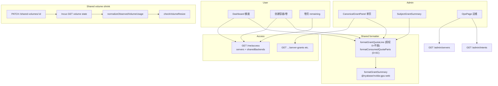
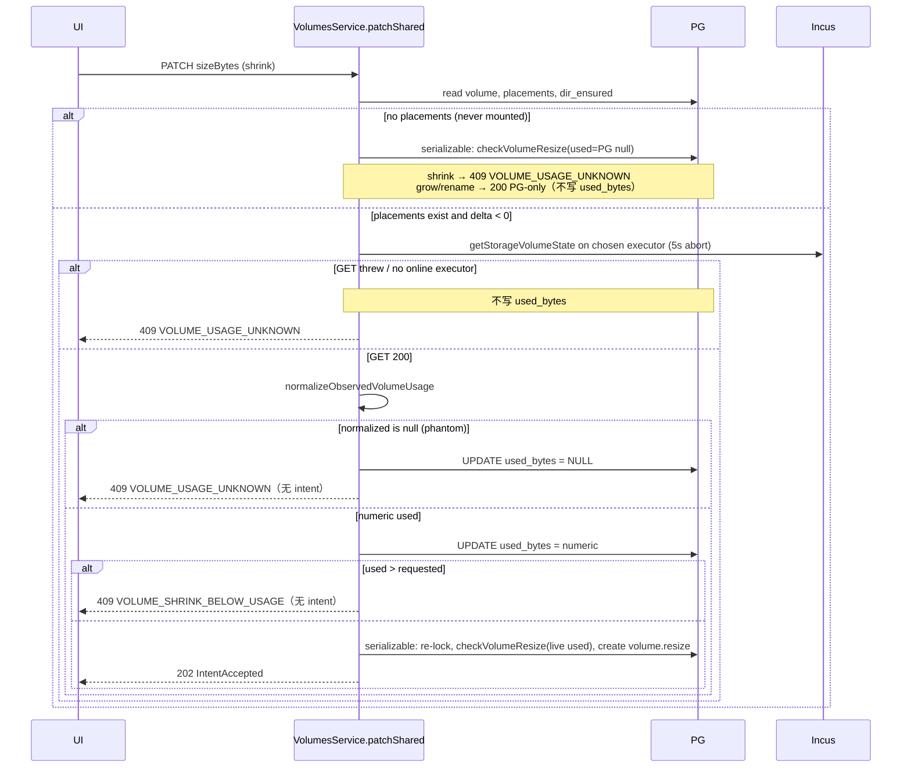

# Nyabase：授权可见性、管理运维页、共享卷已用/缩容 fail-closed

| 字段 | 值 |
| --- | --- |
| 状态 | Draft |
| 作者 | TBD |
| 日期 | 2026-09-07 |
| 产品 | Nyabase（**未发布**，无兼容义务） |
| 仓库 | `/root/nyabase` |
| 实验室 | `20260907-uitest` 保持 UP，本设计实现不得销毁 |

---

## Overview

管理员在用户/组授权里已经能通过扩展槽 `grant.server` 写入 GPU（`iam.server_grants.extension_grants` jsonb，键为 `nvidia-gpu`），但已授权列表和用户/组摘要只渲染 `serverName · CPU · 到期`，内存、磁盘、GPU 全部消失。授权面板还被切成三个 Tabs，存储池与所属服务器脱节。用户侧概览和创建流同样看不到「2C / 2G / 100G / 2GPU」这种额度语言。运维没有一张全局页能回答「系统是否健康」。同时共享卷存在最高严重度 bug：CephFS Incus 把空盘和满盘都报成 `used === config.size` 且 `total` 缺失，`normalizeObservedVolumeUsage` 把这种形状改写成 `0n`，UI 显示 0B，缩容预检把 0 当已知地板，导致满盘也能缩。

本设计一次落地六件事，但按四个独立可审 PR 提交：

1. **共享卷 used-bytes + 缩容 fail-closed**（bug，不改授权 UI）。
2. **授权展示 helper + 管理列表/摘要 + 单页布局**（items 1–3）。
3. **管理运维页**（当前/历史意图 + 机器状态）。
4. **用户额度表面**（概览、创建流、卷页）。

产品未发布：无 dual-write、无 feature flag、无遗留别名。GPU 继续走扩展 jsonb + slot/formatter；核心不得长一等 GPU 列。回滚 = 还原 PR 栈。不引入 Incus cluster、Agent、libcephfs。不改 destroy/adopt/粘性 catalog。

---

## Background & Motivation

### Item 1 — GPU 授权写得进去，列表看不见

`CanonicalGrantPanel`（`packages/frontend/src/components/grants/canonical-grant-panel.tsx`）通过 `ExtensionSlots area="grant.server"` 编辑 GPU，`PUT /admin/{users|groups}/:id/server-grants/:serverId` 把 `extensionGrants` 写入 `iam.server_grants.extension_grants`。已授权列表（`GrantList` ~183–189）只拼：

```
${serverName} · CPU ${formatCpu(cpuMillis)} · 到期 ${expiryLabel}
```

不渲染 `memBytes`、`diskBytes`、`extensionGrants`。`SubjectGrantSummary`（`subject-grant-summary.tsx`）的「已授权服务器」chip 只有服务器名 + 到期徽章。

NVIDIA 授权形态在包内：`GpuGrantMode` `none | all | pci` + `pciAddresses`（`extensions/nvidia-gpu/src/schema.ts` `zNvidiaGpuGrant`）。核心已有不透明 `OpaqueExtensionMap`；展示必须走扩展注册的 formatter / 已有 slot，禁止在 core grant 文件里读 `nvidia-gpu` 字段名。

### Item 2 — 授权页三个 Tabs，池与服务器脱节

当前 `Tabs`：服务器 / 存储池 / 共享存储。存储池是扁平列表，label 里才带服务器名。用户要求：服务器、存储池、共享存储同一页滚动；存储池跟在所属服务器后面（`StoragePoolDto.serverId`）；服务器条目展开（现在一行太窄）；共享存储因 backend 不是 per-server，同页独立一节即可。

已有 API 足够，禁止为布局发明 N+1 新接口：

| 用途 | 已有 |
| --- | --- |
| 服务器目录 | `GET /admin/servers` |
| 本地池（执行端拆分后 **仅本地**） | `GET /admin/servers/:id/storage-pools` |
| 共享后端 | `GET /admin/shared-backends` |
| 三类授权 | `GET/PUT/DELETE .../server-grants`、`storage-pool-grants`、`shared-backend-grants` |

`iam.storage_pool_grants` 与 `iam.server_grants` **不合并**。授权 UI 不得把 cephfs/shareable 再列进「存储池」（`isLocalStoragePool` 只是皮带；list API 已是 local-only；`lane-d-product.surface.test.ts` 已断言 grant 面板不含 `isLocalStoragePool`）。

### Item 3 — 用户/组列表摘要不够用

`users-page.tsx` / `groups-page.tsx` 的 `SubjectGrantSummary` 三行 chip 互不隶属。需要紧凑额度 chip：`2C / 2G / 100G / 2GPU`（CPU/mem/disk 的 grant `null`/`0` → `不限`；GPU 由扩展 formatter 决定省略 / `2GPU` / `全部GPU`）。**本地池嵌在对应服务器行下**；共享后端 grant 不是 per-server，作为与服务器行平级的独立行（`ceph-nbdev  100G`），不要塞进某台机器下面。

### Item 4 — 没有全局「系统健康」页

意图已按资源展示（`ResourceIntentHistory` / `IntentsPanel`）。全局列表已存在：`GET /admin/intents`（`AdminIntentsController`，`packages/backend/src/runtime/intents.controller.ts`），`@RequireAnyCaps(ManageContainersAny, ManageVolumes, ManageSharedVolumes, ManageServers, ManageImages, ManageCertificates)`，并按 actor cap 过滤 `resourceType`（卷还按 shared vs local 再滤）。没有前端页把它和机器状态放在一起。

Operators 默认 cap（`groups.service.ts` `ensureSystemGroups`）含 `ManageServers` / `ManageContainersAny` / `ManageImages`，**不含** `ManageVolumes` / `ManageSharedVolumes`。运维页必须复用现有 cap 集，禁止为了「能看卷意图」给 Operators 加 cap。

### Item 5 — 共享卷已用=0B 且满盘可缩（P0）

现场：

1. 从未挂载的共享卷缩容 → 已用未知 → **符合预期**（`used_bytes` null → `VOLUME_USAGE_UNKNOWN`）。
2. 挂载后写到 Ceph guest 配额打满 → **符合预期**。
3. 回到共享卷页，**已用仍 0B**。
4. 缩容成功，意图成功。
5. 客户机里删+重写后新配额生效 → 缩容确实落到 CephFS size。

根因在 `packages/backend/src/runtime/volume-reconciler.service.ts` `normalizeObservedVolumeUsage`：

```ts
if (input.driver !== 'cephfs') return input.usedBytes;
const totalMissing = input.totalBytes === null || input.totalBytes === 0n;
if (totalMissing && input.usedBytes >= input.currentSizeBytes) {
  return 0n; // phantom-empty rewrite
}
```

CephFS Incus 对**真空**（配额天花板回声）和**写满**都报 `used === config.size` 且 `total` 缺失/0。改写成 `0n` 后：

- `observeVolumeUsage` 用 `greatest(coalesce(used_bytes, 0), observed)` 把 0 写进 PG。
- DTO `usedBytes: 0` → UI `已用 0B`（`shared-volumes-page.tsx` 只把 `null` 当「未知」）。
- `VolumesService` 共享 PATCH（~982–994）用 **PG** `locked.used_bytes` 做 `checkVolumeResize`，不 live-GET Incus。`usedBytes === 0` 是已知地板，缩到任意正数都过。
- Reconciler `decideVolumeResize` 同样吃到 0n，放行 shrink。

`effectiveUsageForShrinkFloor` / `checkVolumeResize` 对 quota_online 已经把 `used === size` 当真实占用（`volumes.service.test.ts`），但它们吃到的是 **normalize 之后** 的 0。guest 配额和 control-plane size 是同一份 CephFS `config.size`；「guest 已经挡过了」不能当缩容许可。

从未挂载路径（`dir_ensured=false`、无 placement）保持今日：纯 PG 改 `size_bytes` 返回 200（扩容/改名）；`used_bytes` 保持 null，缩容 409 `VOLUME_USAGE_UNKNOWN`。不碰 destroy/adopt/粘性 catalog/RemoveAll。

### Item 6 — 用户看不到自己的额度

`GET /me/access` → `EffectiveAccessDto` 只有 `servers[]`（cpu/mem/disk/`extensionGrants`/到期）。`create-container-dialog.tsx` ~238 已印所选服务器的「授权额度」，但不含 GPU、不含剩余。Dashboard（`dashboard-page.tsx`）只有服务器/容器计数。本地卷/共享卷创建对话框没有额度/剩余。用户卷页没有 grant remaining。

共享剩余 **无法** 从今日 `EffectiveAccessDto` 或用户 `GET /shared-backends` 推出：后者没有 `limitBytes`，quota 在 `iam.shared_backend_grants`。GPU 展示可以从 `extensionGrants` 经扩展 formatter 推出，不必新列。

---

## Goals & Non-Goals

### Goals

1. CephFS 无法区分「真空回声」与「写满」时，**拒绝缩容**（`VOLUME_USAGE_UNKNOWN`），禁止把 phantom 写成 0。UI 未知 vs 真实已用分家。
2. 管理员授权列表、用户/组摘要、用户概览/创建流共用同一套额度语言：`2C / 2G / 100G / 2GPU`，`不限`。GPU 文案只来自扩展 formatter。
3. 授权编辑单页滚动：服务器可展开；该机本地池跟在服务器下；共享存储同页独立节。
4. 一张管理运维页：进行中意图、历史意图、机器状态。复用 `IntentDto` + `GET /admin/intents`。
5. 用户能在概览和创建流看到 **额度**（grant formatter）与（有数据时的）**已分配/已预订/剩余**（consumed formatter；空列表是 `0C` 不是 `不限`）。

### Non-Goals

- 兼容、dual-write、feature flag、别名、遗留 GPU 列。
- Incus cluster、Agent、libcephfs。
- 粘性 catalog、一次性 RemoveAll、执行端拆分再设计；destroy/adopt 生命周期（见 `plans/incus-shared-storage.md` 保持不变的约束）。
- 把 pool grant 并进 server grant schema。
- 给 Operators 增加 `ManageVolumes` / `ManageSharedVolumes`。
- 浏览器 e2e 旅程；仅当 API 合同现有 spec 盖不住时补 API 覆盖。禁止 skip-as-pass GPU/CephFS。
- 新的意图存储、新的健康聚合服务。
- 为「真空 CephFS 可缩」去猜 Incus；fail-closed 是产品选择。

---

## Key Decisions

1. **Phantom CephFS usage → `null`（未知），永远不再改写成 `0n`。**  
   `used === size && (total == null || total == 0)` 对 CephFS 同时覆盖空盘回声和满盘。改写成 0 是本次 bug。fail-closed：不能区分就当未知。`used < size`（即便 total 缺失）视为可信已用。`total > 0` 时按 Incus 原值（满盘且 total 在场 → `VOLUME_SHRINK_BELOW_USAGE`，不是 unknown）。

2. **有 catalog 的共享卷缩容必须 `getStorageVolumeState` live-GET；禁止信任 PG 里的 0 / stale。**  
   `VolumesService` 已注入 `INCUS_CLIENT_FACTORY`（第 9 个构造参数；第 8 个是 optional `NyabaseConfigService`）。缩容且 `placements.length > 0` 时，在 **可序列化事务外** 调用 `client.getStorageVolumeState(pool.incus_name, 'custom', volume.incus_name, { signal })`（5s abort），再 `normalizeObservedVolumeUsage`。三条互斥出口（必须一致，否则卡片「已用 0B」会活过 409）：
   1. GET **成功**且 normalize 为 `null`（phantom）→ **先** `UPDATE used_bytes = NULL`，再 409 `VOLUME_USAGE_UNKNOWN`，不建 intent。
   2. GET **失败** / 无在线执行端 → **不写** PG，409 `VOLUME_USAGE_UNKNOWN`。
   3. GET **成功**且得到数字 → **先**把该数字写入 `used_bytes`，再 `checkVolumeResize`：超地板 409 `VOLUME_SHRINK_BELOW_USAGE`（已写回，无 intent）；否则进事务建 `volume.resize`。
   从未挂载（无 placement）不 GET，保持纯 PG；缩容仍因 `used_bytes` null 而 409。这不是 inspect 路径：inspect（~2131）用 `getStorageVolume` 探存在；用量只在 `getStorageVolumeState`。

3. **观察写入停止 `greatest()`；phantom 必须把 PG 写成 `NULL`。**  
   今日 `observeVolumeUsage` 在 `used === null` 时 `return`（不清理假 0），非 null 时 `greatest(coalesce(used_bytes, 0), observed)`。今日 `revertImpossibleShrink` 在 `usedBytes === null` 时对 `used_bytes` 列 **no-op**（`usedBytes === null ? {} : greatest…` ~1179）。PR 1 三条路径同一合同：可信 used 原样覆盖；GET 成功的 phantom/`null` 写 `NULL`；GET 抛错保持原行。本地 dir 观察走同一函数，行为变「允许已用下降」——这是正确的。

4. **GPU 展示走 `formatGrantSummary`，不新增 core 列，不在 core 里读 `nvidia-gpu` 字段。**  
   与已有 `formatError` 同级，注册在 `ServerCardWebExtension`（`packages/frontend/src/extensions/types.ts` **和** `extensions/nvidia-gpu/src/web/types.ts` 两份形状都要加可选字段）。紧凑 chip 是字符串（`2GPU` / `全部GPU` / `none` 则省略），不适合再开一个 React slot。`grant.server` 继续只负责编辑。禁止新增 `gpuCount`。`formatGrantQuotaParts` **只格式化授权**（`0`/`null` → `不限`）；已分配/剩余另用 `formatConsumedQuotaParts`（`0` → `0C` / `0G`），禁止把容器 sum=0 喂进 grant formatter。

5. **授权 UI 去 Tabs，池 nested 在服务器下；schema 不合并。**  
   复用现有三个 grant 表和三个 REST 资源。共享后端不是 per-server，同页底下一节。不新 API。

6. **`EffectiveAccessDto` 增加 `sharedBackends[]`（`limitBytes` + 已预订 `usedBytes`）；只含 **live** 共享 grant。**  
   GPU/服务器额度已能从现有 DTO + formatter 派生；共享剩余不能。`usedBytes` = 该用户在该后端上非 failed/deleting 卷的 `sum(size_bytes)`（与 `assertSharedCapacityForDeltaForUser` ~1795–1800 同一口径），不是 Ceph 物理 used。

   **不要**把 `VolumesService.effectiveSharedGrant` 整段拷到 resolver。那是 mutate 路径：单 `backendId`、`.forUpdate('grant')`、返回 `number | null | undefined`（无 `expiresAt`）。`GET /me/access` 若循环它会在 dashboard poll 上 `FOR UPDATE`，且丢到期字段。

   抽出的是 **纯获胜函数**：把 `compareGrantCandidates`（`volumes.service.ts` ~111–130，live 优先、direct > group、组内 `expiresAt` 再 priority）挪到 `access/grant-expiry.ts`，与 `liveExpiry` / `classifyGrantExpiry` 同文件。**不**走 `selectWinningGrantCandidate`（含 grace，tie-break 不同）。

   - `getEffectiveSharedAccess`：一次 **非锁定** 读出该用户全部 `iam.shared_backend_grants`（direct + group），按 `shared_backend_id` 分组，每组 `liveExpiry` 过滤后跑纯获胜函数，再一次 `sum(size_bytes)` 聚合。返回 DTO（含 `expiresAt`）。无 live 行的 backend 不出现。
   - `VolumesService.effectiveSharedGrant` **留在** create/resize：继续 `FOR UPDATE` + 同一纯获胜函数 + `0 → null`。resolver 不 import `VolumesService`。

   DTO **没有** `accessPhase: grace`：grace 共享 grant 今日 `assertSharedGrant` 会 403，UI 不得展示额度。`AccessResolverService.getEffectiveAccess` 今日返回 `EffectiveServerAccessDto[]`；共享列表用新的 `getEffectiveSharedAccess`，由 `MeAccessController` / `UserGrantsController.effectiveAccess` 组装 `{ servers, sharedBackends }`。

7. **运维页 cap = 与 `AdminIntentsController` 相同的 **六个** Capability，按资源过滤，不扩大 Operators。**  
   `ADMIN_INTENT_CAPABILITIES` 今日是 `intents.controller.ts` 的 **文件私有** const，共六值：`ManageContainersAny`, `ManageVolumes`, `ManageSharedVolumes`, `ManageServers`, `ManageImages`, `ManageCertificates`（**不是七个**）。未发布：把它提升到 `@nyabase/common`（`enums.ts` 旁 `export const ADMIN_INTENT_CAPABILITIES`），backend controller 与 frontend `adminNavItems` / `RequireAnyCapability` 共用，避免漂移。机器状态块与服务器名解析仅当 actor 有 `ManageServers` 时拉 `GET /admin/servers`；仅有 `ManageVolumes` 的管理员仍能看卷意图，行上 `serverId` 显示 UUID（或省略该列），**不** 403。

8. **未发布：改 DTO/query 直接改；无 SQL 迁移。**  
   本轮不改 `000001_initial.sql`。`zIntentListQuery` 增加可选 `resourceType` / `serverId`，但 **只有** `AdminIntentsController` 把这两字段传进 `intents.list`（新 `adminIntentListOptions()`）。资源级 controller 继续用现有 `listOptions`（limit/cursor/status/kind）+ 路径上的 `resourceType`/`serverId`/`resourceId`，避免 query `serverId` 污染容器/卷意图列表。回滚 = git revert。

---

## Proposed Design

### 总览



---

### Item 5 — 共享卷 used-bytes / 缩容（PR 1，最高优先级）

#### 观察规范化

改 `normalizeObservedVolumeUsage`（`volume-reconciler.service.ts`）。CephFS phantom **返回 `null`**，不再 `0n`。

```ts
export function normalizeObservedVolumeUsage(input: {
  readonly resizeFamily: 'quota_online' | 'block_backed';
  readonly driver: VolumeRow['driver'];
  readonly usedBytes: bigint | null;
  readonly totalBytes: bigint | null;
  readonly currentSizeBytes: bigint;
}): bigint | null {
  if (input.usedBytes === null) {
    if (
      input.resizeFamily === 'quota_online'
      && input.driver !== 'cephfs'
      && input.totalBytes === 0n
    ) {
      return 0n; // dir/btrfs/zfs 空盘 { total: 0 } 无 used
    }
    return null;
  }
  if (input.driver !== 'cephfs') return input.usedBytes;
  const totalMissing = input.totalBytes === null || input.totalBytes === 0n;
  if (totalMissing && input.usedBytes >= input.currentSizeBytes) {
    return null; // was 0n — 空/满不可分，fail-closed
  }
  return input.usedBytes;
}
```

真值表（CephFS quota_online，`size = 100`）：

| Incus `used` | Incus `total` | 结果 | 缩容到 50 |
| --- | --- | --- | --- |
| `null` | any | `null` | `VOLUME_USAGE_UNKNOWN` |
| `100` | `null` 或 `0` | `null`（phantom） | `VOLUME_USAGE_UNKNOWN` |
| `100` | `100` | `100` | `VOLUME_SHRINK_BELOW_USAGE` |
| `40` | `0` / `null` | `40`（used &lt; size，可信） | 允许 |
| `0` | `null`，size=100 | `0`（used &lt; size，可信空） | 允许 |
| `80` | `100` | `80` | `VOLUME_SHRINK_BELOW_USAGE` |

dir/btrfs/zfs：`used === size` **保持原值**（已有测试「不得把 dir occupancy 改写成 0」继续有效）。

抽出 `isPhantomCephfsUsage(used, total, size)` 供 unit + PATCH 预检共用，避免两处漂移。

#### 观察写入

`observeVolumeUsage` 今日：

```ts
if (used === null) return;
await ... set({ used_bytes: sql`greatest(coalesce(used_bytes, 0), ${used}::bigint)` })
```

改为：`getStorageVolumeState` **成功**则 **覆盖**（含把 phantom 清成 NULL）：

- normalize 结果 `used === null`（含 CephFS phantom）→ `used_bytes = NULL`（今日在 `null` 时 `return`，假 0 会粘住）
- 否则 → `used_bytes = used`（允许下降；去掉 `greatest`）
- `getStorageVolumeState` **抛错** → 不写，打 warn（与今日一致）

`revertImpossibleShrink` 今日 `usedBytes === null` 时对 `used_bytes` **不更新**（`{}` 分支 ~1179），在飞的 `volume.resize` 失败后假 0 仍在。改为始终写入：`usedBytes === null` → `used_bytes = NULL`，否则写该数字（仍去掉 `greatest`）。`size_bytes` 回滚到 `actualSizeBytes` 的现有行为不变。

扫描仍只对 `catalog_state === 'present'` 且 list 得到该卷的 placement 做观察（`volume-reconciler.service.ts` ~307–313）。从未挂载无 catalog → 不观察 → `used_bytes` 保持 null。

#### 共享 PATCH 缩容预检

`patchShared`（`volumes.service.ts` ~965+）今日在事务内用 PG `locked.used_bytes`。改为（事务外 live-GET；**写回与 409 的合同如下，三路不得合并**）：



成功 GET 的写回可在 serializable 事务外做一次短 UPDATE（不持 Incus 锁）；成功建 intent 的事务不必再写一遍，但写两次同一值也无害。409 之前必须已经把 NULL 或数字落盘，这样刷新卡片不会继续显示历史 `0B`。

执行端选择（用量 API，**不是** inspect 的 `getStorageVolume` 存在探活）：

1. `control.volume_placements` 中 `catalog_state IN ('present','ensuring')` 且对应 `infra.servers.status = 'online'` 的第一台。对该机 `clients.get(serverId)` 后：
   `getStorageVolumeState(pool.incus_name, 'custom', volume.incus_name, { signal })`，5s `AbortController`。
2. 否则对 `listEligibleDestroyExecutors`（online + registered + shareable cephfs，`eligible-destroy-executors.ts`）逐台同样 `getStorageVolumeState`；`INCUS_NOT_FOUND` 试下一台；其它错误视为该执行端失败。
3. 全部失败 / 无在线执行端 → 出口 2（不写 PG）。不要对每台执行端循环 `getStorageVolume`。

Incus I/O **不得**放进 `serializable` 事务（持锁 + 5s RTT）。事务内 `checkVolumeResize` 用已经 observe 到的数字（防 TOCTOU 只靠 reconciler 二次地板，与今日「预检 + reconcile」一致）。

扩容（`delta >= 0`）不 GET Incus。无 placement 的改名/扩容保持 200。

`quotaEffective === false` 时今日 `if (precheckFailure && quotaEffective)` 会跳过地板。不改变这条皮带（配额未生效的池本就不能当 CephFS 共享产品）；本 bug 的对象是 quota 生效的共享卷。

不要因为「guest 已 enforce quota」跳过地板。guest 配额天花板 = control-plane `size_bytes`。

#### UI 已用

今日（`shared-volumes-page.tsx` / `manage-shared-volumes-page.tsx` / 编辑对话框 `validateShrinkFloor`）：

```
已用 ${volume.usedBytes === null ? '未知' : approxGibHint(volume.usedBytes)}
```

`null` 已经是「未知」。问题是 PG 里的 **0**。后端不再写 phantom 0 后，这条就能显示「未知」。

仍要修的展示陷阱：

- `formatBytes(0)` → `0 B`；`usedTotalLabel` 对 `usedBytes == null` 会 `usedBytes ?? 0`。共享卷卡片不要走 `usedTotalLabel`。
- 新增 `formatObservedUsage(usedBytes: number | null): string`：`null` → `未知`；有值 → 现有 `approxGibHint` / compact。**禁止** `usedBytes ?? 0`。
- 共享卷卡片、管理共享卷、缩容对话框一律走该 helper。
- 前端 `validateShrinkFloor`：`usedBytes === null` 已拒绝。不要把 `0` 再当成 unknown（`used < size` 的真实 0 应允许缩）。后端 live-GET 是最后一道门。

缩容对话框文案保持「在线缩容：仅校验目标容量不小于已用量。」；当 `usedBytes === null` 时现有 `已用量未知，无法缩容` 已经正确。

#### 测试（PR 1 必须带）

| 层 | 断言 |
| --- | --- |
| `volume-reconciler.test.ts` | CephFS `used===size && totalMissing` → `null`，不是 `0n`；`decideVolumeResize` → `usage_unknown`，**不是** `shrink`。今日「allows CephFS shrink after normalizing a false-full usage report」**改为相反**。dir `used===size` 仍为原值 + `usage_floor`。 |
| `volumes.service.test.ts` | `checkVolumeResize` quota_online `used===size` 仍 `VOLUME_SHRINK_BELOW_USAGE`；`used=null` 仍 `VOLUME_USAGE_UNKNOWN`。 |
| `volumes.shared.pg.test.ts` | 现有 harness：`describePg` 在无 `NYABASE_TEST_DATABASE_URL` 时 skip（既有跳过，不是 skip-as-pass GPU/CephFS）。`serverValues` **默认 `status: 'unknown'`**，live-GET 用例必须显式 `status: 'online'`。`makeService` 今日只传 7 个参数；factory 是构造器 **第 9 个**（第 8 个 `NyabaseConfigService` 传 `undefined`）。已有 never-mounted **grow** 100→200 → 200 无 intent（~207–226）与 create `usedBytes: null`；本 PR 补 never-mounted **shrink**。矩阵：① never-mounted 缩容 409 `VOLUME_USAGE_UNKNOWN`，扩容 200，`dir_ensured=false`，不调 Incus。② `dir_ensured=true` + placement `catalog_state='present'`（或 `'ensuring'`）+ server online，mock `getStorageVolumeState` phantom `used===size,total=0`，缩容 409 unknown，**不**建 intent；PG `used_bytes` **变为 `null`**（即便种子是 0）。③ mock live used=80，请求 50 → 409 `VOLUME_SHRINK_BELOW_USAGE`，PG `used_bytes=80`，无 intent。④ mock used=40,total=0,size=100，请求 50 → 建 `volume.resize`，PG `used_bytes=40`。⑤ mock GET 抛错 / 无 factory → 409 unknown，**PG `used_bytes` 保持种子值**（含假 0，等扫描清理）。禁止 `it.skip` 翻转后的 reconciler 单测。 |
| `storage-shrink.test.ts` + 页面 unit | `formatObservedUsage(null) === '未知'`；渲染路径不得把 null 显示成 `0B` / `0 GiB`。 |
| `lane-d-product.surface.test.ts` | 共享卷页 `usedBytes === null ? '未知'`（或 helper）；不得出现 `usedBytes ?? 0`。 |

现有 e2e `storage.shared-lifecycle.spec.ts` 已接受 `VOLUME_SHRINK_BELOW_USAGE|VOLUME_USAGE_UNKNOWN`。本轮 **不** 加浏览器旅程。若 mock 不到 Incus 的 pg 测试已覆盖合同，不新开 live spec。禁止 skip-as-pass。

实验室 `20260907-uitest` 仅供操作员手测；实现脚本不得 `orchestrator/down.sh`。

---

### Items 1–3 — 授权展示 + 单页布局（PR 2）

#### 单一额度 formatter

核心 CPU/mem/disk 与扩展 chip 拼接。扩展侧与 `formatError` 同级：

```ts
// packages/frontend/src/extensions/types.ts  （nvidia-gpu/src/web/types.ts 同步）
export interface ServerCardWebExtension {
  readonly id: string;
  readonly slots: Partial<{ ... }>;
  readonly formatError: ExtensionErrorFormatter;
  readonly formatGrantSummary?: (grants: OpaqueExtensionMap) => string | null;
}
```

```ts
// packages/frontend/src/extensions/registry.ts
export function formatExtensionGrantSummaries(
  grants: OpaqueExtensionMap | null | undefined,
): string[] {
  const out: string[] = [];
  for (const ext of extensions) {
    const chip = ext.formatGrantSummary?.(grants ?? {});
    if (chip) out.push(chip);
  }
  return out;
}
```

`extensions/nvidia-gpu/src/web/index.ts`：

```ts
formatGrantSummary(grants) {
  const parsed = parseGrant(grants[NVIDIA_GPU_EXTENSION_ID]);
  if (!parsed || parsed.mode === GpuGrantMode.None) return null;
  if (parsed.mode === GpuGrantMode.All) return '全部GPU';
  if (parsed.pciAddresses.length === 0) return null; // mode=pci 空列表（GpuPicker 切到 specific）
  return `${parsed.pciAddresses.length}GPU`;
}
```

`none` / 缺省 / 空 pci：**省略** GPU chip，不要 `0GPU`。GPU 没有「null = 不限」；不限是 `mode=all` → `全部GPU`。nvidia 包内单测 `formatGrantSummary`（`parseGrant` 已在 `grant-state.ts`）。

核心 helper `packages/frontend/src/lib/grant-quota.ts`（纯函数，**不** import 扩展 registry，易测）：

```ts
type CpuMemDisk = {
  cpuMillis: number | null;
  memBytes: number | null;
  diskBytes: number | null;
};

/** Grant ceilings only. null/0 → 不限. Never pass consumed sums here. */
export function formatGrantQuotaParts(grant: CpuMemDisk): string[] { /* 2C, 2G, 100G 或 不限 */ }

export function formatGrantQuotaLine(
  grant: CpuMemDisk,
  extensionChips: readonly string[] = [],
): string {
  return [...formatGrantQuotaParts(grant), ...extensionChips].join(' / ');
}

/** Allocated/committed usage. 0 → 0C / 0G. null = no observation (omit the row). */
export function formatConsumedQuotaParts(consumed: CpuMemDisk): string[] { /* 0C, 0G, 30G */ }
```

调用方拼接扩展 chip：`formatGrantQuotaLine(grant, formatExtensionGrantSummaries(grant.extensionGrants))`。`grant-quota.test.ts` 不注册 nvidia-gpu。

Compact 规则：

| 用途 | `null` | `0` | 正数 |
| --- | --- | --- | --- |
| **授权** `formatGrantQuotaParts` | `不限` | `不限`（与 `resourceVal` / grant 语义一致） | `2C` / `2G` / `100G` |
| **已分配/已预订** `formatConsumedQuotaParts` | 该维不可用 → 调用方省略整行或该维 | `0C` / `0G` | 同 compact |
| **剩余** | grant 为不限 → `不限`；否则 `max(0, grant − consumed)` 走 consumed formatter | | |
| **GPU** | 不跑 consumed（Non-Goal）；授权 chip 来自 `formatGrantSummary` | | |

`cpuMillis` compact：`millis/1000` → `2C`（整数）或 `0.5C`。bytes：≥0.95 GiB 用 `2G` / `100G`，更小用 `formatBytesCompact`。

**核心 grant/dashboard 文件禁止**出现 `nvidia-gpu`、`pciAddresses`、`GpuGrantMode`。Surface test 锁这一点。

不新增 `ServerCardUiArea`。`grant.server` 仍只用于编辑（`GpuPicker`）。列表/摘要用字符串 chip，避免只读 picker 的噪音。

#### CanonicalGrantPanel 布局

去掉 `Tabs`。单列滚动：

```
┌ 服务器授权 ─────────────────────────────────────┐
│ [添加] 选择未授权服务器 + CPU/内存/磁盘 + GPU槽 + 到期 + 保存 │
│                                                    │
│ ▼ nyabase-test-1 · 2C / 2G / 100G / 2GPU · 不设期限 │
│   CPU [2]  内存 [2G]  磁盘 [100G]                  │
│   ExtensionSlots grant.server（可改 GPU）          │
│   到期 …  [保存] [删除]                             │
│   存储池                                            │
│     · dir-quota  已授权 · 不设期限  [删除]          │
│     · btrfs-a    未授权              [授权]         │
│                                                    │
│ ▶ aya-1 · 不限 / 不限 / 不限 · 宽限期              │
└────────────────────────────────────────────────────┘
┌ 共享存储 ────────────────────────────────────────┐
│ 选择后端 + 额度(G) + 到期 + 保存                   │
│ ceph-nbdev · 100G · 不设期限  [删除]               │
└────────────────────────────────────────────────────┘
```

实现要点：

- **已授权服务器**才渲染为可展开卡片（默认展开）。用现有 Chevron + `aria-expanded` 模式（`ResourceIntentHistory`），不强制新引入 Accordion。
- **未授权服务器只出现在「添加」`<Select>`**，不渲染空卡片，避免和添加表单抢同一份 state。
- 每个已授权卡片持有自己的表单 state，从 `ServerGrantDto` 初始化（cpuMillis/1000、bytes/GiB、`extensionGrants`）。保存仍 `PUT .../server-grants/:serverId`。
- 池：继续 `Promise.all(servers.map(id => GET /admin/servers/:id/storage-pools))`（今日已有，不是新 N+1 API）。按 `pool.serverId` 分组渲染在对应服务器卡片内。只展示 `registered` 本地池（`GET /admin/servers/:id/storage-pools` 已是 local-only）。授权/撤销仍 `PUT/DELETE .../storage-pool-grants/:poolId`。
- **无服务器授权的池 grant**（异常，但 list 可能返回）：在服务器卡片列表下方单独一块「存储池（无服务器授权）」，只读展示池名 + 到期 + 删除。不要为了嵌套去发明空的服务器卡片。
- 共享存储一节保持今日表单 + 列表（额度必填；`limitBytes === 0` 展示 `不限`，与 `effectiveSharedGrant` 一致）。
- 列表 label 用 `formatGrantQuotaLine(grant, formatExtensionGrantSummaries(grant.extensionGrants))`，不再只印 CPU。
- `data-testid="canonical-grants"` 保留。

#### SubjectGrantSummary

嵌套，不再三行断开：

```
nyabase-test-1  2C / 2G / 100G / 2GPU  [有效]
  池：dir-quota、btrfs-a
ceph-nbdev  100G  [有效]
```

无服务器 grant 但有池 grant 的（异常，池本应跟服务器）仍列出，前缀「存储池」以免丢数据——与面板的「存储池（无服务器授权）」同一规则。共享后端行与服务器行 **平级**，不嵌进服务器。`limitBytes === 0` → `不限`。到期徽章沿用 `grantExpiryPhaseLabel`。

`data-testid="subject-grant-summary"` 保留。

#### 测试（PR 2）

- `grant-quota.test.ts`：授权 null/0 → 不限；1000ms+2GiB+100GiB → `1C / 2G / 100G`。`formatConsumedQuotaParts({ cpuMillis: 0, memBytes: 0, diskBytes: 0 })` → `0C / 0G / 0G`，**不得**变成 `不限`。`formatGrantQuotaLine` 第二个参数默认 `[]`（不碰 registry）。
- nvidia-gpu 包内 `formatGrantSummary`：none / 缺省 / **`mode=pci` 且 `pciAddresses=[]`** → `null`（不要 `0GPU`）；all → `全部GPU`；pci 两张 → `2GPU`。
- `canonical-grant-panel` 组件或 surface：无 `Tabs`/`TabsTrigger`；有「存储池」出现在服务器块内；`formatGrantQuotaLine` / `formatExtensionGrantSummaries`；core 文件不得匹配 `nvidia-gpu`。
- `lane-d-product.surface.test.ts`：继续禁止 `isLocalStoragePool`；断言无三 Tab 文案结构；磁盘 hint「不含共享卷」保留。

---

### Item 4 — 管理运维页（PR 3）

#### 路由与权限

| | |
| --- | --- |
| 路径 | `/ops`（file route `packages/frontend/src/routes/ops/index.tsx`，TanStack 生成 `routeTree.gen.ts`） |
| 导航 | `adminNavItems` 增加 `{ to: '/ops', icon: Activity, label: '运维', caps: ADMIN_INTENT_CAPABILITIES }`，放在「容器管理」附近。`ADMIN_INTENT_CAPABILITIES` 从 `@nyabase/common` 导入（本 PR 从 controller 私有 const 提升），**恰好六个** Capability。 |
| 守卫 | `RequireAnyCapability capabilities={ADMIN_INTENT_CAPABILITIES}`：`ManageContainersAny`, `ManageVolumes`, `ManageSharedVolumes`, `ManageServers`, `ManageImages`, `ManageCertificates` |
| 机器块 / 服务器过滤 / 服务器名 | 仅 `user.capabilities.includes(ManageServers)` 时请求 `GET /admin/servers`。无该 cap：**隐藏**机器表和服务器下拉；意图行 `serverId` 列显示原始 UUID 或省略该列。不要为解析名字去打 `GET /admin/servers`（会 403）。 |

Operators 已有 `ManageServers`+`ManageContainersAny`+`ManageImages`，能进页、能看容器/服务器/镜像/证书意图，**看不见卷意图**（controller 已滤）。不要改 `ensureSystemGroups`。Surface test 断言 `groups.service.ts` Operators 数组仍无 `ManageVolumes` / `ManageSharedVolumes`。

#### API

不新意图表。复用 `GET /admin/intents`、`GET /admin/intents/:id`、`POST /admin/intents/:id/retry`、`GET /admin/servers`。

`zIntentListQuery` 今日只有 `limit/cursor/status/kind`。`IntentListOptions` 已有 `resourceType`/`serverId`，但 query 没暴露（`AdminServerIntentsController` 用路径参数）。未发布，直接扩展：

```ts
export const zIntentListQuery = z.object({
  limit: z.coerce.number().int().min(1).max(MAX_INTENT_LIST_PAGE_SIZE).default(50),
  cursor: z.string().min(1).max(512).optional(),
  status: z.nativeEnum(IntentStatus).optional(),
  kind: z.nativeEnum(IntentKind).optional(),
  resourceType: z.nativeEnum(IntentResourceType).optional(),
  serverId: zResourceIdentity.optional(),
}).strict();
```

**不要**把新字段塞进现有 `listOptions()` 再 spread 到所有 controller。今日 `listOptions` 只转发 `limit/cursor/status/kind`；`ContainerIntentsController` 等 `...listOptions(query)` 后再用路径覆盖 `resourceType`/`resourceId`。`AdminServerIntentsController` 是 `{ ...parsed, serverId }`（路径优先）。若 `listOptions` 开始拷贝 query `serverId`，资源级列表会被 UI 从未发送的 query 污染。

合同：

```ts
function listOptions(query): Pick<IntentListOptions, 'limit' | 'cursor' | 'status' | 'kind'> { /* 今日 */ }

function adminIntentListOptions(query): IntentListOptions {
  const parsed = zIntentListQuery.parse(query);
  return {
    ...listOptions(query),
    resourceType: parsed.resourceType,
    serverId: parsed.serverId,
  };
}
```

仅 `AdminIntentsController.list` 使用 `adminIntentListOptions`。无 cap 的 `resourceType` 仍空页不 403（已有 ~274–276）。`serverId` 不额外扩 cap。镜像 assignment list 已显式挑字段（`images.service.ts` ~485–492），不受影响。

默认页大小 50，上限 100（现常量）。游标与今日 `created_at DESC, id DESC` 一致。

`filterVolumeIntents` 在 SQL `limit` **之后**丢掉 actor 不能管的 local/shared 卷行。全局运维页一页可能不足 50 条但仍有 `nextCursor`。**接受短页**；不要为了凑满 50 去给 Operators 加 cap，也不在本 PR 把 shared-vs-local 推进 SQL（可另开 follow-up）。UI 文案用「加载更多」，不承诺「每页 50 条可见」。

#### UI

`packages/frontend/src/pages/ops-page.tsx`，中文文案：

```
运维
机器状态 | 意图

机器状态（有 ManageServers 时）
  表格：名称、状态（在线/不可达/未知）、最近观测、lastError 摘要、nodeMetrics.health
  行点击 → /servers/$id
  不在线行 destructive badge

意图
  分段：进行中（status=pending）| 失败（status=failed）| 全部
  过滤：kind、resourceType、server（仅 ManageServers 且已拉到目录时）
  行：kind 中文、status、resourceType、server（有目录则名，否则 UUID / 省略）、requestedBy（用户 id，与今日 IntentsPanel 一致）、createdAt、attempt、failure
  失败行：重试（已有 retryIntent(admin=true)）
  nextCursor →「加载更多」（可见行可能 < limit，见上）
```

`IntentsPanel` 今日只渲染 kind/status/requestedBy/createdAt/`requestSummary` JSON，**没有** resourceType / server 列，不能当全局表的 drop-in。做法：从 `IntentsPanel` **抽出** `IntentRow`（保留 retry、failure、attempt），ops 页传入可选 `serverLabel` / `resourceType`；资源历史页继续包一层 `IntentsPanel`。不要复制一套 retry/failure 栈，也不要在 ops 主行 dump JSON。

机器表复用 `serverStatusLabel`、`relativeTime`。

`data-testid="ops-page"`。

#### 测试（PR 3）

- `intents.controller.test.ts`：query `resourceType`/`serverId` 传到 `list`；无 cap 的 type 仍空页。
- `protocol.test.ts`：`zIntentListQuery` 接受新字段，拒绝未知键。
- `lane-d-product.surface.test.ts`：nav `/ops` + `运维`；route/`adminNavItems` 的 cap 数组 **恰好六个**（与 `ADMIN_INTENT_CAPABILITIES` 字面量一致）；**不得**把 `ManageVolumes` / `ManageSharedVolumes` 加进 `groups.service.ts` Operators 默认列表。
- 组件/surface：进行中请求 `status=pending`；失败请求 `status=failed`。

不写浏览器 e2e。现有 `container-api-extras.spec.ts` `GET /api/admin/intents` 仍然通过。

---

### Item 6 — 用户额度表面（PR 4，依赖 PR 2 formatter + 本 PR 的 DTO）

#### DTO

```ts
export interface EffectiveSharedBackendAccessDto {
  sharedBackendId: string;
  limitBytes: number | null; // null = 不限（effectiveSharedGrant 把 0 折成 null）
  usedBytes: number;         // sum(size_bytes); 0 = 尚未预订，不是不限
  expiresAt: string | null;
}

export interface EffectiveAccessDto {
  servers: EffectiveServerAccessDto[];
  sharedBackends: EffectiveSharedBackendAccessDto[];
}
```

无 `accessPhase`。只返回 **live** 共享 grant（grace 不能 create/resize，不进 DTO）。获胜 = `grant-expiry.ts` 里的纯函数（从 `compareGrantCandidates` 挪来）+ `liveExpiry`，**不要**调用 `selectWinningGrantCandidate`，**不要**在 GET 路径 `FOR UPDATE`。`GET /me/access` 与 `GET /admin/users/:id/effective-access` 都返回新字段。组没有 effective-access 端点，不新造。无 Zod DTO；未发布直接改 TS。DTO 无 `name`：展示名 join 用户 `GET /shared-backends`（与服务器 `GET /servers` + `serverId` 同一模式）。

`AccessResolverService.getEffectiveAccess` **继续**返回 `EffectiveServerAccessDto[]`（现有 array 测试保留）。新增 `getEffectiveSharedAccess(userId): EffectiveSharedBackendAccessDto[]`。`MeAccessController` / `UserGrantsController.effectiveAccess`：

```ts
return {
  servers: await this.access.getEffectiveAccess(userId),
  sharedBackends: await this.access.getEffectiveSharedAccess(userId),
};
```

`usedBytes` 一次聚合：

```sql
select shared_backend_id, coalesce(sum(size_bytes),0)
from control.volumes
where owner_id = $user
  and shared_backend_id in (...)
  and lifecycle_phase not in ('failed','deleting')
group by shared_backend_id
```

未发布，旧客户端不存在，直接改。`access-resolver.test.ts` 保留现有 `getEffectiveAccess` **数组**断言（~49–61）；另加 sibling：无共享 grant 时 `getEffectiveSharedAccess` → `[]`。`e2e/specs/50-access/grants.spec.ts`：`expect(Array.isArray(effective.sharedBackends)).toBe(true)`。这是 API 合同变化，属于「现有 spec 盖不住」的最小补丁，不是新浏览器旅程。

#### Dashboard / 资源概览

`dashboard-page.tsx` 增 `GET /me/access`（`queryKeys.meAccess`）。每台 `UserServerDto` 行在健康徽章旁加额度行：

```
nyabase-test-1                    在线
额度 2C / 2G / 100G / 2GPU
已分配 1C / 1G / 30G              （数据源已返回才显示；全 0 显示 0C / 0G，不是「不限」）
```

「额度」走 `formatGrantQuotaLine` + `formatExtensionGrantSummaries`。「已分配 / 已预订」走 `formatConsumedQuotaParts`，**禁止**把消耗喂进 grant formatter。查询失败 / 未拉取 → 省略该行，不编造。`GET /containers` 今日未分页（`ContainersController.list`），对当前用户做 sum 可以。

| 资源 | 来源 | 文案 |
| --- | --- | --- |
| CPU / 内存 | 当前用户 `GET /containers` 中 `serverId` 匹配的 `sum(cpuMillis)` / `sum(memBytes)` | 已分配 |
| 本地磁盘 | **本 PR 新增** `GET /servers/:id/storage-capacity`（`queryKeys.storageCapacity`）。只对 **在线** 服务器懒加载。`usedByRootDisksBytes + usedByLocalVolumesBytes` vs `grantLimitBytes` / `availableBytes` | 已预订 |
| GPU | 本轮 **只展示 grant chip**。从 `container.extensions` 数已用会在 core 读 nvidia 字段。若以后要已用，再在扩展上加 `formatUsageSummary`。 | — |
| 共享 | 概览底部一小节：每个 `sharedBackends[]` → `ceph-nbdev  已预订 20G / 额度 100G`。`usedBytes === 0` → `已预订 0G`；`limitBytes === null` → `额度 不限` | 已预订 |

不要把以上数字叫「已用」——那是 Ceph `VolumeDto.usedBytes` / 卡片「已用」。无 grant 的可见服务器（不应出现在 `/servers`）不画额度。

#### 创建流

**容器**（已有额度句，补 GPU + 剩余）：

```
额度 2C / 2G / 100G / 2GPU
剩余 CPU 1C · 内存 1G · 磁盘 70G
```

剩余：grant 为不限 → `不限`；否则 `max(0, grant − consumed)`，consumed 用 `formatConsumedQuotaParts`。

CPU/mem consumed：**PR 4 新增** `queryKeys.containers.userList`（`GET /containers`，`enabled: open`）。今日对话框 **没有** 这份 list（只拉 `/servers`、`/images`、`/me/access`、`storage-capacity`）。对 `form.serverId` 做 `sum(cpuMillis)` / `sum(memBytes)`。查询失败或未返回 → **省略**「剩余 CPU/内存」子句，不印 `NaN` / `不限`。空 list → `0C` / `0G`。

磁盘：`StorageCapacityDto.availableBytes` / `grantAvailableLabel`（创建容器对话框 **已经** 拉 `GET /servers/:id/storage-capacity`）。GPU 剩余不编造。

**本地卷对话框**：今日 **没有** capacity 请求（只拉 `/servers` 与 `/servers/:id/storage-pools`）。PR 4 **新增** `queryKeys.storageCapacity(serverId)`，`enabled: open && serverId.length > 0`。输入旁 hint：`剩余 70G / 额度 100G`（`grantAvailableLabel` + `grantLimitBytes`；不限则「额度不限」）。不要声称该 fetch 已经存在。

**共享卷对话框**：选中 backend 后从 `me/access.sharedBackends` 显示 `剩余 80G / 额度 100G`（`usedBytes === 0` 时剩余=额度，显示 `0G` 已预订不是「不限」）。展示名 join 用户 `GET /shared-backends`（DTO 无 `name`）。

用户 `GET /shared-backends`（`listForUser`）含 **grace**（`classifyGrantExpiry !== 'lost'`）；`/me/access.sharedBackends` 只有 **live**。因此 picker 里可以出现一个 grace-only 后端而 **没有** remaining 行——正确：create/resize 仍 403。**不要**为了对齐 picker 把 grace 塞回 DTO。没有 access 行就不画剩余，不是「正常总会有」。

#### 用户卷页

`volumes-page.tsx` / `shared-volumes-page.tsx` 页头 description 下加一行剩余摘要（按服务器 / 按后端折叠成 chip）。不改卡片内部结构。本地卷页的磁盘剩余同样要 **新增** `storage-capacity` 查询（懒加载在线机）；今日页头没有任何 capacity query。共享卷页用 `me/access.sharedBackends`，不必打 capacity。

#### 测试（PR 4）

- access-resolver：保留 `getEffectiveAccess` 数组测试；`getEffectiveSharedAccess` 无 grant → `[]`。
- `grant-quota.test.ts` 已在 PR 2 覆盖 consumed vs grant；本 PR 测 dashboard/create 调用 `formatGrantQuotaLine` **和** `formatConsumedQuotaParts`。
- `lane-d-product.surface.test.ts`：dashboard 含「额度」与「已分配」或「已预订」（不要用 Ceph 含义的「已用」当额度对比）；create-container 额度行含 formatter 而不是 `nvidia-gpu`，且含 `queryKeys.containers.userList` / `GET /containers`；`local-volume-form-dialog.tsx` 含 `queryKeys.storageCapacity` / `storage-capacity`；shared 对话框含「剩余」或「额度」，不假设每个 picker backend 都有 `sharedBackends[]` 行。
- 组件 test：无 access 数据时不崩溃、不显示 `NaN`；容器 list 为空时已分配为 `0C / 0G` 不是 `不限`。

---

## API / Interface Changes

### 不变

- `ServerGrantDto` / `StoragePoolGrantDto` / `SharedBackendGrantDto`
- `PUT` grant bodies
- `IntentDto`
- `VolumeDto.usedBytes` / `SharedVolumeDto.usedBytes` 语义：`null` = 未知，数字 = 可信已用（**不再**用 0 表示 phantom）
- GPU 仍在 `extension_grants` jsonb

### 改（未发布，直接改）

**`EffectiveAccessDto`**

```ts
export interface EffectiveAccessDto {
  servers: EffectiveServerAccessDto[];
  sharedBackends: EffectiveSharedBackendAccessDto[];
}
```

调用方：`GET /me/access`、`GET /admin/users/:id/effective-access`。

**`zIntentListQuery`**

可选 `resourceType`、`serverId`。`.strict()` 允许资源级 list 带上这两个可选键（客户端不传则 undefined）。**只有** `AdminIntentsController` 通过 `adminIntentListOptions()` 把它们传进 `intents.list`。`listOptions()` 保持今日的 `limit/cursor/status/kind`。`AdminServerIntentsController` 继续 `{ ...listOptions(query), serverId: path }`，路径覆盖 query。

无新 REST 资源。无 SQL。

**`ADMIN_INTENT_CAPABILITIES`**

从 `intents.controller.ts` 私有 const 提升到 `@nyabase/common`（六个 Capability 的 `as const` 数组）。backend `@RequireAnyCaps(...ADMIN_INTENT_CAPABILITIES)` 与 frontend nav/route 共用。

---

## Data Model Changes

无。`control.volumes.used_bytes` 列已存在（null=未知）。本轮只改 **写入策略**（phantom → NULL，去掉 greatest）。`iam.server_grants.extension_grants` 已是 jsonb。不改 `000001_initial.sql`。

回滚 = revert PR。假 0 行在 revert 后会按旧 normalize 再次出现；前进方向靠扫描/缩容 live-GET 把 0 纠正为 NULL。

---

## Alternatives Considered

### A. Phantom 继续当 0，但缩容跳过地板

「guest 配额已经挡住写满」。拒绝：guest 配额与 control-plane size 是同一 CephFS size；跳过地板就是本次 bug。用户明确要求不要这条路。

### B. 从 Ceph MDS / libcephfs 读真实 rbytes

更准，但 Non-Goal（禁止 libcephfs / Agent）。Incus 是唯一允许的观察源。不能区分时 fail-closed。

### C. `used_bytes` 旁加 `usage_confidence` 列

未发布可以加。但 `null` 已经表示未知；多一列要改 SQL、DTO、所有写入点。用 `null` vs 数字足够。不采用。

### D. 授权 GPU 展示在 core 解析 `extensionGrants['nvidia-gpu']`

实现最快，直接违反扩展边界，FPGA 兄弟包无法接入。采用 `formatGrantSummary`。

### E. 新 slot `grant.summary` / `access.summary` 返回 ReactNode

Chip 需要进 `2C / 2G / 100G / 2GPU` 字符串和摘要行。React slot 对纯文本拼接不合适。`formatError` 已是非 slot formatter 先例。不新开 `ServerCardUiArea`。

### F. 运维页只挂 `ManageServers`

卷/镜像管理员将 403。现有 list 已经按资源 cap 过滤。`RequireAnyCaps` 与 controller 对齐。机器块单独 gated。

### G. 共享剩余塞进用户 `SharedBackendDto`

会把 IAM 额度混进存储产品 DTO，admin list 还要分叉。放进 `EffectiveAccessDto` 与服务器额度对称。

### H. 授权继续 Tabs，只加 GPU 文字

不满足「一页」和「池跟服务器」。Tabs 去掉。

---

## Security & Privacy Considerations

| 风险 | 严重度 | 缓解 |
| --- | --- | --- |
| 运维页扩大 Operators 能力 | 高 | 不改 system group cap。页面 AnyCaps = 现 controller。机器目录仍要 `ManageServers`。 |
| `GET /admin/intents` 加 `serverId` 泄露他类资源 | 中 | controller 继续按 `allowedResourceTypes` + `filterVolumeIntents` 过滤；无 cap 的 type 空页。 |
| live-GET 在用户 PATCH 路径打 Incus | 中 | 仅共享缩容且已有 catalog；5s abort；失败 fail-closed，不把超时当 used=0。 |
| `EffectiveAccessDto.sharedBackends` 泄露他人用量 | 低 | `/me/access` 仅本人；admin effective-access 已要 `ManageGrants`。`usedBytes` 是该 subject 的预订合计。 |
| 前端 formatter 误把扩展 payload 当可信授权 | 低 | 展示-only；enforce 仍在 backend admit（`extensions/nvidia-gpu/src/backend/admit.ts`）。 |

威胁模型无变化：授权仍服务端 enforce；本轮是观察/展示/预检收紧，不是放宽。

---

## Observability

- 缩容因 phantom 409：已有 `FailureCode.VolumeUsageUnknown`，且 PG `used_bytes` 已是 NULL。GET 失败 409 不改 PG。intent 失败路径仍 `VOLUME_USAGE_UNKNOWN`（`revertImpossibleShrink` 现在会把 phantom 写成 NULL）。
- `observeVolumeUsage` GET 失败继续 `logger.warn`；phantom 写 NULL **不** warn（那是稳态）。
- 可选：warn 当 CephFS 观察从数字变为 NULL（扫描发现不可分）。不要新指标名除非现有 volume scan 已有 counter；本轮不强制新 Prometheus 系列。
- 运维页本身就是意图/机器的人眼告警面；失败意图可重试。

延迟：共享缩容 PATCH 增加一次 ≤5s Incus RTT，目标 p99 &lt; 6s。扩容/从未挂载不变。`GET /admin/intents` 默认 50 行，与今日相同。

---

## Rollout Plan

未发布，无 flag。顺序即 PR Plan。每 PR 独立可合并、可 revert。

实验室 `20260907-uitest` 保持 UP，供操作员在 PR 1 后手测：挂载写满的共享卷应显示「未知」或真实已用（不得 0B），缩容应 409 直到 Incus 报出 `used < size`。

回滚：`git revert` 对应 PR。PR 1 revert 会恢复 phantom→0 的旧行为（已知错误）；若必须紧急恢复「空盘可缩」，那是接受数据损坏，不作为设计内 rollback。

---

## Risks

| 风险 | 严重度 | 缓解 |
| --- | --- | --- |
| 真空但 Incus 报 `used===size` 的卷将无法缩容，直到出现 `used < size` | 中（产品选择） | 文档/UI「已用量未知，无法缩容」。用户可扩容。禁止猜 0。 |
| 历史 PG `used_bytes=0` 在下次扫描前仍显示 0B | 中 | 扫描 `observeVolumeUsage` 在 phantom 时写 NULL（不再 no-op）。缩容 live-GET：**成功 GET** 在 409 前写 NULL 或数字；**GET 失败不写**（假 0 等到下次成功观察）。UI helper 不把 null 显示成 0。不在前端把 `used===0 && dirEnsured` 一律当未知（会误伤真实空盘）。 |
| `greatest` 去掉后，抖动的 Incus used 会让已用上下跳 | 低 | 接受。粘滞最大值曾掩盖满盘。 |
| live-GET 选错执行端（catalog 尚未 present） | 中 | 优先 present+online placement；全 404 → unknown，不把「目录还没有」当成 used=0。 |
| 授权页去掉 Tabs 后表单 state 变复杂 | 低 | 每卡片独立 state；添加区与已授权区分开。 |
| 概览/本地卷页对每台服务器拉 capacity | 低 | **新增** query，仅在线机懒加载。创建容器对话框已有该 fetch；本地卷对话框本轮才加。 |
| GPU 已用不在 dashboard | 低 | 明确 Non-Goal；避免 core 读 pci。chip 仍显示授权。 |

---

## Open Questions

1. **真空 CephFS 是否要提供「强制缩容」管理员出口？** 本设计 **否**。与 fail-closed 冲突。若操作员坚持，应另开设计，且必须是 admin-only + 审计，不在本四 PR。
2. **`formatGrantSummary` 是否返回 i18n key？** 否。产品 UI 已硬编码中文（`不限`、`未知`）。扩展返回中文 chip。
3. **组的 effective-access？** 今日没有 `GET /admin/groups/:id/effective-access`。摘要用原始 grants 即可（组 grant 即展示源）。不本轮新增。
4. **运维页是否要 WebSocket 实时意图？** 否。TanStack `refetchInterval` 15–30s 与 dashboard 一致。

---

## Test Plan（跨 PR）

- **Unit**：normalize / decideVolumeResize / checkVolumeResize / grant-quota（grant vs consumed） / nvidia formatGrantSummary / zIntentListQuery / access-resolver `getEffectiveSharedAccess`。
- **PG**：`volumes.shared.pg.test.ts` 五条缩容矩阵（online server + 第 9 参 factory）；never-mounted 200/409；phantom 409 后 `used_bytes` IS NULL；GET 失败不改种子 0。
- **Surface**：`lane-d-product.surface.test.ts` 扩断言（无 Tabs、无 core `nvidia-gpu`、无 `usedBytes ?? 0`、`/ops` **六个** cap、Operators 无 volume cap、dashboard「额度」/「已分配」、local-volume `storageCapacity`）。
- **Component**：grant summary 嵌套；ops 过滤；create dialog 额度行。
- **API e2e**：`grants.spec.ts` 断言 `effective.sharedBackends` 为数组。不新开浏览器 GPU/CephFS 旅程；禁止 skip-as-pass。
- **手测**：实验室现网写满共享卷（操作员，不在 CI 销毁 lab）。

Frontend 验证必须可执行：改过的面板/对话框要有 testid + surface/component 覆盖。

---

## References

- `packages/backend/src/runtime/volume-reconciler.service.ts` — `normalizeObservedVolumeUsage`, `observeVolumeUsage`, `decideVolumeResize`, `revertImpossibleShrink`
- `packages/backend/src/volumes/volumes.service.ts` — `checkVolumeResize`, `patchShared` ~965, `effectiveSharedGrant`（live-only）, Incus factory 第 9 参；`getStorageVolume` inspect ~2132 仅探存在，用量走 `getStorageVolumeState`
- `packages/backend/src/runtime/intents.controller.ts` — `AdminIntentsController`, 文件私有六 cap（本设计提升到 common）
- `packages/backend/src/groups/groups.service.ts` — Operators 默认 cap（无 ManageVolumes / ManageSharedVolumes）
- `packages/backend/src/groups/me-access.controller.ts` — `GET /me/access` 组装 `{ servers }`（本设计加 `sharedBackends`）
- `packages/backend/src/access/access-resolver.service.ts` — `getEffectiveAccess(): EffectiveServerAccessDto[]`
- `packages/frontend/src/components/grants/canonical-grant-panel.tsx`
- `packages/frontend/src/components/grants/subject-grant-summary.tsx`
- `packages/frontend/src/extensions/{types,registry,slots}.ts(x)`
- `extensions/nvidia-gpu/src/web/{slots,index,gpu-picker}.tsx`
- `packages/frontend/src/pages/dashboard-page.tsx`
- `packages/frontend/src/lib/lane-d-product.surface.test.ts`
- `plans/incus-shared-storage.md` — 从未挂载纯 PG 预订、local vs shared 分家、不改 destroy/adopt
- `packages/common/src/protocol/rest.ts` — `EffectiveAccessDto`, `IntentDto`, `SharedVolumeDto.usedBytes`

---

## PR Plan

### PR 1 — fix: CephFS shared-volume phantom used-bytes must not unlock shrink

- **Title**: `fix(volumes): treat CephFS used===size+totalMissing as unknown, fail-closed shrink`
- **Depends on**: none
- **Files / components**:
  - `packages/backend/src/runtime/volume-reconciler.service.ts`
  - `packages/backend/src/runtime/volume-reconciler.test.ts`
  - `packages/backend/src/volumes/volumes.service.ts`（共享 PATCH live-GET + 写回 `used_bytes`）
  - `packages/backend/src/volumes/volumes.service.test.ts`
  - `packages/backend/src/volumes/volumes.shared.pg.test.ts`
  - `packages/frontend/src/lib/storage-shrink.ts`（`formatObservedUsage`）
  - `packages/frontend/src/lib/storage-shrink.test.ts`
  - `packages/frontend/src/pages/shared-volumes-page.tsx`
  - `packages/frontend/src/pages/manage-shared-volumes-page.tsx`
  - `packages/frontend/src/lib/lane-d-product.surface.test.ts`（禁止 `usedBytes ?? 0`）
- **Description**: Invert phantom rewrite `0n` → `null`. `observeVolumeUsage` and `revertImpossibleShrink` write `NULL` on phantom (stop `greatest` / stop no-op). Shared shrink with catalog calls `getStorageVolumeState` (not inspect `getStorageVolume`) outside the serializable txn. GET success + phantom → persist NULL then 409 unknown; GET fail → no write, 409 unknown; numeric used persisted then floor check / intent. Never-mounted PG-only grow/rename stays 200; never-mounted shrink stays unknown. Pg tests: `status: 'online'`, 9th-arg Incus factory. UI 已用 prints 未知 for null, never coalesces to 0B. No grant UI, no destroy/adopt, no lab teardown.

### PR 2 — feat(grants): quota chips, nested pool layout, extension grant summary

- **Title**: `feat(grants): show mem/disk/GPU chips and nest pools under servers`
- **Depends on**: none（可与 PR 1 并行；不依赖 DTO 扩展）
- **Files / components**:
  - `packages/frontend/src/lib/grant-quota.ts` + `grant-quota.test.ts`
  - `packages/frontend/src/extensions/types.ts`, `registry.ts`
  - `extensions/nvidia-gpu/src/web/types.ts`, `index.ts`（`formatGrantSummary`）
  - `extensions/nvidia-gpu` grant-state/web tests
  - `packages/frontend/src/components/grants/canonical-grant-panel.tsx`
  - `packages/frontend/src/components/grants/subject-grant-summary.tsx`
  - `packages/frontend/src/pages/users-page.tsx` / `groups-page.tsx`（若仅消费 summary，可能无 diff）
  - `packages/frontend/src/lib/lane-d-product.surface.test.ts`
- **Description**: Register opaque `formatGrantSummary` on both duplicated `ServerCardWebExtension` types (nvidia-gpu: `2GPU` / `全部GPU` / omit). Core `formatGrantQuotaLine(grant, chips = [])` is grant-only (`0` → `不限`); also ship `formatConsumedQuotaParts` (`0` → `0C`) for PR 4. Replace grant Tabs with one scroll: expandable **granted** server cards, ungranted servers only in the add Select, local pools nested by `serverId`, pool-only grants in a fallback block, shared backends as a sibling section (`limitBytes === 0` → `不限`). No schema merge, no new REST, no `nvidia-gpu` identifiers in core grant files.

### PR 3 — feat(admin): ops page for intents and machine health

- **Title**: `feat(admin): /ops page for intents and server health`
- **Depends on**: none（可与 1/2 并行）
- **Files / components**:
  - `packages/common/src/enums.ts`（或旁路常量：export `ADMIN_INTENT_CAPABILITIES` 六值）
  - `packages/common/src/protocol/rest-schema.ts`（`zIntentListQuery` + `resourceType`/`serverId`）
  - `packages/common/src/__tests__/protocol.test.ts`
  - `packages/backend/src/runtime/intents.controller.ts`（`adminIntentListOptions` 仅全局 list 使用；资源 controller 仍用旧 `listOptions`）
  - `packages/backend/src/runtime/intents.controller.test.ts`
  - `packages/frontend/src/routes/ops/index.tsx`（TanStack 生成 `routeTree.gen.ts`）
  - `packages/frontend/src/pages/ops-page.tsx`
  - `packages/frontend/src/components/containers/intents-panel.tsx`（抽出 `IntentRow`）
  - `packages/frontend/src/components/layout/app-layout.tsx`
  - `packages/frontend/src/lib/query-keys.ts`
  - `packages/frontend/src/lib/lane-d-product.surface.test.ts`
- **Description**: Admin 运维 page gated with the **six** AnyCaps exported from common. Filters: pending/failed/all, kind, resourceType, serverId (server filter + names only with `ManageServers`). Cursor pagination; short pages from post-SQL `filterVolumeIntents` are accepted. Extract `IntentRow` from `IntentsPanel` for extra columns; do not dump `requestSummary` as the ops primary row. Do not expand Operators. No second intent store. UI unit/surface only.

### PR 4 — feat(access): user-facing quota on dashboard and create flows

- **Title**: `feat(access): show grant ceilings and remaining on user surfaces`
- **Depends on**: PR 2（`formatGrantQuotaLine` / `formatConsumedQuotaParts` / `formatExtensionGrantSummaries`）
- **Files / components**:
  - `packages/common/src/protocol/rest.ts`（`EffectiveSharedBackendAccessDto` live-only，无 grace；`EffectiveAccessDto.sharedBackends`）
  - `packages/backend/src/access/grant-expiry.ts`（抽出纯 `compareGrantCandidates` / live 获胜函数）
  - `packages/backend/src/access/access-resolver.service.ts`（`getEffectiveSharedAccess` 非锁定 list；`getEffectiveAccess` 仍返回数组）+ tests
  - `packages/backend/src/volumes/volumes.service.ts`（`effectiveSharedGrant` 继续 `FOR UPDATE`，改调抽出的纯函数）
  - `packages/backend/src/groups/me-access.controller.ts`
  - `packages/backend/src/groups/user-grants.controller.ts`
  - `packages/frontend/src/pages/dashboard-page.tsx`
  - `packages/frontend/src/components/containers/create-container-dialog.tsx`（**新增** `GET /containers` 以算 CPU/mem 剩余）
  - `packages/frontend/src/components/storage/local-volume-form-dialog.tsx`（**新增** `GET /servers/:id/storage-capacity`）
  - `packages/frontend/src/components/storage/shared-volume-form-dialog.tsx`
  - `packages/frontend/src/pages/volumes-page.tsx`（**新增** 在线机 capacity 懒加载）
  - `packages/frontend/src/pages/shared-volumes-page.tsx`
  - `packages/frontend/src/lib/lane-d-product.surface.test.ts`
  - `e2e/specs/50-access/grants.spec.ts`（`Array.isArray(effective.sharedBackends)`）
- **Description**: Extend `GET /me/access` with live-only shared-backend grant + committed `sum(size_bytes)`. `getEffectiveSharedAccess` is one non-locking read + pure winner from `grant-expiry.ts`; `effectiveSharedGrant` keeps `FOR UPDATE` on mutate. Dashboard per-server compact 额度 (grant formatter) and 已分配/已预订 (consumed formatter; empty list → `0C` not `不限`). GPU grant-only chip via extension. Create-container **adds** `GET /containers` for CPU/mem remaining (capacity fetch already exists there). Local-volume dialog and volumes page **add** capacity. Shared remaining from live `sharedBackends[]`; grace backends may appear in `GET /shared-backends` picker with no remaining line — do not put grace in the DTO. No core GPU columns.

**Suggested merge order**: PR 1 first (P0 bug, no UI redesign)。PR 2 与 PR 3 可并行。PR 4 等 PR 2 的 formatter 落地。
