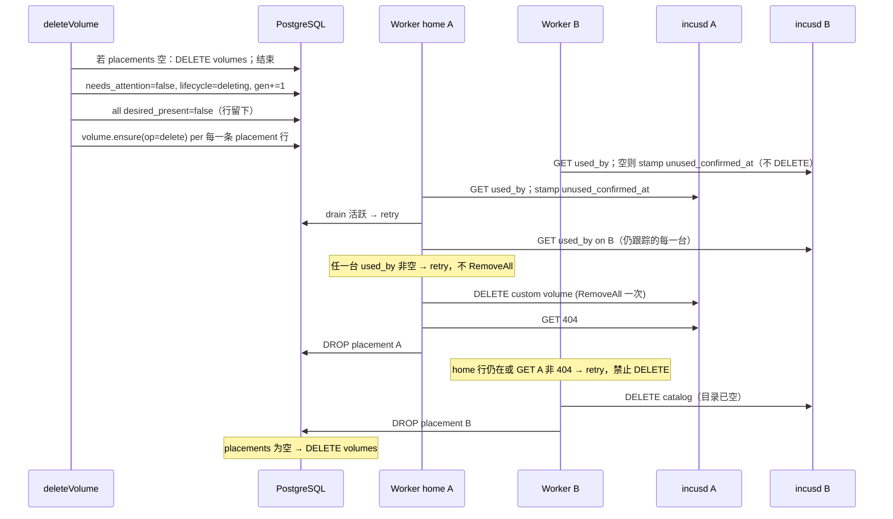
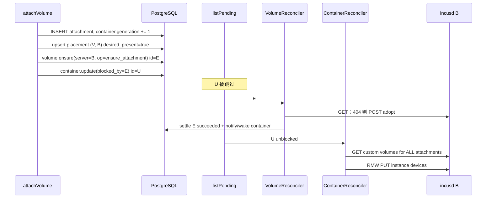

# Incus 控制面共享卷与收敛缺陷的系统性修复

| 字段 | 值 |
| --- | --- |
| 状态 | Draft（rev 4） |
| 作者 | TBD |
| 日期 | 2026-08-27 |
| 仓库 | `/root/nyabase` |
| 基线架构 | `plans/incus-architecture.md` |
| 产品状态 | **未发布**。无兼容、无双写、无遗留别名、无旧行为 feature flag。允许直接重写 `packages/backend/src/persistence-pg/migrations/000001_initial.sql`。 |

---

## Overview

当前控制面把共享 CephFS 卷当成「一行 `control.volumes` + 若干带 `request_json.targetServerId` 的 `volume.ensure`」来驱动。这与 Incus 的真实拓扑不匹配：两台 standalone `incusd` 各自有独立的 custom volume **catalog**，但同一 `identity_key`（`cephfs:{cluster}/{source}/{path}`，见 `deriveSharedBackendIdentity`）下它们指向 **同一 CephFS 目录**。由此产生三个 P0 缺陷，外加一个会把「修 P0-3」变成删数据的陷阱：

1. 共享卷删除在**第一台** Incus 删掉 catalog 条目后立刻 `DELETE FROM control.volumes`，其余副本成为孤儿。
2. `VolumesService.attachVolume` 在同一事务里创建 `volume.ensure` 和 `container.update`，worker `listPending` 全局 `created_at DESC`，container 先跑；目标 Incus 上还没有卷 → HTTP 400 `INCUS_BAD_REQUEST` **managed_failure**。PG 里 attachment 已存在，期望态与实际态分裂。
3. `VolumeReconciler.scan` 对所有「本机看得到该 CephFS 后端」的服务器 `ensurePending`，把 **catalog 条目**乘到每一台能看见后端的主机上。

更关键的物理事实：**Incus `cephfs` 的 `DeleteVolume` 对共享路径做 `os.RemoveAll`。** 在 server B 上 DELETE 同名 custom volume，会删掉 server A 的 catalog 仍指向的那份目录。因此：

- 非 home 的 retract / scan extras **禁止**对仍存在的逻辑卷调用 Incus DELETE。
- Catalog 在逻辑删除之前是 **grow-only**。
- 逻辑删除时 `RemoveAll` 只允许发生 **一次**（home），其余 catalog 在目录已空后再清。

本方案引入显式 **placement**：`control.volume_placements.desired_present` 是 reconciler/scan 读取的**唯一权威**。声明锁与意图按 `(resource, placement_server)` 粒度运行。PG 卷行只在 placement 表为空后删除。挂载用一层前置意图 + 容器侧「卷尚未出现 → retry」+ settle 时唤醒依赖者。顺带修 GPU 唯一约束、管理员代建容器的 `ownerId`、以及意图队列的全局 newest-first。

---

## Background & Motivation

### 已成立且保持不变的前提

- 控制面 HTTPS + mTLS 直连每台 standalone Incus；**没有 nyabase Agent**。
- 期望态 + 意图在 PostgreSQL；worker 读实际态收敛（`plans/incus-architecture.md` §5）。
- 本地卷与本地容器生命周期是正确的；本方案只在共享卷与之共用的代码路径上改动。
- 可共享驱动**只有 `cephfs`**（S9 / §3.4）。custom volume 一律 `filesystem` + `security.shifted=true`。
- `PUT /1.0/instances/<n>` 是真替换，必须 RMW + `If-Match`（本方案不改这条路径的语义，只在挂盘前增加「卷存在」门闩）。
- 惰性卸载：`control.volume_detach_drains` 360s 窗口保留。

### CephFS：catalog 条目 ≠ 数据副本

`infra.shared_backends.identity_key` 由 `deriveSharedBackendIdentity` 合成：`cephfs:{cephfs.cluster_name}/{source}/{cephfs.path}`。两台 standalone `incusd` 登记到同一 key，挂载的是**同一 POSIX 目录树**。

Incus `cephfs` 驱动（`internal/server/storage/drivers/driver_cephfs_volumes.go`，与历史 LXD 同构）：

| 操作 | 驱动行为 | 两台 standalone 共享同一 `identity_key` 时 |
| --- | --- | --- |
| `CreateVolume` | 在池的 CephFS 路径下 `mkdir` 卷目录（目录已存在时：或跳过并继续写本地 DB，或 `EEXIST` 且**不**插入本地 catalog） | 第二台 POST 是「在本地 catalog 登记已存在的目录」，不是复制字节 |
| `DeleteVolume` | `os.RemoveAll` 该卷目录，再删本地 catalog | **任何一台**的 DELETE 都会毁掉另一台 catalog 仍指向的数据 |

因此「B 的 replica」这个词在本文件里**只表示 B 的 Incus catalog 行**，不表示第二份数据。D2 旧稿「删 B 的 replica、数据留在 A」在未证明 DELETE 非破坏之前 **不成立**；本修订按「未证明 = 破坏性」设计。

人工 CephFS 证明（上线前必须跑，见 Tests；**假池 e2e 不算**）：

1. 在 A 上 create `nyv-*`，写文件 `probe`。
2. 在 B 上 POST 同名 custom volume。
3. **通过条件：** B 的 GET 200，且从 B 能读到 `probe`（catalog 采纳成功）。
4. 在 B 上 DELETE 该 volume。
5. **若 A 上 `probe` 消失：** 证实 RemoveAll 跨 daemon。本 RFC 的 grow-only **必须**落地。方案默认这条为真。
6. 若（5）文件仍在：grow-only 仍然正确（偏保守），**照常发布**；另开 RFC 才讨论非 home 提前 DELETE。不把「文件还在」当成停发条件。

第二台 catalog 的填充（attach-to-B）见 §1「Adopt」。若 POST 不能在目录已存在时写入 B 的 catalog，attach-to-B 在该 Incus 版本上不可用，必须变成明确的 `VOLUME_CATALOG_ADOPT_FAILED`，而不是无限 retry。

### 当前实现如何把共享卷做错

逻辑卷一行，`server_id IS NULL`，`shared_backend_id` 非空。跨服务器操作把目标塞进 `request_json.targetServerId`，同时 **强制 `intents.server_id` 为 NULL**（`IntentRepository.createPending`）：

```361:373:packages/backend/src/runtime/intent.repository.ts
    if (input.resourceType === IntentResourceType.Volume) {
      // ...
      if (volume?.shared_backend_id !== null && volume?.shared_backend_id !== undefined && serverId) {
        throw new Error('Shared volume intents cannot carry a server id');
      }
```

`control.reconcile_claims` 主键是 `(resource_type, resource_id)`。不同 `targetServerId` 的删除意图争夺**同一把锁**。`VolumeReconciler.reconcile` 在 `lifecycle_phase = 'deleting'` 且本机 `actual` 仍在时：删 Incus 对象 → **立刻删 PG 行**（`packages/backend/src/runtime/volume-reconciler.service.ts` 约 280–345 行）。`otherIntent` 屏障只在 `!actual` 时运行；`settleForObservedGeneration` 又按 `targetServerId` 过滤，所以其它服务器的删除意图不会被这次成功结算。

扫描路径同样把「能看见后端」当成「应该有 catalog」：

```220:240:packages/backend/src/runtime/volume-reconciler.service.ts
    for (const row of rows) {
      const localHere = row.server_id === serverId;
      const sharedHere = row.shared_backend_id !== null
        && sharedBackendsHere.has(row.shared_backend_id);
      // ...
      await this.intents.ensurePending({
        kind: 'volume.ensure',
        request: {
          source: 'full_scan',
          ...(row.shared_backend_id ? { targetServerId: serverId } : {}),
        },
      });
    }
```

挂载路径（`VolumesService.attachVolume`）先 `ensurePending(volume.ensure)` 再 `createPending(container.update)`。worker `IntentRepository.list` 以 `created_at DESC` 取 pending，后创建的 `container.update` 先执行。本地挂载没事（卷已在该 Incus 上）；共享挂载会打到缺失的 custom volume。`mapIncusApiFailure` 把 HTTP 400 映射为 `INCUS_BAD_REQUEST` / `managed_failure`（`packages/backend/src/incus/incus-errors.ts`），用户看到终态失败，卷随后出现，attachment 行已经在 PG。

GPU：`control.container_gpu_claims` 只有 `UNIQUE (container_id, gpu_pci_address)`。应用层 `claimedGpuAddresses` 在 serializable 事务里过滤 `lifecycle_phase NOT IN ('failed','deleting')`，但**行仍在**。管理员创建容器没有 `ownerId`，`createForAdmin` 用 `actorId` 当 `owner_id`。

### 痛点

- 共享卷删除会丢控制面真相；若按「每台都 DELETE」还会丢 CephFS 数据。
- 共享挂载是竞态，不是确定性工作流。
- 扫描制造多余 catalog，再 DELETE 会放大数据丢失半径。
- GPU 互斥不是数据库不变量。
- 管理员无法给用户建容器（卷已经可以）。

---

## Goals & Non-Goals

### Goals

1. 给出共享卷的 **placement 模型**：哪台 Incus 必须有 catalog、扫描如何收敛、何时允许 Incus DELETE、何时丢 PG 行。
2. 声明锁粒度允许**不同容器并行**，且**禁止**在任一 placement 行仍存在时删除逻辑卷行。
3. 意图模型在崩溃恢复与队列顺序下，共享卷删除/扩缩容都正确，且非 home DELETE 不会 `RemoveAll` 仍在使用的目录。
4. 共享挂载不能把「卷还在 provision」变成用户可见的终态失败；失败路径也要可恢复。
5. 替换全局 newest-first 作为 worker 的唯一排序（公平性；**不**单独关闭 P0-2）。
6. GPU：`UNIQUE (server_id, gpu_pci_address)`，并与 failed/deleting 的声明释放语义对齐。
7. 管理员创建容器必须带 `ownerId`；物理容量策略对齐卷的 admin 路径（active-user 检查是额外收紧，见 §7）。
8. 直接改 `000001_initial.sql`；类型、函数、错误码可落地。
9. 列出必须改/新增的测试，含 CephFS 破坏性证明。

### Non-Goals（明确不重新设计）

- Capability vs grant 两层 IAM。
- 撤销拦截 vs 到期清理。
- Incus instance PUT 的 RMW / If-Match 机制本身。
- 控制面 IPAM + guest exec 写 IP（N1 现为 unmanaged bridged vmbr，见 `plans/incus-architecture.md`；不要复活 routed）。
- 重新引入 Agent。
- 本地卷 create/resize/attach/detach 的语义（除非共享卷改动碰到同一段代码）。
- Feature flag / 双路径 / 兼容别名。
- Incus cluster、VM、快照、OCI 镜像。
- 把 bridged vmbr 换成 routed。
- Worker 每次 reconcile 重新检查 grant。
- 通用工作流引擎（没有任意 DAG、没有多级补偿事务）。

---

## Key Decisions

| # | 决策 | 理由 |
| --- | --- | --- |
| D1 | **保留一行逻辑卷 + 新增 `control.volume_placements`**（方案 A）。拒绝「每台服务器一行 `control.volumes`」。 | 共享卷是一个配额对象、一个名字、S10 下同一用户多挂载。各 Incus 上的对象是 **catalog 行**，不是第二份逻辑卷。 |
| D2 | **CephFS catalog 在逻辑删除前 grow-only。** Home = `volumes.pool_id` 所在服务器，是初始 catalog 与 **唯一** 允许 `RemoveAll` 的 placement。非 home retract = `desired_present=false` **且保留 placement 行**（`observed_present` 可仍为 true）。**禁止**在对应 Incus catalog 仍存在、且逻辑卷仍存在时 `DELETE volume_placements`。Scan extras 禁止 Incus DELETE。`desired_present` 是 reconciler/scan 的唯一权威；计算函数不含 inflight 意图。 | 丢掉 PG 行会让 B 的 catalog 变成无主缓存：home `RemoveAll` 看不见 B 的 `used_by`，scan 也可能先丢掉 home 行。跟踪缓存才能在销毁前问遍每一台 catalog。 |
| D3 | **声明主键改为 `(resource_type, resource_id, placement_server_id)`。** 每条共享卷意图带真实 `server_id`。证书轮转使用哨兵 UUID。`reconcile_claims.server_id` **`ON DELETE RESTRICT`**。 | 不同 Incus 上的 catalog 必须能并行收敛。`request_json.targetServerId` 不再是身份键，直接删掉。SET NULL 会破坏 `server_id = placement_server_id` CHECK。 |
| D4 | **一条意图对应一个 `(volume, placement server)`。** Resize 只打 `desired_present=true` 的 placement。逻辑删除：零 placement 则当场删 PG 行；否则 `needs_attention=false`、全部 `desired_present=false`，并为**每一条仍在的 placement 行**（含 cache）入队。Incus `RemoveAll` 仅 home，且必须先确认所有仍跟踪 catalog 的 `used_by` 为空。Placement 行只在该台 catalog GET 404 之后删除。 | 与 D2/D3 对齐。失败/attention 卷走同一条 home 销毁路径，不遗弃。 |
| D5 | **挂载因果：`(a)` 凡带 attachments 的 container create/update 都 preflight；PUT 外包 `isMissingCustomVolumeError` → retry；`(c)` 单层 `blocked_by_intent_id`。Settle 成功/级联失败时 `pg_notify`+`wake` 依赖资源。** | 用户已经接受 202。多 worker 下 FIFO 挡不住并行（不同 `resource_id`）。Wake 必须在 settle 里做，否则依赖者要等 60s 扫描。 |
| D6 | **Worker `listPending`：`ready_at ASC, created_at ASC, id ASC`。** HTTP 意图历史保持 newest-first。FIFO **不是** P0-2 的修复。 | Newest-first 会饿死无关资源。P0-2 只在 PR 5（blocked_by + preflight + PUT 包装）后关闭。 |
| D7 | **GPU：`UNIQUE (server_id, gpu_pci_address)` + 容器进入 `failed`/`deleting` 时删除 claim 行（触发器 + 应用层）。** Grant-expiry purge 依赖 phase 触发器或容器行 `ON DELETE CASCADE`，无单独 GPU 路径。 | 部分唯一索引无法 join phase。行留着会让 UNIQUE 挡住重试。 |
| D8 | **管理员创建容器：`ownerId` 必填；用户创建禁止 `ownerId`。** 容量：admin 覆盖用户额度，仍检查池物理容量、GPU 运行时、GPU UNIQUE。Owner 必须存在且 `active`——这是**比卷更严**的检查，不宣称与卷完全同口径。用户 `POST /volumes` 带 `ownerId` 改为 400（行为变化，一并收紧）。 | 卷 admin 已覆盖用户 grant（`volumes.capacity.pg.test.ts`）。不要发明第二种配额政策。 |
| D9 | **直接改 `000001_initial.sql`。** 回滚 = 还原 PR / 从备份恢复库。 | 产品未发布（架构文档 A5）。 |
| D10 | **不把 `volume.ensure` / `volume.resize` 合并。** ensure = 该 placement 上「catalog 存在且 size=X」；resize = 用户可归因的扩缩容。`ensurePending` 匹配含 `kind` + `operation` idempotencyKey。 | 现状两种 kind 都在用；不按 kind 匹配会把 pending resize 当成 attach ensure。 |

---

## Proposed Design

### 1. Placement 模型

共享卷的**逻辑对象**仍是 `control.volumes` 一行（`server_id IS NULL`，`shared_backend_id` 非空，`incus_name = nyv-<uuid32>` 全局稳定）。

共享卷的**物理对象**分两层：

1. **字节：** 一份 CephFS 目录（由 home 上的第一次 `CreateVolume`/`mkdir` 创建）。
2. **Catalog：** 每台需要挂载的 Incus 上的一条 custom volume 记录（grow-only，直到逻辑删除）。

```sql
CREATE TABLE control.volume_placements (
    volume_id uuid NOT NULL REFERENCES control.volumes(id) ON DELETE CASCADE,
    server_id uuid NOT NULL REFERENCES infra.servers(id) ON DELETE RESTRICT,
    pool_id uuid NOT NULL REFERENCES infra.storage_pools(id) ON DELETE RESTRICT,
    desired_present boolean NOT NULL,
    observed_present boolean,
    observed_generation integer,
    unused_confirmed_at timestamp with time zone,
    created_at timestamp with time zone DEFAULT clock_timestamp() NOT NULL,
    updated_at timestamp with time zone DEFAULT clock_timestamp() NOT NULL,
    PRIMARY KEY (volume_id, server_id),
    CONSTRAINT volume_placements_observed_generation_check
        CHECK (observed_generation IS NULL OR observed_generation > 0)
);
```

`pool_id` 是该服务器上映射到同一 `shared_backend_id` 的已登记 cephfs 池（本地卷则等于 `volumes.pool_id`）。范围由约束触发器强制（见 Data Model）。

#### 权威：`desired_present`，不是计算函数

**Reconciler 与 scan 只读 `volume_placements`。** 它们不查询 intents，也不计算「inflight ∪ attachments」。

API（及 scan 的**写**路径）用纯函数决定**要写进表里的值**：

```
function placementServersToDesire(V):  -- 不含 inflight
  if V.lifecycle_phase = 'deleting': return ∅
  if V.server_id IS NOT NULL: return {V.server_id}          -- 本地
  home = storage_pools.server_id WHERE id = V.pool_id
  if V.lifecycle_phase = 'failed': return {home}            -- 不扩散；也不从 home 拆 catalog
  live = { C.server_id |
             volume_attachments A JOIN containers C
             WHERE A.volume_id = V.id
               AND A.detach_drained_at IS NULL
               AND C.lifecycle_phase ∉ {failed, deleting} }
  return {home} ∪ live
```

谁写表：

| 调用方 | 写什么 |
| --- | --- |
| `createVolume` | upsert home，`desired_present=true` |
| `attachVolume`（共享，目标 server S） | upsert `(V,S)` `desired_present=true`（与 ensure 意图同一事务） |
| `detachVolume` 卸掉 S 上最后一条 live attachment | 若 S 不是 home：`desired_present=false`，**行留下**（cache）。`observed_present` 保持。忽略仍 pending 的 ensure。不发 Incus DELETE，也不 `DELETE` placement 行。 |
| `deleteVolume` | `needs_attention=false`；`lifecycle_phase='deleting'`（从 `failed` 也可）；全部 `desired_present=false`；**对每一条仍在的 placement 行**入队 delete。零行则当场 `DELETE volumes`。 |
| scan 发现「该在 S 上 desired（按上面纯函数）但无行」 | 先 upsert `desired_present=true`，再 `ensurePending`（补 API 崩溃）。**禁止**因为看见一个 pending scan 意图就把 S 算进期望集。 |

`failed` 卷：home 行保留且 `desired_present=true`；已有的非 home cache 行保留为 `desired_present=false`。Scan **不得** Incus-DELETE 它们。用户删除失败卷走与正常卷相同的 home 销毁路径（`deleteVolume` 清 `needs_attention`）。

Detach 竞态：attach 插入 pending ensure 且 `desired_present=true` → 用户在 ensure 结算前 detach → B 置 `desired_present=false` **行仍在** → ensure 读到 false：若 catalog 尚未出现则只把 `observed_present=false` 留下行；若已出现则 `observed_present=true`。`observed_generation` 提升忽略 `desired_present=false`，cache 不卡住 generation。

#### Catalog 生命周期（共享卷）

```
                    ┌─────────────┐
 create on home     │ catalog A   │  mkdir 目录（唯一数据）
                    └──────┬──────┘
                           │ attach to B
                           ▼
                    ┌─────────────┐
 adopt on B         │ catalog B   │  POST；目录已存在 → 只登记本地 DB
                    └──────┬──────┘
                           │ last detach on B
                           ▼
                    desired_present=false
                    PG placement B 留下（observed_present=true，cache 被跟踪）
                           │
                           ▼
                    用户 DELETE 逻辑卷（fan-out 到 A 与 B 两行）
                           │
              每台先确认本机 used_by 空（stamp unused_confirmed_at）
              home 再 GET 所有仍跟踪 catalog 的 used_by
                           │
              home Incus DELETE（RemoveAll 一次）→ GET A 404 → DROP placement A
                           │
              非 home：home 行已空 AND GET A 404
              再 Incus DELETE（目录已空，清本地 catalog）→ DROP placement B
                           │
                    placements 为空 → DELETE control.volumes
```

**硬不变量（测试锁定）：**

1. `lifecycle_phase ≠ 'deleting'` 时，worker **不得**对共享卷调用 `deleteStorageVolume`，也 **不得** `DELETE` 任何 `volume_placements` 行。
2. `lifecycle_phase = 'deleting'` 时，只有 **home** 可以在目录仍可能有数据时调用 `deleteStorageVolume`，且须先确认**每一条仍跟踪的 catalog** `used_by` 为空、排空窗已过。不另查 pending detach 意图。
3. 非 home 的 `deleteStorageVolume` 仅允许在 **home placement 行已不存在 AND GET home 404**（RemoveAll 已观测）之后，作为 catalog 收尾。
4. Scan 不得对「`control.volumes` 仍有该 `incus_name`」的 `nyv-*` 调用 `deleteOrphanVolume` / `deleteStorageVolume`。Scan **永不**丢掉 home 行或 `deleting` 卷的任何 placement 行。
5. `dropPlacementAndMaybeVolume` 只在该 placement 的 Incus catalog 已 GET 404 之后调用（逻辑删除路径）。Retract 不调用它。

本地卷不受 grow-only 约束：目录不共享，retract/delete 仍直接 Incus DELETE，并可在 catalog gone 后删 placement 行。

#### Adopt：在 B 上填充 catalog

`VolumeReconciler.ensure` 在 placement S 上、`desired_present=true`：

```
actual = GET pool/custom/incus_name
if actual: 对齐 size + security.shifted；写 observed_present=true
else:
  POST create (filesystem, size, security.shifted=true)
  if success: GET 确认
  else if isAlreadyExistsError(error):
    actual = GET
    if actual: 视为 adopt 成功（本地 catalog 已有）
    else:
      if (intent.attemptCount >= VOLUME_ADOPT_FAIL_AFTER_ATTEMPTS) { // 8
        return {
          outcome: 'failed',
          failure: volumeFailure('VOLUME_CATALOG_ADOPT_FAILED',
            'Incus did not adopt the existing CephFS directory into this daemon catalog'),
        };
      }
      return {
        outcome: 'retry',
        failure: volumeFailure('VOLUME_CATALOG_ADOPT_PENDING', '...'),
        retryAfterMs: boundedRetryDelay(intent.attemptCount),
      };
```

**Adopt 失败闭合是 `VolumeReconciler` 的策略，不是 worker 全局政策。** 今日 `boundedRetryDelay` 只把间隔封顶在 60s，`scheduleRetry` **无限**重试（唯一有次数上限的是 instance-lock busy-strike）。因此必须在 reconciler 里看 `intent.attemptCount`：同一意图第 8 次仍 GET 404 则 `outcome: 'failed'` / `FailureCode.VolumeCatalogAdoptFailed`。常量 `VOLUME_ADOPT_FAIL_AFTER_ATTEMPTS = 8`（与 delay 指数封顶同阶）。**不**改 worker 的通用 retry 循环。

`isAlreadyExistsError`：HTTP 409，或 400 且 error 文本含 `already exists` / `already exist` / `file exists` / `EEXIST`。

**若 Incus 在目录已存在时 POST 失败且不写 catalog（GET 仍 404）：** 公开 API 没有「把已有目录登记进本地 DB」的 import。控制面**不能**在无 Agent 的前提下自己改 Incus sqlite。此时 attach-to-B 在该版本上不可行，必须 `VOLUME_CATALOG_ADOPT_FAILED` 给用户/管理员，而不是假装 retry 会好。人工证明步骤 2–3 就是为了在真实 Ceph 上确认 POST 会 adopt。

CreateVolume 的 revert 路径若在 POST 失败时 `RemoveAll`，adopt 会变成数据丢失。人工证明必须包含：**B 的失败 POST 不得删掉 A 上的 `probe` 文件。** 若会删，共享挂载在该 Incus 版本上要整条禁用（`needs_attention` + 拒绝新的共享 attach）。本方案假定 mkdir-of-existing 失败是「返回错误、不 RemoveAll」；用证明测试守门，不在假池上假装覆盖。

#### 扫描收敛（每服务器一次，`VolumeReconciler.scan`）

对正在扫描的服务器 `S`：

1. 列出 S 上已登记池的 custom volumes。
2. **knownNames（防误删）：** 所有 `control.volumes.incus_name`，其中本地 `server_id=S`，**或** `shared_backend_id` 在 S 上有已登记 cephfs 池。含 `failed` / `deleting` / `needs_attention`。这比 desired 集合**更宽**，专门挡住「逻辑卷还在、本机不是 desired → 当孤儿 RemoveAll」。
3. 读 `volume_placements` 在 S 上的行（权威）。
4. **缺 catalog：**
   - 纯函数说 S 该 desired 但无 placement 行：先 upsert `desired_present=true`，再 `ensurePending`（`failed`/`deleting`/`needs_attention` 不扩散新 placement）。
   - 已有 `desired_present=true` 且 list 没有：`ensurePending`（补丢失 catalog）。
   - 已有 `desired_present=true` 且 list 有、但 `config.size` 或 `security.shifted` 与期望不符：`ensurePending`（**保留今天 `scanNeedsEnsure` 的 size/shifted 比较**）。`desired_present=false` 的 cache **不**为 drift 入队。
5. **cache（`desired_present=false`，逻辑卷仍在）：** **不** Incus-DELETE。写下 `observed_present`。**不** `DELETE` placement 行（含 home、含 `deleting`）。这是跟踪缓存，供销毁时枚举 `used_by`。
6. **无 PG placement 且不在 desired 纯函数中、但 knownNames 含该名字：** 共享卷 → **忽略**（不可登记为孤儿；也不可悄悄建行，除非步骤 4 的 desired 写路径）。本地卷 → 可按今天孤儿规则删（数据不跨机）。
7. **真孤儿：** `nyv-*` 且**全局** `control.volumes` 无此 `incus_name`，且 `used_by` 空 → `deleteOrphanVolume`。只在逻辑行已消失后才安全。
8. **`deleting`：** 不 orphan-delete、不丢任何 placement 行；对每条残留 placement `ensurePending(op=delete)`。永不丢掉 home 行。

这关掉 P0-3：看得见后端 ≠ 新建 catalog。未挂载卷只在 home 上由 create 产生 catalog。

`volumes.observed_generation`：**所有 `desired_present=true` 的 placement 都达到该 generation**。单个 placement 成功时只写 `volume_placements.observed_*`，再：

```sql
UPDATE control.volumes v
SET observed_generation = v.generation,
    lifecycle_phase = CASE WHEN v.lifecycle_phase = 'provisioning' THEN 'active' ELSE v.lifecycle_phase END,
    used_bytes = COALESCE($used, v.used_bytes),
    failure_code = NULL,
    needs_attention = false
WHERE v.id = $id
  AND v.generation = $generation
  AND v.lifecycle_phase NOT IN ('deleting', 'failed')
  AND NOT EXISTS (
    SELECT 1 FROM control.volume_placements p
    WHERE p.volume_id = v.id
      AND p.desired_present
      AND p.observed_generation IS DISTINCT FROM v.generation
  );
```

`used_bytes` 优先从 home placement 的 `GET .../state` 读。

### 2. 声明锁粒度

```sql
CREATE TABLE control.reconcile_claims (
    resource_type text NOT NULL,
    resource_id uuid NOT NULL,
    placement_server_id uuid NOT NULL,
    server_id uuid REFERENCES infra.servers(id) ON DELETE RESTRICT,
    worker_id text NOT NULL,
    lease_expires_at timestamp with time zone NOT NULL,
    claimed_at timestamp with time zone DEFAULT clock_timestamp() NOT NULL,
    CONSTRAINT reconcile_claims_resource_type_check
        CHECK (resource_type = ANY (ARRAY[
            'container','volume','image_assignment','server','certificate_rotation'
        ])),
    CONSTRAINT reconcile_claims_worker_check CHECK (length(btrim(worker_id)) > 0),
    CONSTRAINT reconcile_claims_placement_shape_check
        CHECK (
            (placement_server_id = '00000000-0000-0000-0000-000000000000'
                AND server_id IS NULL
                AND resource_type = 'certificate_rotation')
            OR (placement_server_id <> '00000000-0000-0000-0000-000000000000'
                AND server_id = placement_server_id)
        ),
    PRIMARY KEY (resource_type, resource_id, placement_server_id)
);
```

`intents.server_id` 已是 `ON DELETE RESTRICT`；claims 与之对齐。**禁止** `ON DELETE SET NULL`：会违反 CHECK，也会让 `MAX_ACTIVE_CLAIMS_PER_SERVER` 计数丢服务器。删服务器前必须先没有 claim（与没有 intent 相同）。

TypeScript：`NO_PLACEMENT_SERVER_ID = '00000000-0000-0000-0000-000000000000'`，在 `reconcile-claim.repository.ts`。

| 资源 | `placement_server_id` | 并发含义 |
| --- | --- | --- |
| container | 容器的 `server_id` | 不同容器并行（现状） |
| 本地 volume | 卷的 `server_id` | 与今天等价 |
| 共享 volume | 该 catalog 所在 Incus | 同一逻辑卷的两个 catalog 可并行 |
| image_assignment / server | 对应服务器 | 不变 |
| certificate_rotation | 哨兵 | `server_id IS NULL`，跳过每服务器上限 |

`MAX_ACTIVE_CLAIMS_PER_SERVER = 8` 按 `reconcile_claims.server_id` 计数。共享卷 ensure **计入目标 Incus 的 8**（今天 `serverId=null` 绕过上限是错误的）。

`ReconcileClaimRepository`：**claim / renew / release / startLeaseGuard / withLease 全部携带 `placementServerId`。** 今日 `renew`/`release` 只键 `(resource_type, resource_id, worker_id)`，复合主键后不带 placement 会续错副本或一次 release 错行。

- advisory lock：`reconcile-placement:${resourceType}:${resourceId}:${placementServerId}`。
- 每服务器容量锁：`reconcile-server:${serverId}`（哨兵跳过 `serverAtCapacity`）。
- `ON CONFLICT (resource_type, resource_id, placement_server_id)`。

pg 测试：`intent-claim.repository.pg.test.ts` —— 同一 volume 两个 placement 可同时 claim；renew/release 只影响对应 placement。

不选「一把 volume 锁、一次 reconcile 遍历所有 placement」：worker 一次 `processIntent` 只拿一个 `IncusClientPort`；串行 N 台会撑满 60s 租约。容器并行不受影响（`resource_id=containerId`）。

### 3. 意图模型

#### `control.intents` 变更

```sql
blocked_by_intent_id uuid REFERENCES control.intents(id) ON DELETE SET NULL

CONSTRAINT intents_resource_shape_check
    CHECK (
        (resource_type IN ('container','volume','image_assignment','server')
            AND server_id IS NOT NULL)
        OR (resource_type = 'certificate_rotation' AND server_id IS NULL)
    );

CONSTRAINT intents_blocked_by_check
    CHECK (blocked_by_intent_id IS NULL OR blocked_by_intent_id <> id);
```

删除「共享卷意图不得带 `server_id`」的应用断言：

- 本地卷：`serverId === volumes.server_id`。
- 共享卷：`serverId` 必须等于某条 placement 的 `server_id`（create 时是 home）。
- **禁止**再写 `request_json.targetServerId`。

`request_json.operation` 仍作展示摘要；**`ensurePending` 用显式 `idempotencyKey`**，避免同 generation 的 resize 被当成 attach ensure：

| operation | idempotencyKey | 何时 |
| --- | --- | --- |
| `create` | `create` | 建卷（home） |
| `ensure_attachment` | `ensure_attachment` | 挂载需要的新 catalog |
| `resize` | `resize`（kind=`volume.resize`） | 用户改 size |
| `delete` | `delete` | 逻辑删除 |
| `retract` | （不入队） | 非 home detach 只写 `desired_present=false`，保留行；无 volume 意图 |

匹配键：`(resource_type, resource_id, server_id, kind, target_generation, idempotencyKey)`。删除 `request_json->>'targetServerId'` 分支。Scan 补齐用 `ensure_attachment` 或 `create`（是否 home）或 size drift 时的 `ensure_attachment`；**不再**用会自指的 `physical:scan` 作为期望集的一部分。

Kind 不变：`volume.ensure` / `volume.resize`。

#### 结算

`settleForObservedGeneration` 增加必填 `placementServerId`（即 `intent.serverId`，证书轮转为 null）：

```
WHERE resource_type = $type
  AND resource_id = $id
  AND status = 'pending'
  AND target_generation <= $observed
  AND server_id IS NOT DISTINCT FROM $placementServerId
```

去掉 `request_json->>'targetServerId'`。

**同一事务内：**

1. 更新被结算的意图行。
2. 若 `outcome=failed`：把 `blocked_by_intent_id IN (刚失败的 id)` 且仍 pending 的意图标为 `VOLUME_PLACEMENT_FAILED`（只一层）。
3. `pg_notify('nyabase_reconcile', { resourceType, resourceId, serverId } of each unblocked or cascaded resource)` + `wake.wake(...)`。
   - ensure 成功 → wake **container**（依赖者），不只是 volume。
   - ensure 失败级联 → 同样 wake container，让 UI/worker 看到 failed，而不是永远 pending。

今日 `notifyReconcile` / `wake` 只在 `createPending`（`intent.repository.ts` ~433–443）。`executeRunOnce` 每轮 100 条且跳过 blocked 行；不 wake 的话依赖者要等 60s `fullScan`。这违反「用户操作靠 notify + 内存 wake」。

#### 删除：崩溃安全 + 跟踪全部 catalog



`deleteVolume` 同一事务（从 `failed`/`needs_attention` 也可以进来）：

```
lock volume
forbid live attachments (现有 hasAttachments)
if no placement rows:
  DELETE FROM control.volumes
  同事务 createPending + settleOne succeeded（可归因记录）
else:
  needs_attention = false          -- 否则 processIntent 直接 return，home 永不 RemoveAll
  lifecycle_phase = deleting       -- 覆盖 failed
  gen += 1
  UPDATE placements SET desired_present=false
  for each remaining placement row (home、cache、已经 false 的残留):
    createPending volume.ensure op=delete serverId=placement.server_id
```

操作员 retry 删除意图时同样把 `needs_attention=false`、phase 保持/改回 `deleting`。失败卷与正常卷走同一 home 销毁路径，不遗弃。

Scan 对 `deleting`：**不要** orphan-delete，**不要**删 placement 行；对每条残留行 `ensurePending(op=delete)`。`placementServersToDesire` 返回 ∅ 不表示「没有活」——活在仍在的 placement 行上。

每条 deleting placement 先在本机 stamp，home 再做跨 catalog 门闩：

```ts
if (row.lifecycle_phase !== 'deleting') {
  if (placement.desired_present === false) {
    // 共享 retract：禁止 Incus DELETE，禁止 DELETE placement 行
    return { outcome: 'succeeded', observedGeneration: row.generation };
  }
  // ensure/resize as usual
}

// deleting:
const drain = await findDetachDrain(row.id);
if (drain && drain.drained_at > now) {
  return retry('VOLUME_DETACH_DRAINING', { retryAfterMs: drain.drained_at - now });
}
if (await hasAttachments(row.id) || actual?.used_by?.length) {
  return retry('VOLUME_REQUIRES_DETACH'); // 仍挂着或 drain 竞态；不 fail，避免 writeFailure 干扰 deleting
}
await stampUnusedConfirmed(row.id, row.target_server_id); // unused_confirmed_at = now

const isHome = row.pool_server_id === row.target_server_id;
if (isHome) {
  const peers = await listPlacements(row.id); // 所有仍在的行
  for (const peer of peers) {
    const client = await this.clients.get(peer.server_id);
    let peerActual;
    try { peerActual = await client.getStorageVolume(...); }
    catch (e) { if (isNotFound(e)) continue; throw e; }
    if (peerActual.used_by?.length) {
      return retry('VOLUME_REQUIRES_DETACH', { serverId: peer.server_id });
    }
    if (peer.unused_confirmed_at == null) {
      return retry('VOLUME_DELETE_WAITING_IDLE');
    }
  }
  if (actual) {
    await deleteStorageVolume(...); // 唯一 RemoveAll
    await verifyAbsent(...);
  }
  await dropPlacementAndMaybeVolume(row.id, row.target_server_id);
  return succeeded;
}

// 非 home：home 行必须已消失，且 GET home 404（观测到 RemoveAll）
const homeRow = await placementExists(row.id, homeServerId);
if (homeRow) {
  return retry('VOLUME_DELETE_WAITING_HOME');
}
const homePlacement = await readHomePlacement(row.id); // pool_id 在 home 行上
const homePool = await poolIncusName(homePlacement.pool_id); // 不是 B 的本地池名
const homeClient = await this.clients.get(homePlacement.server_id);
try {
  await homeClient.getStorageVolume(homePool, 'custom', row.incus_name);
  return retry('VOLUME_DELETE_WAITING_HOME'); // 行没了但目录/catalog 还在 A
} catch (e) {
  if (!isNotFound(e)) throw e;
}
if (actual) {
  await deleteStorageVolume(...); // 目录应已空；清 B catalog
  await verifyAbsent(...);
}
await dropPlacementAndMaybeVolume(row.id, row.target_server_id);
return succeeded;
```

`dropPlacementAndMaybeVolume`：仅此路径。volume `FOR UPDATE`，删**这一台** placement 行；若 `deleting` 且零行剩余 → `DELETE volumes`。

Home 不可达：逻辑行留在 `deleting`，非 home 只 retry `VOLUME_DELETE_WAITING_HOME`，**绝不**抢先 RemoveAll。`VOLUME_DELETE_WAITING_HOME` **不**把卷标 `needs_attention`（否则又挡掉 home 的 delete ensure）。10 分钟告警指向 home placement 仍在；可选：仅对 **home** 意图在 N 次 retry 后 `needs_attention`（busy-strike 不适用于这条）。

**第二台 Incus client（一意图一 client 的仅有例外）：**

1. **Home 销毁前**扫每一条仍跟踪 placement 的 `used_by`（`this.clients.get(peer.server_id)`）。
2. **非 home catalog 收尾**时 GET home 404（`this.clients.get(homePlacement.server_id)`）。home 池名取 **home placement 的 `pool_id`** → `infra.storage_pools.incus_name`，不是本机（B）的池名。

`VolumeReconciler` 注入现有 `INCUS_CLIENT_FACTORY`（今日构造器只有 db / intents / audit；`context.client` 仍是本 placement 的那一台）。其余 ensure/resize/scan 仍只用 `context.client`。

**丢掉 `hasPendingDetachContainerUpdate`。** 今日 `container.update` detach 的 `request_json` 是 `{ operation: 'detach_volume', attachmentId }`，没有 `volumeId`，查起来要 join attachment。Home 已经对每台跟踪 catalog GET `used_by`，再加 360s `volume_detach_drains`，足够挡住惰性卸载；不给 detach 请求加字段。

销毁路径上的 `used_by` / drain / 仍存在的 attachments **一律 `retry`**，不要 `outcome: 'failed'`。否则 `markFailure` → `writeFailure` 会把卷打成 `failed` + `needs_attention`，`processIntent` 直接跳过，home RemoveAll 停摆。

`PgResourceStatusRepository.writeFailure`（volume）：若当前 `lifecycle_phase='deleting'`，**禁止**写成 `failed`；只写 `failure_code`（可选 `needs_attention`）。`processIntent`：**volume 且 phase=`deleting` 时即使 `needs_attention` 也继续跑**（否则 sibling cache 的 delete ensure 会冻住）。Adopt 失败（非 deleting）仍走今天的 `failed` + attention。

#### 扩缩容

`patchVolume` 只对 `desired_present=true` 的 placement 发 `volume.resize`。空表防御：至少 home。CephFS 的 `config.size` 是每台 catalog 一份，应对仍 desired 的 catalog 逐台写入（配额最终作用在同一目录上，多写是幂等对齐）。`decideVolumeResize` 不变。

### 4. 挂载因果（P0-2）



#### (c) 单层 predecessor

仅 attach：`ensurePending` 仍 pending → `container.update.blocked_by_intent_id = ensure.id`。已 succeeded（同 server 上该 volume 已有成功 ensure）则不设。

`listPending` 跳过未就绪 predecessor（`pred.status='succeeded'` 才放行）。

Predecessor failed：同事务级联 `VOLUME_PLACEMENT_FAILED` + wake。没有递归 DAG。Detach / limits / power 不使用 `blocked_by`。

#### 恢复矩阵

| 状态 | 谁来修 | 为何不能「再点一次挂载」 |
| --- | --- | --- |
| ensure pending，update blocked | worker；settle 成功后 wake container | — |
| ensure retry（服务器不可达 / adopt pending） | `scheduleRetry`；volume 未 `needs_attention` | attachment 已在，UNIQUE `(container_id, volume_id)` |
| ensure `needs_attention` / `VOLUME_CATALOG_ADOPT_FAILED` | 管理员清 `needs_attention` 后 `POST .../intents/:id/retry` **ensure** | `retry()` 对 volume 意图；成功后再 retry 或扫描唤醒 container。级联已经把 update 标 failed。 |
| update `VOLUME_PLACEMENT_FAILED`（ensure 终态失败） | 先修好 volume；再 `retry` **container.update**（`retry()` 不复制 `blockedByIntentId`，此时确保必须已经 present，否则 preflight 再 retry） | 再 `POST attach` → `volume_attachments_pair_unique` 冲突。**重挂不是 API。** 文档/前端走意图 retry。 |
| update `VOLUME_PLACEMENT_PENDING` retry | worker；卷一出现即成功 | 意图保持 pending，用户不看到 failed |
| 无 predecessor 的 retry 副本（`retry()` 只克隆 request JSON） | preflight + PUT 包装仍把缺卷映射为 retry | FIFO/blocked_by 覆盖不了这条，所以 (a) 必须对**所有**带 attachment 的 create/update 生效 |
| 卷 `failed` / `needs_attention`，用户要删 | `deleteVolume` 置 `needs_attention=false`、`lifecycle_phase=deleting`，对**每一条** placement 入队 delete | 不是 retry 旧 ensure；删除走 home 销毁路径 |
| `VOLUME_DELETE_WAITING_HOME` | home 不可达时非 home 一直 retry；**不**标 volume attention | 10 分钟告警盯 home；可选只给 **home** 意图打 attention |

`PgResourceStatusRepository.writeFailure`：volume 在 **非 deleting** 且 attention 时才把 `lifecycle_phase='failed'`。`deleting` 期间只记 `failure_code`，phase 不变。`processIntent` 对 `needsAttention` 直接 return 的规则对 **`lifecycle_phase='deleting'` 的 volume 无效**——删除 ensure 必须继续跑。非 deleting 的失败 ensure 仍不会自己好：清 attention 再 retry，或 `deleteVolume`（清 attention + 改 deleting）。

#### (a) 容器 reconciler

对 **`container.create` 与 `container.update`，只要 `readAttachments` 非空**，在 `readModifyWriteInstance` 之前：

```ts
await this.assertCustomVolumesPresent(client, attachments);
```

`MISSING_STORAGE_POOL`：若该共享后端在本 server 上有已登记 cephfs 池（API 挂载时已查过 `VOLUME_CROSS_SERVER_DENIED`），视为暂态 → retry `VOLUME_PLACEMENT_PENDING`。若池确实不在（`registered=false` 或 backend 不可见）→ 保持 `managed_failure`。

**PUT 包装（必须接线，不能只定义函数）：**

```ts
try {
  await readAfterTimeout(() => requestAndWait(client, (options) =>
    client.readModifyWriteInstance(expectedName, mutate, options)), ...);
} catch (error) {
  if (isMissingCustomVolumeError(error)) {
    throw new IncusError('VOLUME_PLACEMENT_PENDING', 'retry', {
      volumeId: '...',
      reason: 'put_toctou',
    });
  }
  throw error;
}
```

`isMissingCustomVolumeError` 放在 `incus-errors.ts`，由 **ContainerReconciler** 调用，**不**改 `mapIncusApiFailure`（避免把所有 400 变成 retry）。Worker `handleError` 只对 `disposition==='retry'` 重试；因此必须在 reconciler 里把 TOCTOU 400 转成 `VOLUME_PLACEMENT_PENDING`。

```ts
export function isMissingCustomVolumeError(error: unknown): boolean {
  if (!(error instanceof IncusError)) return false;
  if (error.code !== 'INCUS_BAD_REQUEST' && error.code !== 'INCUS_NOT_FOUND') return false;
  const text = String(error.details?.error ?? '').toLowerCase();
  return (
    (text.includes('storage volume') &&
      (text.includes('not found') || text.includes('no such') || text.includes('missing')))
    || (/failed to (start|create|add) device/.test(text) && text.includes('volume'))
  );
}
```

本地挂载：不创建 `volume.ensure`（`volumes.service.ts` 仅 `shared_backend_id` 才 ensure）。Preflight GET 本地已存在的卷是 no-op。

`attachVolume` 双 wake（volume + container）。Settle 再 wake 一次 container。

`VOLUME_PLACEMENT_PENDING` 只作为 `IncusFailureCode`，disposition=retry，**不**进入 `FailureCode` 枚举（用户不可见）。`VOLUME_PLACEMENT_FAILED` 与 `VOLUME_CATALOG_ADOPT_FAILED` 进入 `FailureCode`（意图 failed / API 展示）。`VOLUME_DELETE_INCOMPLETE` 今日只是 reconciler 字符串，不是 enum 成员；删除主路径后不必加进 `enums.ts`。

### 5. 意图调度（P1-3）

拆分 `list` 与 `listPending`。API 历史仍 `created_at DESC`。

Worker `listPending`：

```
ready_at = COALESCE(next_attempt_at, created_at)
ORDER BY ready_at ASC, created_at ASC, id ASC
WHERE status='pending'
  AND (next_attempt_at IS NULL OR next_attempt_at <= now)
  AND blocked_by 已成功或为空
```

多 `runtime.role=worker` 副本下，volume ensure 与 container update 是不同 `resource_id`，**FIFO 不能阻止它们被两个 worker 并行 claim**。FIFO 只改善单进程内的顺序和无关资源饥饿。**P0-2 的关闭条件是 PR 5**，不是 PR 3。

索引：`intents_pending_ready_idx`（表达式 `COALESCE(next_attempt_at, created_at)` ASC）、`intents_pending_resource_idx`、`intents_blocked_by_idx`、`intents_history_idx`。删除今日 `intents_pending_idx (... created_at DESC)`，不要两套并存。

### 6. GPU 唯一性（P1-1）

```sql
UNIQUE (server_id, gpu_pci_address)   -- container_gpu_claims_server_pci_key
UNIQUE (container_id, gpu_pci_address) -- 保留，防同一容器重复行

CREATE FUNCTION control.release_gpu_claims_on_terminal_phase() ...
CREATE TRIGGER containers_release_gpu_claims
    AFTER UPDATE OF lifecycle_phase ON control.containers
    FOR EACH ROW EXECUTE FUNCTION control.release_gpu_claims_on_terminal_phase();
```

应用层 `releaseGpuClaims`：`transition` / `updateDesired` 进入 `failed`/`deleting` 时删除。`claimedGpuAddresses` 的 phase 过滤保留。

**Grant-expiry purge 没有单独的 GPU 路径。** 它把容器标 `deleting` 或删行：前者走触发器，后者走 `container_id ON DELETE CASCADE`。本方案不给 expiry worker 加第三套释放逻辑；测试用 raw SQL `UPDATE lifecycle_phase`（现有 pg 测试 167–179 行）锁定触发器。

冲突：`23505` → `FailureCode.GpuAlreadyClaimed`（替换今天误用的 `GpuRuntimeUnavailable`）。Admin GPU 路径同样走 `replaceGpuClaims` / insert，同一 UNIQUE。

### 7. 管理员创建容器 `ownerId`（P1-2）

`zCreateContainerRequest` 增加可选 `ownerId`。

| 入口 | `ownerId` | 行为 |
| --- | --- | --- |
| `POST /containers` | 出现 → `400 INVALID_INPUT` | `owner_id = actorId` |
| `POST /admin/containers` | **必填** 否则 400 | `owner_id = ownerId`，`created_by = actorId` |
| `POST /volumes`（用户） | 出现 → `400 INVALID_INPUT` | **行为变化**：今天 `zCreateVolumeRequest` 含 optional `ownerId` 且 `createForUser` 忽略它 |

Admin 容器：

1. Owner 用户存在且 `status='active'`，否则 404。**卷 admin 不检查 active**（只有 FK）。这是有意更严，不写「口径对齐」来形容这一条。
2. 不调用 `resolveContainerCreateAccessInTransaction`。
3. `assertRootCapacity(..., grantLimit=null)`：不消耗 owner 的 `disk_bytes`；池超分仍检查。对齐 `assertCapacityForDeltaForAdmin`。
4. GPU：跳过 owner GPU grant；检查 `gpu_runtime_available` + UNIQUE / `GpuAlreadyClaimed`。
5. 跳过 `assertComputeGrant`。
6. 镜像 assignment 仍须 active + fingerprint 匹配。

前端：用户 `CreateContainerDialog` 不得出现 `ownerId`。管理面最小代建对话框 POST `/admin/containers`。

---

## API / Interface Changes

无新 REST 路径。`CreateContainerRequest.ownerId` 可选。意图 DTO 只读 `blockedByIntentId?: string | null`。

```ts
export interface CreatePendingIntentInput {
  readonly blockedByIntentId?: string | null;
  readonly request?: Record<string, unknown> | null; // 含 idempotencyKey
}

export interface PhysicalSettlement {
  readonly outcome: 'succeeded' | 'failed';
  readonly failure?: IntentFailure;
  readonly placementServerId?: string | null;
}

export interface ClaimInput {
  readonly resourceType: IntentResource;
  readonly resourceId: string;
  readonly placementServerId: string;
  readonly serverId?: string | null;
  readonly workerId: string;
}

// incus-errors.ts — 仅 IncusFailureCode，非 FailureCode
| 'VOLUME_PLACEMENT_PENDING'      // retry
| 'VOLUME_CATALOG_ADOPT_PENDING'  // retry；第 8 次由 VolumeReconciler 改 failed
| 'VOLUME_DELETE_WAITING_HOME'    // retry；不标 volume needs_attention
| 'VOLUME_DELETE_WAITING_IDLE'    // retry
```

`FailureCode`（用户可见）：`VolumePlacementFailed`、`VolumeCatalogAdoptFailed`、`GpuAlreadyClaimed`。

`claimServerId`：volume 直接用 `intent.serverId`。删除 anchor 回落。

---

## Data Model Changes

全部写入 `000001_initial.sql`。

### `control.volume_placements`

见 §1。另加：

```sql
CREATE INDEX volume_placements_server_idx
    ON control.volume_placements (server_id, desired_present);
CREATE INDEX volume_placements_volume_desired_idx
    ON control.volume_placements (volume_id) WHERE desired_present;
CREATE INDEX volume_placements_pool_fk_idx
    ON control.volume_placements (pool_id);

CREATE TRIGGER volume_placements_touch_updated_at
    BEFORE UPDATE ON control.volume_placements
    FOR EACH ROW EXECUTE FUNCTION control.touch_updated_at();

CREATE FUNCTION control.assert_volume_placement_scope() RETURNS trigger ...
-- pool.server_id = NEW.server_id
-- 本地卷：pool_id = volume.pool_id 且 volume.server_id = NEW.server_id
-- 共享卷：pool.shared_backend_id = volume.shared_backend_id
--         AND pool.driver='cephfs' AND pool.shareable AND pool.registered

CREATE CONSTRAINT TRIGGER volume_placements_scope
    AFTER INSERT OR UPDATE OF volume_id, server_id, pool_id ON control.volume_placements
    DEFERRABLE INITIALLY DEFERRED
    FOR EACH ROW EXECUTE FUNCTION control.assert_volume_placement_scope();
```

`volume_id ON DELETE CASCADE`（与 attachments 的 RESTRICT 对照：删逻辑行前 attachments 必须已空；placement 随逻辑行走）。

### `control.intents`

- volume `server_id IS NOT NULL`。
- `blocked_by_intent_id` + CHECK + 部分索引。
- pending 索引替换为 ready ASC，删除旧 DESC pending 索引。

### `control.reconcile_claims`

- PK `(resource_type, resource_id, placement_server_id)`。
- `server_id ... ON DELETE RESTRICT`（不再 SET NULL）。
- placement shape CHECK。

### `control.container_gpu_claims`

- `UNIQUE (server_id, gpu_pci_address)`。
- 触发器 `containers_release_gpu_claims`。

### 不改

`volume_detach_drains`、`volume_attachments`、IAM、`authorization_dependencies`。`volumes_incus_name_key UNIQUE (incus_name)` 保留。

无后续迁移。

---

## Alternatives Considered

### A. 一行逻辑卷 + `volume_placements`（**采纳**）

逻辑身份 / 配额 C / S10 不动。Catalog 显式。扫描有权威集合。

### B. `volumes` 一行 per `(volume, server)`（**拒绝**）

破坏「一个配额对象」。与 `volumes_scope_check` 冲突。

### C. 只改 worker（**拒绝**）

claim PK、结算过滤、扫描权威、CephFS 禁止误 DELETE 都需要 schema/表。未发布却留错模型。

### 其它

| 选项 | 弃选 |
| --- | --- |
| 非 home Incus DELETE，赌数据留在 A | 与驱动 `RemoveAll` 相反；未做人工证明前禁止 |
| API 同步等 ensure | 把 REST 绑在 Incus 上 |
| 通用 depends_on DAG | 只有 attach 一条边 |
| 无 home，未挂载零 catalog | 逻辑删除前若任何 DELETE 都 RemoveAll，未挂载卷没有「安全的最后副本」策略以外的选择；home 就是那条初始 catalog |
| FIFO 当作 P0-2 修复 | 多 worker 并行不同 resource_id |

---

## Security & Privacy Considerations

| 威胁 | 处理 |
| --- | --- |
| 管理员代建写错用户 | `ownerId` 必填；owner `active`；`created_by`=actor |
| 用户伪造 `ownerId` | 用户入口 400 |
| 共享 catalog 出现在无授权服务器 | 只由 home ∪ live attachment 写入 `desired_present`；跨机挂载仍 `VOLUME_CROSS_SERVER_DENIED` |
| 非 home DELETE 毁掉共享目录 | D2 硬不变量 + 测试 |
| GPU 双分配 | UNIQUE + 终态删行 |
| `blocked_by` 外源 ID | 仅同事务指向刚插入的 ensure |
| 哨兵 UUID 当服务器 | CHECK 仅 certificate_rotation |

---

## Observability

- VolumeReconciler：`volume=%s server=%s desired_present=%s actual=%s destroyer=%s`。逻辑行删除单独一条。
- ContainerReconciler：preflight miss 为 info。
- Settle 时 log wake 的 dependent `resourceType/resourceId`。
- 指标：`VOLUME_PLACEMENT_PENDING` retry 次数（PR 5 后应接近 0）；`VOLUME_CATALOG_ADOPT_FAILED`；placement 行数 per server；GPU 409。
- 告警：`deleting` > 10 分钟且 home placement 仍在（home 不可达）；`VOLUME_CATALOG_ADOPT_FAILED`；container `INCUS_BAD_REQUEST` + `attach_volume`（门闩失效）。

---

## Rollout Plan

未发布，一次切库。无 flag、无 `targetServerId` 读路径。回滚 = revert + 恢复库。

人工验收（真 CephFS，假池不算）：

1. **破坏性证明（发布门闩，不反转）：** A create + 写文件 → B POST 同名 → B DELETE。
   - 文件在 A **消失** ⇒ 证实 RemoveAll 跨 daemon，**本 RFC 的 grow-only 是必需的**，按本文实现。
   - 文件在 A **仍在** ⇒ 本方案仍然安全（只是偏保守）；照常发布 grow-only。可选后续 RFC 再打开非 home Incus DELETE。
   - 另：**B 的失败 POST 不得删 A 上文件**；否则禁用共享 attach。
2. 功能：创建共享卷 → 仅 home 有 catalog → 挂 B → B GET 200 且能读文件 → 卸 B → **B catalog 仍在、PG placement 行仍在**（`desired_present=false`）、A 文件仍在 → 立即 `deleteVolume` 时若 B `used_by` 非空则 **不得** 对 A `deleteStorageVolume` → 排空结束后 home RemoveAll → GET A 404 后 B catalog 收尾 → PG 行消失。
3. 挂载在 ensure 完成前不得出现 failed 意图；settle 后 1s 级（wake）内 container 开始 reconcile，不等 60s 扫描。

---

## Risks

| 风险 | 严重度 | 缓解 |
| --- | --- | --- |
| 任何一台 Incus DELETE 毁掉共享目录 | P0 | Grow-only；仅 home 在逻辑删除时 DELETE；scan knownNames 含全部同 backend 的逻辑卷 |
| B POST adopt 失败且 GET 404，无法挂载 | P1 | reconciler 在 `attemptCount>=8` 时 failed，不靠 worker 无限 `scheduleRetry` |
| B POST 失败路径 RemoveAll | P0 | 人工证明「失败 POST 不得删 A 上文件」；失败则禁用共享 attach |
| FIFO 被当成 P0-2 修复 | P2 | PR 文案写明；关闭条件是 PR 5 |
| UNIQUE GPU + 漏删行 | P0 | 触发器 + 应用；raw SQL UPDATE phase 测试 |
| claim renew 漏 `placementServerId` | P1 | pg 测试两 placement |
| `blocked_by` 无 wake | P0（体验） | settle 同事务 notify+wake |
| 零 placement 的 deleting 永挂 | P1 | deleteVolume 当场删行；scan 对残留 placement 入队 delete，永不丢 home 行 |
| failed/attention 挡住 delete ensure | P0 | `deleteVolume` 与删除 retry 清 `needs_attention` |
| retract 丢掉 PG 行导致 home 看不见 B 的 used_by | P0 | cache 行保留直到该台 catalog 404 |

---

## Open Questions

全部拍板：

1. 未挂载共享卷是否在 home 留 catalog？**是**（grow-only 的初始条目；P0-3 仍关闭，因为不会扫到其它机器上 ensure）。
2. 非 home 可否在数据可能还在时 Incus DELETE？**否**。Home RemoveAll 并 GET 404 之后，非 home 可以 DELETE 空目录以清 catalog。
3. 期望集是否含 inflight？**否**。只写 `desired_present`。
4. Admin 是否消耗 owner 额度？**否**（物理池容量仍查）。active-user 是额外检查。
5. 不需要产品再问的 CephFS 行为：按破坏性默认；证明测试是发布门闩不是设计分叉。

---

## Tests

`describePg` 仍由 `NYABASE_TEST_DATABASE_URL` 门控。

### 必须新增

| 测试 | 文件 | 断言 |
| --- | --- | --- |
| 共享删除跨 2 服务器 | `volume-reconciler.pg.test.ts`（新） | 非 home **不得**在 home GET 非 404 时 `deleteStorageVolume`；home 成功后 PG volumes 行仍在直到最后一条 placement 空；零 placement 的 deleteVolume 当场删行。 |
| detach B 后立即 deleteVolume | `volume-reconciler.pg.test.ts` | fake Incus B 仍报 `used_by` 时 **不得**对 A `deleteStorageVolume`；`volume_detach_drains` 未过期同样挡住 home RemoveAll；B 的 placement 行在 detach 后仍在。 |
| scan 在 deleting 期间 | `volume-reconciler.test.ts` + pg | **不得** `DELETE` home placement 行；不得 orphan-delete 该 `nyv-*`；应对残留行 `ensurePending(op=delete)`。 |
| Adopt 第 8 次仍 404 | `volume-reconciler.test.ts` | `attemptCount >= 8` → `outcome: 'failed'` / `VOLUME_CATALOG_ADOPT_FAILED`；更少则 `retry` `VOLUME_CATALOG_ADOPT_PENDING`。**不**依赖 worker 耗尽 attempt。 |
| deleting 不被 markFailure 改成 failed | `reconcile-worker.service.test.ts` | `writeFailure` 在 phase=`deleting` 时保持 deleting；`processIntent` 仍处理该 volume 的 delete ensure。 |
| 非 home GET home 404 | `volume-reconciler.test.ts` | 第二台 client 打 **home placement.pool_id** 的池名；本机池名不同时不得误用。 |
| scan size/shifted | `volume-reconciler.test.ts` | `desired_present=true` 且 listed size ≠ desired → `ensurePending`；`desired_present=false` cache 即使 size 不同也不入队。 |
| 挂载竞态 + wake | `volumes.attachments.pg.test.ts`、`intent-claim.repository.pg.test.ts`、`container-reconciler.test.ts` | attach 写 blocked_by；listPending 在 ensure pending 时不返回 update；settle ensure **调用 wake(container)**；preflight 404 → `retry` `VOLUME_PLACEMENT_PENDING`；PUT 抛 `INCUS_BAD_REQUEST` 缺卷 → 同一 retry，不是 failed。 |
| GPU UNIQUE | `container-control.pg.test.ts` | 同 PCI 第二条 409 `GPU_ALREADY_CLAIMED`；SQL 第二行 23505；raw UPDATE phase 后 claims 无该 PCI。 |
| Admin ownerId | `container-control.pg.test.ts` | admin 无 ownerId → 400；owner_id/created_by 分离；owner 无 grant 仍成功；user 带 ownerId → 400；禁用用户 404。 |
| 用户 POST /volumes + ownerId | `volumes.capacity.pg.test.ts` 或 controller 测试 | 400（行为变化）。 |
| 两 placement 同时 claim / renew | `intent-claim.repository.pg.test.ts` | 同 volume 不同 `placementServerId` 可并行；renew 必须带 placement。 |
| CephFS 破坏性证明 | 人工清单 / `plans/incus-architecture.md` 验收项 | 见 Rollout；**不**用假池冒充。 |

### 必须修改

| 文件 | 原因 |
| --- | --- |
| `volume-reconciler.test.ts` | 无 `targetServerId`；gone volume 不删逻辑行除非零 placement；scan extras 共享路径不 delete、不丢 placement 行；deleting 时不丢 home。 |
| `intent.repository.test.ts` | FIFO；blocked_by；settle 按 server_id；settle **wake** 依赖；ensurePending 按 kind+idempotencyKey。 |
| `reconcile-claim.repository.ts` 单测 | `placementServerId` 贯穿 renew/release/lease guard。 |
| `reconcile-worker.service.test.ts` | 无 anchor fallback；volume deleting 时 skip-on-attention 关闭；`writeFailure` 不把 deleting 写成 failed。 |
| `container-control.service.test.ts` / api-contract / protocol.test.ts | ownerId、GpuAlreadyClaimed。 |
| `user-admin-isolation.surface.test.ts` | 用户面对话框仍无 ownerId。 |
| incus-errors 测试 | `VOLUME_PLACEMENT_PENDING` retry；`isMissingCustomVolumeError`；**不**把该码放进 FailureCode。 |

### 不必重做

本地 drain、macvlan/SSH/镜像。真 Ceph 不进假池 e2e。

---

## Schema 变更清单

在 `000001_initial.sql`：

1. 新表 `control.volume_placements`：PK、`updated_at`、`unused_confirmed_at`、`touch_updated_at` 触发器、`assert_volume_placement_scope` 约束触发器、`(server_id, desired_present)` 索引、desired 部分索引、**`pool_id` FK 索引**。
2. `intents.blocked_by_intent_id` + FK `ON DELETE SET NULL` + CHECK + `intents_blocked_by_idx`。
3. `intents_resource_shape_check`：volume 需要 `server_id IS NOT NULL`。
4. 替换 pending 索引（ready ASC）；**删除**今日 `intents_pending_idx` DESC；加 `intents_pending_resource_idx`、`intents_history_idx`。
5. `reconcile_claims`：`placement_server_id`、PK 三列、`server_id ON DELETE RESTRICT`、placement CHECK。
6. `container_gpu_claims`：`UNIQUE (server_id, gpu_pci_address)`。
7. `release_gpu_claims_on_terminal_phase` + `containers_release_gpu_claims`。
8. 不新增 intent kind；不保留 `targetServerId`。
9. Grant-expiry 不改表；依赖 GPU 触发器 / `ON DELETE CASCADE`。

---

## 实现要点（按模块）

### `VolumeReconciler`

- `target_server_id = intent.serverId`（必填）。
- 共享 + `desired_present=false` + 非 deleting → **禁止** Incus DELETE，**禁止**删 placement 行。
- 共享 + deleting：先 stamp `unused_confirmed_at`；home 在所有跟踪 catalog `used_by` 空且 drain 过了之后才 RemoveAll；非 home 等 home 行消失 **且** GET home 404（home 池名 = home placement.`pool_id`）。used_by/drain/残留 attachment 均 retry，不 fail。
- `dropPlacementAndMaybeVolume` 只在该台 GET 404 之后。
- adopt：POST；EEXIST → GET；仍 404 → retry `VOLUME_CATALOG_ADOPT_PENDING`；**同一意图 `attemptCount >= 8` 则 `outcome: 'failed'` / `VOLUME_CATALOG_ADOPT_FAILED`**（reconciler 内，不改 worker 无限 retry）。
- 注入 `INCUS_CLIENT_FACTORY`。Home 销毁与非 home GET-home-404 用第二台 client；home 池名来自 home placement.`pool_id`。
- `scan`：knownNames 含该 backend 上**所有**逻辑卷；`desired_present=true` 比较 size/shifted；永不丢 home / deleting 行。
- 写 `volume_placements.observed_*`，再提升逻辑卷（跳过 deleting/failed；忽略 `desired_present=false`）。

### `VolumesService`

- create：home placement + ensure `idempotencyKey=create`，`serverId=home`。
- attach：upsert `desired_present=true`；ensure `idempotencyKey=ensure_attachment`；`blockedByIntentId`；双 wake。
- detach：按 live attachments（**忽略 inflight**）把非 home 设 `desired_present=false`，**行留下**。无 volume retract 意图。
- delete：`needs_attention=false`；零 placement → 当场删行 + 同事务 succeeded 意图；否则全部 false + **每一条残留行**一条 delete ensure（含 cache）。
- resize：`desired_present=true` only。

### `IntentRepository` / claims / worker

- `listPending` FIFO + blocked_by。
- `settle*` 同事务级联失败 + notify/wake 依赖资源。
- claim/renew/release/lease 带 `placementServerId`。
- `processIntent`：`placementServerId: intent.serverId ?? NO_PLACEMENT_SERVER_ID`。volume + `lifecycle_phase='deleting'` 时不因 `needs_attention` 跳过。
- `writeFailure`（volume）：phase=`deleting` 时不得写成 `failed`。

### `ContainerReconciler`

- 任何带 attachments 的 create/update：`assertCustomVolumesPresent`。
- `readModifyWriteInstance` catch → `isMissingCustomVolumeError` → `VOLUME_PLACEMENT_PENDING` retry。
- 不改 RMW/If-Match。

### `ContainerControlService`

- ownerId 分流；active 检查；`GpuAlreadyClaimed`；`releaseGpuClaims`。

---

## References

- Incus `cephfs` 驱动：`CreateVolume` mkdir 共享路径；`DeleteVolume` `os.RemoveAll`（`internal/server/storage/drivers/driver_cephfs_volumes.go`，与 LXD 同构）。文档亦写明 remote 池上所有成员看见同一内容。
- `deriveSharedBackendIdentity`：`packages/backend/src/storage-pools/storage-pools.service.ts`
- `plans/incus-architecture.md` §3.4 / §5 / §7.6 / §10.2
- 文中引用的 reconciler / intent / claim / volumes / containers / `000001_initial.sql` / `incus-errors.ts`

---

## PR Plan

每个 PR 独立可审。GPU / ownerId 与 placement 并行。**P0-2 只在 PR 5 关闭。** `settleForObservedGeneration` 的签名只改一次。

### PR 1 — GPU UNIQUE + 终态释放

- **标题：** `fix(gpu): unique (server_id, gpu_pci_address) and drop claims on terminal phase`
- **文件：** `000001_initial.sql`；`container-control.repository.ts` / `service.ts`；`enums.ts`（`GpuAlreadyClaimed`）；pg/service 测试
- **依赖：** 无
- **内容：** UNIQUE、触发器、`releaseGpuClaims`、23505 映射。Grant-expiry 不改，测 raw UPDATE phase。不碰卷。

### PR 2 — 管理员创建容器 ownerId

- **标题：** `feat(containers): require ownerId on admin create`
- **文件：** rest-schema、protocol 测试、container-control service/controllers/tests、volumes 用户入口 forbid ownerId、manage-containers-page 最小代建、user-admin-isolation 测试
- **依赖：** 无（可与 PR 1 并行）
- **内容：** admin 必填；created_by=actor；物理容量覆盖；owner active 404（明确比卷严）；`POST /volumes` 用户带 ownerId → 400（**行为变化**）。Admin GPU 走同一 UNIQUE。

### PR 3 — FIFO `listPending` + `blocked_by` 列（非 P0-2 修复）

- **标题：** `fix(intents): FIFO listPending and blocked_by column`
- **文件：** `000001`（列 + ready 索引，删旧 DESC pending 索引）；IntentTable；`intent.repository.ts`（FIFO、ensure 匹配 kind+idempotencyKey；**本 PR 不改 settle 签名**）；list 仍 DESC
- **依赖：** 无
- **内容：** 排序拆分；列存在但 attach 还不写。**明确：多 worker 下 FIFO 不关闭 P0-2。** 不在本 PR 做 predecessor 级联（避免与 PR 4 的 settle 签名打架）。

### PR 4 — Placement、claim PK、CephFS grow-only 删除/扫描

- **标题：** `fix(volumes): placements and grow-only shared CephFS catalogs`
- **文件：** `000001`（placements 含 `unused_confirmed_at` + touch/scope/pool 索引 + claims PK + RESTRICT + intents.server_id 对 volume）；`volume-placement.ts`；volumes service/repo；`volume-reconciler.service.ts`（注入 `INCUS_CLIENT_FACTORY`；adopt 第 8 次 failed）；`runtime.module.ts`；`reconcile-worker.service.ts`（`writeFailure` 保 deleting；`processIntent` 对 deleting volume 不跳过 attention）；claim repository（placementServerId 贯穿）；worker `claimServerId`；**`settleForObservedGeneration({ placementServerId })` 一次改完，并在同一函数里做级联失败 + notify/wake**；`enums.ts` 的 `FailureCode.VolumeCatalogAdoptFailed`（与 reconciler 同 PR）；architecture.md §5.4/§10.2；pg 测试：跨 2 server 删除、detach 后立即删除时 B `used_by` 挡住 A、scan 在 deleting 时不丢 home 行、adopt 8 次失败
- **依赖：** PR 3 仅文件叠在 `000001` / `intent.repository.ts` 上。逻辑上不依赖 FIFO。Settle API **在本 PR 改**，PR 5 rebase。
- **内容：** D1–D4。Placement 行只在 catalog 404 后删除。Home 唯一 RemoveAll。`deleteVolume` 清 `needs_attention`。Adopt 失败闭合在 reconciler（`attemptCount>=8`）。deleting 期间 `writeFailure` 不得改 phase。第二 client：home `used_by` 扫描 + 非 home GET-home-404。Scan knownNames 宽于 desired，并对 `desired_present=true` 比较 size/shifted。去掉 `otherIntent` 与 `targetServerId`。

### PR 5 — 挂载因果（关闭 P0-2）

- **标题：** `fix(volumes): attach blocked_by, wake on settle, missing volume is retry`
- **文件：** `volumes.service.ts`（blocked_by、upsert、双 wake）；`volumes.attachments.pg.test.ts`；`container-reconciler.service.ts`（所有带盘的 create/update preflight + PUT 包装）；`container-reconciler.test.ts`；`incus-errors.ts`（`VOLUME_PLACEMENT_PENDING` 等 Incus 码 + `isMissingCustomVolumeError`）；`enums.ts` 的 `VolumePlacementFailed`（`VolumeCatalogAdoptFailed` 已在 PR 4）
- **依赖：** PR 3（列）、PR 4（placement + settle/wake 已在 settle 里）
- **内容：** D5。本地 attach 回归。无 predecessor 的 retry 仍靠 preflight。**这是 P0-2 的关闭 PR。**

合并后跑真 Ceph 人工清单。无需 flag。
