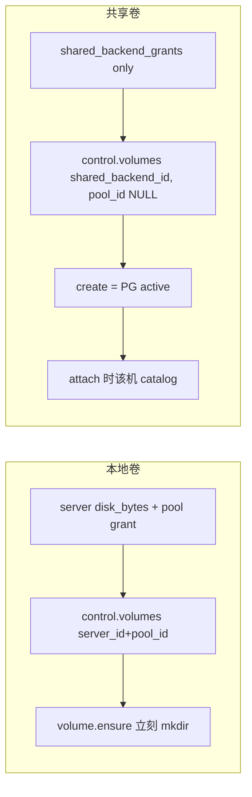
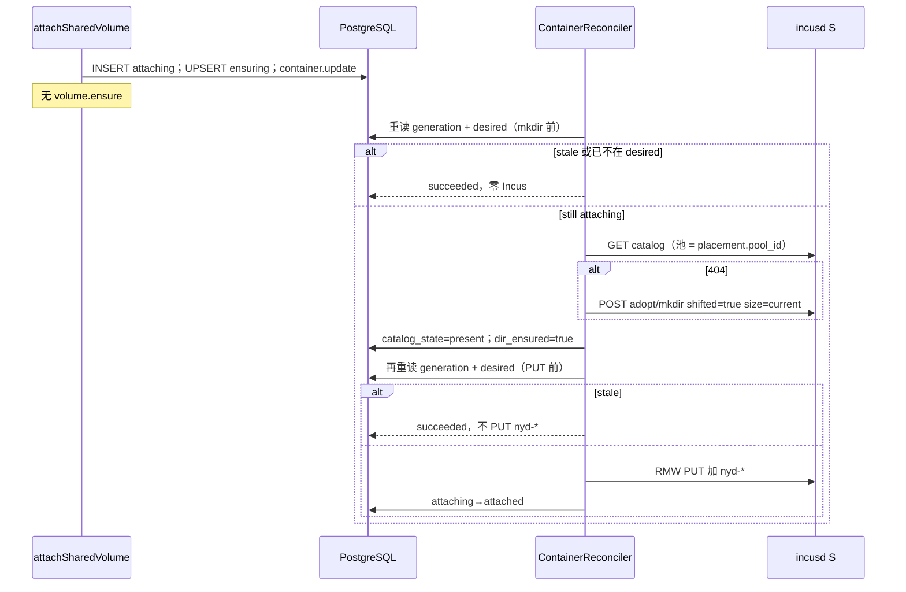
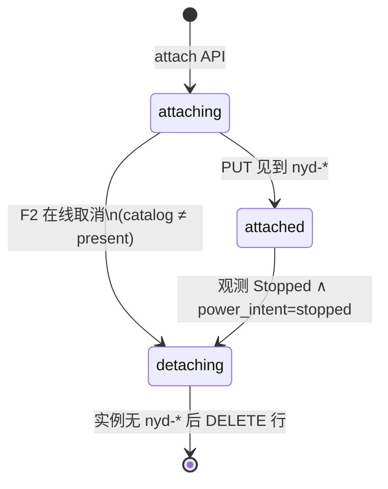
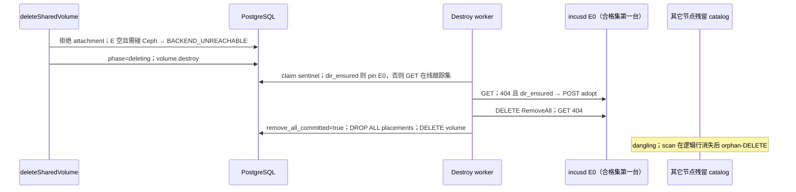

# 共享存储与本地存储彻底分家：后端绑定、惰性 catalog、对等销毁

| 字段 | 值 |
| --- | --- |
| 状态 | Implementing |
| 作者 | TBD |
| 日期 | 2026-09-07 |
| 仓库 | `/root/nyabase` |
| 基线 | equal-node 已在 main 落地（粘性 catalog、`volume.destroy`、`bind_state`、occupancy=PG、`purgeServerControlPlane`）。本文是其上的 **下一刀切**，不是从零重写 Incus 架构。 |
| 取代 | `plans/incus-shared-volume-equal-nodes.md`（保留文件；本文 Overview/References 标明取代。实现以本文为准。） |
| 产品状态 | **未发布**。无兼容、无双写、无 feature flag、无遗留别名。直接重写 `packages/backend/src/persistence-pg/migrations/000001_initial.sql`（000002/000003 仅在需要自洽时改）。回滚 = 还原 PR 栈。 |

---

## Overview

equal-node 切掉了假 home：共享卷不再绑死 `volumes.pool_id` 所在服务器，catalog 粘性保留到卷销毁或该机控制面 cascade，`volume.destroy` 用 sentinel claim 做至多一次 `DeleteVolume`（`os.RemoveAll`）。这套已经在 main 上跑。

它仍把共享卷做成「本地卷的跨机变体」：创建要选一台服务器上的池并立刻 `volume.ensure` mkdir；销毁门闩看 **跟踪集成员** 是否 `online`（`VOLUME_DELETE_SERVER_OFFLINE`）；list/create/admin cap/`ManageVolumes`/「数据卷」页把两种产品混在一起。物理事实与产品意图都不是这样。

**本轮落地（2026-09-07）**：equal-node 与共享 create=PG / 惰性 catalog / 对等销毁已在树里。本轮把 **CephFS 执行端从「存储池」产品拿掉**：存储池页与服务器池表只列本地盘；执行端登记改到「共享存储」卡片；授权「存储池」页只授本地池。不引入 Incus cluster、Agent、libcephfs。

本方案把它们做成 **两个产品**：

```
Local:  绑定一台服务器 + 一个非 shareable 池；计入 server disk_bytes；
        create = volume.ensure 立刻 mkdir（这份 catalog *就是* 这块盘）

Shared: 只绑定顶层 shared_backend；只计入 shared_backend_grants；
        无 server_id、无 pool_id；create = PG 配额预订，立即 active；
        某机第一次挂载才在该机 adopt/mkdir catalog
```

权限、REST、UI 全部分开。**用户/管理员 DELETE 卷**以及 **grant-expiry janitor** 的销毁改为：任意一台 **能看见该 CephFS** 的在线服务器即可（必要时 adopt），**一次** RemoveAll，然后丢掉全部 PG 状态。跟踪集成员离线不再挡删除。从未挂载过的卷（从未 mkdir）禁止为了删除去 POST catalog。**管理员删服务器仍只清控制面**（equal-node K6）：零 Incus 调用，不因跟踪集被抽空而入队 `volume.destroy`；最后一台 catalog 机离开后接受 Ceph 残留（K5）。

---

## Background & Motivation

### 保持不变（equal-node + `plans/incus-architecture.md`）

- 无 Incus cluster、无 Agent、无 home。控制面 HTTPS + mTLS 直连每台 standalone `incusd`。
- 可共享驱动只有 `cephfs`。Custom volume 一律 `filesystem` + `security.shifted=true`。
- PostgreSQL 是占用与 catalog 登记的唯一真相；不把 Incus `used_by` 当删除门闩。
- 卸载路径 **永不** `deleteStorageVolume`。唯一允许对「目录可能仍有数据」调用 `deleteStorageVolume` 的是 `volume.destroy`。
- 销毁与 placement 工作互斥：sentinel `VOLUME_DESTROY_PLACEMENT_ID`（`reconcile-claim.repository.ts`）。
- 管理员删服务器 = `ServersService.purgeServerControlPlane`，只清该机控制面，**零 Incus 调用**，不入队 `volume.destroy`；再加入 = 全新空白服务器；无 fencing。空跟踪集 + 残留 Ceph 接受（K5）。删服务器对话框文案保持今日：`server-detail-page.tsx`「不会对这台 Incus 做任何删除。……若只登记在这台上，控制面卷行会消失，Ceph 目录可能残留」。
- Grant-expiry 仍走 `UserServerResourcePurgeService`（机器还在集群里，会 Incus-mutate），且 **走 D**：意图是销毁卷，合格节点 adopt+RemoveAll。
- 跟踪集 ≠ 所有看得见该后端的服务器。Scan 不得因后端可见而发明 catalog。
- 无 360s drain，无 `volume_detach_drains`。
- `bind_state` 为 `attaching | attached | detaching`；占用 = 任意 attachment 行；API 永不删行，reconciler 在实例不再有 `nyd-*` 后删行。

### 今日 main 仍把共享卷做错的地方

创建（`VolumesService.createVolume`）对共享与本地同一条路：`resolveScopeCore` **要求** `scope.poolId`，upsert placement `ensuring`，入队 `volume.ensure` `op=create`。`zSharedVolumeScope` 仍强制 `poolId`。共享卷 `lifecycle_phase` 默认 `provisioning`（`VolumesRepository.insert`）。用户在「数据卷」里选 backend **再选一台机器上的池**，共享卷看起来「住在」那台服务器上。

挂载仍 `blocked_by` `volume.ensure`（`attachVolume` ~976–1000）。`ContainerReconciler.assertCustomVolumesPresent` 在 catalog 404 时抛 `VOLUME_PLACEMENT_PENDING`，自己不 mkdir。

销毁 API（`deleteVolume` ~745–758）对跟踪集任一 `status≠online` 返回 `VOLUME_DELETE_SERVER_OFFLINE`。Worker（`VolumeReconciler.reconcileDestroy`）GET-all **跟踪集** 后对 GET 200 的节点之一 RemoveAll，再逐台收尾。跟踪集里的离线机会挡住删除，即使另一台完全能看见同一 CephFS 的服务器在线且从未进入跟踪集。

卸载（`detachVolume`）三种 `bind_state` 无分支，运行中也可卸——与 GPU（`containerStatus(...) !== Stopped` → `GPU_CHANGE_REQUIRES_STOP`）以及产品「先停止容器」不一致。存储面板文案仍是「运行中的容器可以直接挂载或卸载数据卷」（`storage-panel.tsx`）。

权限：`AdminVolumesController` / `AdminContainerVolumesController` / `AdminVolumeIntentsController` 全部 `@RequireCaps(Capability.ManageVolumes)`。用户 `GET /volumes` 混排本地与共享。`volume-form-dialog.tsx` 用同一对话框切换 `scopeKind`。Grants 面板已有独立「共享存储」页，但卷产品本身没有分家。

Resize：`patchVolume` 在 `listPlacements` 为空时 409「A volume with no catalog registration cannot be resized」。本方案共享 create 不再 mkdir，从未挂载的卷必须允许纯 PG 改配额。

### 痛点

1. 共享卷创建绑池、绑机、立刻 mkdir，与「配额预订」产品相反。
2. 销毁被跟踪集成员离线卡住，明明有别的在线节点能 `RemoveAll`。
3. 从未挂载的卷若走「找一台 POST 再 DELETE」会无中生有地在 Ceph 上建目录。
4. 本地磁盘授权与共享后端授权在 API/UI/admin cap 上混用。
5. 运行中卸载与 GPU 产品不一致；API 不能 GET Incus 来判断「盘还没加上」。

---

## Goals & Non-Goals

### Goals

1. 共享卷只绑定 `shared_backend_id`。逻辑行 `server_id IS NULL AND pool_id IS NULL`。
2. 共享 create = 同一事务锁配额 + insert `active` + 返回 `SharedVolumeDto`。零 Incus，零 `volume.ensure`。
3. 某机第一次挂载（`container.update` / 带盘出生的 `container.create`）才在该机 GET 404 → POST adopt/mkdir。
4. **DELETE 卷**（及 grant-expiry）：占用门闩仍是任意 attachment；可达门闩改为 **零台** 在线且登记了该 backend 的 shareable cephfs 池。有执行者则 pin 一台、必要时 adopt、一次 RemoveAll、丢全部 PG placement（不再 GET-all 收尾）。**不**适用于管理员删服务器。
5. 从未 `dir_ensured` 且跟踪集空 → 纯 PG 删除，禁止为删而 POST。
6. 卸载 `attached`：观测已停止 **且** `power_intent=stopped`。`attaching` 且该机 `catalog_state≠present` 允许在线取消。K-proxy **不是**唯一门闩：mkdir/PUT 前必须重读 generation（F2-reread）。
7. 权限/API/UI 完整分家；新 cap `ManageSharedVolumes`。
8. Admin inspect 只读：cache vs in-use vs dangling。无 mutate 按钮。

### Non-Goals

- Incus cluster、Agent、home、fencing、360s drain、`used_by` 门闩。
- 组合「停止并卸载」动作（G1）。
- 通用 DAG 工作流、feature flag、双路径、遗留 `poolId` 别名。
- 改 `shared_backends.identity_key` 合成规则。
- 把 grant-expiry 并进服务器 cascade。
- 在本设计里给 dangling catalog 提供「一键修复 / 强制 DELETE」管理员按钮。

---

## Key Decisions

| # | 决策 | 理由 |
| --- | --- | --- |
| A | 共享卷绑定顶层 `shared_backend`，永不绑定 server / per-server pool。本地与共享在权限、API、UI 上完全分开。 | 共享字节在 CephFS 上只有一份；池只是某台 incusd 的 catalog 入口。混在 `/volumes` + `ManageVolumes` 会把共享卷画成「住在某台机器」。 |
| B1 | 共享卷 **没有** `volume.ensure`。Create 纯 PG。mkdir/adopt 只发生在挂载意图里（`container.update`，或带盘出生的 `container.create`）。 | 配额预订不是磁盘。Create 失败不该留下 `provisioning` 僵尸行。 |
| C1 | 粘性 catalog：最后一次卸载不撤回 catalog、不 `deleteStorageVolume`。Catalog 留到卷销毁或该机 `purgeServerControlPlane`。 | 已在 equal-node 落地；卸载 RemoveAll 会删掉仍被其它节点指向的目录。 |
| D | **范围：用户/管理员 `DELETE /shared-volumes/:id`，以及 grant-expiry janitor（意图是销毁该卷）。** 不要求跟踪集成员在线。**任意一台** `status=online` 且登记了该 `shared_backend_id` 的 shareable cephfs 池的服务器即可。必要时 adopt，**一次** `DeleteVolume`，再丢全部 PG 状态。新门闩：零台在线机器能看见该 CephFS。取代跟踪集上的 `VOLUME_DELETE_SERVER_OFFLINE`。 | 跟踪集只是 cache。执行者是「谁能看见这份 CephFS」，不是「谁曾经挂过」。 |
| D-never | **从未挂载**（`dir_ensured=false` 且零 placement）→ 纯 PG 删除，禁止 POST catalog 再删。 | Create 不再 mkdir，Ceph 上没有目录。POST 会无中生有。 |
| D-scope | **管理员删服务器保持 equal-node K6**：`purgeServerControlPlane` 零 Incus，**不**因跟踪集变空而入队 `volume.destroy`。cascade 后其它活服务器上仍有 placement → 卷行保留。cascade 抽走最后一条 placement → PG 删卷行（或空跟踪成功），**不** RemoveAll，接受残留 Ceph（K5）。被删 Incus 上的 ghost guest 可能继续写该目录——已接受。对话框文案不改。 | D 的 adopt+RemoveAll 会在 guest 仍挂盘时从另一节点删数据，与「只清控制面」产品相反。 |
| D-track-get | `dir_ensured=false` 且仍有 placement 时：worker 在跳过 RemoveAll 之前必须 GET **每一台在线跟踪集成员**（200/404/error 三分法）。任一 GET 200 → pin **该 200 成员**（`ORDER BY server.id` 取第一台 200）再 RemoveAll。全部在线成员 404（离线/ensuring 未 GET 到 200）→ 纯 PG，不 POST。禁止把有数据的 RemoveAll 推给 scan orphan。 | 只 GET `E[0]` 会在「A 崩溃窗口已 POST、B 的 UUID 更小」时漏删目录。 |
| E1 | 保持 `bind_state` `attaching\|attached\|detaching`。占用=任意 attachment 行。API 永不删行；reconciler 在实例 spec 不再有 `nyd-*` 后删行。 | 已落地。PUT 加盘与 PG settle 之间的窗口必须靠行挡住 `deleteVolume`。 |
| F2 | 卸 `attached`：要求 **观测** `instance_status=Stopped` **且** `power_intent=stopped`。若仍 `attaching` **且该机 `catalog_state` 不是 `present`**，允许在线取消。API **禁止** GET Incus。K-proxy 只挡 API 侧；in-flight mkdir/PUT 靠 F2-reread。 | `present` 后 PUT 可能已落地，必须停机。 |
| F2-reread | 容器 reconciler 在 **mkdir 前** 与 **PUT 前** 各重读一次 `containers.generation` + 当前 desired attachments。若 `intent.targetGeneration < generation` 或该卷已不在 desired（已 `detaching`/行没了）→ **跳过**该次 Incus 变更（不 POST、不 PUT `nyd-*`），本意图 `succeeded`（stale）。`present`+`dir_ensured` 必须在 PUT 前那次重读 **之前** 落盘。 | mkdir 与 PUT 在同一次 reconcile；只在 reconcile 开头读 generation 会把 stale `attaching` 快照 PUT 到运行中实例，F2 在线取消就变成热拔。 |
| G1 | UX：运行中禁用卸载，文案「先停止容器」，与 GPU 相同。本设计不做组合 stop+unmount。v1 **没有**「重试挂载」API：失败后取消再挂（UNIQUE 挡住第二行）。若 adopt 已把 `catalog_state` 写成 `present`，必须先停机再取消。 | 产品已接受 GPU 模式；组合动作与 retry 端点是另一张工单。 |
| H1 | 共享 create 立即 `active`。无 `provisioning`。Adopt/mkdir 失败只失败 **该次 attachment**，卷保持 active，配额保持预订。 | 卷是配额对象，不是某次挂载的副作用。 |
| I1 | 从未挂载的 resize = 纯 PG，返回 DTO。已有 catalog 才 `volume.resize` 更新粘性集。禁止为了 resize 发明 catalog。 | 配额数字在 PG；Ceph `config.size` 只在已有 catalog 上有意义。 |
| J1 | Scan 不为共享卷发明 placement/catalog；不 Incus-DELETE 仍有 `control.volumes` 行的 `nyv-*`；孤儿 DELETE 仅当逻辑行已不在；只在 **已 list 到的** catalog 上修 size/`shifted`；`deleting` 只 `ensurePending(volume.destroy)`。Admin UI 只读。 | 关掉 catalog 乘到每台机器；误 RemoveAll 是 P0。 |
| K1 | 全部 custom volume：允许在线挂载；卸载要求观测停止（F2 例外：attaching 且无 catalog）。本地 create 仍立刻 `volume.ensure` mkdir。 | 本地卷 *就是* 那块盘。 |
| L1 | 删容器带走其 attachment 行（`ON DELETE CASCADE`）。不因容器消失而对粘性共享 catalog 做 RemoveAll。 | Catalog 属于卷，不属于容器。 |
| K-cap | 新增 `Capability.ManageSharedVolumes = 'manage_shared_volumes'`。`ManageVolumes` 只管本地卷。`ManageSharedBackends` 仍只管后端登记。不把两者塞进同一个 cap。 | 今日 `AdminVolumesController` 用 `ManageVolumes` 管两种产品。 |
| K-dir | `control.volumes.dir_ensured`：任一台 catalog 第一次确认 GET 200 / POST 成功时置 true，之后永不回到 false。用于 **DELETE 卷 / grant-expiry** 区分 never-mounted 与「目录可能已在」。cascade 抽空最后 placement 时 **不管** 此旗，直接 PG 删行。 | User DELETE 与 cascade 语义不同；不能靠空跟踪集一个分支打天下。 |
| K-pin | Destroy 在调用 `deleteStorageVolume` **之前** 把 `remove_all_server_id` pin 到所选执行者。`remove_all_committed` 仅在该执行者 GET 404 之后置 true。flag 为 false 时禁止换第二台 **仍活着的** 执行者做有数据的 RemoveAll。pinned 机被 cascade 掉且 **E 仍非空**（FK SET NULL）后才允许重选。**E 空** → 步骤 7 泄漏，不再 pin。 | 两次 RemoveAll 是 P0；E 空死等与 D-scope 泄漏口径相反。 |
| K-proxy | API 侧「盘还没上实例」的 PG 代理：该容器 `server_id` 上该卷的 `volume_placements.catalog_state` **不是** `present`（无行或 `ensuring`）。**单独不足以**禁止热拔；必须配合 F2-reread。 | 旧 `assertCustomVolumesPresent` 在 PUT 前；本方案 mkdir 与 PUT 同轮。 |
| K-claim | 容器 reconciler 做共享 mkdir 时 **不** 再拿 volume placement claim。占用门闩是 attachment 行；destroy API/worker 看见任意 attachment 则拒绝/retry。Volume 级互斥仍由 sentinel 对 `volume.ensure`/`volume.resize`/`volume.destroy` 生效。 | 容器 claim 已持有 `reconcile-server:S`；再拿 `volume-lifecycle:` 易与 destroy 死锁。Attachment 行足够。 |
| K-local-destroy | 本地卷销毁仍走 `volume.destroy`，执行者就是 `volumes.server_id`；该机离线 → 409（本地没有「另一台能看见这块盘」）。空跟踪（该机已被 cascade）→ 纯 PG。 | 本地不是 CephFS 对等模型。 |
| K-grant | 共享 **create / resize / attach** 要求有效 `shared_backend_grant`。**list / get / delete** 只要求 owner（或 admin cap）。grant 过期后主人仍能 GET/DELETE 从未挂载的预订；grant-expiry janitor 仍会 Incus-mutate 销毁已 mkdir 的卷。本地同构：create 要 server+pool grant；list/get/delete 只看 owner。 | 配额预订是用户的对象，不是 grant 行的影子。今日 `listForUser`/`deleteVolume` 已是 owner-scoped。 |
| K-pool | 共享 mkdir / GET catalog / `volume.resize` **始终**用 `volume_placements.pool_id`（`(volume_id, container.server_id)`）。无 placement 行 → `VOLUME_PLACEMENT_PENDING` / `MISSING_STORAGE_POOL`，禁止回退「该机该 backend 任意池」或 `volumes.pool_id`（恒 NULL）。Destroy 执行者使用合格集里该机的池，adopt 时可 upsert placement。 | 今日 `readAttachments` 猜「该机该 backend 一个 registered 池」；一台两池会 mkdir 到与 placement 不同的 Incus 池。 |
| K-start | `start` / `restart` 在该容器任意 attachment `bind_state='detaching'` 时 409 `INSTANCE_BUSY`（「等待卸载完成后再启动」）。不在 PUT 时对运行中实例热摘 `nyd-*`。 | 停机卸载后立刻启动会让 detach PUT 打到正在起来的实例。 |
| K-used | 共享 `used_bytes` 的写入者：`VolumeReconciler.scan` 对 **已 list 到且 placement present** 的 catalog GET `/state`，`normalizeObservedVolumeUsage` 后 `volumes.used_bytes = GREATEST(已存, 本轮)`（null 当缺测）。**不**为此入队 `volume.ensure`。容器 mkdir 后 GET 200 也可写一笔。`volume.resize` 的 `alignSizeAndShifted` 保持。从未挂载保持 null。 | 今日只在 ensure/resize 的 `alignSizeAndShifted` 写；B1 之后稳定挂载的卷永远不刷新，shrink floor 失明。 |

equal-node 仍有效且不与 A–L 冲突的条目：无 cluster/Agent/home；PG occupancy；卸载不 DELETE catalog；`VOLUME_DESTROY_PLACEMENT_ID`；**cascade 只清控制面、空跟踪不碰 Ceph（K5/K6）**；grant-expiry 分路径且走 D；scan 不扩散；无 drain。

---

## Proposed Design

### 1. 两个产品



CephFS 物理层不变：同一 `identity_key` 下各 standalone catalog 指向同一目录；任意 `DeleteVolume` = `os.RemoveAll`。

### 2. 数据模型

直接改 `000001_initial.sql`。000002 busy-strikes、000003 `root_used_bytes` 与本方案正交，**不改**。

#### 2.1 `control.volumes`

```sql
CREATE TABLE control.volumes (
    id uuid NOT NULL,
    owner_id uuid NOT NULL REFERENCES iam.users(id) ON DELETE RESTRICT,
    pool_id uuid REFERENCES infra.storage_pools(id) ON DELETE SET NULL,
    server_id uuid REFERENCES infra.servers(id) ON DELETE RESTRICT,
    shared_backend_id uuid REFERENCES infra.shared_backends(id) ON DELETE RESTRICT,
    name text NOT NULL,
    incus_name text NOT NULL,
    size_bytes bigint NOT NULL,
    used_bytes bigint,
    generation integer DEFAULT 1 NOT NULL,
    observed_generation integer,
    lifecycle_phase text DEFAULT 'provisioning' NOT NULL,
    needs_attention boolean DEFAULT false NOT NULL,
    failure_code text,
    dir_ensured boolean DEFAULT false NOT NULL,
    remove_all_committed boolean DEFAULT false NOT NULL,
    remove_all_server_id uuid REFERENCES infra.servers(id) ON DELETE SET NULL,
    created_at timestamptz DEFAULT clock_timestamp() NOT NULL,
    updated_at timestamptz DEFAULT clock_timestamp() NOT NULL,

    CONSTRAINT volumes_scope_check CHECK (
        (server_id IS NOT NULL AND shared_backend_id IS NULL AND pool_id IS NOT NULL)
        OR (server_id IS NULL AND shared_backend_id IS NOT NULL AND pool_id IS NULL)
    ),
    CONSTRAINT volumes_remove_all_shape_check CHECK (
        (lifecycle_phase <> 'deleting'
            AND NOT remove_all_committed
            AND remove_all_server_id IS NULL)
        OR lifecycle_phase = 'deleting'
    ),
    -- 其余 CHECK 同今日（incus_name、size、lifecycle、failure_shape、generation）
    PRIMARY KEY (id)
);
```

相对今日（equal-node 已落地）的增量：

- 共享 **强制** `pool_id IS NULL`（今日允许 create-time 池）。
- 新增 `dir_ensured`。
- `remove_all_server_id` 可在 `remove_all_committed=false` 时于 `deleting` 相位 pin 执行者（今日 CHECK 要求二者同时出现）。

`lifecycle_phase` SQL 默认仍是 `provisioning`（本地 create 沿用）。共享 insert 显式写 `active`。

`control.assert_volume_pool_scope`：本地分支不变；共享因 `pool_id IS NULL` 走今日已有的 `ELSIF NEW.pool_id IS NULL THEN RETURN NEW`，删掉「create-time cephfs 池」分支（`volumes_shared_pool_scope`）。

`lockVolumeQuota`（`VolumesService.lockVolumeQuota`）保持：

```
if volume.server_id IS NOT NULL:
    lockCapacityScope(volume.pool_id, volume.server_id, [])
else:
    lockSharedBackends([volume.shared_backend_id])
```

共享路径 **禁止** 再调用 `lockCapacityScope`（没有 pool）。

#### 2.2 `control.volume_placements`

表形状不变（`catalog_state` 仅 `ensuring|present`）。语义：

| 写入方 | 行为 |
| --- | --- |
| 共享 `createVolume` | **不写** placement |
| 共享 attach / 带盘 `container.create` | 目标机无行则 upsert `ensuring`；已有行不降级 |
| 本地 create | 仍 upsert `ensuring` + `volume.ensure` |
| detach | **不改** placement |
| 共享 mkdir 成功（容器 reconciler 或 destroy adopt） | `catalog_state='present'`，`volumes.dir_ensured=true` |
| destroy worker（RemoveAll 已确认） | `DELETE` 该卷 **全部** placement，不逐台 GET-all |
| `purgeServerControlPlane` | 只删 `server_id=S` 的行 |

`control.assert_volume_placement_scope` 保持：共享 placement 的池必须是该 backend 在该机上的 registered shareable cephfs。

#### 2.3 `control.volume_attachments`

不变。`UNIQUE (container_id, volume_id)` / `UNIQUE (container_id, container_path)` 覆盖全部 `bind_state`。`ON DELETE CASCADE` from containers → L1。

`VolumeAttachmentDto` 增加：

```ts
kind: 'local' | 'shared';
onlineCancelAllowed: boolean; // F2 代理：bind_state==='attaching' 且该机 catalog_state !== 'present'
```

由 list API 用 PG 算出，前端不猜、不 GET Incus。

#### 2.4 意图与 claim

`volume.destroy` / sentinel / `volume-lifecycle:` advisory / 60s 租约 **保持**。

共享卷 **禁止** 再入队 `volume.ensure`（create、attach、scan 都不）。`IntentRepository.createPending`：若 `kind=volume.ensure` 且 volume 是共享 → throw（防御）。**PR2 与 mkdir-on-attach 同一切片落地**；PR1 的 create 已不入队 ensure，但 attach 仍可暂时走旧 ensure，直到 PR2 删掉并改为容器 mkdir。

`volume.resize` 仅当该 `serverId` 已有 placement（同今日共享检查）。空跟踪集的共享 resize 不入队意图。

`intents_resource_shape_check` 不变。

### 3. 权限分家

#### 3.1 用户授权

| 操作 | 本地 | 共享 |
| --- | --- | --- |
| create / resize | 有效 **server grant** + **pool grant**；**禁止**要求 shared-backend grant | 有效 **shared_backend_grant**；**禁止**要求 server/pool grant |
| list / get / delete | **owner**（或 `ManageVolumes`）；不重新检查 grant | **owner**（或 `ManageSharedVolumes`）；不重新检查 grant。grant 过期后主人仍能 GET/DELETE 从未挂载的预订 |
| 挂到容器 | 容器所有权 + 卷所有权（同 owner）+ 卷 `server_id=container.server_id` | (1) 容器权限（所有权或 admin 容器 cap）(2) 覆盖该卷的 **live** shared-backend grant (3) 容器所在服务器对该 backend **恰好一个** registered shareable cephfs 池，否则 `VOLUME_CROSS_SERVER_DENIED` `reason=backend_not_reachable` |

今日 `attachVolume` 对共享只查「恰好一个池」，**不**再 `assertSharedGrant`。本方案用户 attach **必须** `assertSharedGrant`（grant 过期后不能再挂；已挂载的占用仍靠 attachment 行，卸走 F2，删卷走 owner 门闩）。不新增 `shared_volume_grants` 表——配额对象仍是 `iam.shared_backend_grants`。

`assertCapacityForDeltaForUser` 共享分支只走 `effectiveSharedGrant` + `assertSharedBackendPhysicalCapacity`（backend `total_bytes * overcommit`）。物理容量锁键是 backend，不需要代表池。

共享 create 的健康检查（**不**写入 `pool_id`，**不**要求 `servers.status=online`）：该 backend 至少有一个 registered shareable cephfs 池且 `quota_effective=true`。否则 409 `STORAGE_POOL_QUOTA_INEFFECTIVE`。零登记池 → 409 `InvalidInput`「该共享后端尚未在任何服务器上登记可写配额的 CephFS 池」。配额预订允许在全部 incusd 离线时完成；不能挂载/不能销毁已有目录是执行期问题。UI 可提示「当前没有在线执行者，现在还不能挂载或销毁已有目录」，但 API 不因此 409 create。

#### 3.2 Admin capability

新增：

```ts
// packages/common/src/enums.ts
ManageSharedVolumes = 'manage_shared_volumes',
```

中文：`display-labels.ts` → 「管理共享卷」。`ManageVolumes` 文案改为「管理本地数据卷」（今日「管理数据卷」会让人以为包含共享）。

| Cap | 范围 |
| --- | --- |
| `ManageVolumes` | 本地卷 admin CRUD、本地卷意图、管理面本地挂载/卸载 |
| `ManageSharedVolumes` | 共享卷 admin CRUD、共享卷意图、管理面共享挂载/卸载、catalog inspect |
| `ManageSharedBackends` | 后端登记 / FSID / 池绑定（今日 `shared-backends-page.tsx`） |
| `ManageContainersAny` | 容器；**不**再隐含挂载任意卷。管理面存储页：有容器 cap 无卷 cap → 只读已有挂载 |

**每一个 call site**（今日全部挂在 `ManageVolumes` 上的必须拆开）：

| 文件 | 今日 | 改为 |
| --- | --- | --- |
| `volumes.controller.ts` `AdminVolumesController` | `ManageVolumes` 管全部 | **仅本地**；共享 id → 404 |
| `volumes.controller.ts` `AdminContainerVolumesController` | 同上 | **仅本地** attach/detach |
| 新 `shared-volumes.controller.ts` `AdminSharedVolumesController` | — | `ManageSharedVolumes` |
| 新 admin 容器共享挂载 controller | — | `ManageSharedVolumes` |
| `intents.controller.ts` `adminCapabilityForIntent(Volume)` | 一律 `ManageVolumes` | 查 `control.volumes.shared_backend_id`：空 → `ManageVolumes`，非空 → `ManageSharedVolumes` |
| `intents.controller.ts` `AdminVolumeIntentsController` | `ManageVolumes` | 拆成本地/共享两个 controller，或入口按卷类型选 cap |
| `intents.controller.ts` `ADMIN_INTENT_CAPABILITIES` | 含 `ManageVolumes` | 加上 `ManageSharedVolumes` |
| `intents.controller.test.ts` | 只测 `ManageVolumes` | 补共享卷意图 cap |
| `app-layout.tsx` `adminNavItems` | `/manage/volumes` → `ManageVolumes` | 增加 `/manage/shared-volumes` → `ManageSharedVolumes` |
| `app-layout.tsx` `userNavItems` | 仅 `/volumes` | **增加** `{ to: '/shared-volumes', label: '共享卷' }`。只有 backend grant 的用户必须有入口 |
| `routes/volumes/index.tsx` / 新 `routes/shared-volumes/index.tsx` | 用户混排 | 用户两页；共享页无 cap 要求（owner+grant） |
| `routes/manage/volumes/index.tsx` | `ManageVolumes` | 保持，页面只列本地 |
| 新 `routes/manage/shared-volumes/index.tsx` | — | `ManageSharedVolumes` |
| `volumes.module.ts` `controllers` | 五个 controller | 加上 `SharedVolumesController`、`AdminSharedVolumesController`、`ContainerSharedVolumesController`、`AdminContainerSharedVolumesController`（可同文件或 `shared-volumes.controller.ts`） |
| `query-keys.ts` | `volumes.user/admin` | 增加 `sharedVolumes.user/admin`、`sharedVolumes.attachable(serverId)`、inspect keys |
| `container-detail-page.tsx` | `canManageVolumes` 卡住整个存储 tab | 本地 mutate ← `ManageVolumes`；共享 mutate ← `ManageSharedVolumes` |
| `container-control.service.ts` `ContainerDto` mapper ~1354 | `volumes: attachmentsByContainer` 混排 | `volumes` 仅本地；`sharedVolumes` 仅共享。nested GET 与 DTO 同源（按 `volume.shared_backend_id` 切） |
| `display-labels.ts` | 一项 | 两项 |
| `packages/common/src/errors.ts` `ErrorCode` | 仍有 `VolumeDeleteServerOffline` | 删除该别名；增加 `VolumeDeleteBackendUnreachable`、`VolumeDetachRequiresStop`（与 `FailureCode` 同 PR） |
| `canonical-grant-panel.tsx` | `label="磁盘（G，空=不限）"` | 改为「磁盘（G，空=不限，不含共享卷）」 |
| `subject-grant-summary.tsx` | 已分 server/pool/backend 三列 | 保持；backend 列不得画成某台服务器的盘 |
| `lane-d-product.surface.test.ts` / `user-admin-isolation.surface.test.ts` | 断言 `ManageVolumes` | 补用户 `/shared-volumes` 不打 `/admin/*`；admin 共享面要 `ManageSharedVolumes` |
| 组能力编辑 `group-detail-page.tsx` | `Object.values(Capability)` 自动出现 | 管理员组 `ensureSystemGroup(..., Object.values(Capability))`（`groups.service.ts` ~602）**自动**含新 cap。Operators 今日列表无 `ManageVolumes`，无意外丢失。自定义组若只被授了 `ManageVolumes`，**不会**自动获得 `ManageSharedVolumes`（有意） |

用户面不需要 cap：所有权 + 对应 grant（create/resize/attach）；list/get/delete 只需所有权。

### 4. API 分家

无双路径。`POST /volumes` 的 `scope.kind='shared'` **删除**。`zSharedVolumeScope` 从 `zVolumeScope` 去掉。

#### 4.1 协议

```ts
// rest-schema.ts
export const zLocalVolumeScope = z.object({
  kind: z.literal('local'),
  serverId: zResourceIdentity,
  poolId: zResourceIdentity,
}).strict();

export const zSharedVolumeScope = z.object({
  kind: z.literal('shared'),
  sharedBackendId: zResourceIdentity,
}).strict(); // 无 poolId

export const zCreateVolumeRequest = z.object({
  ownerId: zResourceIdentity.optional(),
  name: zName,
  sizeBytes: zPositiveBytes,
  scope: zLocalVolumeScope, // 仅本地
}).strict();

export const zCreateSharedVolumeRequest = z.object({
  ownerId: zResourceIdentity.optional(),
  name: zName,
  sizeBytes: zPositiveBytes,
  scope: zSharedVolumeScope,
}).strict();
```

`VolumeDto`（本地）`scope` 只剩 local。`poolId: string` 恢复为非空（本地 CHECK 保证）。

```ts
export interface SharedVolumeDto {
  id: string;
  ownerId: string;
  sharedBackendId: string;
  sharedBackendName: string;          // displayName ?? name
  name: string;
  incusName: string;
  sizeBytes: number;
  usedBytes: number | null;
  capability: StoragePoolCapabilityDto; // 见 §6
  lifecyclePhase: ResourceLifecyclePhase; // create 后即为 active
  generation: number;
  observedGeneration: number | null;
  needsAttention: boolean;
  failureCode: string | null;
  dirEnsured: boolean;
  createdAt: string;
  updatedAt: string;
  attachments: VolumeAttachmentSummaryDto[];
}
```

`zCreateContainerRequest` 增加可选（**PR2** 与 mapper 拆分一起；**混合数组，kind 由卷行决定**，不在此再拆两个字段）：

```ts
volumes: z.array(zAttachVolumeRequest).max(32).optional(), // 出生即挂；mkdir 走 container.create
```

用户/管理员 create 对每个 `volumeId` 跑 **与对应 attach 完全相同** 的检查：本地 = owner + 同机；共享 = owner + `assertSharedGrant` + 恰好一个池。同一事务插入 `attaching` + 必要时 `ensuring` placement。nested attach REST 仍按 kind 分路径；create-time 数组只是把同一套校验嵌进 `container.create`。

#### 4.2 REST

| 方法 | 路径 | 用户 | Admin cap | 成功 |
| --- | --- | --- | --- | --- |
| GET/POST | `/volumes` | 本地 list/create | — | list 200；create **202** `IntentAccepted` |
| GET/PATCH/DELETE | `/volumes/:id` | 本地；共享 id → 404 | — | patch 名/从未确保的？本地始终有 catalog；resize 202 |
| GET/POST | `/shared-volumes` | 共享；`GET ?attachableOnServerId=<uuid>` 只返回该机有恰好一个登记 shareable cephfs 的 backend 上、本用户的卷 | — | list 200；create **201** `SharedVolumeDto` |
| GET/PATCH/DELETE | `/shared-volumes/:id` | 共享；本地 id → 404 | — | 从未挂载 resize **200** DTO；有 catalog 的 resize **202**；delete 202（空跟踪可同事务 settle） |
| GET/POST | `/containers/:id/volumes` | GET 仅本地 attachment；POST 仅本地盘 | — | GET 200；POST 202。今日无 nested GET（只有 `ContainerDto.volumes`）；本方案 **两者都做**，同源按 `shared_backend_id` 切 |
| DELETE | `/containers/:id/volumes/:attachmentId` | 仅本地 attachment | — | 202；跨 kind → 404 |
| GET/POST | `/containers/:id/shared-volumes` | GET 仅共享 attachment；POST 仅共享盘 | — | GET 200；POST 202 |
| DELETE | `/containers/:id/shared-volumes/:attachmentId` | 仅共享 attachment | — | 202 |
| GET/POST | `/admin/volumes` | — | `ManageVolumes` | 同用户，可带 `ownerId` |
| GET/POST | `/admin/shared-volumes` | — | `ManageSharedVolumes` | create 201 |
| GET | `/admin/shared-volumes/:id/catalogs` | — | `ManageSharedVolumes` | 200 inspect DTO，只读 |
| GET | `/admin/shared-backends/:id/catalog-inspect` | — | `ManageSharedVolumes` | 200 该后端全部 nyv-* vs PG |

`StorageCapacityController` `GET /servers/:id/storage-capacity` 保持：只含非 shareable 池 + `usedByLocalVolumesBytes`。共享容量走 backend DTO / grants，不出现在服务器容量里。

`POST /volumes` 若 body 仍带 `scope.kind='shared'` → Zod 400，无别名转发。

HTTP 状态（Nest：**禁止**在共享 controller 上用类级 `@HttpCode(ACCEPTED)`，那是今日 `VolumesController.create` ~44 的陷阱）：

- `SharedVolumesController.create`：方法级 `@HttpCode(HttpStatus.CREATED)`（201）。
- `delete`：`@HttpCode(HttpStatus.ACCEPTED)`（202），包括同事务 settle 的 never-mounted。
- `patch`：返回 DTO → 200；返回 `IntentAccepted` → 202。用 `@Res({ passthrough: true })` 按 `intentId in result` 设状态，或内部 `isIntentAccepted` helper。
- nested GET：默认 200。nested POST/DELETE：202。

#### 4.3 错误码

| 码 | 用途 |
| --- | --- |
| `VOLUME_REQUIRES_UNBIND` | 任意 attachment 仍在（保持） |
| **删除** `VOLUME_DELETE_SERVER_OFFLINE` | 终态从 `FailureCode` / `ErrorCode` / `status-labels.ts` 去掉。**PR1 仍保留**：有 placement 的 `DELETE /shared-volumes/:id` 复用今日 GET-all。PR2 换成 D 时再删 |
| `VOLUME_DELETE_BACKEND_UNREACHABLE` | **新**。共享：零台 `online` 且登记了该 backend 的 shareable cephfs 池，**并且**需要碰 Ceph（`dir_ensured=true` 或仍有 placement 可能对应目录）。文案：「没有在线服务器可以访问该共享存储，请联系管理员。」`details: { sharedBackendId }` |
| `VOLUME_DETACH_REQUIRES_STOP` | **新**。卸 `attached`，或卸 `attaching` 且 `catalog_state=present`，但并非（观测 Stopped ∧ `power_intent=stopped`）。文案：「请先停止容器」。与 GPU 平行 |
| `VOLUME_CROSS_SERVER_DENIED` | 保持；共享 attach 目标机不是恰好一个池 |
| `VOLUME_CATALOG_ADOPT_FAILED` | mkdir/adopt 8 次后失败 **该 attachment 的容器意图**；卷不标 `failed` |

本地删除、该机 `status≠online`、跟踪集非空：409 `SERVER_UNREACHABLE`（已有码）或保持专用本地文案。不复用 `VOLUME_DELETE_BACKEND_UNREACHABLE`。锁定：本地用 `FailureCode.ServerUnreachable`，`details: { serverId, serverName }`。

### 5. 生命周期

#### 5.1 共享 create（`VolumesService.createSharedVolume`，新方法）

同一 serializable 事务：

1. `assertSharedGrant`（用户）/ admin 跳过 grant。
2. `lockSharedBackends([id])`。
3. 健康检查：存在 registered shareable cephfs、`quota_effective=true` 的池（**不**看 `servers.status`）。
4. `assertCapacityForDelta`（backend grant + 物理超分）。
5. `insert`：`server_id=null`，`pool_id=null`，`lifecycle_phase='active'`，`dir_ensured=false`，**无** placement，**无** intent。
6. 审计 `CreateVolume`。
7. 返回 `SharedVolumeDto`。HTTP 201。不 `wake` volume worker。

失败（配额、重名 UNIQUE）→ 零行。

#### 5.2 本地 create

保持 `createVolume` + `volume.ensure` `op=create` + placement ensuring + 202。`resolveScopeCore` **不再**接受 shared。删 `anchorServerId` 在共享分支（共享分支删除）。

#### 5.3 挂载（共享）

`attachSharedVolume`（从 `attachVolume` 拆出）：

1. Lock container + volume。
2. 用户：双方 owner、`assertSharedGrant`、volume 非 deleting/failed。
3. 目标机恰好一个 registered shareable cephfs → `placementPoolId`；否则 `VOLUME_CROSS_SERVER_DENIED`。
4. INSERT attachment `attaching`（UNIQUE 挡住双挂）。
5. `containers.generation += 1`。
6. 无 placement 则 upsert `ensuring`（已有 `present`/`ensuring` 不降级）。
7. `createPending(container.update, op=attach_volume)`，**`blockedByIntentId=null`**。禁止 `volume.ensure`。
8. wake **container**（不必 wake volume）。



带盘出生：`container.create` 事务里对每个 `volumes[]` 走 2–6（generation 已是 create 的）。`ContainerReconciler` 在 create PUT 前走同一套 mkdir。

**失败**：POST 非 AlreadyExists 的硬错误，或 8 次 adopt 仍 404 → 容器意图 `failed` `VOLUME_CATALOG_ADOPT_FAILED`。Attachment 留 `attaching`。卷留 `active`。`VOLUME_ADOPT_FAIL_AFTER_ATTEMPTS` 按 **该容器意图的 attemptCount** 计。

**v1 恢复路径只有「取消 + 再挂」**，没有 retry API、没有对 `attaching` 行 bump generation 的「继续挂」端点。UNIQUE `(container_id, volume_id)` 挡住第二行 attach，所以必须先把行卸掉。若失败时 `catalog_state` 已是 `present`，在线取消被 F2 禁止：用户先停机 → 取消 → 再挂。UI 不展示单独的「重试」按钮。

#### 5.4 mkdir 实现（容器 reconciler）

从 `VolumeReconciler.adoptOrCreate` 抽出 `ensureSharedCatalogOnServer(client, { poolName, incusName, sizeBytes })`（`packages/backend/src/volumes/shared-catalog.ts`，两处调用：容器 reconciler、destroy adopt）。`poolName` 来自 **`volume_placements.pool_id`**（K-pool）。无 placement → 抛 `VOLUME_PLACEMENT_PENDING` / `MISSING_STORAGE_POOL`，不猜测。

`ContainerReconciler.reconcile` 顺序（F2-reread）：

```
1. 开头：若 intent.targetGeneration < containers.generation → succeeded，零 Incus（保持 equal-node）。
2. 读 attachments；desired = attaching|attached。
3. 【mkdir 前重读】再读 generation + attachments。stale 或目标卷已不在 desired → succeeded，不 POST。
4. for each still-desired:
     local: GET 必须 200，否则 VOLUME_PLACEMENT_PENDING（volume.ensure 负责）；池 = volumes.pool_id
     shared: 池 = placement.pool_id
       GET 200 → 写 PG present + dir_ensured（若尚未）
       GET 404 → POST adopt/mkdir；AlreadyExists 则 GET；成功写 present + dir_ensured
       其它错误 → 抛给 worker
5. 【PUT 前重读】再读 generation + attachments。stale 或 desired 已不含该 nyd-* → 不 PUT 该设备（整次 PUT 用 **重读后** 的 desired 重建 spec）。
6. RMW PUT。
7. settleVolumeBinds（用 PUT 后的实例文档 + **当前** 行，不是 reconcile 开头快照）。
```

**禁止** 对共享 404 再抛 `VOLUME_PLACEMENT_PENDING` 干等一个不会入队的 `volume.ensure`。

纯 `detaching` 更新：不 mkdir、不 preflight catalog（equal-node §2.3 保持）。G+1 detach 使 G 的 attach 在步骤 1 或 3/5 变成 stale，**不得**再 PUT `nyd-*`。

`settleVolumeBinds` 保持：attaching+device → attached；detaching+无 device → DELETE 行。

#### 5.5 卸载（F2）

`detachVolume` / `detachSharedVolume` 在 serializable 事务中（**零 Incus GET**）：

1. `SELECT attachment FOR UPDATE`。404 if missing / wrong kind for the route.
2. 读容器 `FOR UPDATE` + `currentRoute.instance_status`（与 `ContainerControlService` GPU 路径相同，`container-control.service.ts` ~748）。
3. 读该容器 `server_id` 上该卷的 placement `catalog_state`（无行视为 not present）。
4. **停机门闩**：
   - `bind_state='attached'` → 必须 `power_intent=stopped` **且** `lower(instance_status)='stopped'`。`instance_status` 空/unknown/running → 409 `VOLUME_DETACH_REQUIRES_STOP`。
   - `bind_state='attaching'` 且 `catalog_state='present'` → 同上（PUT 可能已落地）。
   - `bind_state='attaching'` 且 `catalog_state≠present` → **允许在线取消**。
   - `bind_state='detaching'` → 幂等，仍 bump generation。
5. `bind_state='detaching'`；`generation+=1`；`createPending(container.update, op=detach_volume)`；不 `blocked_by`；不改 placement；不 `DELETE` 行。

观测定义不使用 `containerStatus()` 的「status 空且 power=stopped ⇒ Stopped」推断——那不是观测。必须 **route 上报的** `instance_status` 为 Stopped。容器从未启动：create 收敛后 Incus 实例为 Stopped，scan/SSH route 应已写入；若尚未观测到 → 409，用户等几秒或先确认已停止。



K-proxy **单独不能**关「mkdir 已发出、present 未写、同轮 PUT 仍用旧 attaching 快照」这条洞。F2-reread 关它：present 落盘 → PUT 前重读 → 若已 `detaching` 则跳过加盘 PUT。

**残差窗口（必须文档化，产品接受）：**

| 窗口 | 代理 / 重读怎么判 | 实际 | 后果 |
| --- | --- | --- | --- |
| POST mkdir 已成功，PG 尚未写 `present`，用户 F2 取消 | API 允许在线取消（K-proxy）；worker mkdir 后写 present，PUT 前重读见 stale → **不 PUT** | catalog 已在 Incus，device 不加 | catalog **粘性留下**（C1）。安全。**禁止**声称「取消 PUT 不加盘」却不做重读 |
| `present` 已写，PUT 尚未发出 | API 要求停机 | 设备可能还不在 | 用户必须停机才能取消。偏保守。安全 |
| PUT 已加盘，PG 仍 `attaching` | API 要求停机（因 present） | 设备已在运行中实例 | 必须停机。这是 F2 要关的洞 |
| `present` + PUT 失败，设备不在，容器仍 running | 要求停机 | 无设备 | 必须停机才能取消。annoying 但安全 |
| route `instance_status` 滞后，实际已停 | 409 | 已停 | 重试即可 |
| 用户停机卸载后立刻 start（K-start） | start 见 `detaching` → `INSTANCE_BUSY` | detach PUT 尚未跑 | 等卸载 settle 再启动，避免热摘 |

GPU 同样依赖 `currentRoute`；不在本设计引入新观测通道。

本地卸载走同一 F2。本地 create 通常在 attach 前已 `present`，故在线取消几乎只出现在「卷还在 provisioning 就去挂」的窗口。`start`/`restart` 在 `ContainerControlService` 功率路径（~981–1001）加 K-start 检查：存在 `detaching` attachment → 409 `INSTANCE_BUSY`。

#### 5.6 卸载后 / 删容器

C1：placement 留下。L1：`DELETE container` CASCADE attachments；container reconciler 删实例；**零** `deleteStorageVolume`。其它容器仍可挂同一共享卷；sticky catalog 仍在。

#### 5.7 Resize（I1）

共享 `patchSharedVolume`：

- `lockVolumeQuota`。
- 能力：cephfs = `quota_online`，在线缩，enforce usage floor（`volumes.used_bytes`）。不读 `volumes.pool_id`。
- `listPlacements` **空** → 只 `UPDATE size_bytes/name`，返回 DTO（200）。不 upsert placement。
- 非空 → `UPDATE` + 对 **现有** 每条 placement 入队 `volume.resize`（202）。不发明新 catalog。
- `ensuring` 行也发 resize：worker GET 用 **placement.pool_id**；GET 404 则 **不要** POST 新 catalog 来对齐 size（尚未 mkdir 成功）；**succeeded no-op**（size 已在 PG；mkdir 读当前 `size_bytes`）。

本地 resize 保持今日：空 placement 409（本地 create 必有行；cascade 抽空则卷应已删）。

#### 5.8 删除共享卷（D）

##### API `deleteSharedVolume`

同一 serializable 事务：

1. `SELECT volume FOR UPDATE`。已 `deleting` → 409 进行中。
2. `lockVolumeQuota`。
3. 任意 attachment → 409 `VOLUME_REQUIRES_UNBIND`。
4. 计算 **合格执行者**：

```sql
SELECT s.id AS server_id, s.name, p.id AS pool_id, p.incus_name AS pool_name
FROM infra.servers s
JOIN infra.storage_pools p ON p.server_id = s.id
WHERE s.status = 'online'
  AND p.registered AND p.shareable AND p.driver = 'cephfs'
  AND p.shared_backend_id = :backendId
ORDER BY s.id ASC, p.id ASC
```

「看得见」= 至少一行。一台服务器多池时取 `p.id` 最小（attach 已要求恰好一个；多池是错误配置，销毁仍要能推进）。

5. **从未挂载例外（D-never）**：`dir_ensured=false` 且 placement 数为 0 → 同今日 empty_tracking：settle 残留意图、`DELETE` volume、审计 `reason=never_mounted`。**禁止** POST。即使合格执行者非空也不碰 Incus。
6. **需要碰 Ceph 但零合格执行者**：`dir_ensured=true` **或** placements>0（ensuring 行：mkdir 可能在崩溃窗口已 POST）→ 409 `VOLUME_DELETE_BACKEND_UNREACHABLE`。
7. **否则**（调用方仍能 GET 到该行，且 `placements>0` **或** `dir_ensured=true`，且 E 非空）：`lifecycle_phase=deleting`，`generation+=1`，一条 `volume.destroy`（`server_id NULL`，`idempotencyKey=destroy`）。**不**要求跟踪集成员 online。**不要**写「cascade 抽空跟踪集后用户再 DELETE」——D-scope 下 cascade 已把无 placement 的行删掉；若留下 `deleting`+sentinel 且 E 仍非空，步骤 1 409。grant-expiry 的 empty+`dir_ensured`+E 只在 §7.2 入队。in-flight 之后 E 变空 → worker 步骤 7 泄漏，不是本 API。
8. `dir_ensured=false` 且仅有 placement：仍走步骤 7。Worker 按 D-track-get GET **在线跟踪集成员**，不是只 GET `E[0]`。

##### Worker `reconcileDestroy`（共享）

Claim：`placementServerId=VOLUME_DESTROY_PLACEMENT_ID`，`claimServerId=null`（今日 `reconcile-worker.service.ts` `claimServerId` 返回 `intent.serverId`，destroy 已是 null）。`!context.client` 不得 failed。

```
1. 取 sentinel claim；失败则本轮跳过。
2. 读 volume；不存在 → succeeded。
3. 仍有 attachment → retry VOLUME_REQUIRES_UNBIND，零 DELETE。
4. lockVolumeQuota。
5. dir_ensured=false 且 placements 空 → finishEmptyTracking（never_mounted）。
6. 合格执行者集 E = §5.8 SQL。
7. 若 E 空（集群里已无任何 online + 已登记 shareable cephfs 池，含「最后一台合格机刚被 cascade」）：
     finishEmptyTracking / PG 删行，审计 `reason=destroy_executor_gone`（泄漏，口径同 §7.2.4）。
     零 `deleteStorageVolume`。**禁止** 对已没有 online 池的 backend 无限 retry。
     （用户 **尚未** 入队的 DELETE 仍走 API 步骤 6 的 409；本步只收尾 **已在 destroying** 的行。）
8. 若 NOT remove_all_committed：
     8a. 若 remove_all_server_id 已 pin **且仍在 E**：执行者 := 该 id。
         若 pin 不在 E 但 E 非空（pinned 机 unreachable，别人还在）：**禁止**换人，retry。GET 不可达 ≠ 换节点。
         若 E 空：走步骤 7，不经过 8a。
     8b. 若未 pin 且 dir_ensured=false 且 placements 非空（D-track-get）：
         对每一台 **status=online 的跟踪集成员** GET（池 = 该 placement.pool_id）。
         任一非 200/404 → 整段 retry，不置 committed，零 deleteStorageVolume。
         若存在 GET 200：执行者 := 第一台 200（ORDER BY server.id）；pin；转 8d RemoveAll。
         若全部在线成员 404：不 POST、不 RemoveAll；置 committed（remove_all_server_id 可 NULL）；转 9。
         离线跟踪成员不 GET、不挡「全 404」结论（它们不是 online）。
     8c. 若未 pin 且 dir_ensured=true 且 E 非空（含 **跟踪集已空但 E 还有人**：grant-expiry §7.2 入队后 adopt 到从未挂过的节点）：
         执行者 := E[0]（ORDER BY server.id, pool.id），即使它不在跟踪集。
         pin（UPDATE remove_all_server_id … 先提交再 Incus）。
         跟踪集空 **且 E 空** 已在步骤 7 泄漏，不进 8c。
     8d. client = INCUS_CLIENT_FACTORY.get(executor)。失败 → retry，不换人。
         GET（destroy adopt 用合格集池；可 upsert placement）：
           200 → deleteStorageVolume；lease.assertOwned()；再 GET 必须 404，否则 retry、不置 committed。
           404 且 dir_ensured=true → **adopt**（POST 同 mkdir）再 DeleteVolume，确认 404。
               adopt 失败 → retry，不换人，不置 committed。
           404 且 dir_ensured=false → 只应出现在 8b 已判定全 404 之后；不要在这里对 E[0] 单独 404 就 committed。
           非 200/404 → retry，不换人，不置 committed。
     8e. SET remove_all_committed=true（执行者已 404 或 8b 全 404）。lease.assertOwned()。
9. 若 remove_all_committed：
     DELETE FROM volume_placements WHERE volume_id=V   -- 一次性丢掉，不 GET-all 收尾
     finishEmptyTracking
     其它节点残留 sqlite catalog = dangling_incus；逻辑行已不在后，scan orphan-DELETE
     是 **空目录 catalog 清理**，不是有数据的 RemoveAll 替补
```

**禁止** 在 `remove_all_committed=false` 时对第二台仍活着的节点调用有数据的 `deleteStorageVolume`。



崩溃恢复：

| 切点 | 恢复 |
| --- | --- |
| pin 前死 | 下一 worker 再选 E[0]（可能同一台）。零 DELETE 已发出 |
| pin 后、DELETE 前死 | 只用 pinned 节点；GET 200 则 DELETE；404 则按 dir_ensured 决定是否 adopt |
| DELETE 已发出、响应未知 | 只用 pinned；GET 404 → committed；200 → 再 DELETE；error → retry 同一台 |
| committed 后、DROP placement 前死 | 跳过 RemoveAll；DROP 全部 placement；删逻辑行 |
| pinned 节点被 cascade 删掉且尚未 committed、**E 仍非空** | `remove_all_server_id` SET NULL（FK）；flag 仍 false。**允许重新选 E[0]**：旧 pin 已不在集群。若它其实已 RemoveAll，新节点 adopt+DELETE 是空目录操作。若从未发出 DELETE，新节点负责 RemoveAll。记录 warn。测试：至多一次 **有数据的** RemoveAll（第二次 mock 必须是空目录/404） |
| pinned / 最后一台合格机被 cascade、**E 空** | 步骤 7：`finishEmptyTracking`，审计 `destroy_executor_gone`。零再次 `deleteStorageVolume`，卷行消失。接受 Ceph 残留 |

本地 `reconcileDestroy`：E = `{volume.server_id}` 若 online。不 adopt 到别的机器。GET-all 跟踪集大小 1，可直接 RemoveAll。`dir_ensured` 对本地在 ensure 成功时置 true。

`volume.ensure` / `volume.resize` 在 `deleting` 上 retry/no-op，**零** `deleteStorageVolume`（K12 保持）。

#### 5.9 Scan（J1）

`VolumeReconciler.scan(serverId)` 保持「禁止 `innerJoin v.pool_id`」的逻辑行枚举。

对共享卷：

| 观察到 | 动作 |
| --- | --- |
| 无 placement | **不** upsert、**不** POST |
| `deleting` | 只 `ensurePending(volume.destroy)` |
| placement 存在且 list 到 catalog，size/`shifted` 漂 | `volume.resize`（共享）或 `volume.ensure`（本地） |
| 共享 placement present 且 list 到 catalog（无论 size 是否漂） | GET `/state`，写 `used_bytes`（K-used）。size/`shifted` 不漂则 **不** 入队 ensure |
| 共享 placement 存在但 list 404 | **不** POST。warn `dangling_pg`。留给 inspect |
| `failed`/`needs_attention` | 不扩散 |
| `nyv-*` 且全局无 `control.volumes.incus_name` | `deleteOrphanVolume`（本地 used_by 空可作安全阀） |
| `nyv-*` 且逻辑行仍在 | **永不** DELETE |

本地 404 + 已有 placement 仍 `volume.ensure`（那就是盘）。

### 6. Capability / used_bytes / DTO

共享 `capability`：硬约束 cephfs = `quota_online`。从该 backend **任意** registered shareable 池填 `quotaEffective`；无池（全 cascade 掉）则 `quotaEffective=true`、`shrinkOnline=true`、`enforceUsageFloor=true`（驱动默认）。`VolumeDto.poolName` 不再用于共享；`SharedVolumeDto.sharedBackendName`。

`used_bytes = MAX(各 present catalog 观测)`，phantom `used===size` 仍走 `normalizeObservedVolumeUsage`。从未挂载：`used_bytes` 保持 null；shrink floor 只在非 null 时生效。

写入循环（K-used），不是「任一 GET 都可以」的空话：

1. **主写入者：`VolumeReconciler.scan`。** 对 S 上 `catalog_state=present` 且 list 到该 `nyv-*` 的共享卷，GET `.../volumes/custom/<name>/state`，normalize，`UPDATE control.volumes SET used_bytes = GREATEST(COALESCE(used_bytes, 0), :observed)`（若 observed 为 0 且旧值为 null，写成 0）。**不**为此入队 `volume.ensure`。
2. **容器 mkdir 成功且 GET 200**：同样写一笔（可选，让挂载后第一次 shrink 不必等 scan）。
3. **`volume.resize` → `alignSizeAndShifted`**：保持今日路径。
4. Inspect GET **不**持久化 used_bytes（只读）。

测试：attach → 写 probe → 跑 scan → `used_bytes` 非 null → shrink floor 拒绝低于用量。

### 7. 服务器 cascade 与 grant-expiry

两条路径 **不得** 混用。

#### 7.1 管理员删服务器（K6 / D-scope）— 零 Incus

`purgeServerControlPlane`（`servers.service.ts` ~355）顺序保持：删该机 claim/intents/attachments/containers/本地卷/该机 placement，**不**调用 Incus，**不** `ensurePending(volume.destroy)`。

对共享卷，在删掉 S 的 placement 之后，算剩余合格集 E（§5.8 SQL，**不含**正被删除的 S）：

- 其它活服务器上仍有 placement **且** E 非空 → 卷行保留（sticky catalog 还在那些机器上）。
- 零 attachment，且（零 placement **或** 剩余 E 空）：
  1. 未过期 destroy sentinel **且** 剩余 E 非空 → 跳过（worker 在仍活着的执行者上收尾；cascade 自己不入队 destroy）。
  2. 未过期 destroy sentinel **且** 剩余 E 空 → cascade **自己** `finishEmptyTracking`（settle destroy 意图、丢掉 sentinel claim、PG 删卷行），审计 `reason=destroy_executor_gone`。零 Incus。禁止把 `deleting` 行留给一个永远 E=∅ 的 worker。
  3. 无 sentinel → `lockVolumeQuota` + 删逻辑行，审计 `reason=server_cascade_empty_tracking`，**无论 `dir_ensured`**。接受残留 Ceph。

被删 incusd 上的 guest 可能仍挂着目录并继续写——已接受。worker 步骤 7 是同一泄漏的第二条腿（cascade 没碰到、或最后一台只是变成 `unreachable`）。

对话框文案保持 `server-detail-page.tsx` ~378：「只会清除控制面上这台服务器的对象……不会对这台 Incus 做任何删除。共享卷若还登记在其他服务器上会保留；若只登记在这台上，控制面卷行会消失，Ceph 目录可能残留。」

#### 7.2 Grant-expiry（意图销毁卷）— 走 D

`UserServerResourcePurgeService.purgeSharedBackendVolumes` 仍 Incus-mutate：停容器、删容器（CASCADE attachments）。然后 `purgeVolumes` 空 placement 分支 **必须看 `dir_ensured`**（今日 `placements.length === 0` 一律 `deleteVolumeRow`，~335–348，是错的）：

1. 未过期 destroy sentinel → 跳过。
2. `dir_ensured=false` → PG 删行（never_mounted）。
3. `dir_ensured=true` 且 E 非空 → `lifecycle_phase=deleting` + `ensurePending(volume.destroy)`（worker 按 §5.8 adopt+一次 RemoveAll）。
4. `dir_ensured=true` 且 E 空 → PG 删行 + 审计 `reason=destroy_executor_gone`（与 worker 步骤 7 / §7.1.2 同口径）。

不走 F2 用户卸载 API。Destroy worker 不要求原跟踪集在线。

### 8. Admin inspect（只读）

`GET /admin/shared-volumes/:id/catalogs` 实时：

- 对该 backend 下所有 `status=online` 的登记 cephfs 池 GET `nyv-*`（timeout → `incusPresent=null`）。
- JOIN `volume_placements` 与该卷在各机的 attachments。
- **省略** `pgCatalogState==='absent' && incusPresent===false` 的节点：该机从未见过此卷，不要在管理面堆「空」行。matcher 对 **发出的 items** 必须穷尽。

```ts
interface SharedVolumeCatalogInspectDto {
  volumeId: string;
  incusName: string;
  sharedBackendId: string;
  items: SharedVolumeCatalogInspectItemDto[];
}

interface SharedVolumeCatalogInspectItemDto {
  serverId: string;
  serverName: string;
  serverStatus: ServerStatus;
  poolId: string | null;
  poolName: string | null;
  pgCatalogState: 'ensuring' | 'present' | 'absent';
  incusPresent: boolean | null; // null = GET 失败
  occupancy: 'in_use' | 'cache' | 'ensuring' | 'dangling_incus' | 'dangling_pg' | 'unreachable';
}

// 发出 items 之前：
//   skip: pgCatalogState==='absent' && incusPresent===false
// occupancy 对发出的每一项穷尽（先匹配先得）。in_use/cache/ensuring 要求 incusPresent===true。
// 1. unreachable:    incusPresent === null          // 含 pg absent（GET 超时：值得显示）
// 2. dangling_pg:    pgCatalogState ∈ {ensuring,present} ∧ incusPresent === false
// 3. dangling_incus: pgCatalogState === 'absent' ∧ incusPresent === true
// 4. in_use:         incusPresent === true ∧ 该机任意 bind_state 的 attachment
// 5. cache:          incusPresent === true ∧ pg present ∧ 零 attachment
// 6. ensuring:       incusPresent === true ∧ pg ensuring ∧ 零 attachment
// 不新增 occupancy:'absent'。
// 表驱动：六种发出值 + 一条 skip（pg absent ∧ incus false 不出现在 items）。
// in_use 含 attaching/detaching。
```

`GET /admin/shared-backends/:id/catalog-inspect`：对该后端每台在线机 list custom volumes，把 `nyv-*` 对到 `control.volumes`；无逻辑行的 = dangling_incus（逻辑卷已删、catalog 残留）。

前端：管理面共享卷详情只读表，列 occupancy 中文：使用中 / 缓存（无挂载）/ 登记中 / Incus 有 PG 无 / PG 有 Incus 无 / 不可达。无按钮。

实现可同步 GET；超时 5s/节点。不写新快照表。Scan 已有 warn 可复用文案。

### 9. 前端分家

| 今日 | 改为 |
| --- | --- |
| `/volumes` 混排 | 仅本地。「数据卷」描述改为服务器本地盘 |
| `userNavItems` 无共享入口 | **必须**加 `/shared-volumes`（`app-layout.tsx` ~30–35） |
| 新 `/shared-volumes` | 用户共享卷。创建只选 backend + 容量，不选服务器/池。PR1 即可用（页面可暂用瘦身 form） |
| `/manage/volumes` | 仅本地，`ManageVolumes` |
| 新 `/manage/shared-volumes` | `ManageSharedVolumes` + inspect 入口 |
| `volume-form-dialog.tsx` scope 切换 | 拆成 `local-volume-form-dialog.tsx` / `shared-volume-form-dialog.tsx` |
| `storage-panel.tsx` 「热卸载」 | 两节：本地 / 共享。运行中卸载 disabled，`title/hint`=「先停止容器」。`onlineCancelAllowed` 时显示「取消挂载」 |
| `filterAttachableVolumes` | 拆 `filterLocalVolumes` / `filterSharedVolumes`。今日 `serverId === null` 视为每台都可挂（`attachable-volumes.ts` ~17–18）必须改掉。共享下拉数据源：`GET /shared-volumes?attachableOnServerId=<container.serverId>`（协议字段，不是前端自己交集） |
| Grants | 已分 tab（`canonical-grant-panel.tsx` servers/pools/backends）。改 copy：`label="磁盘（G，空=不限）"` → 「磁盘（G，空=不限，不含共享卷）」。不新增 grant 类型 |
| `server-detail-page` / `storage-pools-page` | 不列出逻辑共享卷；池仍可绑定 backend |
| `shared-backends-page` | 后端登记；链到「共享卷管理」inspect，不在此 CRUD 用户卷 |
| `query-keys.ts` | `sharedVolumes.user/admin` 与 `volumes` 分开 |
| create toast | 共享：「已创建」（同步）；本地保持「创建已提交」 |

GPU 对照：`spec-panel.tsx` `canEditGpu = !running && actions.start.enabled`，描述「GPU 修改要求容器停止。」卸载按钮同样：`disabled={running && !onlineCancelAllowed}`。adopt 已 `present` 时不要显示「取消挂载」，显示「先停止容器」。

`ContainerDto`：`volumes` 仅本地 attachment；新增 `sharedVolumes: VolumeAttachmentDto[]`（`container-control.service.ts` mapper）。storage tab 用 nested GET（本地 `/volumes`、共享 `/shared-volumes`），与 DTO 同源。概述面板可继续读 DTO 字段。

共享 create 页：若 list backends 后没有任何 online 执行者，可显示提示「现在还不能挂载或销毁已有目录」——不阻止 create。

---

## API / Interface Changes

见 §4。摘要：

- 删除 `zVolumeScope` 联合里的 shared+`poolId`。
- 新资源 `/shared-volumes`、`/admin/shared-volumes`、容器 `/shared-volumes` 挂载。
- 共享 create 201 DTO，不是 202 intent。
- 新 cap、新/删错误码。
- `IntentAcceptedDto.serverId` destroy 仍为 null。
- `VolumeAttachmentDto.kind` + `onlineCancelAllowed`。

`packages/common/src/errors.ts`：删 `VolumeDeleteServerOffline`；加 `VolumeDeleteBackendUnreachable`、`VolumeDetachRequiresStop`（`ErrorCode` 与 `FailureCode` 一起改）。

`GET /shared-volumes?attachableOnServerId=`：zod query `zResourceIdentity.optional()`。

---

## Data Model Changes

全部在 `000001_initial.sql` + Kysely 类型 `storage-database.types.ts`。

1. `volumes_scope_check` 共享强制 `pool_id IS NULL`。
2. `dir_ensured boolean NOT NULL DEFAULT false`。
3. `volumes_remove_all_shape_check` 允许 deleting 时先 pin `remove_all_server_id`。
4. `assert_volume_pool_scope` 去掉 create-time 共享池分支。
5. 无新表。`volume_placements` / `volume_attachments` / claims / intents kind 集合不变。
6. `iam.groups.capabilities` 无 schema 变，枚举多一个值。

`VolumesRepository.insert` 增加 `lifecyclePhase` / `dirEnsured` 参数。共享不走默认 `provisioning`。

---

## Alternatives Considered

### A. 本方案：后端绑定 + 惰性 mkdir + 任意合格节点一次 RemoveAll（**采纳**）

匹配两个产品、CephFS 物理事实、以及「跟踪集只是 cache」。

### B. 继续 equal-node：创建选池立刻 mkdir，销毁门闩=跟踪集全 online（**拒绝**）

正是本文要切掉的。跟踪集离线但其它节点能看见 CephFS 时用户无法删卷；创建 UX 强迫选「家」。未发布，不值得保留。

### C. 共享 create 仍 `volume.ensure`，只是 pool 由控制面挑选（**拒绝**）

仍把配额预订绑在某台 incusd 的在线状态上。该机当时 unreachable 则无法预订。与 H1/B1 相反。

### D. 卸载继续热拔；不做 F2（**拒绝**）

产品已锁定与 GPU 一致。CephFS 惰性 umount 下运行中拔盘会留下 guest fd 直到 cap revoke；停机是明确的用户门闩。

### E. F2 代理用「实例 GET 无 nyd-*」（**拒绝**）

API 会打 8443，与「删除 API 不 ping Incus」和延迟/错误码搅在一起。API 侧用 K-proxy；热拔靠 F2-reread，不靠 API ping Incus。

### F. Destroy 仍 GET-all 跟踪集收尾 sqlite catalog（**拒绝作为 committed 后门闩**）

equal-node 收尾在跟踪集离线时卡住。`dir_ensured=true` 时一次 RemoveAll 后丢 PG；残留 catalog 当 dangling，scan 在逻辑行消失后 orphan-DELETE（空目录）。`dir_ensured=false` 时仍必须 GET **在线跟踪集**（D-track-get），不能把有数据的 RemoveAll 推给 orphan。

### I. cascade 空跟踪也走 D 在剩余节点 RemoveAll（**拒绝**）

会在被删 Incus 的 ghost guest 脚下删 Ceph 目录，且让「不会对这台 Incus 做任何删除」的对话框变成谎言。cascade 保持泄漏（K5）。用户 DELETE / grant-expiry 才 wipe。

### G. 不引入 `ManageSharedVolumes`，用 `ManageSharedBackends` 兼管用户卷（**拒绝**）

后端登记与「看/改用户的共享盘」不是同一职责。Operators 可能管池但不该改用户数据。

### H. 容器 reconciler 拿 volume placement claim 再 mkdir（**拒绝**）

与 destroy 的 `volume-lifecycle:` + server 锁顺序死锁风险。Attachment 行已是占用门闩。

---

## Security & Privacy Considerations

| 威胁 | 处理 |
| --- | --- |
| 任意节点 DELETE 毁掉共享目录 | 仅 destroy、且仅 pinned 执行者在 `remove_all_committed=false` 时一次；detach/scan/容器 mkdir 失败路径禁止 DELETE |
| 用户无 server grant 却建本地盘 / 无 backend grant 却建共享盘 | 分家后的 assert*Grant；测试锁定正反各一条 |
| 用户把共享卷挂到看不见该 CephFS 的机器 | `VOLUME_CROSS_SERVER_DENIED`；trigger `assert_volume_attachment_scope` |
| Admin 只有 `ManageVolumes` 改共享卷 | 404/403；cap 拆开 |
| 运行中卸盘导致 guest 写已 RemoveAll 的目录 | F2 停机门闩；unload 仍不 RemoveAll |
| inspect 把其它租户 nyv 暴露给非 admin | inspect 仅 `ManageSharedVolumes` |
| 两个 worker 对两台做 RemoveAll | sentinel claim + pin + committed flag |
| 伪造 offline 绕过删除 | 门闩读 `infra.servers.status` 与登记池，用户不可写 |

---

## Observability

日志：

- `shared_volume=%s create active quota_only`
- `container=%s ensure shared catalog volume=%s server=%s result=present|posted|failed`
- `volume=%s destroy pin=%s committed=%s eligible=%d dir_ensured=%s`
- scan：`dangling_pg volume=%s server=%s` / `dangling_incus name=%s server=%s`（逻辑行仍在则不 DELETE）

指标：

- `shared_volume_create_total`
- `shared_catalog_mkdir_total{result=adopt|create|fail}`
- `volume_destroy_remove_all_total{result=success|retry}`
- `volume_delete_rejected_unbind_total` / `volume_delete_rejected_backend_unreachable_total`
- `volume_detach_rejected_running_total`
- `VOLUME_CATALOG_ADOPT_FAILED`（attachment，不是 volume failed）

告警：

- `deleting` 超过 10 分钟（pinned 仍在 E 但 GET 失败）。**不是** E 空——那条路径应已 `destroy_executor_gone`。
- `dangling_incus` 且逻辑行仍在（scan warn 突发）。

Audit：`CreateVolume`（无 server）、`DeleteVolume` `reason=never_mounted|destroy|server_cascade_empty_tracking`、`DeleteServer` 保持 purged 列表。

---

## Rollout Plan

未发布，直接切库。无 flag、无双写、无 `poolId` 别名。

回滚 = 还原 PR 栈 + 恢复库备份。

人工验收（真 CephFS）：

1. 只持有 backend grant、无 server disk grant：能建/列/删（从未挂载）共享卷；不能建本地卷。grant 过期后仍能 GET/DELETE 从未挂载预订，不能 resize/attach。
2. 只持有 server+pool grant：能建本地；不能建共享。
3. 共享 create 后立刻 `active`，两台 incusd 上均无 `nyv-*`。
4. 运行中挂到 A：仅 A 出现 catalog；写 probe；挂到 B 可读。
5. 运行中点卸载 → 409/按钮禁用「先停止容器」；停止后卸载，A catalog 仍在，文件仍在。
6. `attaching` 且 catalog 未 present 时取消：不必停机；行消失。
7. 从未挂载删除：零 Incus POST/DELETE。
8. 只在 A 有 catalog，A unreachable，B online 同 backend：删除成功，B 上 adopt+RemoveAll 一次，文件消失。
9. 用户 DELETE：跟踪集空 + 从未 mkdir → 纯 PG。跟踪集空 + `dir_ensured` + B online → B RemoveAll。管理员删最后一台 catalog 机 → PG 删行、零 RemoveAll（Ceph 可能残留）。
10. 删容器：attachment 走，A catalog 仍在。
11. Admin inspect：cache / in-use / dangling 只读。
12. 本地 create 仍立刻有 catalog。

---

## Risks

| 风险 | 严重度 | 缓解 |
| --- | --- | --- |
| pin 后执行者离线，RemoveAll 结果未知，不能换仍活着的节点 | P1 | E 非空则 retry 同一 pin；E 空则步骤 7 泄漏（`destroy_executor_gone`），不 10 分钟告警死等 |
| 最后合格机 cascade 时 destroy 进行中 | P1 | §7.1 与 worker 步骤 7 都 PG 删行；零第二次 RemoveAll |
| mkdir 成功未写 `present`，用户在线取消留下 sticky catalog | P2（接受） | inspect 显示 ensuring/cache；用户 DELETE 时 D-track-get 见到 GET 200 会 RemoveAll |
| F2 代理漏判：present 前 PUT 已发出 | P0 若发生 | F2-reread：present 落盘 **之后** PUT 前重读；stale 不 PUT。`container-reconciler.test.ts` 锁「取消发生在 mkdir 与 PUT 之间 ⇒ 运行中实例零 nyd-* PUT」 |
| 管理员删服务器后 scan orphan 在剩余节点 RemoveAll | P2（cascade 泄漏口径） | 仅当剩余节点 **list 到** `nyv-*` 且逻辑行已不在。最后一台 tracking 机被删后，其它机通常无 catalog。不在 cascade 里主动 wipe |
| 共享 create 不检查池导致配额无法落地 | P2 | create 健康检查 `quota_effective` |
| Scan 把 sticky 404 当孤儿 RemoveAll | P0 | knownNames 含全部逻辑 `incus_name`；共享 404 不 DELETE |
| API 分家漏改 e2e helper `createSharedVolume` 仍 POST `/admin/volumes` + poolId | P1 | **PR1** 改 `e2e/support/volume-ops.ts`；`pnpm typecheck` 含 e2e |
| `ManageVolumes` 持有者突然管不了共享 | P2（有意） | 种子给管理员组加上新 cap；文档 |
| 容器 reconciler 与 destroy 竞态 mkdir vs RemoveAll | P1 | destroy 见 attachment 则 retry；API serializable |
| 一次 RemoveAll 后其它节点 catalog 残留，逻辑行已删，scan 尚未跑 | P2 | inspect 可见；scan 周期 orphan-DELETE |

---

## Tests

`describePg` 仍由 `NYABASE_TEST_DATABASE_URL` 门控。假池不得冒充跨 daemon RemoveAll。

### 必须覆盖（产品锁定）

| 用例 | 文件 | 断言 |
| --- | --- | --- |
| 停机才卸 `attached` | `volumes.attachments.pg.test.ts` + `volumes.service.test.ts` | running 或 `power_intent=running` 或 `instance_status≠stopped` → `VOLUME_DETACH_REQUIRES_STOP`；零 generation bump；观测 Stopped ∧ power stopped → `detaching` + update |
| F2 在线取消 | 同上 + `container-reconciler.test.ts` | `attaching` + 无 placement/`ensuring` → 允许；PUT 不加盘；catalog 404 也不得 `VOLUME_PLACEMENT_PENDING` |
| F2 mkdir-in-flight 竞态 | `container-reconciler.test.ts` | 已过开头 generation 检查 → POST mkdir → 测试在写 present 前把行打成 detaching 并 bump G+1 → 写 present → PUT 前重读 → **零** 对运行中实例的 `nyd-*` PUT |
| F2 `attaching`+`present` | 同上 | 运行中 409；不得删行 |
| start 时仍 detaching | `container-control.service.test.ts` | `start`/`restart` → `INSTANCE_BUSY`；零 power intent 变成 running |
| 惰性 mkdir | `container-reconciler.test.ts` + pg | 共享 create 零 `volume.ensure`、零 POST；第一次 attach GET 404 则 POST `shifted=true`+size；失败卷仍 `active`，意图 failed `VOLUME_CATALOG_ADOPT_FAILED` |
| 带盘 `container.create` | `container-control.service` 测试 + reconciler | create 事务插入 attaching；create worker mkdir 再 PUT devices |
| 从未挂载删除 | `volumes.service.test.ts` | `dir_ensured=false` 零 placement → 零 Incus；PG 行消失 |
| D-track-get：A ensuring 200、B 是 E[0] 且 404 | `volume-reconciler.test.ts` | `dir_ensured=false`；不得因 B 404 就 committed+DROP A；必须 GET 在线跟踪集；pin A；一次 RemoveAll |
| 销毁经从未有 catalog 的节点 | `volume-reconciler.test.ts` | `dir_ensured=true`；跟踪集只有 A，A offline，E[0]=B；pin B；B GET 404 → POST adopt + DELETE 一次；DROP 全部 placement |
| 跟踪集离线、另一可见节点在线 | 同上 + service | A unreachable、B online 同 backend → API **不** 409；worker 在 B 上 RemoveAll |
| 零合格节点 | `volumes.service.test.ts` | `dir_ensured=true` → `VOLUME_DELETE_BACKEND_UNREACHABLE`；`dir_ensured=false` 零 placement → 仍纯 PG |
| pin 不换人 | `volume-reconciler.test.ts` | pin=A 后 A GET error → 零对 B 的 `deleteStorageVolume` |
| pin 后 cascade 掉 A 再 B adopt | `volume-reconciler.test.ts` | pin=A，A DELETE 已发出、committed 前 A 被 cascade（pin SET NULL）；**E 仍含 B**；B adopt+DELETE；mock 上至多一次有数据 RemoveAll（第二次必须 404/空目录） |
| 最后合格机 cascade、E 空 | `volume-reconciler.test.ts` + `servers.clean-cutover.pg.test.ts` | destroying + sentinel，最后一台合格机被 purge → 零再次 `deleteStorageVolume`，卷行消失，审计 `destroy_executor_gone`；worker 再 claim 见行不在 → succeeded |
| 权限正反 | `volumes.capacity.pg.test.ts` + 新 rbac 测试 | 仅 backend grant：共享 create/resize/attach 成功、本地 create 403；仅 disk_bytes：反向。**grant 过期**：owner 仍 GET/DELETE never-mounted；resize/attach 403 |
| Admin inspect occupancy | 新 `shared-volumes.inspect` 测试 + frontend surface | 表驱动六种发出的 occupancy；`dangling_pg` 不得标成 cache；`pg absent ∧ incus false` **不在 items**；无 mutate 路由 |
| used_bytes 扫描写入 | `volume-reconciler.test.ts` + pg | attach、写数据、scan、GET `/state` mock → `used_bytes` 非 null；不入队 `volume.ensure` |
| 删容器留 sticky | `container-reconciler.test.ts` + pg | CASCADE attachments；placement 仍 present；零 `deleteStorageVolume` |
| 本地仍 create-ensure | `volume-reconciler.test.ts` | 本地 create 立刻 POST catalog；attach 不 mkdir（preflight 200） |
| 共享 create 无 poolId | `packages/common` protocol 测试 + service | body 含 `poolId` → 400；`volumes.pool_id` 为 null |
| 从未挂载 resize | `volumes.service.test.ts` | 200 DTO；零 intent；再 attach 的 POST size 为新值 |
| 有 catalog resize | 同上 | 对粘性集 `volume.resize`；不在新机器建行 |
| Scan 不扩散 / 不删仍有逻辑行的 nyv | `volume-reconciler.test.ts` | 保持 equal-node 用例；共享 404 placement 不 POST |
| 共享 attach 无 `blocked_by` | `volumes.attachments.pg.test.ts` | container.update `blocked_by` 为空；无 `volume.ensure` 行 |
| API 分家 | controller 测试 | `GET /volumes` 不含共享；`GET /volumes/:sharedId` 404；admin 缺 cap 403 |
| cascade vs dir_ensured | `servers.clean-cutover.pg.test.ts` | 其它节点仍有 placement **且 E 非空** → 卷行保留、零新 `volume.destroy`；抽走最后 placement 且无 sentinel → PG 删行、零 Incus；sentinel **且剩余 E 非空** → 不抽卷行；sentinel **且剩余 E 空** → cascade 收尾删行（`destroy_executor_gone`），不留给 worker 死循环 |
| grant-expiry 空 placement | `user-server-resource-purge` 测试 | `dir_ensured=false` → PG 删；`dir_ensured=true` + E 非空 → `volume.destroy`；`dir_ensured=true` + E 空 → PG 删+泄漏审计 |
| GPU 对照 UX | frontend 测试 | 卸载 disabled + 「先停止容器」 |

### 必须修改的现有测试 / helper

- `e2e/support/volume-ops.ts` `createSharedVolume`：**PR1 即改**：`POST /api/admin/shared-volumes`，无 `poolId`，期望 201，不等 `volume.ensure`。否则 `pnpm typecheck`（含 `@nyabase/e2e`）红。
- `e2e/specs/40-storage/storage.shared-lifecycle.spec.ts`：去掉「create 后 catalog 已在锚定机」与 `VOLUME_DELETE_SERVER_OFFLINE` 断言（~404）；加上停机卸载、跨节点 destroy、never-mounted delete。可在 PR2 行为落地后改断言。
- `e2e/specs/40-storage/storage.spec.ts`：本地路径保持；混用 list 断言拆开。
- `volumes.service.ts` 删除共享 `resolveScopeCore` 池分支、`anchorServerId`。
- `volume-form-dialog` 单测 / lane-d surface：不再出现「锚定存储池」。
- `status-labels.ts`：新码中文。
- grant-expiry 测试：共享 destroy 仍一条 `volume.destroy`；空 placement 看 `dir_ensured`。
- `container-control.service.ts` start/restart 门闩测试。

---

## Locked implementation invariants

（取代「无分叉」空话。实现者按此写代码与测试。）

1. **F2-reread**：mkdir 前与 PUT 前各重读 `generation` + desired attachments；stale ⇒ 跳过 Incus mutate。`present`+`dir_ensured` 在 PUT 前重读之前落盘。K-proxy 只服务 API，不单独宣称能挡住同轮 PUT。
2. **D-track-get**：`dir_ensured=false` 且有 placement 时 GET 每一台 **在线跟踪集成员**；任一 200 则 pin 该成员 RemoveAll；全 404 才纯 PG。有数据的 RemoveAll 不是 scan orphan 的工作。
3. **D-scope**：adopt+RemoveAll 仅用户/管理员 DELETE 卷与 grant-expiry。`purgeServerControlPlane` 零 Incus、不入队 destroy。最后 placement 被 cascade 抽走 → PG 删行，接受 Ceph 残留。对话框文案不改。**in-flight destroy + E 空**（最后合格机 cascade 或全部 unreachable）：worker 步骤 7 与 §7.1.2 都 `finishEmptyTracking`（`destroy_executor_gone`），禁止 sentinel 把 `deleting` 行留下死循环。
4. **K-grant**：create/resize/attach 要 live backend grant；list/get/delete 只看 owner。过期 grant 仍可删 never-mounted。
5. **Occupancy**：`dangling_pg` 在 in_use/cache/ensuring 之前匹配；后三者要求 `incusPresent===true`。`pg absent ∧ incusPresent===false` **不发出** item（该机从未见过此卷）。matcher 对发出项穷尽；不设 `occupancy:'absent'`。
6. **K-used**：scan 对 present+listed 的共享 catalog GET `/state` 写 `used_bytes`，不入队 ensure。
7. **K-pool**：共享 catalog 操作使用 `volume_placements.pool_id`，不猜。
8. **K-start**：`detaching` 时拒绝 start/restart（`INSTANCE_BUSY`）。
9. **G1 v1**：无 retry-attach API；失败路径 = 取消（必要时先停机）再挂。
10. **Create 健康检查**不要求 server online。
11. **PR 合入 main 必须 `pnpm typecheck` 绿**（含 e2e 包）。PR1 协议只加 `SharedVolumeDto` + create/list/get/delete + `attachableOnServerId` + cap/错误枚举（见 PR Plan）；`ContainerDto.sharedVolumes`、nested GET、`zCreateContainerRequest.volumes` 留 PR2。禁止共享 `volume.ensure` 与 mkdir-on-attach 分两个已合入的 main 提交。
12. **不新增** `shared_volume_grants`。管理员组靠 `Object.values(Capability)` 自动拿到新 cap。

---

## References

- **本文取代** `plans/incus-shared-volume-equal-nodes.md`（对等节点、粘性 catalog、`volume.destroy`、bind_state、cascade；home 模型已作废）。不要按那份的「创建选池 mkdir」或「跟踪集离线 → `VOLUME_DELETE_SERVER_OFFLINE`」实现。**空跟踪立刻 PG 成功**仍适用于 **管理员删服务器**（K5）；用户 DELETE / grant-expiry 在 `dir_ensured=true` 时走 D。
- `plans/incus-architecture.md` §3.4 仅 cephfs 可共享、§3.6 惰性卸载、§5 意图/claim、S8/S9 容量与跨机。
- `plans/incus-control-plane-fixes.md` — home 销毁作废；adopt 8 次、scan knownNames 仍被收编。
- `packages/backend/src/volumes/volumes.service.ts` — `createVolume` / `attachVolume` / `detachVolume` / `deleteVolume` / `lockVolumeQuota` / `resolveScopeCore`
- `packages/backend/src/volumes/volumes.repository.ts` — insert 默认 `provisioning`；`upsertPlacement`
- `packages/backend/src/volumes/volume-placement.ts` — 仅 `VOLUME_ADOPT_FAIL_AFTER_ATTEMPTS`
- `packages/backend/src/runtime/volume-reconciler.service.ts` — `scan` / `adoptOrCreate` / `reconcileDestroy` / `deleteCatalog`
- `packages/backend/src/runtime/container-reconciler.service.ts` — `assertCustomVolumesPresent` / `settleVolumeBinds` / desired=`attaching|attached`
- `packages/backend/src/runtime/intent.repository.ts` — 共享 ensure 必须已有 placement；destroy 无 server
- `packages/backend/src/runtime/reconcile-claim.repository.ts` — `VOLUME_DESTROY_PLACEMENT_ID`
- `packages/backend/src/servers/servers.service.ts` — `purgeServerControlPlane`
- `packages/backend/src/access/user-server-resource-purge.service.ts` — `purgeSharedBackendVolumes`
- `packages/backend/src/groups/groups.service.ts` — `disk_bytes` vs `iam.shared_backend_grants`
- `packages/backend/src/containers/container-control.service.ts` — `containerStatus` / GPU `GpuChangeRequiresStop`
- `packages/backend/src/persistence-pg/migrations/000001_initial.sql`
- `packages/common/src/enums.ts` `Capability` / `FailureCode`；`protocol/rest-schema.ts` `zSharedVolumeScope`
- Frontend：`volumes-page.tsx`、`manage-volumes-page.tsx`、`shared-backends-page.tsx`、`storage-pools-page.tsx`、`server-detail-page.tsx`、`canonical-grant-panel.tsx`、`storage-panel.tsx`、`volume-form-dialog.tsx`
- e2e：`e2e/specs/40-storage/`、`e2e/support/volume-ops.ts`
- Incus `driver_cephfs_volumes.go` `DeleteVolume` → `os.RemoveAll`

---

## PR Plan

未发布允许破坏性 schema。合入 **main** 的每一刀都必须让根目录 `pnpm typecheck` 绿（含 `pnpm --filter @nyabase/e2e typecheck`），并且共享 **create/list/get/delete** 有可用路由。禁止「协议已切、helper 还 POST `/admin/volumes`+`poolId`」或「已 throw 共享 `volume.ensure`、mkdir-on-attach 还没合」。可以内部 squash，但 **main 上每一步都是产品完整的**。

### PR1 — schema + protocol + 配额-only `/shared-volumes` CRUD

- **标题：** `storage: shared volumes are quota reservations on /shared-volumes`
- **影响：**
  - `000001_initial.sql`（scope check、`dir_ensured`、remove_all CHECK、`assert_volume_pool_scope`）
  - `storage-database.types.ts`
  - `enums.ts` / `errors.ts`：加 `ManageSharedVolumes`。**保留** `VOLUME_DELETE_SERVER_OFFLINE`（本 PR 有 placement 的 DELETE 仍走今日 GET-all）。不要在本 PR 加 `VOLUME_DETACH_REQUIRES_STOP` / `VOLUME_DELETE_BACKEND_UNREACHABLE`（PR2 与 F2/D 一起加，并删掉 `VOLUME_DELETE_SERVER_OFFLINE`）
  - `rest.ts` / `rest-schema.ts`：**仅** `zCreateSharedVolumeRequest`（无 `poolId`）、`SharedVolumeDto`、`GET /shared-volumes?attachableOnServerId=`。**不要**改 `ContainerDto.sharedVolumes`、nested GET、`zCreateContainerRequest.volumes`、`VolumeAttachmentDto.kind` / `onlineCancelAllowed`（全部 PR2 + mapper 拆分）
  - **新** `shared-volumes.controller.ts` + `VolumesModule` 注册；`VolumesController` 拒 `kind=shared`
  - `VolumesService.createSharedVolume` / list / get / never-mounted delete+resize（纯 PG）；共享不再写 `pool_id`、不再 `volume.ensure` **于 create**
  - `DELETE /shared-volumes/:id`：无 placement → 纯 PG（D-never）。**有 placement → 复用今日 `deleteVolume` GET-all destroy**（含 `VOLUME_DELETE_SERVER_OFFLINE`）。PR2 才换成 D。
  - `e2e/support/volume-ops.ts` `createSharedVolume` → `POST /api/admin/shared-volumes`、201、无 `poolId`
  - `volume-form-dialog.tsx`：共享创建去掉池选择，POST `/shared-volumes`（完整页面分家可留后 PR，但 **这一条 POST 必须合法**）
  - `query-keys.ts`、`display-labels.ts`、`status-labels.ts`
  - `app-layout.tsx` `userNavItems` 增加 `/shared-volumes`（可先指到瘦身页）
- **依赖：** 无
- **说明：** 用户可预订/列出/删除从未挂载的共享卷。Attach 仍走旧 `volume.ensure`（PR1 **不要** 让 `IntentRepository` throw 共享 ensure）。有 catalog 的删除仍是跟踪集 GET-all + `VOLUME_DELETE_SERVER_OFFLINE`。e2e 改 helper 与 create 断言；「create 后 catalog 已在锚定机」改为「create 后无 catalog」。`ContainerDto.volumes` 本 PR 仍可混排。

### PR2 — destroy D + mkdir-on-attach + F2 停机卸载（同一切片）

- **标题：** `volume: lazy catalog on attach, stop-required detach, eligible-node destroy`
- **影响：** `volumes.service.ts` attach/detach（无共享 `blocked_by` ensure；F2；K-grant attach）；`intent.repository.ts` **本 PR** 才禁止共享 `volume.ensure`；`container-reconciler.service.ts`（`ensureSharedCatalogOnServer`、F2-reread、K-pool）；`volume-reconciler.service.ts`（**用 D 替换 PR1 的 GET-all destroy**、D-track-get、K-pin、K-used scan `/state`、共享 404 不 POST）；`container-control.service.ts`（K-start、**mapper 把 `volumes`/`sharedVolumes` 切开**）；`zCreateContainerRequest.volumes`；nested GET `/containers/:id/volumes` 与 `/shared-volumes`；`VolumeAttachmentDto.kind` / `onlineCancelAllowed`；`user-server-resource-purge.service.ts`（空 placement 看 `dir_ensured`，走 D）；cascade **保持** 零 Incus / 空跟踪 PG 删行；`VOLUME_DETACH_REQUIRES_STOP` + `VOLUME_DELETE_BACKEND_UNREACHABLE`，**删除** `VOLUME_DELETE_SERVER_OFFLINE`；cap 映射共享意图；单测覆盖 F2 竞态、D-track-get、pin-then-cascade、grant 过期仍可 DELETE。
- **依赖：** PR1（路由、`dir_ensured`、共享 create 已无 ensure）
- **说明：** 禁止把「throw 共享 ensure」与「容器 mkdir」拆到两个已合入 main 的 commit。Destroy 与 attach 生命周期必须一起绿。

### PR3 — 前端产品分家 + inspect + 「先停止容器」

- **标题：** `ui: split local/shared volume pages and inspect-only catalogs`
- **影响：** 页面/路由 `shared-volumes`、`manage/shared-volumes`；拆 form；`storage-panel.tsx` 两节 + disabled 卸载；`container-detail-page.tsx` cap 拆；`attachable-volumes.ts`；inspect 只读表；grants copy「不含共享卷」；surface 测试。
- **依赖：** PR2（F2 字段 `onlineCancelAllowed`、inspect API 若本 PR 才加 endpoint 则把 inspect controller 放本 PR 或 PR2）
- **说明：** Inspect endpoint 可放 PR2（只读，小）或本 PR；不要在没有 GET 的情况下画 mutate 按钮。

### PR4 — 剩余 e2e / 真 Ceph 行为

- **标题：** `test: shared storage cutover e2e`
- **影响：** `e2e/specs/40-storage/*`、`e2e/specs/80-recovery/recovery.spec.ts`、权限 e2e。
- **依赖：** PR2–PR3
- **说明：** 停机卸载、跨节点 destroy、never-mounted delete、grant 过期仍可删预订。假池不得冒充 RemoveAll。

每个 PR 自带被它打破的测试。不要把 schema 合进 main 却仍对共享写 `pool_id`。不要在 main 上出现「共享 attach throw ensure、容器还不 mkdir」。
