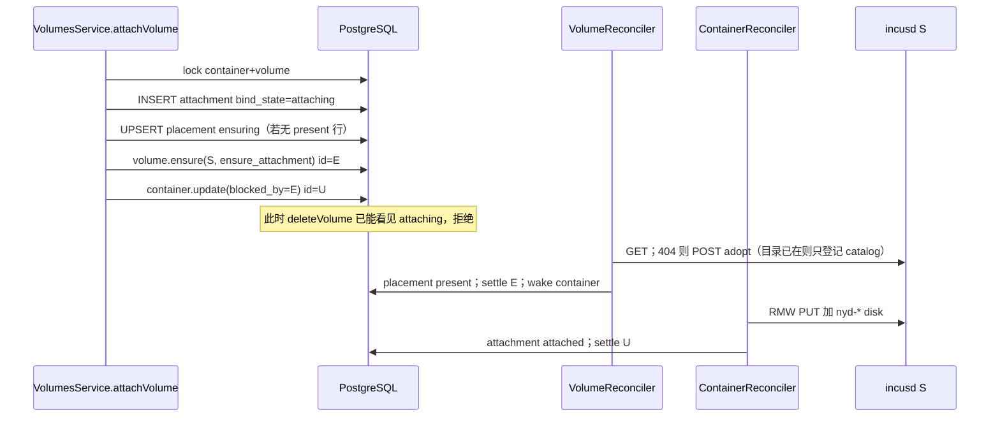
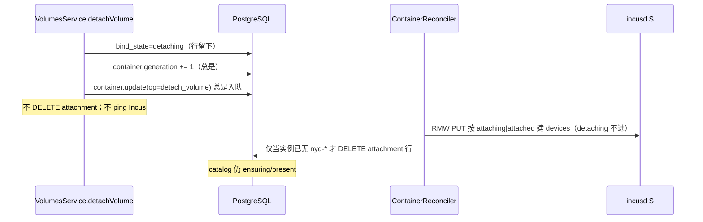
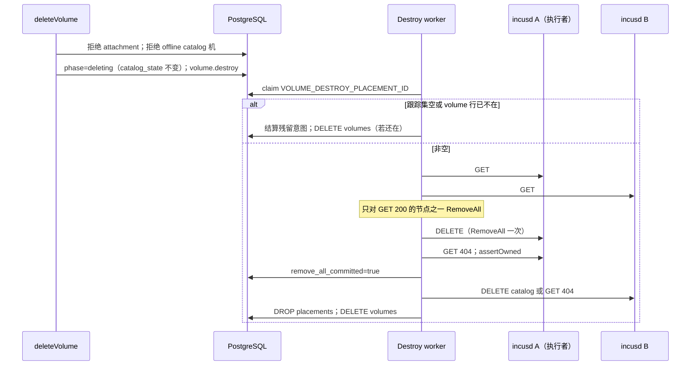

# 共享 CephFS 卷：对等节点生命周期

| 字段 | 值 |
| --- | --- |
| 状态 | Draft |
| 作者 | TBD |
| 日期 | 2026-08-31 |
| 仓库 | `/root/nyabase` |
| 基线 | `plans/incus-architecture.md`；本文件**取代** `plans/incus-control-plane-fixes.md` 中 home / grow-only / `VOLUME_DELETE_WAITING_HOME` 销毁模型 |
| 产品状态 | **未发布**。无兼容、无双写、无旧 home 行为 feature flag、无遗留别名。直接重写 `packages/backend/src/persistence-pg/migrations/000001_initial.sql`。回滚 = 还原 PR 栈。 |

---

## Overview

Nyabase 控制面把共享卷当成「一行 `control.volumes` + 若干 Incus catalog」。物理事实是：同一 `infra.shared_backends.identity_key`（`deriveSharedBackendIdentity` → `cephfs:{cluster}/{source}/{path}`）下，两台 standalone `incusd` 的 custom volume **指向同一 CephFS 目录**。Incus `cephfs` 的 `DeleteVolume` 对该目录做 `os.RemoveAll`，因此**任意一台**的 `deleteStorageVolume` 都会毁掉其它 catalog 仍指向的数据。

当前实现用 `volumes.pool_id` 所在服务器当 **home**：只有 home 可以 `RemoveAll`，非 home 卡在 `VOLUME_DELETE_WAITING_HOME`。这把一台本可对等的 Incus 做成假 SPOF；同时非 home 在 home GET 非 404 前若误调 `deleteStorageVolume` 会直接删数据。Scan **今天**的 desire 是 `home ∪ live attachments`（`placementServersToDesire`），不是「每个看得见后端的服务器」；仍会在「该 desired 但无行」时 upsert 新 catalog。历史 P0-3（按后端可见扩散到每一台）必须保持关闭，且不得借 home 集合把 catalog 再铺开。

本方案做 **clean cutover**：

- **没有 home。** 凡已登记同一 `shared_backend` 的 Incus 对等；任一在线节点可做首次 `mkdir` 或 adopt。
- **PostgreSQL 是占用与 catalog 登记的唯一真相。** 不把 Incus `used_by` 当删除门闩；扫描不得因为后端可见就发明 catalog。
- **意图先 settle，再改用户可见的 committed 状态。** 挂载先插入 in-flight 占位，adopt+attach 成功后才 committed；卸载保持 committed 行直到实例 disk device 去掉。
- **销毁由后端串行。** 卷级 claim；过门闩后 **至多一次** `DeleteVolume`（`RemoveAll`）。跟踪集为空（例如最后一台有 catalog 的服务器已被控制面删除）则 **立刻 PG 成功**，不关心残留 Ceph 目录。
- **卸载从不调用 `deleteStorageVolume`。** Catalog 粘性保留到卷删除或服务器控制面删除。

---

## Background & Motivation

### 保持不变的前提

- 控制面 HTTPS + mTLS 直连每台 standalone Incus；**没有** nyabase Agent、**没有** Incus cluster（`plans/incus-architecture.md` A1/A2、§3.4、非目标）。
- 可共享驱动只有 `cephfs`。Custom volume 一律 `filesystem` + `security.shifted=true`。
- 本地卷（`server_id` 非空）生命周期精神不变：一台 Incus、一份目录、一份 catalog。
- `PUT /1.0/instances/<n>` 仍是 RMW + `If-Match`。**只有进入期望设备集的挂载**（`attaching|attached`）才要求该机 catalog 已在，否则 `VOLUME_PLACEMENT_PENDING` retry。纯卸载 PUT 不 preflight catalog（§2.3 / §4）。
- 容量模型 A/B/C 不变。共享卷计入 `iam.shared_backend_grants`，不进服务器 `disk_bytes`。

### 当前实现如何把共享卷做错

逻辑卷一行，`server_id IS NULL`，`shared_backend_id` 非空，`pool_id NOT NULL`。`VolumesService.resolveScopeCore` 把用户创建时选的池写成 **终身 home**：

```439:449:packages/backend/src/volumes/volumes.service.ts
          await this.repository.upsertPlacement({
            volumeId: row.id,
            serverId: scope.anchorServerId,
            poolId: scope.poolId,
            desiredPresent: true,
          }, transaction);
          const intent = await this.intents.createPending({
            ...
            serverId: scope.anchorServerId,
```

`placementServersToDesire`（`packages/backend/src/volumes/volume-placement.ts`）永远把 `homeServerId` 放进期望集。`VolumeReconciler.reconcileDelete` 用 `row.pool_server_id === row.target_server_id` 判断 `isHome`；非 home 在 home 行仍在或 GET home 非 404 时 `VOLUME_DELETE_WAITING_HOME`，即使另一台完全可以 `RemoveAll`。

Detach 把非 home 的 `desired_present=false` 但**留下行**（cache），这是对的——共享 `!desired_present` 路径今天已经不调 `deleteStorageVolume`；错的是销毁仍绑在 home 上，以及 `desired_present` 被当成「还有没有 live attachment」。Scan 仍用 `placementServersToDesire` 在「该 desired 但无行」时 **upsert 新 catalog**。`deleteVolume` 的用户错误码误用 `VOLUME_DETACH_DRAINING`。卸载立刻 `DELETE volume_attachments` 再写 360s `volume_detach_drains`，与「意图 settle 后才改 committed」相反。

`ServersService.delete` 在任何引用上返回 `SERVER_NOT_EMPTY`（`packages/backend/src/servers/servers.service.ts`）。`UserServerResourcePurgeService` 是 **grant 到期 / 用户-服务器资源清理**：对容器发 `container.delete`（会打 Incus），且只清该用户的**本地**卷。它不是「管理员把机器移出集群、只清控制面」。

### 痛点（必须解决，不能糊上）

1. Home 是假 SPOF：`VOLUME_DELETE_WAITING_HOME` 即使另一节点能执行 `RemoveAll`。
2. 任意节点 `DeleteVolume` 都会 `RemoveAll` 共享目录；detach / scan extras 调 DELETE 即删数据。
3. 两台 standalone catalog 互不可见；Incus 集群 occupancy / `used_by` 不能当跨机门闩。
4. Scan 仍按 home ∪ live attachments upsert catalog；不得再扩散，也不得借 `innerJoin v.pool_id` 把可空池的逻辑行从 `knownNames` 里丢掉。
5. `volumes.pool_id` 编码 home。

---

## Goals & Non-Goals

### Goals

1. 节点对等：销毁执行者不是 `volumes.pool_id` 的服务器。
2. 用户可见 PG 行（list/delete 当真相的 attachment、catalog、volume 行）只在对应 Incus 操作成功且意图 settle 之后变成 committed。
3. 卸载 = 解绑 disk device；不 `deleteStorageVolume`；数据与 per-node catalog 保留。
4. 后端串行销毁：卷级 claim；至多一次 `RemoveAll`；跟踪集空则纯 PG 成功。
5. 删除门闩：committed 或 in-flight 挂载 → 先解绑；catalog 所在服务器不可达 → 联系管理员。不把 360s lazy-umount 当产品门闩。
6. 管理员删服务器 = **只清该服务器的控制面对象**，不 Incus-mutate 离机。删完后空跟踪集的逻辑卷自动删除并释放配额。
7. 信任控制面：不以 Incus `used_by` 为删除门闩；scan 不发明 catalog；不 Incus-DELETE 仍有 `control.volumes` 行的 `nyv-*`。
8. 直接改 `000001_initial.sql`（及如需的 000002/000003 以保持自洽）。前端去掉任何 home 文案。

### Non-Goals

- Incus cluster；控制面谈 Ceph 管理 API；catalog-only 的独立 Incus「import」API。
- 等待 guest fd drain / 360s 窗口作为卸载或删卷门闩。
- 对「同一 Incus 带着旧指纹回来」做 fencing / orphan-scan 特例 / 身份复活。重新加入 = 全新空白服务器。
- 改 `shared_backends.identity_key` 合成规则。
- 重新设计本地卷 create/resize/attach（除非共享路径改到同一函数）。
- 通用 DAG 工作流引擎、feature flag、双路径。

---

## Key Decisions

| # | 决策 | 理由 |
| --- | --- | --- |
| K1 | **没有 home。** 已登记同一 `shared_backend_id` 的 Incus 对等。创建时用户仍指定一个池，只作为 **首次 mkdir 的执行者**，记成一条 catalog，不是终身销毁者。 | `volumes.pool_id` 编码 home 是 P0。任一在线 catalog 节点都能 `RemoveAll`。 |
| K2 | **Catalog 粘性：直到卷删除或该服务器被控制面删除。** 最后一次 detach 不撤回、不 DELETE catalog。`catalog_state` 只表示 Incus catalog 是否已确认（`ensuring`/`present`），**不是**销毁相位。销毁只写 `volumes.lifecycle_phase='deleting'`，**不**把 placement 打成第三态。 | Scan 若 retract + DELETE 会 `RemoveAll`。粘性 cache 让销毁能枚举跟踪集。Destroy 执行者靠 GET 200，不靠被覆盖掉的旧 state。 |
| K3 | **意图 settle 之后才改 committed。** Attach：同一事务插入 `bind_state='attaching'` +（必要时）`catalog_state='ensuring'` + 意图，成功后才 `'attached'` / `'present'`。Detach：**API 永不 `DELETE` attachment 行。** `attaching`/`attached`/`detaching` 一律写成 `detaching`（幂等）+ **总是** bump 容器 `generation` + **总是** 入队 `container.update`。只有 reconciler 在 GET/PUT 后确认实例上已无 `nyd-*` 才删行。Delete 看见任意 `bind_state` 都拒绝。 | PUT 加盘与 PG `attaching→attached` 之间有窗口：API 按 `attaching` 删行会丢掉占用门闩，而 in-flight 的 attach PUT 仍把 device 留在实例上。必须靠新 generation 覆盖那次 PUT。 |
| K4 | **卷级销毁锁。** `reconcile_claims` 增加 sentinel `placement_server_id = VOLUME_DESTROY_PLACEMENT_ID`。Destroy 与该卷任意 placement 工作互斥。Placement 级 claim 仍可在不同服务器并行 adopt/resize/ensure。 | 现有 PK 是 `(resource_type, resource_id, placement_server_id)`。Sentinel 与证书轮转同一模式，不必新表。 |
| K5 | **跟踪集为空 ⇒ 立刻 `DELETE control.volumes`，成功。** 同事务结算该 `resource_id` 的残留 volume 意图。不扫 Ceph，不要求有执行者。仍在集群里、从未进入跟踪集的 `nyv-*` 由 scan orphan-DELETE 清理，与「没有执行者就不碰 Ceph」不是同一条路径。 | 最后一台有 catalog 的服务器被控制面删除后，没有合法 Incus 可调用；操作员接受残留目录。 |
| K6 | **管理员删服务器只清控制面**（该服务器的容器、本地卷、该机上的 attachment、该机的 shared catalog、指向该机的 intents/claims、授权/IP/GPU/镜像分配）。不 Incus-mutate 离机。其它活服务器上同一共享卷的 placement/attachment **不动**。 | 产品：「只清理控制面」。机器可能还在跑——接受。 |
| K7 | **信任 PG，不信任 `used_by`。** 删除 API 与 destroy worker 的占用门闩是 `volume_attachments`（任意 `bind_state`）。Worker 仍 GET 404 以确认 **本次** `DeleteVolume` 的效果，但空 `used_by` 不是允许 RemoveAll 的条件。 | 两台 standalone 的 `used_by` 互不可见；用它当门闩会漏或假阻塞。 |
| K8 | **跟踪集 ≠ 所有看得见该 CephFS 池的服务器。** 跟踪集 = 本卷已有或 in-flight 的 catalog 行。从未 adopt 的离线 C 不挡删除。Scan 不得因后端可见而建行；不得 Incus-DELETE 仍在 `control.volumes` 的 `nyv-*`。 | 关掉「catalog 乘到每台机器」和误 RemoveAll。 |
| K9 | **`volumes.pool_id` 对共享卷可空。** 本地仍 NOT NULL。共享卷的配额锁走 `lockSharedBackends([shared_backend_id])`，**永不**用可空的 `volumes.pool_id` 调 `lockCapacityScope`。能力/展示池从仍存在的 create-time 池，否则任一条 catalog 的 `pool_id` 解析。该机池随服务器 cascade 消失时 `ON DELETE SET NULL`。 | 销毁身份不能落在 `pool_id`。今日 `deleteVolume`/`patchVolume`/`scan`/`readVolume` 都 `innerJoin`/`lock` 这个列，可空后会直接抛或把卷从 `knownNames` 丢掉。 |
| K10 | **Cascade 后：零 attachment（含 in-flight）且零 catalog 的逻辑卷自动删除。** 释放配额。若该卷仍有未过期的 `volume.destroy` sentinel claim，**不** K10 删行，留给 worker 按空跟踪集收尾。仍登记在其它服务器上的卷保留。 | 空跟踪集会立刻成功；cascade 里做掉避免僵尸行。不得在 RemoveAll 进行中把卷行从 worker 脚下抽走。 |
| K11 | **丢掉 `volume_detach_drains` 和 attachment 上的 `detach_drained_at`。** 卸载成功 ≠ 没有写者（惰性 umount）；RemoveAll 时 CephFS cap revoke，fd 失败。操作员已接受。 | 360s 不是产品门闩；留着会把 home 时代的 destroy 语义偷运回来。 |
| K12 | **新意图 `volume.destroy`，`server_id IS NULL`。只有它（且仅在 `remove_all_committed=false` 的 GET-200 执行者上）可以调用「目录可能仍有数据」的 `deleteStorageVolume`。** `volume.ensure` / `volume.resize` 在 `deleting` 上 no-op/retry，**零** Incus DELETE。不再 fan-out `volume.ensure op=delete`。 | 今日任何 volume 意图在 `deleting` 都进 `reconcileDelete`。残留 ensure 会从非执行者 RemoveAll。 |

---

## Proposed Design

### 1. 拓扑与对象

```
                    PostgreSQL（唯一集群元数据）
                    control.volumes  1 行逻辑卷
                    control.volume_placements  N 条 catalog 登记
                    control.volume_attachments  挂载（attaching|attached|detaching）
                              │
              ┌───────────────┼───────────────┐
              ▼               ▼               ▼
           incusd A        incusd B        incusd C
           catalog A       catalog B       （无本卷 catalog）
              │               │
              └───────┬───────┘
                      ▼
              同一 CephFS 目录（mkdir 一次）
```

字节只有一份。Catalog 是每台 incusd sqlite 里的 custom volume 行。Nyabase PG 是谁有 catalog、谁在挂载的唯一权威。

### 2. 数据模型

重写 `000001_initial.sql`（000002 busy-strikes、000003 `root_used_bytes` 保持，与本方案正交）。

#### 2.1 `control.volumes`

```sql
CREATE TABLE control.volumes (
    id uuid NOT NULL,
    owner_id uuid NOT NULL REFERENCES iam.users(id) ON DELETE RESTRICT,
    -- 本地：NOT NULL，该机池。共享：可空；仅「创建时用过的池」，不是销毁者。
    pool_id uuid REFERENCES infra.storage_pools(id) ON DELETE SET NULL,
    server_id uuid REFERENCES infra.servers(id) ON DELETE RESTRICT,
    shared_backend_id uuid REFERENCES infra.shared_backends(id) ON DELETE RESTRICT,
    name text NOT NULL,
    incus_name text NOT NULL,          -- nyv-<uuid32>，UNIQUE 全局
    size_bytes bigint NOT NULL,
    used_bytes bigint,                 -- 见 §6：各 present catalog 观测值的 max
    generation integer DEFAULT 1 NOT NULL,
    observed_generation integer,
    lifecycle_phase text DEFAULT 'provisioning' NOT NULL,
    needs_attention boolean DEFAULT false NOT NULL,
    failure_code text,
    -- 销毁：RemoveAll 已在执行者上确认 GET 404。重试不得再挑另一台做第二次有数据的 DELETE。
    remove_all_committed boolean DEFAULT false NOT NULL,
    remove_all_server_id uuid REFERENCES infra.servers(id) ON DELETE SET NULL,
    created_at timestamptz DEFAULT clock_timestamp() NOT NULL,
    updated_at timestamptz DEFAULT clock_timestamp() NOT NULL,

    CONSTRAINT volumes_scope_check CHECK (
        (server_id IS NOT NULL AND shared_backend_id IS NULL AND pool_id IS NOT NULL)
        OR (server_id IS NULL AND shared_backend_id IS NOT NULL)
    ),
    CONSTRAINT volumes_remove_all_shape_check CHECK (
        (NOT remove_all_committed AND remove_all_server_id IS NULL)
        OR (remove_all_committed AND lifecycle_phase = 'deleting')
        -- remove_all_server_id 在执行者随后被 cascade 删除后可为 NULL；flag 仍为 true
    ),
    -- 其余 CHECK 同今日（incus_name、size、lifecycle、failure_shape、generation）
    PRIMARY KEY (id)
);
```

`volumes.pool_id` 对共享卷：**创建事务写入所选池**；该池随服务器 cascade 消失时变为 NULL。**禁止**再用它判断 `isHome`，**禁止**用它当容量锁键。

触发器 `assert_volume_pool_scope`：

- 本地：池在 `volumes.server_id` 上、非 shareable、registered（同今日）。
- 共享且 `pool_id IS NOT NULL`：池必须是该 `shared_backend_id` 的 registered shareable cephfs。
- 共享且 `pool_id IS NULL`：跳过池形状（catalog 行仍由 `assert_volume_placement_scope` 约束）。

**单一配额锁助手** `lockVolumeQuota(volume, txn)`（所有 create/resize/delete/K10 空跟踪删行都走它）：

```
if volume.server_id IS NOT NULL:
    lockCapacityScope(volume.pool_id, volume.server_id, [])   -- 本地 pool_id NOT NULL
else:
    lockSharedBackends([volume.shared_backend_id])           -- 现有 storage-pools.repository.ts lockSharedBackends
    -- 绝不 lockCapacityScope(volume.pool_id, …)，pool_id 可为 NULL
```

Resize / shrink 的 driver、`resize_family`、`quota_effective` 读 **代表池**：`volumes.pool_id` 仍存在则用它，否则 `SELECT pool_id FROM volume_placements WHERE volume_id=V LIMIT 1`。空跟踪集拒绝 resize（不必再 upsert 一条「home」placement；今日 `patchVolume` ~663–671 的空表防御 **删除**）。

Scan / `readVolume` **禁止** `innerJoin infra.storage_pools ON v.pool_id`。Placement 路径 join `volume_placements.pool_id`；逻辑行枚举只读 `control.volumes`。

`VolumeDto.poolId`：`string | null`。解析顺序：仍存在的 `volumes.pool_id` → 任一条 `volume_placements.pool_id` → `null`（仅短暂出现在 cascade 与自动删行之间）。`poolName`：代表池的 `display_name` 或 `incus_name`；无代表池则用 `infra.shared_backends.display_name`/`name`（本地卷不会落到这一步）。`capability` 在无池时按 cephfs / `quota_online` 填写（驱动硬约束）。

创建 API 仍要求 `scope.kind='shared'` 带 `poolId`（`zSharedVolumeScope` 不变）：那是 **初始 mkdir 的显式执行池**，必须在线且 registered。

#### 2.2 `control.volume_placements`（catalog 跟踪集）

保留表名以免无意义的全局重命名；语义改为 **catalog 登记**，不再是 home ∪ live attachments 的 desire 函数输出。

```sql
CREATE TABLE control.volume_placements (
    volume_id uuid NOT NULL REFERENCES control.volumes(id) ON DELETE CASCADE,
    server_id uuid NOT NULL REFERENCES infra.servers(id) ON DELETE RESTRICT,
    pool_id uuid NOT NULL REFERENCES infra.storage_pools(id) ON DELETE RESTRICT,
    -- ensuring: API 已占位、Incus catalog 尚未确认 GET 200
    -- present: GET 200 且 size/shifted 对齐过
    -- 销毁不写第三态：volumes.lifecycle_phase='deleting' 才是销毁相位
    catalog_state text NOT NULL,
    observed_generation integer,
    created_at timestamptz DEFAULT clock_timestamp() NOT NULL,
    updated_at timestamptz DEFAULT clock_timestamp() NOT NULL,
    PRIMARY KEY (volume_id, server_id),
    CONSTRAINT volume_placements_state_check
        CHECK (catalog_state = ANY (ARRAY['ensuring', 'present']))
);
```

删除列：`desired_present`、`observed_present`、`unused_confirmed_at`。

**跟踪集** = 该 `volume_id` 的全部 placement 行（`ensuring` 与 `present` 都算）。从未 adopt 的服务器不在集内。Destroy 执行者 **不**从 `catalog_state` 挑选，见 §5.2 GET-all。

`assert_volume_placement_scope` 保持并收紧：

- `pool.server_id = NEW.server_id`
- 本地：`pool_id = volume.pool_id` 且 `volume.server_id = NEW.server_id`
- 共享：`pool.shared_backend_id = volume.shared_backend_id AND driver='cephfs' AND shareable AND registered`

谁写表：

| 调用方 | 写什么 |
| --- | --- |
| `createVolume` | upsert `(V, createServer)` `ensuring`；失败卷不另写 |
| `attachVolume` 目标 S | 无行则 upsert `ensuring`；已有 `present`/`ensuring` 不动 |
| `detachVolume` | **不改** placement；**不** `DELETE` attachment 行；只把 bind_state 写成 `detaching` 并 bump 容器 generation |
| `deleteVolume` | **不改** `catalog_state`；只把 `volumes.lifecycle_phase='deleting'`；零行则当场删 volume（§5.1） |
| 服务器控制面 cascade | `DELETE` **该 server_id** 的行；其它服务器的行不动 |
| scan | **不插入新行**；不对 `control.volumes` 仍在的 `nyv-*` 调 Incus DELETE；phase≠deleting 且 `ensuring`/`present` 缺失 catalog 时 `ensurePending`；`failed` 不扩散；phase=deleting 只 `ensurePending(volume.destroy)` |
| destroy worker | GET-all 后至多一次有数据的 RemoveAll；确认后再逐台 404 / catalog DELETE，然后 `DELETE` 该 placement 行 |

`placementServersToDesire` **删除**。Scan 与 detach 不再调用它。

#### 2.3 `control.volume_attachments`

```sql
CREATE TABLE control.volume_attachments (
    id uuid NOT NULL,
    container_id uuid NOT NULL REFERENCES control.containers(id) ON DELETE CASCADE,
    volume_id uuid NOT NULL REFERENCES control.volumes(id) ON DELETE RESTRICT,
    device_name text NOT NULL,          -- nyd-<uuid32>
    container_path text NOT NULL,
    read_only boolean DEFAULT false NOT NULL,
    bind_state text DEFAULT 'attaching' NOT NULL,  -- attaching | attached | detaching
    created_at timestamptz DEFAULT clock_timestamp() NOT NULL,
    updated_at timestamptz DEFAULT clock_timestamp() NOT NULL,
    CONSTRAINT volume_attachments_bind_state_check
        CHECK (bind_state = ANY (ARRAY['attaching', 'attached', 'detaching']))
    -- path / device_name CHECK 同今日
);
```

删除 `detach_drained_at`。删除整表 `control.volume_detach_drains`。

`UNIQUE (container_id, volume_id)`、`UNIQUE (container_id, container_path)` 覆盖全部 `bind_state`，所以 in-flight attach 挡住第二次 attach。

`assert_volume_attachment_scope` 不变（owner、本地同机、共享后端在目标机可见）。**In-flight 行同样触发**，这样 delete 与撤销守卫看得到静默挂载窗口。

`ContainerReconciler.readAttachments` **必须加载全部 `bind_state`**（含 `detaching`）。然后拆成两份：

- `desiredAttachments = attaching|attached` → 唯一进入 `buildDesiredInstanceSpec` 的集合（`detaching` 不进 devices，等于从实例拿掉 `nyd-*`）。
- **Catalog preflight 与这份 desired 集合同范围。** `assertCustomVolumesPresent(desiredAttachments)` —— **不是** `attachments.length > 0` 的全表。PUT 包装 `isMissingCustomVolumeError` → `VOLUME_PLACEMENT_PENDING` **仅当** desired spec 仍含该 `nyd-*`。纯卸载（desired 为空，或本卷不在 desired 里）**不得**因 catalog 404/缺卷而 retry；做 no-op 或去掉 device 的 PUT。
- **过期意图：** `intent.targetGeneration < containers.generation` 的 `container.update` → `outcome: 'succeeded'`，`observedGeneration = intent.targetGeneration`（只结算这一代及更旧的 pending；**禁止**用当前 `containers.generation` 调 `settleForObservedGeneration`，否则会把 G+1 的 detach 也标成功，而 device 可能还在）。不 PUT、不 preflight、不改 attachment 行。若它 retry `VOLUME_PLACEMENT_PENDING`，FIFO 会一直抢在 G+1 前面，卸载永远不跑。
- 实例 GET/PUT 复验成功后，**同一函数**按**当前**行 settle（不要用 reconcile 开始时的快照当终态）：
  - 行仍是 `attaching` 且设备已在 → `attached`
  - 行是 `detaching` 且设备已无 → `DELETE` 该行（device 从未加上则为 no-op PUT 后同样删行）
  - 行是 `detaching` 且设备仍在 → **保持 `detaching`**，不得写回 `attached`（过期意图走上面 succeeded 捷径，不在这里 PUT）
  - 行是 `attaching` 且设备仍无 → 保持 `attaching`（catalog/ensure 未完成；且它仍在 desired 里，preflight 会 `VOLUME_PLACEMENT_PENDING`）

若 `readAttachments` 先滤掉 `detaching`，settle 永远看不到「device gone」，卸载楔死，删卷被 `VOLUME_REQUIRES_UNBIND` 挡住。若 preflight 仍吃 `detaching` 行，adopt 失败后的取消挂载会永远 `VOLUME_PLACEMENT_PENDING`，UNIQUE 楔死（K3 要关的洞）。

list/get：三种 state 都返回。`VolumeAttachmentDto` **与** `VolumeAttachmentSummaryDto` 都加 `bindState`（卷列表不必二次请求就能显示「挂载中 / 卸载中」）。去掉 `detachDrainedAt`（`container-control.service.ts` 的 mapper 一并改）。

#### 2.4 销毁锁与 `reconcile_claims`

现有 PK `(resource_type, resource_id, placement_server_id)` 保留。证书哨兵仍是 `NO_PLACEMENT_SERVER_ID = 00000000-0000-4000-8000-000000000000`。

新增：

```ts
// reconcile-claim.repository.ts
export const VOLUME_DESTROY_PLACEMENT_ID = '00000000-0000-4000-8000-000000000001';
```

```sql
CONSTRAINT reconcile_claims_placement_shape_check CHECK (
    (placement_server_id = '00000000-0000-4000-8000-000000000000'
        AND server_id IS NULL
        AND resource_type = 'certificate_rotation')
    OR (placement_server_id = '00000000-0000-4000-8000-000000000001'
        AND server_id IS NULL
        AND resource_type = 'volume')
    OR (placement_server_id <> '00000000-0000-4000-8000-000000000000'
        AND placement_server_id <> '00000000-0000-4000-8000-000000000001'
        AND server_id = placement_server_id)
)
```

`ReconcileClaimRepository.claimInTransaction` 对 `resource_type='volume'` 的锁顺序（必须写死，否则与今日 `reconcile-server:` → `reconcile-placement:` 死锁）：

1. **先** `pg_advisory_xact_lock(hashtextextended('volume-lifecycle:' || resource_id, 0))` — 每个 volume claim（placement **与** destroy）都拿。Advisory 是 `xact` 锁，**只覆盖 claim 事务**；Incus 工作期间的互斥靠 60s 租约 + EXISTS。
2. 若 `input.serverId` 非空：`reconcile-server:${serverId}`（今日已有）。Destroy 的 `server_id IS NULL`，**跳过**这一步，也不走 `serverAtCapacity`。
3. `reconcile-placement:${resourceType}:${resourceId}:${placementServerId}`（今日已有）。
4. 若 `placement_server_id = VOLUME_DESTROY_PLACEMENT_ID`：存在其它未过期 `(volume, *)` claim → 返回 `null`。
5. 若普通 placement claim：存在未过期 destroy sentinel → 返回 `null`。
6. 插入/续租该 PK 行。Destroy sentinel **不计入** `MAX_ACTIVE_CLAIMS_PER_SERVER`。真正打 Incus 的节点由 reconciler 经 `INCUS_CLIENT_FACTORY` 访问。

租约 60s，`RECONCILE_RENEWAL_MS=20s`。Destroy 是第一条可能跑数十秒的 volume 路径（CephFS `RemoveAll`）。Worker 必须在 §5.2 步骤 5 的 `deleteStorageVolume` **之后、写 `remove_all_committed` 之前**，以及每台 catalog 收尾 DELETE **之后**调用 `lease.assertOwned()`；长操作期间续租。否则第二个 worker 会在 flag 仍 false 时再开一次有数据的 DELETE。不另建锁表（K4 / 方案 E）。

崩溃：租约过期后下一个 worker 重读 `remove_all_committed` 与 GET-all。

#### 2.5 `control.intents`

新增 kind `volume.destroy`。`intents_kind_check` / `IntentKind.VolumeDestroy`。

```sql
CONSTRAINT intents_resource_shape_check CHECK (
    (resource_type IN ('container', 'image_assignment', 'server') AND server_id IS NOT NULL)
    OR (resource_type = 'volume' AND kind IN ('volume.ensure', 'volume.resize') AND server_id IS NOT NULL)
    OR (resource_type = 'volume' AND kind = 'volume.destroy' AND server_id IS NULL)
    OR (resource_type = 'certificate_rotation' AND server_id IS NULL)
)
```

`IntentRepository.createPending`：

- `volume.ensure` / `volume.resize`：共享卷的 `serverId` 必须已有 placement 行（create 与 attach 在同一事务先 upsert）。
- `volume.destroy`：**禁止** `serverId`；**不**要求 placement 存在；**允许** `control.volumes` 行已不存在（空跟踪集先 DELETE 再 insert+settle 归因意图）。

`ensurePending` 匹配键增加 kind，destroy 的 `idempotencyKey='destroy'`。Scan 对 `deleting` 卷 `ensurePending(volume.destroy)` 一次，不再 per-placement `op=delete`。

删除 `VOLUME_DELETE_WAITING_HOME`、`VOLUME_DELETE_WAITING_IDLE`（`incus-errors.ts`）。删除代码与注释中的 `anchorServerId` / `homeServerId` / `isHome` / `destroyer=`。

---

### 3. 谁拥有 catalog

```
create ──mkdir/adopt──► catalog A (ensuring→present)
                │
        attach to B
                ▼
           catalog B  （粘性；detach 后仍在）
                │
        用户 DELETE 卷 或  管理员删除服务器 A/B
                ▼
           跟踪集收缩；空则 PG 删逻辑行
```

**Create。** `resolveScopeCore` 仍要求用户/管理员给出 `scope.poolId`。该池的服务器必须 `infra.servers.status = 'online'`，否则 409 `SERVER_UNREACHABLE`（创建，不是删卷那条「联系管理员」文案）。不在「所有看得见后端的节点」里自动挑——创建范围保持显式，只是这个池**不是 home-for-life**。同一事务：insert volume（`pool_id`=该池，`lifecycle_phase='provisioning'`）+ placement `ensuring` + `volume.ensure` `idempotencyKey=create`。若 ensure 失败：卷停在 `provisioning`/`failed`，**这一条** ensuring 行保留；scan **不得**把 catalog 扩散到新服务器。

**Attach 到 S。** 目标机必须有且仅有一个该 backend 的 registered shareable cephfs 池（今日 `VOLUME_CROSS_SERVER_DENIED` / `backend_not_reachable`）。无 placement 则 upsert `ensuring`；`volume.ensure` `ensure_attachment`（已 `present` 则 `ensurePending` 直接 reused/settled，不挡 container.update）。Catalog 在 detach 后仍为 `present`。

**Detach S 上最后一条 attachment。** 不改 placement。禁止 Incus DELETE。禁止 `DELETE volume_placements`。

**Failed 卷。** 不扩散。已有 ensuring/present 保留，供之后 `deleteVolume` 走同一销毁路径（`needs_attention=false`，phase=`deleting`）。

**Scan（每服务器 S，`VolumeReconciler.scan`）。**

查询（**禁止** `innerJoin v.pool_id`，否则共享卷 create-time 池被 cascade `SET NULL` 后该行从 `rows`/`knownNames` 消失，scan 会把仍在 T 上的 `nyv-*` 当孤儿 `RemoveAll`）：

```sql
SELECT v.* FROM control.volumes v
WHERE v.server_id = :S
   OR v.shared_backend_id IN (
        SELECT shared_backend_id FROM infra.storage_pools
        WHERE server_id = :S AND registered AND driver = 'cephfs' AND shareable
          AND shared_backend_id IS NOT NULL
      )
```

1. 列出 S 上已登记池的 custom volumes。
2. `knownNames` = 上式全部 `incus_name`（含 failed/deleting/needs_attention，含 `pool_id IS NULL`）。比跟踪集更宽，挡住误 orphan-RemoveAll。
3. 读 `volume_placements` where `server_id=S`。
4. 有行且 volume **不是** `deleting` 且 list 缺/size/shifted 漂 → `ensurePending(volume.ensure)`（create vs ensure_attachment 只按「该行是否已 `present`」区分，**不要** `home_server_id === S`）。
5. volume `lifecycle_phase='deleting'` → **只** `ensurePending(volume.destroy)`（卷级，幂等）。**禁止**再 enqueue `volume.ensure` / `op=delete`。
6. **无行：什么都不插入。** 看得见后端 ≠ 建 catalog。今日 `placementServersToDesire` upsert（`volume-reconciler.service.ts` ~270–278）删除。
7. `failed`/`needs_attention`：不插入新行；已有 ensuring/present 仍可补 ensure（非 deleting）。
8. 真孤儿：`nyv-*` 且**全局**无 `control.volumes.incus_name` → `deleteOrphanVolume`（Incus `used_by` 空可作为本地安全阀，但不是跨机门闩）。这是 **跟踪集外、逻辑行已不存在** 的 sqlite/目录清理，与 K5「空跟踪集不扫 Ceph」不矛盾：K5 是控制面已经没有任何执行者时跳过；C 若仍在集群且有**从未登记**的 `nyv-*`，scan 清它是有意的。
9. 逻辑行仍在的 `nyv-*`：**永不** `deleteStorageVolume` / `deleteOrphanVolume`。

---

### 4. Attach / Detach 序列

`blocked_by_intent_id` 单层 predecessor **仅 attach**：`container.update(attach)` 可 blocked_by `volume.ensure`。Detach 的 `container.update` **不** blocked_by catalog ensure。

Catalog preflight（`assertCustomVolumesPresent` + PUT 上 `isMissingCustomVolumeError` → `VOLUME_PLACEMENT_PENDING`）**只作用于 `attaching|attached`**，见 §2.3。纯 `detaching` 的更新不查 catalog。

#### 4.1 Attach



Adopt 失败闭合不变：`VOLUME_ADOPT_FAIL_AFTER_ATTEMPTS = 8` → `VOLUME_CATALOG_ADOPT_FAILED`。失败 POST 不得 `RemoveAll`（已有人工证明门闩，见 Tests）。`cascadeBlockedBy` 会把 `container.update` 标失败；**`attaching` 行仍在**，必须靠 §4.2 把行打成 `detaching` 并跑完新 generation 的 update 才能再 attach 或删卷。

`attaching` 行占用 `volume_attachments_pair_unique`，用户不能「再点一次挂载」来修复。Delete 在 settle 前已经能看见 in-flight 行（`hasAttachments` 无 `bind_state` 过滤）。

#### 4.2 Detach（只解绑；`attaching`/`attached`/`detaching` 同一条路径）

API **不做 Incus 读**（与删卷 API 一样不 ping 8443），因此 **不能**用「实例尚无 `nyd-*`」分支。`ContainerReconciler` 在 reconcile 开头快照 attachments、PUT、再返回；attach 的 PUT 加盘与 PG settle `attaching→attached` 之间，行仍是 `attaching` 而 device 已在。若此时 API `DELETE` 行或「已有 pending 就不发新 generation」，那次 PUT 会把 device 留在实例上，占用门闩已空，`deleteVolume` 会放行 RemoveAll。

规范（同一 serializable 事务，对三种 `bind_state` **无分支**）：

1. `SELECT attachment FOR UPDATE`。不存在 → 404。
2. `bind_state='detaching'`（已是则仍执行下面两步，幂等卸载）。
3. **总是** `containers.generation += 1`（即使已有 pending `container.update(attach)`）。
4. **总是** `createPending(container.update, op=detach_volume)`，`targetGeneration` = 新 generation。不设 `blocked_by`。不取消 sticky catalog 的 `volume.ensure`。
5. **禁止** `DELETE FROM volume_attachments`。**禁止** `deleteStorageVolume`。



Worker settle 见 §2.3。若 attach 的旧意图（generation G）仍 pending：它是过期意图（`targetGeneration < containers.generation`）→ **直接 succeeded**，不 PUT、不 `VOLUME_PLACEMENT_PENDING`。G+1 的 detach update 再跑：desired 不含该盘；catalog 404 也继续；no-op PUT 或拿掉已存在的 `nyd-*`；行在 device 消失后删除。

不写 `volume_detach_drains`。不把 lazy-umount 当成功门闩。

Adopt 失败后的恢复：detach `attaching` → 行变为 `detaching` + 新 generation 的 update。该 update **零** `VOLUME_PLACEMENT_PENDING`（catalog 不在也不等）。从未加上则为空操作 PUT → 删行 → `deleteVolume` 才过占用门闩。测试锁定（`volumes.attachments.pg.test.ts`、`container-reconciler.test.ts`）：adopt 失败后的 detach **不得**出现 `VOLUME_PLACEMENT_PENDING`。

---

### 5. 删除卷算法（规范）

用户可见错误必须区分「先解绑」与「服务器离线，联系管理员」。

#### 5.1 API（`VolumesService.deleteVolume`，同一 serializable 事务）

1. `SELECT volume FOR UPDATE`。已 `deleting` → 409 删除进行中（同今日）。
2. `lockVolumeQuota(volume)`（K9）。空跟踪集删除也必须拿这把锁，避免与 create 的 `sum(size_bytes)` 写偏斜超发。
3. **占用门闩：** 存在任意 `volume_attachments` 行（`attaching`/`attached`/`detaching`）→ 409 `FailureCode.VolumeRequiresUnbind`（**新码**，取代误用的 `VOLUME_DETACH_DRAINING`）。文案：先从容器卸载。不查 Incus `used_by`。
4. **可达门闩：** 跟踪集中任一 `volume_placements.server_id` 满足 `infra.servers.status IS DISTINCT FROM 'online'`（含 `unreachable`、`unknown`）→ 409 `FailureCode.VolumeDeleteServerOffline`，`details: { serverId, serverName }`。**API 不做 Incus ping**。从未 adopt 的机器不在跟踪集，不挡。
5. 跟踪集为空（即时 PG 成功）：
   1. 将该 `resource_type='volume' AND resource_id=V` 的 **全部 pending** 意图（ensure/resize/destroy）`settleOne(succeeded)`，`request.note='empty_tracking'`（或直接 `DELETE` 这些意图：产品未发布，允许丢历史）。**先于**删 volume 行，避免 worker 随后 `VOLUME_NOT_FOUND` 把它们标 failed。
   2. `DELETE FROM control.volumes`（attachments 已空；placements 已空）。
   3. `createPending(volume.destroy)` **允许 volume 行已不存在**（`createPending` 对 destroy 不查 placement、不要求 volume 仍在）+ 同事务 `settleOne(succeeded)`。若审计已有 `DeleteVolume`，可省略这条意图，但要有一条可归因记录。
   4. 审计 `DeleteVolume` `reason=empty_tracking`
6. 否则：
   - `needs_attention=false`，`lifecycle_phase='deleting'`，`failure_code=null`，`generation += 1`
   - **不**改 `catalog_state`（保持 `ensuring`/`present`，供观测；执行者由 GET 200 决定）
   - **一条** `volume.destroy`（`server_id NULL`，`idempotencyKey=destroy`）
   - wake volume（无 serverId）

Grant-expiry / `purgeSharedBackendVolumes` 走同一套 destroy（会打 Incus——机器仍在集群里），**不要**再 fan-out per-placement `op=delete`。K10 cascade 的空跟踪删行复用步骤 5，且必须 `lockVolumeQuota`。

#### 5.2 Worker（`VolumeReconciler`）

**硬门闩：** 只有 `intent.kind === 'volume.destroy'` 可以调用 `deleteStorageVolume`。`volume.ensure` / `volume.resize`：

- `lifecycle_phase='deleting'` → `retry`（等 destroy）或 `succeeded` no-op（placement 工作让给 destroy）。**零** `deleteStorageVolume`。
- 今日 `if (row.lifecycle_phase === 'deleting') return this.reconcileDelete(...)` 对 **非 destroy** kind **删除**。`supports()` 仍是 `resourceType === 'volume'`，所以必须在 `reconcile` 入口按 kind 分支。

`processIntent`：`volume.destroy` 的 `claimServerId` 返回 `null`；`placementServerId = VOLUME_DESTROY_PLACEMENT_ID`。Reconciler **不**要求 `context.client` / `intent.serverId`；用 `INCUS_CLIENT_FACTORY` 按 placement 逐台 `get`。Volume 行已不存在 → `succeeded`（空跟踪 API、K10、或 cascade 已删行），**不**再打 Incus。

```
1. 取卷级 destroy claim。取不到 → 本轮跳过。
2. 读 volume；不存在 → succeeded（不 Incus）。
3. 仍有 attachment 行 → retry（不 fail、不 RemoveAll）。
4. lockVolumeQuota + 跟踪集为空 → 同 §5.1 步骤 5 结算残留意图、DELETE volumes → succeeded。
5. 再读跟踪集：任一 status≠online 或 clients.get() 抛 SERVER_UNREACHABLE / TLS / timeout
     → retry，不 RemoveAll，不丢 PG 行。
6. 若 NOT remove_all_committed：
     对跟踪集 **每一台** GET pool/custom/incus_name（池名来自 **该 placement.pool_id**，不是 volumes.pool_id）。
     每台 GET 的结果只允许三种：
       - Incus HTTP 200（catalog 在）
       - Incus HTTP 404 / `INCUS_NOT_FOUND`（catalog 不在）
       - **其它一切**（`SERVER_UNREACHABLE`、TLS、timeout、5xx、JSON 错、非 NotFound 的 IncusError）：
         → **整段 destroy retry**。不置 `remove_all_committed`，不对任何节点 `deleteStorageVolume`。
     「全部 404」= 跟踪集 **每一个成员都返回了 404**，不是「观察到的零个 200」。
     若有任何非 200/404：到此为止（即使已有几台 200/404）。
     若 **至少一台 GET 200**（且没有任何非 200/404）：选其中 **恰好一台** 为执行者；
         deleteStorageVolume（唯一允许对「目录可能仍有数据」的 DELETE）；
         lease.assertOwned()；
         确认该执行者 GET 404，否则 retry、不置 flag；
         UPDATE volumes SET remove_all_committed=true, remove_all_server_id=executor
         （先提交 flag，再进入收尾，避免崩溃后对另一台 200 再 RemoveAll）。
     若 **每一个成员都是 404**：mkdir/adopt 从未落地；SET remove_all_committed=true 且
         remove_all_server_id NULL；**不**做有数据的 DELETE（Ceph 泄漏接受，与 K5 同口径）。
     **禁止**把 timeout/5xx 当成缺席。ensuring 404 + present timeout 不得置 flag，也不得对 timeout 那台做「收尾 DELETE」（仍是 `os.RemoveAll`）。
7. 若 remove_all_committed：禁止再把任何 GET 200 当作「目录可能有数据」。
     对跟踪集每一行：GET；200 则 deleteStorageVolume（目录应已空，只清 sqlite）；
     404 则 ok；**非 200/404 → 整段 retry**，不 DROP 该 placement、不继续下一台。
     lease.assertOwned()。该台 404 后 DROP placement 行。
8. 跟踪集空 → lockVolumeQuota、结算残留意图、DELETE volumes → succeeded。
```

**禁止**并行 `DeleteVolume`。Destroy 是一个 worker、一个 claim、顺序 GET-all 再一次 RemoveAll。



崩溃：

| 切点 | 恢复 |
| --- | --- |
| RemoveAll 前死 | 租约过期；flag 仍 false；下一 worker **再 GET-all**，对仍 200 的节点之一 DELETE |
| DELETE 已发出、响应未回 | 下一 worker GET-all：每一个成员都是 404 则置 flag；仍有 200 则对其中一台再 DELETE；任一非 200/404 → retry、不置 flag |
| GET-all 中一台 timeout/5xx | retry 整段 destroy；零 `deleteStorageVolume`；flag 仍 false |
| flag 已写、catalog 收尾中死 | 跳过有数据的 RemoveAll；对其余节点 DELETE-or-404 |
| 执行者在 flag 之后被 cascade 删掉 | `remove_all_server_id` SET NULL；flag 仍 true；其余节点只收尾 |
| Cascade 抽走最后 placement 但 destroy claim 仍在 | K10 **不**删 volume 行；worker 下一步看到空跟踪集，走 §5.1 步骤 5 |
| Volume 行已消失（API 空跟踪 / K10 在 claim 过期后） | worker `succeeded`，不 Incus |

`writeFailure`：phase=`deleting` 时**禁止**改成 `failed`（今日已有）。`processIntent` 对 deleting volume 即使 `needs_attention` 也继续（今日已有）。Destroy retry **不**把卷标 attention，除非执行者连续 N 次非 unreachable 的硬错误（adopt 8 次那套不套用在 destroy 上；destroy 以可达性为门闩，离线用 API/管理员删服务器解开）。

#### 5.3 本地卷

同一算法，跟踪集大小为 1。空跟踪集（该服务器已被控制面删除）同样即时 PG 成功。本地 `DeleteVolume` 不是跨机 RemoveAll 风险，但仍走卷级 destroy，避免两条代码路径。

---

### 6. Resize 与 `used_bytes`

`patchVolume` 对**全部现有 catalog 行**（`ensuring` 与 `present`）发 `volume.resize`，不是「所有看得见后端的服务器」，也不是旧的 `desired_present=true`。CephFS `config.size` 是每台 catalog 一份，最终配额作用在同一目录；多写幂等。

**删除**今日空表防御：`listDesiredPlacements` 为空时 **upsert 一条 home placement**（`volumes.service.ts` ~663–671）。空跟踪集的 resize → 409 `InvalidInput`（卷应处于 failed/异常，或刚被 cascade 抽空）。能力/driver 读 K9 代表池；无代表池同样拒绝。配额锁走 `lockVolumeQuota`。

`decideVolumeResize` / `checkVolumeResize` 不变。Shrink floor 用 `volumes.used_bytes`。

**观测：** 任一 `catalog_state='present'` 的 `GET .../state` 都可写观测。持久化：

```
volumes.used_bytes = MAX(各 present catalog 本轮或已存观测)
```

取 max 是为了 shrink floor 保守。不再有 home `used_bytes` 垄断（删掉 `alignSizeAndShifted` 里 `pool_server_id === target_server_id` 才写 used 的分支）。`normalizeObservedVolumeUsage` 对 cephfs phantom `used===size` 仍适用。

`observed_generation`：所有仍在的 placement（`ensuring` 必须变成 `present` 并对齐 size）都达到该 generation 才提升 volume。`lifecycle_phase='deleting'` 时不再提升 `observed_generation` 来离开 deleting。

---

### 7. 服务器删除（只清控制面）

今日 `ServersService.delete` 在 `serverReferences()` 非空时 `SERVER_NOT_EMPTY`。改为 **管理员离集群**：删控制面对象，**零 Incus 调用**。

**不要**复用 `UserServerResourcePurgeService.purge`：那条路径发 `container.delete` / `volume.ensure op=delete`，会打仍在线的 Incus。Grant 到期清理仍然用它（机器还在集群里，需要真删实例）。离集群是新路径：`ServersService.delete` → 私有 `purgeServerControlPlane(serverId)`，可放在同一 service 或 `access/` 下明确命名的 `ServerControlPlanePurge`，避免与 user-server grant purge 混淆。

范围：**仅该 `server_id`。**

顺序（同一事务。今日 RESTRICT 必须按清单显式 DELETE/NULL，禁止依赖静默 CASCADE 打到**其它服务器**的共享卷）：

`000001_initial.sql` 指向 `infra.servers` / `infra.storage_pools` 的 RESTRICT 清单（CASCADE 的一并列出以免漏）：

| 对象 | FK | ON DELETE | cascade 动作 |
| --- | --- | --- | --- |
| `infra.storage_pools.server_id` | servers | RESTRICT | 步骤 17 显式删池 |
| `infra.servers.system_pool_id` | storage_pools | RESTRICT | **步骤 16 先 `SET NULL`** |
| `iam.server_grants.server_id` | servers | RESTRICT | 步骤 10 |
| `iam.storage_pool_grants.pool_id` | storage_pools | RESTRICT | 步骤 10 |
| `control.containers.server_id` / `root_pool_id` | servers / pools | RESTRICT | 步骤 4（容器先于池） |
| `control.volumes.server_id` | servers | RESTRICT | 步骤 5 本地卷 |
| `control.volumes.pool_id` | storage_pools | **本方案 SET NULL** | 共享卷随池消失变 NULL |
| `control.volume_placements.server_id` / `pool_id` | servers / pools | RESTRICT | 步骤 6 只删该机行 |
| `control.container_network_claims.server_id` | servers | RESTRICT | 步骤 12 |
| `control.container_gpu_claims.server_id` | servers | RESTRICT | 随容器 CASCADE 或步骤 4 |
| `control.container_ssh_routes.server_id` | servers | RESTRICT | 随容器 |
| `control.authorization_dependencies.server_id` / `pool_id` | servers / pools | RESTRICT | 步骤 9 |
| `control.intents.server_id` | servers | RESTRICT | 步骤 2 删除该 `server_id` 全部意图 |
| `control.reconcile_claims.server_id` | servers | RESTRICT | 步骤 1 只删 **该机** claim |
| `infra.ip_pool_servers.server_id` | servers | CASCADE | 步骤 13 |
| `infra.image_server_assignments.server_id` | servers | CASCADE | 步骤 11 |
| `system.incus_client_certificate_trusts.server_id` | servers | CASCADE | 步骤 14 |
| `control.grant_expiry_enforcement.server_id` | servers | CASCADE | 步骤 15 |

1. `DELETE reconcile_claims WHERE server_id=S OR placement_server_id=S`。**不要**删 `placement_server_id=VOLUME_DESTROY_PLACEMENT_ID` 的 sentinel（`server_id IS NULL`）。RemoveAll 进行中释放 sentinel 是错的。
2. `DELETE FROM control.intents WHERE server_id=S`（pending 与历史；未发布允许丢）。`volume.destroy` 是 `server_id NULL`，**不会**被这步删掉——这是有意的。
3. `volume_attachments` 其容器 `server_id=S`（或下一步容器 CASCADE）。
4. `control.containers` where `server_id=S`（GPU / SSH 随容器走）。
5. 本地 `control.volumes` where `server_id=S`（先清其 placements）。
6. `control.volume_placements` where `server_id=S`（**只这一台**的共享 catalog）。
7. K10：共享卷零 attachment 且零 placement。同一事务 `lockVolumeQuota`。**若**存在未过期 destroy sentinel claim（`placement_server_id=VOLUME_DESTROY_PLACEMENT_ID AND lease_expires_at > now()`）→ **跳过该卷**，留下 `deleting` 行给 worker 按空跟踪集收尾。
8. 对其它仍活着的共享卷：`volumes.pool_id` 指向即将删除的池时变为 NULL（FK SET NULL；也可显式 `UPDATE … SET pool_id=NULL`）。
9. `authorization_dependencies` where `server_id=S`。
10. `iam.server_grants` where `server_id=S`；`iam.storage_pool_grants` 指向该机池。
11. `infra.image_server_assignments` where `server_id=S`。
12. `control.container_network_claims` where `server_id=S`（含 releasing）。
13. `infra.ip_pool_servers`。
14. `system.incus_client_certificate_trusts`。
15. `control.grant_expiry_enforcement` where `server_id=S`。
16. `UPDATE infra.servers SET system_pool_id=NULL WHERE id=S`（否则步骤 17 删池会被 `servers.system_pool_id` RESTRICT 挡住）。
17. `DELETE infra.storage_pools WHERE server_id=S`。
18. `DELETE infra.servers WHERE id=S`。

**不**删除其它活服务器上同一共享卷的 attachments / placements。**不**调用任何 Incus API。**不**按 host fingerprint 识别「同一台回来了」。再登记是新 `infra.servers` 行，空跟踪。

`volume_placements.server_id` 保持 RESTRICT（防止漏删 placement 就删服务器）。pg 测试必须覆盖：被删服务器 `system_pool_id IS NOT NULL`。

前端：管理面删服务器文案改为「只移除控制面登记；不会清空这台机器上的 Incus/Ceph 数据。若该机仍有共享卷 catalog，删除共享卷前请先把它从集群移除或恢复在线。」错误码 `SERVER_NOT_EMPTY` 删除。

---

### 8. 并发与 worker

| 工作 | Claim | 并行 |
| --- | --- | --- |
| adopt / ensure / resize on S | `(volume, S)` | 不同 S 可并行 |
| destroy | `(volume, VOLUME_DESTROY_PLACEMENT_ID)` | 与该卷任何 placement 工作互斥 |
| container update | `(container, container.server_id)` | attach 靠 `blocked_by` + **仅 desired（attaching\|attached）** preflight；detach 不 preflight catalog |

`claimServerId(volume.destroy) = null`。其它 volume 意图仍 `intent.serverId`。`volume.destroy` 在拿到 client 之前不得因 `!context.client` / `!intent.serverId` 走今日的 `SERVER_UNREACHABLE` / `VOLUME_NOT_FOUND` failed 路径。

`MAX_ACTIVE_CLAIMS_PER_SERVER = 8` 不变。共享 ensure 计入目标 Incus。

---

## API / Interface Changes

无新 REST 路径。Create/attach 请求体尽量不变（`zSharedVolumeScope.poolId` 仍必填，含义改为初始 mkdir 池）。

| 变更 | 细节 |
| --- | --- |
| `FailureCode.VolumeRequiresUnbind` | 删卷时存在任意 attachment。用户：「请先从容器卸载该卷。」 |
| `FailureCode.VolumeDeleteServerOffline` | 跟踪集中有 `status≠online`。`details.serverId`/`serverName`。用户：「服务器 X 不可达，请联系管理员。」 |
| 删除误用 | 删卷不再返回 `VOLUME_DETACH_DRAINING`。该码若仍存在则只留给非本路径（本方案删 drain 后可从 enum 移除）。 |
| 删除 | `VOLUME_DELETE_WAITING_HOME`、`VOLUME_DELETE_WAITING_IDLE`（IncusFailureCode）。 |
| `IntentKind.VolumeDestroy` | `'volume.destroy'` |
| `VolumeDto.poolId` | `string \| null` |
| `VolumeDto.poolName` | 代表池显示名；无池则共享后端名（§2.1） |
| `VolumeAttachmentDto.bindState` / `VolumeAttachmentSummaryDto.bindState` | `'attaching' \| 'attached' \| 'detaching'`；去掉 `detachDrainedAt` |
| `IntentAcceptedDto.serverId` | destroy 为 `null` |
| `ErrorCode.VolumeDetachDraining` | 从 `packages/common/src/errors.ts` 与 enum 删除；删卷改 `VolumeRequiresUnbind` |

前端（`packages/frontend/src/lib/status-labels.ts`、`volumes-page.tsx`、`manage-volumes-page.tsx`）：两则删除错误的中文文案；去掉任何「home / 主副本」措辞。Grants 面板无行为变化。`volume-form-dialog.tsx` 创建共享卷仍选 backend + pool（初始 mkdir）。

---

## Data Model Changes

全部写入 `000001_initial.sql`。无双写迁移。

摘要：

1. `volumes.pool_id` 可空 + `ON DELETE SET NULL`；`volumes_scope_check` 仅本地强制 `pool_id NOT NULL`。
2. `remove_all_committed` / `remove_all_server_id`。
3. `volume_placements.catalog_state` 仅 `ensuring\|present`；删除 `desired_present`、`observed_present`、`unused_confirmed_at`。销毁相位只在 `volumes.lifecycle_phase`。
4. `volume_attachments.bind_state`；删除 `detach_drained_at`；删除表 `volume_detach_drains`。
5. `volume.destroy` kind + resource_shape。
6. `reconcile_claims` 形状 CHECK 增加 destroy sentinel。
7. `intents.server_id`：volume.destroy 为空。
8. 触发器：`assert_volume_pool_scope` 允许共享 `pool_id IS NULL`；placement scope 不变。
9. 配置项 `storage.volumeDetachDrainMs` 删除。

---

## Alternatives Considered

### A. 对等节点 + 卷级一次 RemoveAll + 粘性 catalog（**采纳**）

匹配物理事实与产品门闩。空跟踪集走纯 PG。

### B. 保留 home 作为唯一 RemoveAll 者（**拒绝**）

即 `plans/incus-control-plane-fixes.md` D2。Home 不可达时删除永久卡住（`VOLUME_DELETE_WAITING_HOME`），即使 B 能删同一目录。未发布产品不值得保留假 SPOF。

### C. 每台服务器一行 `control.volumes`（**拒绝**）

破坏一个配额对象 / S10 多挂载 / `volumes_scope_check`。Catalog 不是第二份逻辑卷。

### D. 卸载时非 home Incus DELETE，赌数据留在 A（**拒绝**）

与 `os.RemoveAll` 相反。

### E. Destroy 新表而非 sentinel claim（**拒绝**）

能工作，但多一个锁概念。现有 PK 已按 placement 分片；哨兵与证书轮转同构。互斥用 `volume-lifecycle:` advisory lock 即可。

### F. Cascade 不自动删空跟踪集的逻辑卷，留给用户再点删除（**拒绝**）

用户删除本就会立刻成功；留下僵尸行占配额、污染 list。K10 在 cascade 内删掉；**例外**是未过期的 destroy sentinel（§7 步骤 7），以免抽走正在 RemoveAll 的卷行。

### G. API 同步等待 Incus 挂载（**拒绝**）

把 REST 绑在 adopt 上；202 + in-flight 行已足够让 delete 看见竞态。

---

## Security & Privacy Considerations

| 威胁 | 处理 |
| --- | --- |
| 任意节点 DELETE 毁掉共享目录 | 仅 destroy worker 在 `remove_all_committed=false` 时调用一次；detach/scan 禁止；测试锁定 |
| 跟踪集外的服务器上残留 catalog | 接受（操作员离机不 wipe）。再加入是新服务器，scan 不得因看见 `nyv-*` 且 `control.volumes` 仍在而 DELETE |
| 管理员删服务器但机器仍在跑 | 接受。控制面不再指向它；其上进程可继续写直到 MDS/cap；后续用户删卷可能已空跟踪而不 RemoveAll → **Ceph 目录泄漏**（接受） |
| 共享 catalog 出现在无授权服务器 | 只由 create 所选池或 attach 目标写入 placement；跨机仍 `VOLUME_CROSS_SERVER_DENIED` |
| in-flight attach 窗口内删卷丢掉静默挂载 | attaching 行与 delete 门闩 |
| destroy sentinel 被当成服务器 UUID | CHECK：仅 `resource_type=volume` 且 `server_id IS NULL` |
| 用户伪造离线门闩绕过 | 门闩读 `infra.servers.status`，用户不可写 |

---

## Observability

日志：

- `volume=%s destroy executor=%s remove_all_committed=%s catalogs=%d`
- 逻辑行删除单独一条（空跟踪 vs RemoveAll 后）。
- attach：`bind_state attaching→attached`；detach：`detaching→dropped`。
- scan：**禁止**「backend visible → ensure」；若发现无 placement 的 `nyv-*` 且逻辑行仍在，`warn` 一次，不 DELETE。

指标：

- `volume_destroy_remove_all_total{result=success|retry}`
- `volume_delete_rejected_unbind_total` / `volume_delete_rejected_offline_total`
- `volume_catalogs_per_volume`
- `VOLUME_CATALOG_ADOPT_FAILED`
- `VOLUME_PLACEMENT_PENDING` retry（应接近 0）

告警：

- `lifecycle_phase=deleting` 超过 10 分钟且跟踪集非空（通常某 catalog 机 `unreachable`）。
- 管理员删服务器后自动删除的共享卷计数（audit `DeleteVolume` `reason=server_cascade_empty_tracking`）。

Audit：`DeleteVolume`、`DeleteServer` 带 `purgedContainerIds` / `droppedSharedCatalogs` / `autoDeletedVolumeIds`。

---

## Rollout Plan

未发布，一次切库。无 flag、无 home 读路径、无 `targetServerId`。

回滚 = 还原 PR 栈 + 恢复库备份。不允许「临时再开 home」。

`plans/incus-control-plane-fixes.md` 标记为被本文取代（home/WAITING_HOME 一节作废）。实现时不要再实现那份 D2/D4 销毁伪代码。

人工验收（真 CephFS；假池 e2e **不算** RemoveAll 证明）：

1. A create + 写 `probe` → B POST 同名 → B 能读 `probe`。
2. B 失败 POST 不得删 A 上 `probe`。
3. 卸 B → B catalog GET 仍 200、PG placement 仍在、A 文件仍在。
4. 有 attachment 时删卷 → `VOLUME_REQUIRES_UNBIND`，零 `deleteStorageVolume`。
5. 解绑后 B `status=unreachable` → `VOLUME_DELETE_SERVER_OFFLINE`；恢复 online 后删卷：A **或** B **恰好一次** `DeleteVolume`，然后另一台 catalog 404，PG 行消失，文件消失。
6. 只在 A 有 catalog、管理员控制面删除 A → 逻辑卷自动消失，**零** Incus DELETE（目录可能残留）。
7. Scan 在 C（同 backend、无 placement）上不得 POST catalog，也不得 DELETE `nyv-*`。

---

## Risks

| 风险 | 严重度 | 缓解 |
| --- | --- | --- |
| 管理员删服务器但机器仍在跑，guest 继续写共享目录 | P1（已接受） | 文档 + 删服务器文案。不设计 fencing。 |
| 空跟踪集跳过 RemoveAll → Ceph 目录泄漏 | P2（已接受） | 运维手册；不在控制面做 Ceph 扫盘。 |
| Detach 后 guest fd 仍写，直到日后 RemoveAll | P2（已接受） | 不把 360s 当门闩。 |
| 崩溃导致两次 RemoveAll | P0 | `remove_all_committed` + 卷级 claim；第二次 DELETE 在 404 后是空操作 |
| Worker 在 flag 前于错误节点 DELETE | P0 | GET-all 后只对 GET 200 的节点之一 RemoveAll；ensuring 的 404 不得置 flag；timeout/5xx 整段 retry |
| Scan 把无 placement 的 `nyv-*` 当孤儿 | P0 | `knownNames` 含全部同 backend 逻辑卷；逻辑行在则永不 DELETE |
| `volume.destroy` 与 placement ensure 重叠 | P1 | `volume-lifecycle:` advisory + sentinel EXISTS |
| `pool_id` SET NULL 后 DTO 能力丢失 | P2 | DTO 从剩余 catalog 解析；全空则卷应已被 K10 删掉 |
| Grant-expiry purge 误走「不打 Incus」的服务器 cascade | P1 | 两条代码路径分开；expiry 仍 `UserServerResourcePurgeService` + `volume.destroy`（机器在线） |

---

## Tests

`describePg` 仍由 `NYABASE_TEST_DATABASE_URL` 门控。假池不得冒充 RemoveAll 跨 daemon。

### 替换（home / WAITING_HOME）

| 今日测试 | 改为 |
| --- | --- |
| `volume-reconciler.test.ts`：非 home 等 home 404 / `VOLUME_DELETE_WAITING_HOME` | 删除。改为：GET-all 后对 **GET 200** 的节点恰好一次有数据的 `deleteStorageVolume`；`remove_all_committed` 后其它 200 才 catalog-DELETE |
| `volume-reconciler.test.ts`：scan 不丢 home placement | scan 不丢 **任何** 仍存在的 placement；不插入无行的共享 catalog |
| `volume-reconciler.pg.test.ts` / `volumes.attachments.pg.test.ts`：detach 后非 home 行留下且 drain 挡住 home RemoveAll | detach 后 catalog 行留下且 **零** `deleteStorageVolume`；删卷 **不等** drain（表已不存在） |
| `volumes.service.test.ts`：`anchorServerId` / 非 home `desired_present=false` | create 写 ensuring catalog；detach **不**改 catalog_state |
| `incus-errors.ts`：`VOLUME_DELETE_WAITING_HOME` | 删除该码 |

### 必须新增

| 测试 | 文件 | 断言 |
| --- | --- | --- |
| 对等销毁 | `volume-reconciler.test.ts` + pg | 两节点都 GET 200 时，恰好一次有数据的 RemoveAll；另一台在 flag 之后才 DELETE；PG 行在跟踪集空后才消失 |
| A present + B ensuring，worker 若先碰到 B | `volume-reconciler.test.ts` | B GET 404 **不得**置 `remove_all_committed`；必须对 A 的 200 做一次 `deleteStorageVolume`；再收尾 B |
| 全部成员 GET 404 | 同上 | 每一个 tracking 成员都返回 404 才置 flag；零有数据 DELETE |
| GET-all 非 200/404 | 同上 | A 本应 200 但 timeout、B 404 → **不**置 flag、**零** `deleteStorageVolume`、整段 retry |
| 空跟踪集即时删除 | `volumes.service.test.ts` + pg | 无 placement 时当场删行；同事务结算残留 ensure/resize；`lockVolumeQuota` 被调用 |
| 离线登记挡住删除 | `volumes.service.test.ts` | placement 在 `status=unreachable` 的服务器上 → `VOLUME_DELETE_SERVER_OFFLINE`，零意图、零 DELETE |
| 未 adopt 的 C 不挡 | 同上 | 同 backend 的 C 无 placement 行，删除成功 |
| in-flight attach 挡住删除 | `volumes.attachments.pg.test.ts` | `bind_state=attaching` → `VOLUME_REQUIRES_UNBIND` |
| 取消 attaching / adopt 失败解楔 | `volumes.attachments.pg.test.ts` + `container-reconciler.test.ts` | detach `attaching` → `detaching` + generation+1；**零** `VOLUME_PLACEMENT_PENDING`（catalog 404 也 PUT/no-op）；行在 no-op PUT 后删除；随后 deleteVolume 过占用门闩；过期 attach 意图 `succeeded` 且不 settle G+1 |
| PUT 已加盘、bind_state 仍 attaching 时用户卸载 | `container-reconciler.test.ts` + pg | 行变 `detaching`；**新** generation 的 update 跑完后 device 消失、行才删除；此前 `deleteVolume` 仍 `VOLUME_REQUIRES_UNBIND`；零 `deleteStorageVolume` |
| Detach 不 DELETE volume | `volume-reconciler.test.ts` + `container-reconciler.test.ts` | detach 路径零 `deleteStorageVolume`；placement 仍 present；`detaching` 行在 PUT 去掉 `nyd-*` 之前一直在，之后消失 |
| Scan 不扩散 | `volume-reconciler.test.ts` | 同 backend 无 placement → 不 upsert、不 ensure；knownNames 挡住 orphan DELETE |
| Scan `pool_id IS NULL` | 同上 | 共享卷 `pool_id IS NULL`、placement 在 T；scan T **不得** orphan-DELETE 该 `nyv-*`（无 `innerJoin v.pool_id`） |
| Scan 不删仍有逻辑行的 nyv-* | 同上 | |
| Failed 不扩散 | 同上 | phase=failed 不在新服务器建行 |
| `remove_all_committed` 重试 | `volume-reconciler.test.ts` | flag true 时 mock GET 200 on executor 也 **不再** 作为「有数据」路径；只走收尾 |
| Destroy 与 ensure 互斥 | `intent-claim.repository.pg.test.ts` | sentinel claim 存在时 placement claim 失败；反之亦然；两 placement 仍可并行 |
| deleting + `volume.ensure` | `volume-reconciler.test.ts` | mock client **零** `deleteStorageVolume` |
| 服务器 cascade | `servers.clean-cutover.pg.test.ts` | 不再 `SERVER_NOT_EMPTY`；`system_pool_id` 非空也能删；删 S 后：S 上容器/本地卷/该机 catalog 消失；T 上同一共享卷 placement/attachment 仍在；仅登记在 S 上且 **无** 未过期 destroy claim 的共享卷被自动删除；有 sentinel lease 的卷行留下；零 Incus mock 调用 |
| Cascade vs destroy claim | 同上 | 中途 RemoveAll 时删执行者服务器：不 K10 抽走 volume 行；worker 空跟踪收尾 |
| 容器 PUT catalog 门闩范围 | `container-reconciler.test.ts` | `attaching|attached` 缺 catalog → `VOLUME_PLACEMENT_PENDING`；**仅** `detaching` 的 update 缺 catalog → **不** retry，行删除；`targetGeneration < generation` → succeeded、不 PUT、不抢 G+1 |
| Adopt 8 次 | `volume-reconciler.test.ts` | 保持 |
| 容量 | `volumes.capacity.pg.test.ts` | 共享仍走 backend grant；`pool_id` 可空不破核算（用 `shared_backend_id`） |
| e2e | `e2e/specs/40-storage/storage.spec.ts` | 双 worker 挂载仍过；增加：卸一台后另一台可读；删卷后两边 catalog 404；可选：控制面删 worker 后主节点卷仍在 |

### 必须修改

- `volume-placement.ts`：删除 `placementServersToDesire` / `isLiveUndrainedAttachment`。
- `volumes.repository.ts`：bind_state、catalog_state、`hasAttachments` 含 in-flight。
- `reconcile-worker.service.ts`：`claimServerId` / `volume.destroy`；`writeFailure` 保持 deleting。
- `intent.repository.ts`：destroy 无 server；去掉「共享意图必须有 placement」对 destroy 的误用。
- `user-server-resource-purge.service.ts`：共享/池 expiry 改 `volume.destroy` 一条，而不是 per-placement delete ensure。**不要**把离集群语义并进这个 service。
- `packages/common/src/enums.ts`、`packages/common/src/errors.ts`、`packages/common/src/config/definition.ts`（删 `storage.volumeDetachDrainMs`）、`status-labels.ts`。
- `storage-database.types.ts`。
- `container-control.service.ts`（去掉 `detachDrainedAt`）。
- `e2e/specs/10-auth-rbac/abuse-container-double-submit.spec.ts`（删卷-仍挂载改断言 `VOLUME_REQUIRES_UNBIND`）。
- `e2e/specs/40-storage/storage.spec.ts` 同类断言。

---

## Open Questions

无新的产品分叉。下列实现缺口已写进正文，不再留问卷：GET-all 选执行者且非 200/404 整段 retry（§5.2）、`lockVolumeQuota`（§2.1）、detach 永不删行 / 总是 bump generation（§4.2）、catalog preflight 仅 `attaching|attached` / 过期 `container.update` 不 retry（§2.3）、cascade 不抽走持有 destroy lease 的卷（§7 步骤 7）、空跟踪集同事务结算残留意图（§5.1）、scan 禁止 `innerJoin v.pool_id`（§3）。

未重开：无 fd drain、无 `used_by` 门闩、无归来节点 fencing、信任控制面、最后一台服务器删除忽略 Ceph、服务器删除只清控制面。

---

## References

- `plans/incus-architecture.md` §3.4（仅 cephfs 可共享）、§3.6 惰性卸载、§5 意图/claim、§7.6 卷 schema、§10 存储操作
- `plans/incus-control-plane-fixes.md` — **home 销毁模型作废**；placement 表、claim 粒度、attach `blocked_by`、adopt 8 次、scan knownNames 仍有效并被本文件收编
- `packages/backend/src/volumes/volumes.service.ts` — create/attach/detach/delete
- `packages/backend/src/volumes/volume-placement.ts` — 将删除
- `packages/backend/src/runtime/volume-reconciler.service.ts` — scan / adoptOrCreate / reconcileDelete / deleteCatalog
- `packages/backend/src/storage-pools/storage-pools.service.ts` — `deriveSharedBackendIdentity`
- `packages/backend/src/runtime/intent.repository.ts`、`reconcile-claim.repository.ts`
- `packages/backend/src/servers/servers.service.ts` — `delete` / `serverReferences`
- `packages/backend/src/access/user-server-resource-purge.service.ts` — grant-expiry（保持 Incus-mutate；不用于离集群）
- `packages/backend/src/persistence-pg/migrations/000001_initial.sql`
- Incus `driver_cephfs_volumes.go` `DeleteVolume` → `os.RemoveAll`

---

## PR Plan

未发布仓库允许破坏性 schema。原先 PR1–PR4 不能单独合进 main：删掉 `desired_present` / drain / `VOLUME_DELETE_WAITING_*` 会立刻打破 `volume-reconciler.service.ts`、`volumes.service.ts`、`container-control.service.ts`、`common/src/errors.ts`、e2e；只改 reconciler 而 API 仍 fan-out `volume.ensure op=delete` 会让残留 ensure 继续 `deleteStorageVolume`；只接线 `volume.destroy` claim 而不实现 GET-all 会把每条 destroy 标 failed。

因此 **volume 生命周期必须作为一个可编译切片落地**。每个 PR 合入后 main 能 `tsc` + 该层单测。

### PR1 — 共享卷对等生命周期（schema + claim + reconciler + API）

- **标题：** `volume: equal-node destroy, sticky catalogs, intent-then-committed bind`
- **影响：**
  - Schema：`000001_initial.sql`（及类型）
  - Common：`enums.ts`、`errors.ts`、`protocol/rest.ts`、`config/definition.ts`（删 `storage.volumeDetachDrainMs`）
  - Frontend tsc：`packages/frontend/src/lib/status-labels.ts`（删 `VolumeDetachDraining` 映射；加 `VolumeRequiresUnbind` / `VolumeDeleteServerOffline`）。页面文案/确认框可留 PR3，但 **FailureCode 键必须同 PR 改**，否则删 enum 后 frontend `tsc` 红。
  - Runtime：`volume-placement.ts`（删除）、`volume-reconciler.service.ts` + tests、`reconcile-claim.repository.ts`、`intent.repository.ts`、`reconcile-worker.service.ts`、`container-reconciler.service.ts`、`incus-errors.ts`
  - Volumes：`volumes.service.ts`、`volumes.repository.ts`、`volumes.*.test.ts`、`volumes.attachments.pg.test.ts`、`volumes.capacity.pg.test.ts`
  - 其它编译面会破的文件（必须同 PR 改掉）：`container-control.service.ts`（`detachDrainedAt`）、`user-server-resource-purge.service.ts`（单条 `volume.destroy`，不再 per-placement `op=delete`）
  - 若 CI 跑 e2e：同 PR 把 `abuse-container-double-submit.spec.ts` / `storage.spec.ts` 的 `VOLUME_DETACH_DRAINING` 断言改成 `VOLUME_REQUIRES_UNBIND`（文案/确认框可留 PR3）
- **依赖：** 无
- **说明：** 一次切完 §2–§6、K12 硬门闩、GET-all（非 200/404 整段 retry）、`lockVolumeQuota`、detach 永不删 attachment 行、preflight 仅 desired 集。`volume.destroy` 在无 client 时不得 failed。禁止「PR 半截仍走 `reconcileDelete`」。单测覆盖 A present+B ensuring、GET timeout 不置 flag、deleting+ensure 零 DELETE、空跟踪集锁与意图结算、PUT 已加盘时 detach attaching、adopt 失败后 detach 零 `VOLUME_PLACEMENT_PENDING`。

### PR2 — 服务器控制面 cascade

- **标题：** `servers: control-plane-only delete cascade`
- **影响：** `servers.service.ts`；`server-control-plane-purge`（新，或 private）；`servers.clean-cutover.pg.test.ts`；`infrastructure.repository.ts` 如需；审计
- **依赖：** PR1（空跟踪集删行 / `lockVolumeQuota` / destroy sentinel 语义）
- **说明：** 替换 `SERVER_NOT_EMPTY`。**零** Incus 调用。不调用 `UserServerResourcePurgeService`。`system_pool_id` 先 NULL。K10 跳过持有未过期 destroy claim 的卷。

### PR3 — 前端文案 + e2e

- **标题：** `ui/e2e: unbind vs offline delete errors`
- **影响：** `volumes-page.tsx` / manage volumes；删服务器确认框；`status-labels.ts` 的非 FailureCode 文案（FailureCode 映射已在 PR1）；`e2e/specs/40-storage/storage.spec.ts` 行为用例；`e2e/specs/20-servers-images/` 若断言 `SERVER_NOT_EMPTY`
- **依赖：** PR1（错误码）、PR2（删服务器文案）
- **说明：** Grants 面板不改逻辑。Create/attach UX 不变。

每个 PR 自带被它打破的测试。不要把 schema 合进去却留下 home 销毁路径。
