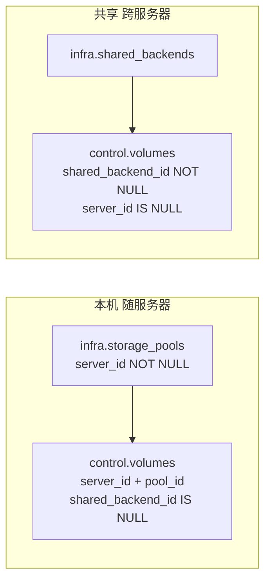
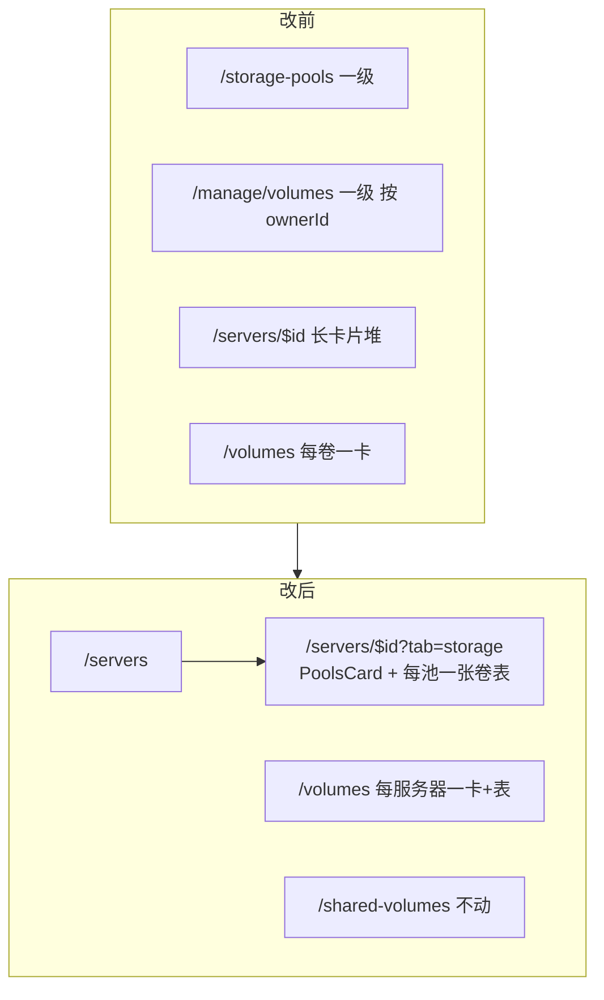
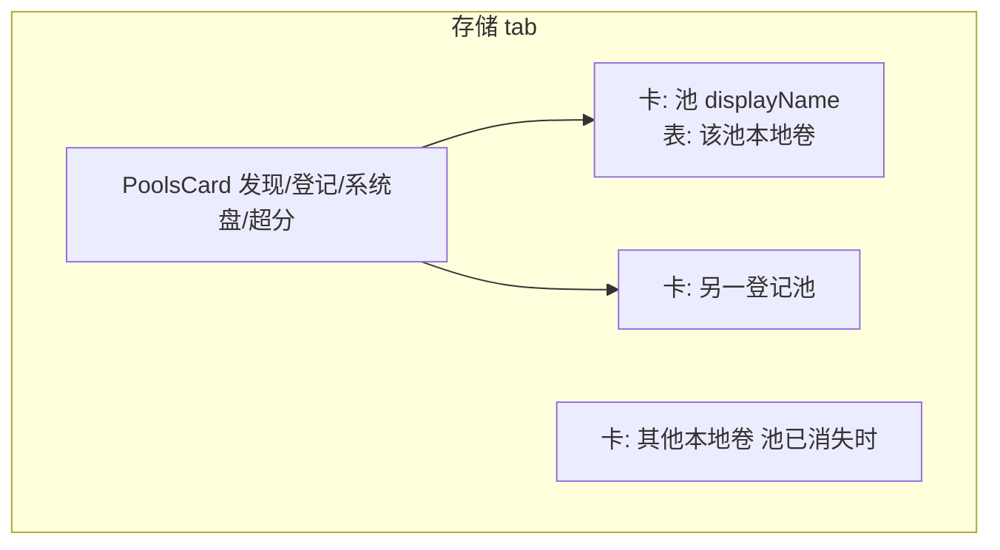

# Nyabase: 以服务器为中心的存储控制台（云厂商式 Tab）

| 字段 | 值 |
| :--- | :--- |
| 文档标题 | Nyabase: server-centric storage UI (tabs like public clouds) |
| 作者 | TBD |
| 日期 | 2026-09-08 |
| 状态 | Draft |
| 范围 | 前端导航 / 服务器详情 Tab / 本机数据卷表；`GET /admin/volumes?serverId=`（无 schema；`listByKind` options 对象）。不扩 catalog AnyCaps。 |
| 产品状态 | **未发布**。无 dual-write、无 feature flag、无长期别名。回滚 = `git revert`。 |
| 实验室 | Lab `20260907-uitest` 保持 UP，禁止 teardown。不提交 git。 |

---

## Overview

Nyabase 把「存储池」和「数据卷管理」做成了侧栏一级产品，但物理模型从来不是这样：`infra.storage_pools.server_id` NOT NULL，本地卷有 `server_id` + `pool_id`，共享卷只有 `shared_backend_id`。执行端拆分已经落地（本地池 list 不再返回 cephfs）。结果是管理员在 `/storage-pools` 和 `/manage/volumes` 看到跨服务器扁平列表，而真正的发现/登记/系统盘/超分已经堆在 `/servers/$id` 的一长串卡片里。

本方案按 AWS/GCP/Azure 实例控制台重组：**存储池从侧栏消失，本机数据卷进入该服务器；服务器详情用 `?tab=` 切换模块。** 用户 `/volumes` 仍是「我的全部本地卷」，按服务器分组为 **一张卡片 + 一张表**，不发明用户服务器控制台。共享卷（`/shared-volumes`、`/manage/shared-volumes`、`/shared-backends`）本轮不动。

除 `GET /admin/volumes?serverId=`（`zResourceIdentity` + `listByKind` options 对象，executor 仍最后）外，本切面是前端 + 路由。无表迁移。不扩 catalog。`control.volumes (server_id)` 已有索引。

---

## Background & Motivation

### 现状（已核对源码）

**管理侧栏**（`packages/frontend/src/components/layout/app-layout.tsx` `adminNavItems`）：

| 路由 | 文案 | Cap |
| :--- | :--- | :--- |
| `/servers` | 服务器 | `ManageServers` |
| `/storage-pools` | 存储池 | `ManageStoragePools` |
| `/manage/volumes` | 数据卷管理 | `ManageVolumes` |
| `/shared-backends` | 共享存储 | `ManageSharedBackends` |
| `/manage/shared-volumes` | 共享卷管理 | `ManageSharedVolumes` |

**用户侧栏**（本轮只改 `/volumes` 的呈现，不改入口）：

- `/volumes` — `volumes-page.tsx`：每卷一张卡的 `ResourceGrid` + `LocalVolumeFormDialog`
- `/shared-volumes` — **本轮禁止迁入服务器**

**管理员服务器详情** `/servers/$id`（`server-detail-page.tsx`，路由 cap = `ManageServers`）目前是单页堆叠：

1. 接入清单（互信 / 池 / 前置检查 / IP 池）
2. 服务器卡扩展（GPU enablement + `ExtensionSlots`）
3. `ConnectCard` + `PreflightCard` 两列
4. `NodeMetricsCard`
5. `PoolsCard`（发现/登记、系统盘池、超分）
6. `CertificateCard`
7. `ResourceIntentFailures`（`/admin/servers/${id}/intents`）

用户没有服务器详情路由。用户在 `/` 看服务器，在 `/volumes` 选服务器建卷。

**存储池独立页** `storage-pools-page.tsx` 对每台服务器 N+1 `GET /admin/servers/:id/storage-pools`，再按服务器分组表格。发现/登记 API 与 `PoolsCard` **完全重复**（`POST .../discover`、`PATCH /admin/storage-pools/:id`）。`queryKeys.storagePools.adminIndex` 只被这一页使用。

**数据卷管理页** `manage-volumes-page.tsx`：`GET /admin/volumes`（无 query），按 `ownerId` 分组，**只读**（无创建/编辑/删除）。每行已展示 `serverId`、`poolName`、容量、已用、挂载数、生命周期、`ResourceIntentHistory`。

**容器详情已是本方案的范本**：`container-detail-page.tsx` + `routes/containers/$containerId.tsx` 的 `validateSearch` → `?tab=`，Radix `Tabs`，按 tab `enabled` 懒加载 Query。

### 痛点

1. 存储池被做成跨服务器一级产品，与 `server_id NOT NULL` 和「CephFS 在共享存储」的产品拆分矛盾。
2. 服务器详情 ~450 行一次性渲染全部卡片，刷新/深链无法停在「存储」或「监控」。
3. 管理员看本地卷必须离开服务器，按租户 UUID 分组，而操作对象是某台机器上的池。
4. 用户 `/volumes` 每卷一张卡，多卷时扫描成本高；「每个数据卷 card 内加一个表格」更贴「按服务器一张卡、卡内是表」。
5. `GET /admin/volumes` 没有 `serverId` 过滤。上限是 `MAX_VOLUMES_PER_USER`（1024）× `MAX_PLATFORM_ACTIVE_USERS`（128）。同仓库的 `GET /admin/containers?serverId=` 和 `GET /admin/shared-volumes?attachableOnServerId=` 已经有按服务器收窄的先例。

### 物理与 API 边界（不变）



- 本地池 list：`GET /admin/servers/:id/storage-pools`（`ManageServers` 或 `ManageGrants`）、`GET /servers/:id/storage-pools`（用户授权池）。执行端拆分后 **不含 cephfs**。
- 本地卷 list：`GET /volumes`（当前用户）、`GET /admin/volumes`（`ManageVolumes`，**今天无 query**）。`VolumeDto.attachments: VolumeAttachmentSummaryDto[]` 已在 list/get 批量填充，禁止为挂载再造 API。
- 共享卷：`zListSharedVolumesQuery.attachableOnServerId` 已存在。本轮不改。

---

## Goals & Non-Goals

### Goals

1. 侧栏去掉「存储池」。深链 `/storage-pools` **删除 file route**（无 redirect 别名；前端无 `notFoundRoute`，实验室书签落到空白 `<Outlet>`，见 Key Decisions）。
2. 侧栏去掉「数据卷管理」。深链 `/manage/volumes` 同样删除路由。管理员在该服务器的 **存储** Tab 管理本机卷。
3. `/servers/$id` 改为云控制台式 Tab，URL `?tab=` 可刷新、可后退。
4. 存储 Tab：现有 `PoolsCard` + **每个存储池一张卡，卡内本地卷表**；新建卷锁定本服务器。
5. 用户 `/volumes` 按服务器分组为卡片，卡体是表格。不新增用户服务器控制台。
6. 中文文案。表面测试更新。实验室用现网 CP 验证（禁止 teardown）。

### Non-Goals

- 不把共享卷、共享存储、共享卷管理迁入服务器。
- 不发明用户 `/servers/$id`。
- 不改 schema、不 dual-write、不上 feature flag、不留永久别名。
- 不改 GPU 核心字段、不引入 Incus cluster/Agent 文案。
- 不把 `GET /admin/volumes` 全量列表改成分页（本轮只加可选 `serverId`）。
- 不改容器详情存储 Tab 的挂载 API，也 **不** 把它的 `queryKey` / `queryFn` 改成 `adminByServer`（它今天仍拉全量 `GET /admin/volumes` + `queryKeys.volumes.admin`；可在后续用同一 query 收窄，**不阻塞本切面**）。
- 不为 `ManageStoragePools` + `ManageGrants`（无 `ManageServers`）保留独立登记页。登记 UI 此后要求 `ManageServers` **且** `ManageStoragePools`（见 Key Decisions / 能力矩阵）。纯 `ManageStoragePools`-only 今天已经 403，不是回归。
- 不把 `GET /admin/catalog/users` 的 AnyCaps 扩到 `ManageVolumes`。管理建卷用 owner UUID 输入。
- 不提交 git。

---

## Proposed Design

### 信息架构



侧栏改后（管理段，只列出变化）：

```
服务器            /servers                 ManageServers
IP 池             /ip-pools                ManageIpPools
共享存储          /shared-backends         ManageSharedBackends   ← 保留
镜像              /images                  ...
...
容器管理          /manage/containers       ManageContainersAny    ← 仍按租户，本轮不改
共享卷管理        /manage/shared-volumes   ManageSharedVolumes    ← 保留
```

删除：`存储池`、`数据卷管理`。

用户段不变：`数据卷` 仍指向 `/volumes`。

### 服务器详情 Tab 壳（云控制台）

Tab 集合（禁止把下列模块塞进「概览」）：

| `tab` | 文案 | 内容 | Query `enabled` |
| :--- | :--- | :--- | :--- |
| `overview` | 概览 | 身份（slug、endpoint、Incus 版本、系统盘池名、超分）、紧凑接入清单（状态 + 链到其它 tab）、**删除仍放页头** | 服务器本体；**池列表整页常开**（清单要「已登记 N 个」，`ServerDto.systemPoolName` 不够） |
| `connect` | 接入 | `ConnectCard`、`CertificateCard`、IP 池提示（链到 `/ip-pools`） | 证书：`canViewCertificate`（与今天相同，可整页） |
| `storage` | 存储 | `PoolsCard` + 每池卷卡 | 池：整页常开；**卷**：`tab === 'storage' && ManageVolumes` |
| `preflight` | 检查 | `PreflightCard`（探针池来自整页池列表） | 前置检查：`tab === 'preflight'`（或进入该 tab 才拉） |
| `metrics` | 监控 | `NodeMetricsCard` | 配置在 `ServerDto.nodeMetrics`，无需新 API |
| `extensions` | 扩展 | 现有 GPU enablement 卡 + `ExtensionSlots` | `extensionsQuery`：`tab === 'extensions'`（`canManageServers` 与今天相同） |
| `activity` | 活动 | `ResourceIntentFailures` `/admin/servers/${id}/intents` | `tab === 'activity'` |

**池 Query 不随 tab 关掉。** 今天 `poolsQuery` 无 `enabled` 门闩，概览接入清单用 `pools.some(pool => pool.registered)` / `已登记 N 个`。`queryKeys.servers.pools(id, true)` 一次 GET，概览 / 存储 / 检查共用。懒加载只用于：卷、前置检查详情、扩展、证书（若不想在概览打证书）、意图。

页头保持：面包屑 `服务器 / {name}`、状态 Badge、`ManageServers` 下的「删除服务器」。删除不藏进概览——云控制台把危险操作放在页级 action，概览只展示清单。

接入清单从整页 Card 收成概览里的紧凑 `<ol>`，每步带状态并 `navigate` 到对应 tab（互信→`connect`，存储池→`storage`，前置检查→`preflight`，IP 池仍是 `/ip-pools`）。

#### URL / Router

照抄容器详情的模块位置，但 **tab 切换不 `replace`**，让浏览器后退在 tab 之间工作（容器详情 `selectTab` 用了 `replace: true`，后退会直接离开页面；本切面按需求保留 tab 历史）。

`parseDetailTab` / `DETAIL_TABS` 今天住在 `container-detail-page.tsx`，两条路由 `import` 进 `validateSearch`。服务器详情只有一条管理路由，仍跟同一模式：

- **导出** `SERVER_DETAIL_TABS` / `ServerDetailTab` / `parseServerDetailTab` 自 `packages/frontend/src/pages/server-detail-page.tsx`（或同目录极薄的 `server-detail-tabs.ts`，页面 re-export，供表面测试读到）。
- `packages/frontend/src/routes/servers/$id.tsx` **只** `import { parseServerDetailTab } from '../../pages/server-detail-page.js'` 填 `validateSearch`。不要把 tab 字面量写进 route 文件。

```ts
// server-detail-page.tsx（或 server-detail-tabs.ts）
export const SERVER_DETAIL_TABS = [
  'overview', 'connect', 'storage', 'preflight', 'metrics', 'extensions', 'activity',
] as const;
export type ServerDetailTab = (typeof SERVER_DETAIL_TABS)[number];

export function parseServerDetailTab(value: unknown): ServerDetailTab {
  return SERVER_DETAIL_TABS.includes(value as ServerDetailTab)
    ? (value as ServerDetailTab)
    : 'overview';
}
```

```ts
// routes/servers/$id.tsx
import { parseServerDetailTab } from '../../pages/server-detail-page.js';

export const Route = createFileRoute('/servers/$id')({
  component: ServerDetailRoute,
  validateSearch: (search: Record<string, unknown>) => ({
    tab: parseServerDetailTab(search.tab),
  }),
});
```

页内（此页不与用户路由共享，`getRouteApi('/servers/$id').useSearch()` 合法）：

```ts
const routeApi = getRouteApi('/servers/$id');
const { tab } = routeApi.useSearch();
const navigate = useNavigate({ from: '/servers/$id' });
const selectTab = (next: ServerDetailTab) => {
  void navigate({ search: (prev) => ({ ...prev, tab: next }) }); // 不 replace
};
```

`Tabs` / `TabsList` / `TabsTrigger` / `TabsContent` 使用已有 `components/ui/tabs.tsx`（与容器详情相同，`TabsList` 已 `flex-wrap`）。根 test id 保持 `server-connect-preflight`（避免无谓打断现有视觉脚本）；新增：

- `data-testid="server-detail-tabs"`
- `data-testid="server-tab-{tab}"`（trigger）
- `data-testid="server-storage-tab"`（存储 `TabsContent`）
- `data-testid="server-volume-table"`（每张卷表；多池时每表都带这个 test id，另加 `data-pool-id`）

#### 必须补 `search` 的现有链接（validateSearch 之后类型会要求）

| 文件 | 动作 | 目标 tab |
| :--- | :--- | :--- |
| `servers-page.tsx` 卡片 `Link` | 进详情 | `overview` |
| `servers-page.tsx` 接入完成后 `navigate` | 进详情 | `connect` |
| `app-layout.tsx` 证书过期条 | 去轮换 | `connect` |
| `ops-page.tsx` 按服务器跳转 | 进详情 | `activity` |

### 存储 Tab 布局



1. **上：现有 `PoolsCard`**。行为、文案、cap 门闩一字不改：
   - 发现：`ManageServers`（嵌套在 `AdminServersController`）
   - 登记/取消登记按钮：`canManageStoragePools`；无权限时保留 `data-testid="storage-pool-register-gated"` 与文案「可以查看存储池，但登记与取消登记需要「管理存储池」权限」
   - 系统盘池 / 超分保存：`PATCH /admin/servers/:id`
   - `ManageServers`-only（Operators）**仍然能看见池表**，与今天 PoolsCard 一致
2. **下：每个已发现的本地池一张 Card**（含未登记——表空，提示「登记后方可建卷」）。卡头：`displayName ?? incusName`、driver、卷数量、该池「新建数据卷」（`ManageVolumes` 且 `registered`）。
3. 卡体：`LocalVolumeTable`（`plane="admin"`，该卡不显示池列）。
4. 若存在 `poolId` 已不在本服务器池列表中的卷（池删除/发现丢失），额外一张「其他本地卷」。**孤儿卡强制显示池列**（`poolName`；卡不再代表一个池，否则不可读）。编辑/删除的 dialog 状态放在 `server-storage-tab.tsx`，不要抬回 `server-detail-page.tsx`。

无 `ManageVolumes` 时：不发 `/admin/volumes`，不渲染卷表，显示一行说明「查看本机数据卷需要「管理本地数据卷」权限」——**不扩大 Operators 的可见面**（今天 Operators 也进不了 `/manage/volumes`）。

### 本地卷表

新建 `packages/frontend/src/components/storage/local-volume-table.tsx`，用户页与管理存储 Tab 共用。PR2 起即带 `plane`，不要靠「看有哪些列」隐式分叉。

```ts
export function LocalVolumeTable({
  volumes,
  plane,
  showPoolColumn,
  canManageContainersAny = false,
  onEdit,
  onDelete,
  testId = 'server-volume-table',
  poolId,
}: {
  volumes: VolumeDto[];
  plane: 'user' | 'admin';
  /** 用户卡、管理孤儿卡必须 true；管理「每池一卡」false。 */
  showPoolColumn: boolean;
  canManageContainersAny?: boolean;
  onEdit?: (volume: VolumeDto) => void;
  onDelete?: (volume: VolumeDto) => void;
  testId?: string;
  poolId?: string; // 写入 data-pool-id；孤儿卡省略
})
```

列：

| 列 | `plane="user"` | `plane="admin"` 且 `showPoolColumn=false` | `plane="admin"` 孤儿卡 `showPoolColumn=true` |
| :--- | :--- | :--- | :--- |
| 名称 | ✓ | ✓ | ✓ |
| 所有者 | — | `ownerId`（monospace；本切面不加 catalog） | 同 |
| 存储池 | ✓（一服务器卡含多池） | — | ✓ `poolName` |
| 容量 | `sizeBytes` | 同 | 同 |
| 已用 | `usedBytes`，`null` →「未知」 | 同 | 同 |
| 挂载 | 有挂载：「挂载于 {containerName}（{containerPath}）」，`data-testid="volume-attachments"`。空挂载：**保留今日 `VolumeCard` CTA** — 「请打开目标容器详情 → 存储 → 挂载」+ `Link` 到 `/containers`。不要用光秃的「未挂载」替换。 | 有挂载：同「挂载于 …」；`canManageContainersAny` 时链 `/manage/containers/$containerId?tab=storage`，否则纯文本。空挂载：管理面用「未挂载」（无用户 CTA）。 | 同管理 |
| 生命周期 | `volumeLifecycleLabel` + attention Badge | 同 | 同 |
| 意图 | **`ResourceIntentFailures` 与 `ResourceIntentHistory` 都要**，路径 `/volumes/${id}/intents`，`admin={false}`（今日 `VolumeCard` 两份都有）。行内展开，不要丢 Failures。 | 折叠 `ResourceIntentHistory`，路径 `/admin/volumes/${id}/intents`，`admin`。管理页今日无 Failures 条，不新加。 | 同管理 |
| 操作 | `onEdit` / `onDelete` 回调（父级对话框） | 同 | 同 |

**表组件内的 admin URL 必须落在 `plane === 'admin'` 分支**（隔离测试会扫这个文件）。用户面 `/volumes/${id}/intents` 与 `/containers` 只出现在 `plane === 'user'`。

字段全部来自现有 `VolumeDto`，**不扩展 DTO**。挂载摘要已在 `toDtos` → `attachmentSummariesByVolumeIds` 批量 join，禁止 N+1。

空态：该池暂无本地数据卷 + 有权限时的「新建数据卷」。

轮询：管理表沿用 `queryPollInterval(..., { activeIntervalMs: 5_000 })`（今天 `manage-volumes-page` 已如此）。用户表保持手动刷新（今天 `/volumes` 不 poll）。用户页 test id 用 `volume-server-table`（经 `testId` prop），不要和管理面 `server-volume-table` 混用。

### 新建/编辑卷（锁定服务器）

扩展 `LocalVolumeFormDialog`，不新开平行对话框：

```ts
export function LocalVolumeFormDialog({
  volume,
  open,
  onOpenChange,
  plane = 'user',
  lockedServerId,
  lockedPoolId,
}: {
  volume?: VolumeDto;
  open: boolean;
  onOpenChange: (open: boolean) => void;
  plane?: 'user' | 'admin';
  lockedServerId?: string;
  lockedPoolId?: string;
})
```

| | 用户 | 管理 |
| :--- | :--- | :--- |
| 列表失效 | `queryKeys.volumes.user` | `invalidateQueries({ queryKey: queryKeys.volumes.admin })`（前缀覆盖 `adminByServer`；**不要**改容器详情的 key） |
| 创建 | `POST /volumes`，禁止 `ownerId`（控制器已拒） | `POST /admin/volumes`，**必填 `ownerId`** |
| 修改 | `PATCH /volumes/:id` | `PATCH /admin/volumes/:id` |
| 删除 | `DELETE /volumes/:id` | `DELETE /admin/volumes/:id` |
| 池 | `GET /servers/:id/storage-pools` | `GET /admin/servers/:id/storage-pools`（已登记） |
| 容量提示 | `GET /servers/:id/storage-capacity` → 该用户磁盘额度剩余 | **不要**把 `GET /admin/servers/:id/storage-capacity` 当成用户额度。`capacityForAdmin` 把 `grantLimitBytes` / `availableBytes` 设为 `null`，并汇总 **全部** owner；对话框会显示「额度不限」。管理面只展示 **池物理剩余**（`pools[].availableBytes`，含超分）+ `quotaEffective`。文案：「池剩余（物理，含超分；不是该用户的磁盘额度）。」 |
| 服务器选择 | 可锁 `lockedServerId`（用户卡上「新建」） | 始终锁当前服务器 |
| 所有者 | 无 | **UUID 文本输入**（`zCreateVolumeRequest.ownerId`）。本切面不扩 catalog AnyCaps，也不阻塞卷表 |

`createForAdmin` 走 `resolveScopeForAdmin` + `assertCapacityForDeltaForAdmin`：只卡池物理容量，**不**断言目标 owner 的 server/pool grant。这是现有后端行为；管理页今天只读，本切面第一次把它暴露到 UI。接受：管理员可以给某用户建超出其 grant 的卷；用户侧后续操作仍受 grant 约束。不新开 `ownerId=` 容量查询。

`quotaEffective !== true` 创建拦截、缩容编排对话框保持不变。

Dialog 的 `plane === 'admin'` 分支会包含 `/admin/volumes` 等字符串。隔离测试：

- `volumes-page.tsx` 继续 **不含** `/admin/`
- `local-volume-form-dialog.tsx` 断言 admin 路径落在 `plane === 'admin'`
- `local-volume-table.tsx` 断言 `/manage/containers` 与 `/admin/volumes/` 落在 `plane === 'admin'`
- 真正 `api.get('/admin/volumes?serverId=')` 的文件是 `server-storage-tab.tsx`（或详情页若未拆出），隔离测试改指向该文件，**不要**指向 presentational 的 table

今天 `manage-volumes-page` 只读。PR2b 在存储 Tab **补齐** 创建/编辑/删除，否则管理员去掉一级页后无法在 UI 里改本地卷。后端 admin mutate API 已存在。编辑/删除 `ConfirmDialog` 与 `LocalVolumeFormDialog` 的 open state 放在 `server-storage-tab.tsx`。

### 用户 `/volumes`

**选择：保留用户一级「数据卷」，按服务器分组；不发明用户服务器控制台。**

```
/volumes
  Card 服务器 A          ← 标题是名字，不可点（用户无 /servers/$id）
    额度剩余 chip（现 ServerDiskRemainingChip 挪进卡头）
    Table 该服务器的卷
    新建（lockedServerId=A）
  Card 服务器 B
    ...
```

- 数据：继续一次 `GET /volumes` + `GET /servers`。用户卷集 ≪ 管理面全量，**客户端按 `serverId` 分组**，不给用户 list 加 query。
- 有授权、零卷的服务器：仍渲染空表 + CTA（与「按服务器一张卡」一致）。
- `serverId` 不在 `/servers` 里的卷：一张「未知服务器」卡，无新建。
- `LocalVolumeFormDialog` 页级「新建数据卷」仍可选任意服务器；卡内新建预填该服务器。
- 删除确认仍在 `volumes-page.tsx`（表只发 `onDelete`）。
- **意图失败 + 操作历史 + 空挂载 CTA 都进 `LocalVolumeTable` `plane="user"`**，与今日 `VolumeCard` 对齐：`ResourceIntentFailures` 与 `ResourceIntentHistory`（`/volumes/${id}/intents`，`admin={false}`）；空挂载文案「请打开目标容器详情 → 存储 → 挂载」+ 链到 `/containers`。不是「未挂载」。
- 共享卷入口文案保留：「共享卷请到「共享卷」」。
- PR3 把 `volume.attachments` / `挂载于` / `请打开目标容器详情` / `ResourceIntentFailures` / `ResourceIntentHistory` / `/volumes/${volume.id}/intents` 从 page 挪进 table。`lane-d-product.surface.test.ts` 必须改读 table 文件（或 `volumes-page.tsx` + table 的 join），否则现有 `read('pages/volumes-page.tsx')` 会红。

### `/storage-pools` 与 `/manage/volumes` 删除

未发布产品：**删页面 + 删 file route，不留 redirect 别名。** 前端没有 `notFoundComponent` / `notFoundRoute`（`routes/__root.tsx` 只有 `AppLayout` + `<Outlet />`）。实验室书签落到 **侧栏仍在、主区空白**，不是 HTTP 404 页，也不是专用「未找到」视图。操作员从「服务器」进详情。`routeTree.gen.ts` 由 `TanStackRouterVite()` 在下次 `vite build` / `vite` 时重生，不要手改当源。

删除文件：

- `packages/frontend/src/pages/storage-pools-page.tsx`
- `packages/frontend/src/routes/storage-pools/index.tsx`
- `packages/frontend/src/pages/manage-volumes-page.tsx`
- `packages/frontend/src/routes/manage/volumes/index.tsx`

`queryKeys.storagePools.adminIndex` 随页删除；`query-keys.test.ts` 去掉该字面量。按服务器的 `queryKeys.servers.pools(id, admin)` 保留（PoolsCard / 授权面板仍用）。

视觉脚本 `packages/frontend/visual/capture.mjs`：

- 删 `{ name: 'storage-pools', path: '/storage-pools' }`、`{ name: 'manage-volumes', path: '/manage/volumes' }`
- 加 `{ name: 'server-detail-storage', path: '/servers/srv-1?tab=storage' }` 以及 connect / preflight / metrics 至少各一张（否则 tab 壳没有回归图）
- mock：`GET /admin/volumes?serverId=srv-1` 与无 query 的 `GET /admin/volumes` 都返回同一夹具卷

### 能力矩阵（不扩大 Operators）

系统组（`groups.service.ts`）：

- **Administrators**：全部 cap → 看见所有 tab 与动作。
- **Operators**：`ManageServers` 等，**无** `ManageStoragePools` / `ManageVolumes` → 能进服务器详情、能看 PoolsCard、能发现；不能登记池、不能看/改卷表。与今天一致。
- **Users**：无管理侧栏。`/volumes` 仍是自己的本地卷。

**真正会回归的自定义组合是 `ManageStoragePools` + `ManageGrants`（无 `ManageServers`），不是「只有 ManageStoragePools」。**

今天的门闩：

| 面 | Cap | 说明 |
| :--- | :--- | :--- |
| 路由 `/storage-pools` | `ManageStoragePools` only | `routes/storage-pools/index.tsx` |
| `GET /admin/servers`、`GET /admin/servers/:id/storage-pools` | `ManageServers` **或** `ManageGrants` | 所以 Grants+Pools 能列出并登记 |
| `POST .../storage-pools/discover` | 类级 `ManageServers` | Grants+Pools **不能**发现 |
| `PATCH /admin/storage-pools/:id` | `ManageStoragePools` | 登记 |
| `GET /admin/servers/:id`、路由 `/servers/$id` | `ManageServers` | Grants+Pools **进不了**详情 |

纯 `ManageStoragePools`（无 Grants、无 Servers）今天对 `/admin/servers` 已是 403，独立页本来就空，**不是本切面引入的洞**。授权面板（`canonical-grant-panel.tsx`）N+1 同一套池 API 只为了发 grant，**没有**链到 `/storage-pools` 或 `/servers/$id`，不能当登记 UI。

**接受的耦合：** 登记 UI 此后要求 `ManageServers` **且** `ManageStoragePools`。发现仍是 `ManageServers`。不为 Grants+Pools 人格保留独立页或跳转页。`ManageVolumes` 无 `ManageServers` 同样失去一级 UI（API 仍在）。

---

## API / Interface Changes

### 已核实：`zListVolumesQuery` 不存在

`AdminVolumesController.list()` 无 `@Query`，`VolumesService.listForAdmin()` 调用 `repository.listByKind('local')`，只滤 `shared_backend_id IS NULL`。用户 `listForUser` 加 `owner_id`。

共享卷已有：

```ts
export const zListSharedVolumesQuery = z.object({
  attachableOnServerId: zResourceIdentity.optional(),
}).strict();
```

管理容器已有更松的 `@Query('serverId')`（无 zod）。本地卷跟 **共享卷的 zod.strict**，避免未知键静默通过。

### 新增（未发布，无 schema）

`packages/common/src/protocol/rest-schema.ts`：

```ts
export const zListVolumesQuery = z.object({
  serverId: zResourceIdentity.optional(),
}).strict();
export type ListVolumesQuery = z.infer<typeof zListVolumesQuery>;
```

`AdminVolumesController`（今天 `volumes.controller.ts` **没有** `Query` import，`list()` 无 `@Query`）：

```ts
@Get()
list(@Query() query: Record<string, unknown>) {
  const parsed = zListVolumesQuery.parse(query);
  return this.service.listForAdmin(parsed.serverId); // string | undefined；undefined = 全量本地卷
}
```

**参数形状必须一致。** 服务是 `listForAdmin(serverId?: string)`，控制器传 **字符串或省略**，不要传 `{ serverId }`（那是 `AdminContainersController` → `containers.listForAdmin({ serverId })` 的形状）。对象当 `serverId` 会把 `WHERE server_id = $1` 绑成 `[object Object]`。`parsed.serverId` 缺省即 `undefined`，全量语义与今天 `listForAdmin()` 无参相同。

**禁止** `listByKind('local', undefined, serverId)`。现场签名是 `listByKind(kind, ownerId?, executor: VolumeExecutor = this.database)`，第三参是 Kysely/事务句柄。传入 UUID 会在 `selectFrom` 上炸掉。现有调用方都只传 1–2 个参数：

```ts
this.repository.listByKind('local', ownerId); // listForUser
this.repository.listByKind('local');         // listForAdmin
this.repository.listByKind('shared', ownerId);
this.repository.listByKind('shared');
```

改成 options 对象，**executor 保持最后**：

```ts
listByKind(
  kind: 'local' | 'shared',
  options: { ownerId?: string; serverId?: string } = {},
  executor: VolumeExecutor = this.database,
) {
  let query = executor.selectFrom('control.volumes').selectAll().orderBy('created_at', 'desc');
  query = kind === 'local'
    ? query.where('shared_backend_id', 'is', null)
    : query.where('shared_backend_id', 'is not', null);
  if (options.ownerId) query = query.where('owner_id', '=', options.ownerId);
  if (options.serverId) query = query.where('server_id', '=', options.serverId);
  return query.execute();
}
```

全部调用方一并改（同 PR2a）。**只改 `listByKind` 的实参**；共享 list 的 `filterAttachableShared` 体保持 `volumes.service.ts` 现状，不要在本设计里重贴一份会丢掉过滤的方法体。

```ts
// listForUser
this.repository.listByKind('local', { ownerId })

// listForAdmin(serverId?: string)  — 与控制器同一形状
this.repository.listByKind('local', { serverId })

// listSharedForUser — 随后仍 filterAttachableShared(rows, attachableOnServerId)
this.repository.listByKind('shared', { ownerId })

// listSharedForAdmin — 随后仍 filterAttachableShared(rows, attachableOnServerId)
this.repository.listByKind('shared', {})
```

```ts
async listForAdmin(serverId?: string): Promise<VolumeDto[]> {
  return this.toDtos(await this.repository.listByKind('local', { serverId }));
}
```

`serverId` 过滤走已有 `CREATE INDEX volumes_server_idx ON control.volumes (server_id)`。无 `serverId` 时语义与今天相同。

`zListVolumesQuery.serverId` 用 **`zResourceIdentity`**（与 `zListSharedVolumesQuery.attachableOnServerId` 相同），**不是** `zUuid`。`zResourceIdentity` 是 `/^[A-Za-z0-9][A-Za-z0-9._:-]*$/`（1–128）。`"srv-1"`（视觉夹具）和 `"not-a-uuid"` **都会通过**。协议测试写「拒绝多余键 / 空对象 ok / 接受 resource id」，**不要**写「拒绝非 UUID」。空字符串、含空格的值仍 400。

用户 `GET /volumes` **不加** query：用户页需要全部分组，一次拉取即可。

前端 query key：

```ts
volumes: {
  user: ['volumes', 'user'] as const,
  admin: ['volumes', 'admin'] as const,
  adminByServer: (serverId: string) => ['volumes', 'admin', serverId] as const,
  // ...
}
```

存储 Tab：`api.get<VolumeDto[]>(`/admin/volumes?serverId=${id}`)`，`queryKey: queryKeys.volumes.adminByServer(id)`。`invalidateQueries({ queryKey: queryKeys.volumes.admin })` 仍能打到 by-server（前缀匹配）。反向不成立：只 invalidate `adminByServer` 打不到容器详情的全量 `queryKeys.volumes.admin`。存储 Tab 的 mutate **必须** invalidate admin 前缀。PR2 **不要**把 `container-detail-page.tsx` 的 `queryKey`/`queryFn` 改成 `adminByServer`「图个一致」——容器详情继续全量 list。

### 调用方（管理存储 Tab）

```ts
const volumesQuery = useQuery({
  queryKey: queryKeys.volumes.adminByServer(id),
  queryFn: () => api.get<VolumeDto[]>(`/admin/volumes?serverId=${id}`),
  enabled: tab === 'storage' && canManageVolumes,
  refetchInterval: (query) => queryPollInterval(query.state, { activeIntervalMs: 5_000 }),
});
```

客户端再按 `poolId` 分到各池卡。单次请求，无 N+1。

### 所有者输入（管理创建）— 本切面不扩 catalog

`GET /admin/catalog/users` 今天 `@RequireAnyCaps(ManageUsers, ManageGroups, ManageGrants)`。把 `ManageVolumes` 加进去是一次真实的授权扩大（字段虽 purpose-safe）。**本切面不做。** 管理对话框用 owner UUID 文本框（`zCreateVolumeRequest.ownerId`）。实验室 Administrators 从「用户」页复制 id。卷表不依赖 catalog。若后续 IAM 同意再单开 PR 扩 AnyCaps + 下拉，不阻塞 PR2a/2b。

---

## Data Model Changes

**无。** 不改表、不改 `VolumeDto`、不加 `ownerName`。

过滤使用现成列与索引。回滚 = revert 提交（本轮甚至不 commit）。

---

## Alternatives Considered

### A. `/storage-pools` 与 `/manage/volumes` 留 redirect 别名

- 优点：实验室书签、视觉脚本少改一行。
- 缺点：未发布产品明确禁止长期别名；`routeTree` 会永远带着假路由；侧栏删了但 URL 还活着，和下掉一级产品的目标相反。
- **弃用。** 删路由 + 空白 Outlet，不留 redirect。

### B. 用户也做服务器控制台（`/servers/$id` 仅卷 Tab）

- 优点：和「数据卷管理进服务器」的字面需求更齐。
- 缺点：用户 `UserServerDto` 没有连接/证书/前置检查/池登记；要新路由、新 cap 故事、和 dashboard 双入口。需求允许「点服务器名哪也不去」。
- **弃用。** `/volumes` 按服务器卡片+表。

### C. 存储 Tab 只做一张「本地数据卷」总表

- 优点：少卡片。
- 缺点：池才是本机存储产品；发现/登记已经按池；「每张卡一张表」按池切比按整机切更接近 AWS EBS「按 volume type / 按 instance 存储」。
- **弃用为默认。** 每池一卡。若某实验室机器只有一个登记池，视觉上等于一张总表。

### D. 管理卷继续客户端过滤全量 `GET /admin/volumes`

- 优点：零后端改动，实验室不用重启 CP。
- 缺点：上限 128×1024；每次进存储 Tab 都物化全平台本地卷再在浏览器滤。索引已在。共享卷/容器 list 已按服务器收窄。
- **弃用为默认。** 加 `?serverId=`。实验室验证 PR2a 时 **原地重启 CP 进程**（禁止 `e2e.sh down` / 拆 lab）。

### E. 管理面保留按 owner 的跳转页

- 优点：跨租户「谁占用了盘」仍有一页。
- 缺点：需求默认删页；跨租户视图与「卷属于服务器」的 IA 打架；真正的配额仍在用户授权。
- **弃用。** 存储 Tab 表有所有者列，够排障。

---

## Security & Privacy Considerations

| 风险 | 严重度 | 缓解 |
| :--- | :--- | :--- |
| `ManageStoragePools`+`ManageGrants`（无 `ManageServers`）失去登记 UI | 中（非系统组） | **接受。** 登记此后要 `ManageServers` ∧ `ManageStoragePools`。纯 Pools-only 今天已 403。授权面板不是替代。API `PATCH /admin/storage-pools/:id` 仍在。 |
| 无 `ManageServers` 的 `ManageVolumes` 失去一级 UI | 低 | 接受。API 仍在。 |
| 管理创建绕过 owner grant | 中（现有 API，新暴露到 UI） | 文案写明只卡池物理容量。不新开 for-owner capacity。用户侧后续操作仍受 grant 约束。 |
| `GET /admin/volumes?serverId=` 跨租户 | 无新增 | 仍要求 `ManageVolumes`；与全量 list 同 cap，只是更窄。 |
| 用户页误调 `/admin/volumes` | 中 | 隔离测试继续禁 `volumes-page.tsx` 的 `/admin/`。Table/dialog 的 admin URL 门闩 `plane`。真正的 GET 断言打在 `server-storage-tab.tsx`。 |
| `zListVolumesQuery.strict()` 把未知 query 变成 400 | 低 | 前端只发 `serverId`。无 query 保持旧客户端兼容。 |
| 存储 Tab 把池暴露给 Operators | 无新增 | 今天 PoolsCard 已如此。卷表仍门闩 `ManageVolumes`。 |
| 删除独立页导致书签空白主区 | 低 | 未发布；不是 HTTP 404 页。操作员走 `/servers`。 |

威胁模型无变化：JWT + `CapabilitiesGuard`。无新公开路由。无新 PII 字段离开服务端。

---

## Observability

- 无新后端指标。卷 list 过滤是同一条 SQL 加 `WHERE server_id = $1`。
- 前端：存储 Tab 走现有 `QueryView` / `QueryErrorState`；池失败与卷失败分开（`PoolsCard` 已有 `onRetryPools`）。
- 意图：用户卷行内 `ResourceIntentFailures` + `ResourceIntentHistory`；管理卷行内仅 History；活动 Tab 是服务器 `ResourceIntentFailures`。不要在存储 Tab 再堆一份服务器意图。
- 实验室验证（禁止 teardown）：
  1. `pnpm --filter @nyabase/frontend build`（或 dev 代理）。CP 已在跑。
  2. PR2a 部署 query 参数后 **原地重启 backend 进程**，不要 `e2e.sh down`。
  3. 管理员：侧栏无「存储池」「数据卷管理」；打开 `/servers/{labServer}?tab=storage`；发现/登记仍可用；卷表列出该机本地卷；新建锁在该机。
  4. `/storage-pools`、`/manage/volumes` → **路由未匹配 / 主区空白**（不是 HTTP 404 页）。
  5. 用户 `/volumes`：每台可见服务器一张卡，卡内表；共享卷入口仍在。
  6. 刷新 `/servers/$id?tab=storage` 停在存储。后退回到上一 tab。
  7. 概览清单仍显示「已登记 N 个」（池 Query 整页常开）。

---

## Rollout Plan

未发布、无 flag。按 PR 落地；每 PR 可独立 review。实验室保持 UP。不 commit（由后续实现者按 PR 提交）。

回滚：`git revert` 该 PR。无数据迁移可逆。若 PR2a 已重启 CP，revert 后再重启一次即可；旧前端在无 query 的 `GET /admin/volumes` 上仍工作（无 `serverId` 保持全量）。PR2a 与 PR2b 必须能各自 revert：2a 只加可选 query，不删页面；2b 删 `/manage/volumes` 但依赖 2a 的 filter（revert 2b 会回到全量管理页，filter 可留着无害）。

`zListVolumesQuery.strict()` 一旦上线，乱传 query 的客户端会 400——仓库内唯一管理调用方是本前端，与 2b 同步。2a 上线时未改的前端不发 query，仍兼容。

---

## Testing

### 表面测试（`lane-d-product.surface.test.ts`）

**PR1（删 `storage-pools-page.tsx` 的同一 PR 必须改测试，否则 `read()` ENOENT）：**

- layout **不含** `to: '/storage-pools'`。
- `server-detail-page.tsx`（或它 re-export 的 `server-detail-tabs.ts`）含 `Tabs`、`parseServerDetailTab`、七个 tab 字面量。**不要**要求这些字符串出现在 `routes/servers/$id.tsx`。
- `splits local and shared...`：删对 `pages/storage-pools-page.tsx` 的 `read`。CephFS 断言改打 `components/servers/pools-card.tsx` 的**现有**句子 `/CephFS 执行端/`（现场文案是「CephFS 执行端请到「共享存储」登记。」，**不是**独立页的「CephFS 执行端在「共享存储」登记」——逐字搬正则会红）。`not.toMatch(/sharedBackendId:/)` 与 `not.toMatch(/isLocalStoragePool/)` 已在 PoolsCard 上，保留。独立页的 `not.toMatch(/pool\.shareable/)` **丢掉**（PoolsCard 从未使用该标识）。
- 保留 PoolsCard 的 `ManageStoragePools` / `可以查看存储池，但登记与取消登记需要「管理存储池」权限` 断言（已有用例）。

**PR2b（删 `manage-volumes-page.tsx` 的同一 PR 必须改测试，否则 ENOENT）：**

- `admin volumes nav requires ManageVolumes`：layout **不含** `to: '/manage/volumes'`；`server-storage-tab.tsx`（真正 `api.get('/admin/volumes?serverId=')` 的文件）含 `ManageVolumes`、`/admin/volumes?serverId=`、`server-volume-table`。不要把 GET 断言打在 presentational 的 `local-volume-table.tsx`。
- `shows typed volume attachments...`：PR2b 还没改用户页，此用例仍读 `volumes-page.tsx`。等到 PR3 再迁。

**PR3：**

- `shows typed volume attachments...` 改读 `local-volume-table.tsx`（或 page+table join）：`volume.attachments`、`挂载于`、`请打开目标容器详情`、`ResourceIntentFailures`、`ResourceIntentHistory`、`/volumes/${volume.id}/intents`、`not.toMatch(/volumeAttachments\()/`。`volumes-page.tsx` 仍须含 `volume-server-table`，且 **不含** `/admin/`。
- 「volume remount… quotaEffective」继续 join dialog，不必迁。

`user-admin-isolation.surface.test.ts`：

- `volumes-page` 用例全程保留（永不 `/admin/`、永不 `ManageVolumes`）。
- PR2b：**删除** `readPage('manage-volumes-page.tsx')`。改为：
  - `server-storage-tab.tsx`（或未拆时的详情页）匹配 `api.get<VolumeDto[]>(\`/admin/volumes?serverId=${...}\`)`，不匹配用户 `'/volumes'`。
  - `local-volume-table.tsx`：`/admin/` 与 `/manage/containers` 仅出现在 `plane === 'admin'` 分支（可用相邻上下文正则）。
  - `local-volume-form-dialog.tsx`：`/admin/volumes` 仅出现在 `plane === 'admin'`。

`query-keys.test.ts`：PR1 删 `storagePools.adminIndex`；PR2b 加 `volumes.adminByServer('s1') === ['volumes', 'admin', 's1']`，且前缀等于 `volumes.admin`。PR2a 不必改前端 keys。

### 协议 / 后端（PR2a）

- `packages/common/src/__tests__/protocol.test.ts`：**没有**现成的 `zListSharedVolumesQuery` 用例可抄。新写 `zListVolumesQuery`：接受 `{}`、接受 `{ serverId: 'srv-1' }`、接受 UUID、**拒绝多余键**、拒绝空字符串。不要断言「拒绝非 UUID」。
- pg：新建 `packages/backend/src/volumes/volumes.list.pg.test.ts`（或加在 `volumes.attachments.pg.test.ts`）。`listForAdmin(serverId)` 只返回该机本地卷，不含共享卷、不含其它 `server_id`；`listForAdmin()` 无参仍全量本地。`volumes.service.test.ts` 是 resize-policy，**不要**把 list 断言塞进去。

### 视觉

更新 `capture.mjs` 路径（见上）。pathname mock 已把 `/admin/volumes?serverId=srv-1` 当成 `/admin/volumes`，额外 mock 行无害但非必须。本切面不把视觉 PNG 当门禁。

### e2e

现有 `e2e/specs/40-storage/storage.spec.ts` 已 `GET /api/admin/volumes` 无 query，**必须继续绿**。

**PR2a 必做（不是可选、不留给 PR1）：** 同文件加 `GET /api/admin/volumes?serverId=${seedState.server.id}`：只返回该 server 的本地卷；不含共享卷；不含其它 server。非法多余 query key 期望 400（`.strict()`）。无 `serverId` 的旧 GET 仍全量。

---

## Risks

| 风险 | 严重度 | 缓解 |
| :--- | :--- | :--- |
| `server-detail-page.tsx` 在 Tab 壳 + 卷表之后继续膨胀 | 中 | PR1 只搬已有卡片；卷表进 `local-volume-table.tsx`；存储 Tab 容器进 `server-storage-tab.tsx`（含 edit/delete dialog state）。 |
| `LocalVolumeFormDialog` 双平面变复杂 | 中 | `plane` / `lockedServerId` / `lockedPoolId` 显式 props；隔离测试锁 `plane` 分支。 |
| PR2a 后端与已运行 CP 不同步 | 中 | 原地重启；2a 上线前前端不发 query，全量 list 仍正确。禁止客户端过滤当长期路径。 |
| 把 `listByKind` 第三参当成 serverId | 高 | options 对象；pg 测试；见 API 节。 |
| 概览清单缺「已登记 N 个」 | 中 | 池 Query 整页常开。 |
| Tab 历史与容器详情不一致（push vs replace） | 低 | 有意为之。 |
| 视觉 shots / 评论仍引用已删页 | 低 | 同步 `capture.mjs`。 |
| 授权面板仍 N+1 拉每台服务器的池 | 无本轮 | 不在范围。 |

---

## Open Questions

1. ~~管理创建是否把 `ManageVolumes` 加进 catalog users AnyCaps？~~ **已决：不加。** Owner UUID 输入。后续若 IAM 同意再单开 PR。
2. **扩展 Tab 在 `extensionsQuery.data.length === 0` 时是否隐藏 trigger？** 默认 **仍显示**，空态「此服务器没有可启用的卡扩展」。避免 tab 集合随异步查询跳动。
3. **容器详情管理存储是否跟进 `?serverId=`？** 默认 **本切面不做**，且 PR2 **禁止**改它的 `queryKey`/`queryFn`。同一 query 参数可后续复用。

---

## References

- `packages/frontend/src/components/layout/app-layout.tsx` — 侧栏
- `packages/frontend/src/pages/server-detail-page.tsx` — 今日卡片堆
- `packages/frontend/src/pages/storage-pools-page.tsx` — 将删除
- `packages/frontend/src/pages/manage-volumes-page.tsx` — 将删除
- `packages/frontend/src/pages/volumes-page.tsx` — 用户本地卷
- `packages/frontend/src/pages/container-detail-page.tsx` — `?tab=` / Tabs 范本
- `packages/frontend/src/components/servers/pools-card.tsx` — 池登记 UI 与 cap 文案
- `packages/frontend/src/components/storage/local-volume-form-dialog.tsx` — 将支持 admin plane
- `packages/frontend/src/lib/lane-d-product.surface.test.ts` — 产品表面门禁
- `packages/backend/src/volumes/volumes.controller.ts` — `AdminVolumesController.list` 无 query
- `packages/backend/src/volumes/volumes.repository.ts` — `listByKind`
- `packages/backend/src/containers/admin-containers.controller.ts` — `?serverId=` 先例
- `packages/common/src/protocol/rest-schema.ts` — `zListSharedVolumesQuery` 先例
- `packages/common/src/protocol/rest.ts` — `VolumeDto.attachments`
- `packages/backend/src/persistence-pg/migrations/000001_initial.sql` — `volumes_server_idx`
- `packages/backend/src/groups/groups.service.ts` — Operators 不含 `ManageVolumes` / `ManageStoragePools`
- `plans/storage-pool-executor-surface.md` — 本地池 vs 共享执行端
- `plans/frontend-architecture.md` — Page/Tabs/URL 真源约定

---

## Key Decisions

1. **`/storage-pools` 与 `/manage/volumes`：删除 file route，不留 redirect。** 前端无 notFound 路由 → 书签是空白 Outlet，不是 HTTP 404 页。实验室从「服务器」进。
2. **用户不发明服务器控制台。** `/volumes` 按服务器一张卡、卡内一张表。服务器名不可点。共享卷留在 `/shared-volumes`。
3. **管理本地卷/池的真源是 `/servers/$id?tab=storage`。** 进页要 `ManageServers`。登记要 `ManageServers` **且** `ManageStoragePools`（接受 `ManageStoragePools`+`ManageGrants` 无独立登记 UI 的回归）。卷 CRUD 要 `ManageVolumes`。Operators 继续能看池、不能看卷。纯 `ManageStoragePools`-only 今天已 403，不是新洞。
4. **存储 Tab = `PoolsCard` + 每个本地池一张卷卡（表）。** 孤儿卷卡强制显示池列。不是一张整机总表，也不是每卷一卡。
5. **删除按钮留在页头**，不藏进概览。概览只放身份 + 紧凑清单。**池 Query 整页常开**（清单要登记数）。
6. **`?tab=` 用 history push，不用 `replace: true`。** `parseServerDetailTab` 导出自体详情页（容器先例），route 只 import。
7. **加未发布 `GET /admin/volumes?serverId=`**：`zListVolumesQuery` 用 `zResourceIdentity`（不是 `zUuid`）；`listByKind` 改为 `{ ownerId?, serverId? }` options，executor 仍最后。**`listForAdmin(serverId?: string)` 与控制器 `listForAdmin(parsed.serverId)` 同一形状**（不要传 `{ serverId }`）。用户 `GET /volumes` 不加 query。无 schema。禁止客户端全量过滤当长期方案。PR2a e2e 必做该 filter。
8. **管理存储 Tab 提供创建/编辑/删除。** Dialog `plane` + `lockedServerId`。管理面容量提示是池物理剩余，**不是** tenant 额度；`createForAdmin` 不卡 owner grant（现有后端）。`LocalVolumeTable({ plane, showPoolColumn })`。Dialog state 在 `server-storage-tab.tsx`。用户面行保留今日 `VolumeCard` 的 `ResourceIntentFailures` + `ResourceIntentHistory` + 空挂载 CTA（链 `/containers`）。
9. **Owner 用 UUID 输入。不扩 catalog AnyCaps。** 卷表不依赖 catalog。
10. **无 dual-write、无 flag、无别名。** 回滚 = git revert。Lab `20260907-uitest` 保持 UP。不在本设计任务里 commit。
11. **PR2 拆成 2a（协议+repo+e2e filter）与 2b（表+dialog+删 `/manage/volumes`）。** 各自可 review / revert。容器详情的 volumes queryKey 本切面不动。

---

## PR Plan

每个 PR 可独立 review、可独立 revert。实验室不 teardown。实现阶段再 commit。

### PR 1 — 服务器详情 Tab 壳；池进入存储；删除 `/storage-pools`

**范围（纯前端/路由）**

- `server-detail-page.tsx`：导出 `SERVER_DETAIL_TABS` / `parseServerDetailTab`；Radix Tabs；现有卡片按 tab 拆；概览紧凑清单（用整页 `poolsQuery` 显示「已登记 N 个」）
- `routes/servers/$id.tsx`：`validateSearch` import parser；**不**内联 tab 字面量
- 池 Query **整页常开**；preflight / extensions / intents 按 tab `enabled`；证书维持今天的 `canViewCertificate`
- 更新四处 `/servers/$id` 导航的 `search`
- 侧栏删除「存储池」
- 删除 `storage-pools-page.tsx` 与 `routes/storage-pools/`（**同一 PR** 改所有 `read('pages/storage-pools-page.tsx')`）
- 表面测试：无 `/storage-pools`；详情含 `Tabs` + `parseServerDetailTab`；CephFS 断言改为 PoolsCard 的 `/CephFS 执行端/`；丢掉 `pool.shareable`
- `queryKeys.storagePools.adminIndex` 删除
- `visual/capture.mjs`：去掉 storage-pools 页；增加 `?tab=` shots

**验证：** `pnpm --filter @nyabase/frontend test` 与 `typecheck`；重建 frontend dist；实验室打开 `/servers/{id}?tab=storage` 只看到 PoolsCard（卷表在 2b）；`/storage-pools` 主区空白；概览仍显示已登记池数。

**非目标：** 卷表、删 `/manage/volumes`、后端。

### PR 2a — `GET /admin/volumes?serverId=`（协议 + repo + 测试）

**范围（无 UI 删除、无 catalog 变更）**

- common：`zListVolumesQuery`（`zResourceIdentity`，`.strict()`）+ `protocol.test.ts`（空对象 / resource id / 多余键）
- backend：`listByKind(kind, { ownerId?, serverId? }, executor)`；更新全部 4 个调用方；`AdminVolumesController` `@Query` + parse；`Query` import
- `volumes.list.pg.test.ts`：按 server 过滤、排除共享与其它 server、无参全量
- e2e `storage.spec.ts`：**必做** `GET /api/admin/volumes?serverId=`；保留无 query GET

**验证：** common + backend 单测/pg；e2e 该条；原地重启 CP。未改的前端继续全量 GET，必须绿。

**非目标：** 任何页面删除、dialog、catalog AnyCaps、容器详情 queryKey。

### PR 2b — 存储 Tab 卷表；删 `/manage/volumes`

**范围（依赖 2a 已合并；可单独 revert 回到全量管理页）**

- `LocalVolumeTable({ plane, showPoolColumn, ... })`
- `server-storage-tab.tsx`：每池一卡 + 孤儿卡（强制池列）；`GET /admin/volumes?serverId=`；edit/delete dialog state；`LocalVolumeFormDialog` admin plane + 锁服务器/池 + owner UUID + 池物理剩余（不是 tenant 额度）
- 侧栏删除「数据卷管理」；删除 `manage-volumes-page.tsx` 与路由（**同一 PR** 改 `readPage('manage-volumes-page.tsx')`）
- query keys `adminByServer`；隔离测试改打 `server-storage-tab.tsx` + table/dialog 的 `plane` 门闩
- **不要**改 `container-detail-page.tsx` 的 volumes `queryKey`/`queryFn`
- 视觉：`server-detail-storage`

**验证：** 前端测试；重建 dist；实验室存储 Tab 见该机卷、按池分卡、新建锁服务器、owner UUID；`/manage/volumes` 主区空白。

**非目标：** 用户 `/volumes` 改组、catalog AnyCaps。

### PR 3 — 用户 `/volumes` 按服务器卡片 + 表

**范围（纯前端；复用 PR2b 的 `LocalVolumeTable`）**

- `volumes-page.tsx`：按 `serverId` 分组（含零卷服务器）；卡头额度；卡体 `<LocalVolumeTable plane="user" showPoolColumn testId="volume-server-table" />`；卡内新建 `lockedServerId`；页级 ConfirmDialog 保留
- **同一 PR** 把 lane-d attachments / `挂载于` / `请打开目标容器详情` / `ResourceIntentFailures` / `ResourceIntentHistory` / `/volumes/${id}/intents` 断言迁到 table（或 page+table join）；page 仍无 `/admin/`
- 视觉：更新 `volumes` shot

**验证：** 前端测试；重建 dist；用户视角每台服务器一张卡一张表；共享卷入口未动。

**非目标：** 用户服务器路由、共享卷、后端。
