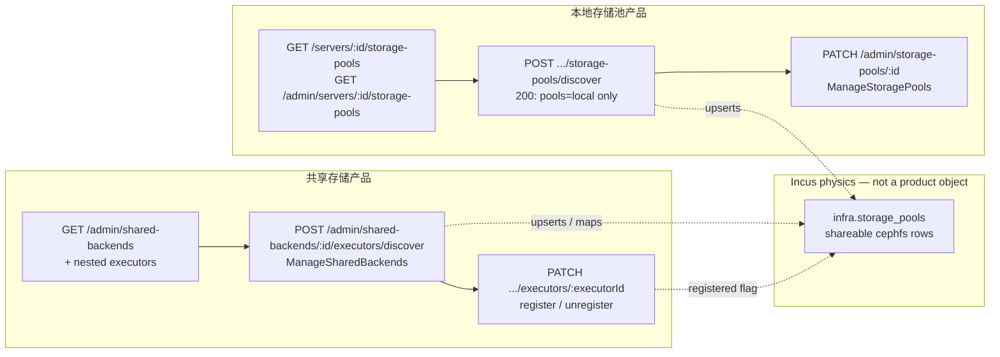
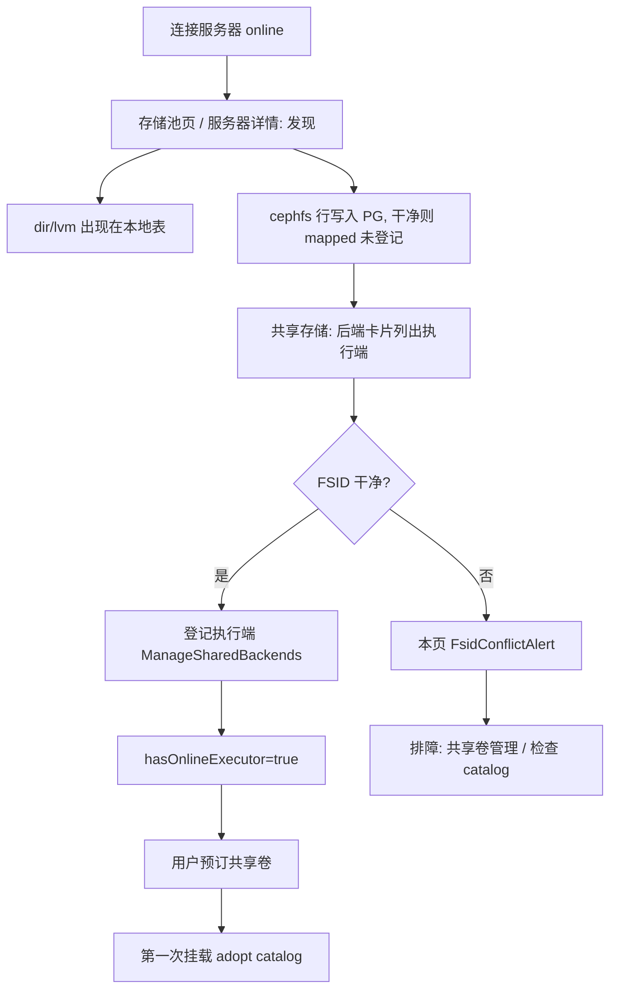

# Close remaining local/shared storage product-surface leaks

| Field | Value |
| --- | --- |
| Status | Draft |
| Author | TBD |
| Date | 2026-09-07 |
| Repository | `/root/nyabase` |
| Product | Unpublished. No compatibility, no dual-write, no feature flags, no leftover aliases. |
| Baseline | Shared-volume product already in tree (create = PG reservation, first attach adopts catalog, never-mounted delete = PG-only, `dir_ensured` delete = any online shareable cephfs executor + one `RemoveAll`, `ManageSharedVolumes` separate, shared volume form does not pick a pool). Full e2e `20260907-split` 84/84. |
| Supercedes (partial) | `plans/incus-shared-storage.md` §9 row "`server-detail-page` / `storage-pools-page` \| 池仍可绑定 backend" and the frontend-only `isLocalStoragePool` cut. Volume lifecycle (sticky catalog, one-shot RemoveAll, `listEligibleDestroyExecutors`) is **out of scope** and is not redesigned. |
| Rollback | `git revert` of the PR stack. |

---

## Overview

The volume lifecycle split is done. What remains is a **product-surface leak**: CephFS executors still live on the local storage-pool API, and the UI hides them after the fact.

`GET /admin/servers/:id/storage-pools` and `GET /servers/:id/storage-pools` still return `driver === 'cephfs'` rows. Five frontend call sites copy `isLocalStoragePool` (`packages/frontend/src/lib/storage-pool-product.ts`) to drop them. Discover (`POST /admin/servers/:id/storage-pools/discover` on `AdminServersController`) still walks Incus, upserts CephFS, maps `identity_key` → `shared_backends`, and **throws** `SHARED_BACKEND_IDENTITY_CONFLICT` — which the storage-pools page and server PoolsCard toast, even though those tables no longer show the CephFS row. Executor register is `PATCH /admin/storage-pools/:id` gated by `ManageStoragePools`, so a `ManageSharedBackends`-only admin sees executor cards on `/shared-backends` and gets 403 (or no button). The shared-backends page N+1s every server's pool list via `queryKeys.storagePools.adminIndex`. Operator copy still treats catalog inspect as a primary CTA from 「共享存储」.

This cut finishes the product split at the **API and operator surface**:

- Local pool list/get/patch/discover-response never expose shareable/cephfs as a local-pool product.
- Local discover still upserts CephFS rows (identity mapping must keep working) but **does not 409** the local page for FSID/identity conflicts.
- Executor list + bind/unbind + discover-executors live under `/admin/shared-backends/...`, gated by `ManageSharedBackends`, fail-closed on FSID/identity.
- Frontend stops using `isLocalStoragePool` as the source of truth.
- Seed/e2e talk to the executor API; no leftover assertion that a local pool list contains cephfs.
- Copy: 共享存储 = 后端 + 执行端. Catalog inspect is a 排障 tool on 共享卷管理, not a CTA from 共享存储.

No Incus cluster, no Agent, no control-plane libcephfs. No change to sticky catalogs or one-shot RemoveAll. No schema rewrite unless a CHECK/column is required — this cut does **not** need one.

---

## Background & Motivation

### What already landed (do not re-design)

From `plans/incus-shared-storage.md`, now in tree:

- Shared create = PG reservation, `lifecycle_phase=active`, `dir_ensured=false`, no pool pick.
- First attach adopts catalog on that server (`volume_placements.pool_id` is the Incus catalog entry, never `volumes.pool_id`).
- Never-mounted delete is PG-only.
- `dir_ensured` delete uses `listEligibleDestroyExecutors` (`packages/backend/src/volumes/eligible-destroy-executors.ts`) — any online registered shareable cephfs pool on that backend, one `RemoveAll`.
- `Capability.ManageSharedVolumes` is separate from `ManageVolumes` and from `ManageSharedBackends`.
- Physical row for an executor is still `infra.storage_pools` (`shareable=true`, `driver='cephfs'`, `shared_backend_id` set). That is Incus physics (a standalone `incusd` catalog entry), not a product object.

A later UI-only cut added `isLocalStoragePool` and filtered CephFS out of local pool *pages*. That is the incomplete cut this document finishes.

### Current leak, with file evidence

**1. Discover vs register split**

| Surface | Discover | List | Register |
| --- | --- | --- | --- |
| 存储池 page `storage-pools-page.tsx` | `POST /admin/servers/:id/storage-pools/discover` | `GET /admin/servers/:id/storage-pools` then `isLocalStoragePool` | `PATCH /admin/storage-pools/:id` (`ManageStoragePools`) |
| Server PoolsCard `pools-card.tsx` | same discover, `parseSharedBackendFsidConflict` in `server-detail-page.tsx` | same list + filter | same PATCH |
| 共享存储 `shared-backends-page.tsx` `ExecutorList` | none | N+1 `GET /admin/servers/:id/storage-pools` flattened by `queryKeys.storagePools.adminIndex` | same PATCH, button gated by `canManageStoragePools` |

`StoragePoolsService.discover` (`storage-pools.service.ts` ~281–488) walks **all** Incus pools, including cephfs, derives `identity_key` via `deriveSharedBackendIdentity`, and throws `ConflictException({ code: FailureCode.SharedBackendIdentityConflict, details: { identityKey, expectedFsid, discoveredFsid, ... } })` on mismatch. The whole serializable transaction rolls back — including local dir/lvm upserts. The local page then toasts 「FSID 冲突」 (`storage-pools-page.tsx` ~56–65) for a row it refuses to render.

Operator flow today: discover on 存储池 / 服务器详情, switch to 共享存储, register there. Conflict fires on the page that hid the row.

**2. Product split, API not split**

`AdminServersController.storagePoolsList` (`admin-servers.controller.ts` ~112–117) calls `this.storagePools.list(id, true)` — unregistered included, **no driver filter**. User `StoragePoolsController.list` (`storage-pools.controller.ts` ~23–26) calls `listForUser`, which still keeps rows whose `shared_backend_id` is granted (`storage-pools.service.ts` ~251–255):

```ts
return rows
  .filter((row) => row.shared_backend_id
    ? backendIds.has(row.shared_backend_id)
    : serverIds.has(row.server_id) && poolIds.has(row.id))
  .map((row) => this.toDto(row));
```

Frontend copies of `isLocalStoragePool`:

- `pages/storage-pools-page.tsx`
- `components/servers/pools-card.tsx`
- `components/servers/preflight-card.tsx`
- `components/grants/canonical-grant-panel.tsx`
- `components/storage/local-volume-form-dialog.tsx`

Missing one surface re-leaks CephFS into a local picker (system pool, preflight probe, pool grant, local volume create).

E2E currently **depends** on the leak:

- `e2e/specs/40-storage/storage.spec.ts` `shared-cephfs-storage` (~982–990, ~1093–1099) asserts `driver === 'cephfs'` on `GET /admin/servers/:id/storage-pools`.
- `e2e/orchestrator/seed.mjs` (~1256–1281, lab path ~513–538) PATCHes `/api/admin/storage-pools/:id` to register cephfs.
- `e2e/support/volume-ops.ts` `registeredCephPool` / `listShareableCephPools` / `listCephCatalogServers` / restore-lab all read cephfs from the local list.

Keeping the leak "for tests" is how the last cut stalled. Tests move to the executor API.

**3. Two capabilities to manage executors**

| Cap | Where | What it actually gates today |
| --- | --- | --- |
| `ManageSharedBackends` | `/shared-backends` route, `AdminSharedBackendsController` | CRUD backends. **Not** executor bind. |
| `ManageStoragePools` | `AdminStoragePoolsController.patch`, storage-pools page | Local register **and** executor register. |
| `ManageServers` | `AdminServersController` class-level | Discover (because discover is a nested server route). |

`shared-backends-page.tsx` ~42–44 / ~160: `canManage={canManageStoragePools}`. A ManageSharedBackends-only admin sees `ExecutorList` and either has no 登记 button or PATCHes 403.

Operators system group (`groups.service.ts` `ensureSystemGroups`) has `ManageServers` but **not** `ManageStoragePools` and **not** `ManageSharedBackends`. Administrators have every cap. The broken case is a custom group with `ManageSharedBackends` without `ManageStoragePools` — exactly the split `plans/incus-shared-storage.md` K-cap intended.

**4. Shared-backends N+1**

```ts
// shared-backends-page.tsx ~52–64
const executorPoolsQuery = useQuery({
  queryKey: queryKeys.storagePools.adminIndex,
  queryFn: async () => {
    const servers = await queryClient.ensureQueryData({ queryKey: queryKeys.servers.admin, ... });
    const rows = await Promise.all(servers.map(async (server) => {
      const pools = await api.get<StoragePoolDto[]>(`/admin/servers/${server.id}/storage-pools`);
      return pools.map((pool) => ({ pool, server }));
    }));
    return rows.flat();
  },
});
```

After the list API drops cephfs this query returns **zero** executors. The N+1 cannot survive the filter. Executors must be listed under the backend (nested on `GET /admin/shared-backends` and/or `GET /admin/shared-backends/:id/executors`).

**5. Catalog is still a first-class CTA**

`shared-backends-page.tsx` header: link 「共享卷管理 / 查看 catalog」 gated on `ManageSharedVolumes`. `lane-d-product.surface.test.ts` ~157 asserts that string. Catalog inspect (`GET /admin/shared-backends/:id/catalog-inspect`, `AdminSharedBackendCatalogInspectController`, cap `ManageSharedVolumes`) is an admin debug occupancy table (`in_use | cache | ensuring | dangling_* | unreachable`). It is not how you operate 后端 + 执行端.

### Pain

1. FSID 409 on a page that does not show CephFS, and it rolls back local dir/lvm discovery.
2. Any missed `isLocalStoragePool` re-leaks executors into local pickers.
3. Executor bind is the wrong cap.
4. Executor UI is an N+1 of the wrong resource; filtering the list without a replacement blanks 共享存储.
5. Operator copy points 共享存储 at catalog inspect.

---

## Goals & Non-Goals

### Goals

1. `GET /admin/servers/:id/storage-pools` and `GET /servers/:id/storage-pools` **never** return a shareable/cephfs row. User `GET /servers/:serverId/storage-pools/:id` 404s shareable (no existence leak). Admin `PATCH /admin/storage-pools/:id` 404s shareable. There is no admin GET-by-pool-id.
2. Local discover still upserts cephfs observations and applies identity mapping when clean, so connecting a server + clicking 发现 still populates executor cards. Local HTTP response is local-only. FSID/identity conflicts **do not** 409 that request; they are returned in a typed sidecar the 共享存储 page consumes from **its own** discover-executors call (same DTO).
3. Executor list + register/unregister + discover-executors live under `AdminSharedBackendsController`, `@RequireCaps(Capability.ManageSharedBackends)`, fail-closed on identity/FSID (no bind on mismatch).
4. Frontend deletes `isLocalStoragePool` from product surfaces. Helper may remain as a test assert.
5. Seed + e2e use the executor API. No assertion that a local pool list contains `driver === 'cephfs'`.
6. Copy: 共享存储 = 后端 + 执行端. Catalog inspect relabeled 排障 on 共享卷管理; remove as CTA from 共享存储.
7. One unpublished cut. No flag. Rollback = git revert.

### Non-Goals

- Incus cluster, Agent, home, fencing, control-plane libcephfs.
- Changing sticky catalog, `dir_ensured`, `remove_all_*`, `listEligibleDestroyExecutors`, volume destroy worker, scan orphan rules.
- Rewriting `shared_backends.identity_key` synthesis (`deriveSharedBackendIdentity`).
- User-facing executor APIs. Users already see `SharedBackendDto.hasOnlineExecutor` / `serverIds` on `GET /shared-backends`.
- Collapsing `ManageSharedBackends` with `ManageSharedVolumes`.
- Persisting FSID conflicts as a new column/table (no `000001` rewrite).
- Fixing grants-panel N+1 over **local** pools (`canonical-grant-panel.tsx` still fans out per server). That is a local-product fetch, not a CephFS leak.
- Changing `AdminServersController` class-level `ManageServers` on discover (pre-existing: storage-pools page's 发现 is a nested server route). Not this cut.

---

## Key Decisions

| # | Decision | Rationale |
| --- | --- | --- |
| S1 | Local list/get APIs filter `shareable = false` (and `driver <> 'cephfs'` as a belt). User `listForUser` drops the `shared_backend_id` grant branch. | Product object for `/storage-pools` is a local disk. CephFS is an executor of a backend. Frontend filter is not an API. |
| S2 | Physical executor row stays `infra.storage_pools`. No new table, no `000001` rewrite. | Incus physics: a standalone catalog entry. `volume_placements.pool_id` and `listEligibleDestroyExecutors` already join this row. Moving it is a lifecycle rewrite, out of scope. |
| S3 | Local `discover` still walks Incus including cephfs and upserts those rows + identity mapping. Response body is **not** the raw row set. | Prompt preference. Identity mapping must not require a second Incus walk before executor cards appear. Local UI must not see cephfs DTOs. |
| S4 | Local discover **never 409s** `SHARED_BACKEND_IDENTITY_CONFLICT` or shareable `STORAGE_POOL_IN_USE` (in-loop skip **and** unique-index `23505` via per-item SAVEPOINT). Delete the outer `hasPostgresCode(..., ['23505'])` catch. Those items are skipped (fail-closed: no bind / no mapping change) and recorded in `identityConflicts`. Local dir/lvm upserts commit. | Today's throw — including `storage_pools_shared_backend_server_unique` 23505 — rolls back local discovery and toasts on the wrong page. Fail-closed is "do not bind the wrong FSID", not "abort the local product". |
| S5 | Executor bind/unbind/discover-executors are `/admin/shared-backends/:backendId/executors...`, cap `ManageSharedBackends`. `PATCH /admin/storage-pools/:id` refuses shareable rows (404). `zPatchStoragePoolRequest.sharedBackendId` is deleted. | Unpublished, no aliases. Wrong-cap 403 is the remaining bug. Local PATCH must not be a back door. |
| S6 | `GET /admin/shared-backends` (admin) includes `executors: SharedBackendExecutorDto[]`. Also `GET /admin/shared-backends/:id/executors` for e2e/seed. User `GET /shared-backends` and `GET /shared-backends/:id` **omit the `executors` key**. `listForUser` / `getForUser` must not call an executor-hydrated `list()`. | Kills N+1 with one admin list. Users already have `hasOnlineExecutor` / `serverIds`; Incus pool names and `registered` are operator inventory. Live `listForUser` is `(await this.list()).filter(...)` (`shared-backends.service.ts` ~84–97) — that path must be split, not “optional field, frontend ignores it”. |
| S7 | Discover-executors is required. `POST /admin/shared-backends/:backendId/executors/discover` with optional `{ serverId? }`. HTTP 200 `{ executors, identityConflicts }`. Register does **not** re-read Incus and does **not** 409 identity: unmapped / wrong-backend executor → **404**. Identity 409 stays on backend create/patch (`ConflictException({ code, message, details })`) and as the discover sidecar. | 共享存储 displays FSID via discover-executors + `FsidConflictAlert`. A new Incus round-trip on PATCH would contradict fail-closed-at-discover and slow bind. |
| S8 | One sidecar type `StorageDiscoverIssueDto` (`code`: `SHARED_BACKEND_IDENTITY_CONFLICT` \| `STORAGE_POOL_IN_USE` \| `SERVER_UNREACHABLE`). Field name on both discover envelopes: `identityConflicts`. Two channels: (a) HTTP 200 sidecar on local discover and executor discover; (b) HTTP 409 body `{ code, message, details }` on **backend create/patch only**. Local UI ignores (a). 共享存储 renders `SHARED_BACKEND_IDENTITY_CONFLICT` from (a) as `FsidConflictAlert`, toasts `STORAGE_POOL_IN_USE` / `SERVER_UNREACHABLE`. | One alert component. Do not invent a second array or an identity-only DTO. Nest does **not** wrap (b) as `zErrorResponse` (no global `requestId` filter). |
| S9 | Frontend source of truth is the API. Delete `isLocalStoragePool` from the five product surfaces. Keep the helper + unit test as a belt-and-suspenders assert that any leaked DTO would still be rejected if a test constructs one. | Scatter-filter is how the leak survived. |
| S10 | Copy: 共享存储 header/CTA do not mention catalog. Inspect on 共享卷管理 is labeled 排障. | Catalog occupancy is debug; 后端+执行端 is the operator product. |
| S11 | Unpublished one-cut. No flag, no dual-write, no alias for `PATCH /admin/storage-pools/:id` + `sharedBackendId`. Seed/e2e move in the same stack. Rollback = git revert. | Dual-read of `infra.storage_pools` from two APIs is the point (local vs executor), not a migration. |
| S12 | Two stacked PRs, land together. PR1 = executor API + cap + seed/e2e register path + shared-backends UI (lists may still contain cephfs). PR2 = local list filter + discover envelope + delete frontend filters + copy + e2e negative assertions. | PR1 alone is mergeable without blanking 共享存储. PR2 alone is not; it depends on PR1. Fake "filter first" blanks executor cards. |

---

## Proposed Design

### 1. Target product surfaces



User shared-volume create/list/delete and catalog inspect stay on `/shared-volumes` and `GET /admin/shared-backends/:id/catalog-inspect` (`ManageSharedVolumes`). Untouched.

### 2. Local pool APIs never return executors

**Filter rule** — two names, one predicate. Do not overload a single identifier across snake_case rows and camelCase DTOs:

```ts
/** infra.storage_pools / repository rows */
export function isLocalPoolRow(row: {
  shareable: boolean;
  driver: string;
  shared_backend_id: string | null;
}): boolean {
  return row.shareable === false
    && row.driver !== StoragePoolDriver.CephFs
    && row.shared_backend_id === null;
}

/** StoragePoolDto — frontend belt helper `isLocalStoragePool` may keep this shape */
export function isLocalPoolDto(pool: {
  shareable: boolean;
  driver: string;
  sharedBackendId: string | null;
}): boolean {
  return pool.shareable === false
    && pool.driver !== StoragePoolDriver.CephFs
    && pool.sharedBackendId === null;
}
```

Apply `isLocalPoolDto` in:

- `StoragePoolsService.list` / `listForUser` / `get` / `getForUser` (`storage-pools.service.ts`) after `toDto`
- Discover HTTP `pools` mapping (not the upsert loop)

Apply `isLocalPoolRow` in **both** capacity methods on **repository** rows. Live call path is `VolumesService.pools: StoragePoolsRepository` (`volumes.service.ts` ~257), **not** `StoragePoolsService.list`:

```ts
// capacityForUser ~333–336 and capacityForAdmin ~383–384 today:
const pools = (await this.pools.list(serverId)).filter((pool) => pool.shared_backend_id === null);
```

Replace that `shared_backend_id === null` filter with `isLocalPoolRow`. Filtering the service DTO list does not change capacity. Unmapped cephfs (`shareable=true`, `shared_backend_id=null`) must not appear in `StorageCapacityDto.pools`.

`listForUser` today ORs backend grants. After the filter that branch is dead — **delete it**. A user with a shared-backend grant and no pool grant must not see an executor on `GET /servers/:id/storage-pools`.

HTTP get-by-id policy (do not invent an admin GET):

- User `GET /servers/:serverId/storage-pools/:id` (`StoragePoolsController.get` → `getForUser`): shareable/cephfs → `404 Storage pool not found`. Do not leak existence.
- Admin `PATCH /admin/storage-pools/:id`: shareable/cephfs → `404` (same). There is **no** admin HTTP GET-by-pool-id (`storage-pools.controller.ts` only lists PATCH on that controller).
- `StoragePoolsService.get()` is unused by controllers today; if kept, shareable → 404 so internal callers cannot accidentally DTO-leak. Do not add an admin GET route.

`PATCH /admin/storage-pools/:id` (`AdminStoragePoolsController`, `ManageStoragePools`):

- Load row. If `!isLocalPoolRow` → `404`. (Misdirected clients, including leftover e2e, fail loudly. Unpublished: no alias, no 301.)
- Body is `zPatchStoragePoolRequest` **without** `sharedBackendId`:

```ts
export const zPatchStoragePoolRequest = z.object({
  expectedRevision: zExpectedRevision,
  registered: z.boolean(),
  displayName: zOptionalText(128),
}).strict();
```

Grant upsert (`groups.service.ts` `upsertStoragePoolGrant` ~830): if the target pool is shareable/cephfs → `404 Storage pool not found`. Frontend will not offer it; this is fail-closed.

Repository `list()` may keep returning all rows for **internal** callers (destroy executors, capacity refresh, discover upsert). The **service DTO** list is the product filter. Do not silently filter inside `StoragePoolsRepository.list` — `listEligibleDestroyExecutors` and `refreshSharedBackendCapacity` need shareable rows and already query the table directly.

### 3. Discover: local upsert vs product response

Keep one Incus walk in `StoragePoolsService.discover(serverId)`. Split the **commit** vs **HTTP body**.

```mermaid
sequenceDiagram
  participant UI as 存储池 / PoolsCard
  participant API as POST /admin/servers/:id/storage-pools/discover
  participant Incus as incusd
  participant PG as infra.storage_pools
  UI->>API: discover
  API->>Incus: listStoragePools + resources
  loop each Incus pool
    alt dir/lvm/btrfs/zfs/ceph (non-cephfs)
      API->>PG: upsert local row
    else cephfs and identity maps and FSID matches
      API->>PG: upsert shareable row, set shared_backend_id
    else cephfs identity/FSID conflict or shareable StoragePoolInUse
      API-->>API: skip bind / skip mapping change, push identityConflicts
    end
  end
  API-->>UI: 200 StoragePoolDiscoverResult { pools: localDtos, identityConflicts }
  Note over UI: ignore identityConflicts; do not toast FSID
```

#### 3.1 Local discover HTTP envelope (exact)

Replace today's `StoragePoolDto[]` return. Unpublished, no array alias. One sidecar type, one field name (S8). An identity-only DTO / second `sharedMappingErrors` array is rejected (see Alternatives H).

```ts
/** packages/common — new; used by local discover and executor discover */
export interface StorageDiscoverIssueDto {
  code:
    | typeof FailureCode.SharedBackendIdentityConflict  // 'SHARED_BACKEND_IDENTITY_CONFLICT'
    | typeof FailureCode.StoragePoolInUse               // 'STORAGE_POOL_IN_USE'
    | typeof FailureCode.ServerUnreachable;             // 'SERVER_UNREACHABLE' (executor discover only)
  message: string;
  identityKey: string | null;
  expectedFsid: string | null;
  discoveredFsid: string | null;
  existingIdentityKey: string | null;
  serverId: string | null;
  incusName: string | null;
  poolId: string | null;
}

export interface StoragePoolDiscoverResult {
  pools: StoragePoolDto[];  // local only, isLocalPoolDto
  identityConflicts: StorageDiscoverIssueDto[];
}
```

Zod: `zStorageDiscoverIssueDto` + `zStoragePoolDiscoverResult` in `rest-schema.ts`. Executor discover reuses the same issue DTO.

HTTP **200** even when `identityConflicts.length > 0`. Local UI: **do not** call `parseSharedBackendFsidConflict`, **do not** mount `FsidConflictAlert`, **do not** toast issues. **Zero CephFS diagnostics on local surfaces.** (Rejected: a quiet "go to 共享存储" hint — still a leak.)

Other failures stay errors on this **single-server** route: Incus down / transport, server not found, serializable retry exhaustion (`40001`/`40P01`). Local discover does not walk sibling servers; if this Incus is down there is nothing to commit.

Field mapping from today's throws (`storage-pools.service.ts`) — all become sidecar items, **not** HTTP 409:

| Today's throw | `code` | Sidecar fields |
| --- | --- | --- |
| "The discovered CephFS identity is bound to another FSID" (~361–369) | `SHARED_BACKEND_IDENTITY_CONFLICT` | `identityKey`, `expectedFsid=backend.ceph_fsid`, `discoveredFsid`, `serverId`, `incusName` |
| "The mapped storage pool reported a different FSID" (~385–394) | `SHARED_BACKEND_IDENTITY_CONFLICT` | `poolId`, `identityKey`, `expectedFsid`, `discoveredFsid`, `serverId`, `incusName` |
| "The discovered FSID is already bound to another identity" (~410–418) | `SHARED_BACKEND_IDENTITY_CONFLICT` | `identityKey`, `discoveredFsid`, `existingIdentityKey`, `serverId`, `incusName` |
| "A storage pool cannot switch shared backend identity during discovery" (~427–431) | `SHARED_BACKEND_IDENTITY_CONFLICT` | `poolId`, `serverId`, `incusName`, `identityKey` of attempted target |
| Shareable "The shared backend already has a pool on this server" (~456–460 **and** unique-index `23505` ~479–483) | `STORAGE_POOL_IN_USE` | `sharedBackendId` via `poolId`/`serverId`/`incusName` |

共享存储 discover-executors shows `SHARED_BACKEND_IDENTITY_CONFLICT` via `FsidConflictAlert` and toasts `STORAGE_POOL_IN_USE` / `SERVER_UNREACHABLE` as ordinary destructive toasts.

#### 3.2 Fail-closed skip rules (local discover upsert loop)

For each cephfs pending item, inside the same serializable transaction as local upserts:

1. **Clean map** (identity matches a backend, FSID equal or discovered FSID absent, no second pool on that server for that backend): upsert with `shared_backend_id`, `shareable=true`, `registered` unchanged (false for new rows). Refresh backend capacity. Same as today.
2. **Identity/FSID conflict, row not yet mapped**: upsert observation **without** `shared_backend_id` (constraint `storage_pools_shared_shape_check` allows `NOT registered AND shared_backend_id IS NULL`). Do not bind. Push issue. Unmapped cephfs will **not** appear under a backend card until discover-executors retries a clean map — that is the display path.
3. **Identity/FSID conflict, row already mapped**: do **not** change `shared_backend_id`, do **not** refresh capacity from the conflicting observation, do **not** overwrite `incus_name`/driver. Leave the row as-is. Push issue. Fail-closed: a lying FSID cannot rebind a live executor.
4. **StoragePoolInUse** (this backend already has another shareable pool on this server): skip the new row (do not insert a second mapping). Push issue. Do not 409 the request.
5. **Non-cephfs "mapped backend cannot become non-CephFS"** (~338–347): this is local-row integrity. Still 409 the whole discover — something already product-broken is trying to mutate a mapped executor into dir/lvm. Not a hidden CephFS toast; it is "this server's pool table is corrupt". Severity: rare.

**Unique-index `23505` must not 409 the envelope.** Live outer catch (`storage-pools.service.ts` ~478–486) converts any `23505` into `ConflictException(STORAGE_POOL_IN_USE)` and aborts the request. `storage_pools_shared_backend_server_unique` (`000001_initial.sql` ~1033–1035, `(shared_backend_id, server_id) WHERE shared_backend_id IS NOT NULL AND shareable`) is exactly this code. `PgTransactionManager` retries only `40001`/`40P01`, not `23505`. A race (or a missed in-loop skip) therefore rolls back already-upserted dir/lvm — pain #1.

Must-change:

- Wrap each **shareable** mapping/upsert in a PostgreSQL `SAVEPOINT`. On `23505` whose constraint is `storage_pools_shared_backend_server_unique`: `ROLLBACK TO SAVEPOINT`, push `STORAGE_POOL_IN_USE` into `identityConflicts`, continue. Local upserts already in the txn stay.
- **Delete** the outer `hasPostgresCode(error, ['23505'])` → `ConflictException` that 409s the whole `discover()`. Do not leave it as a fallback "just in case".
- `23505` on `storage_pools_server_name_unique` `(server_id, incus_name)` is a local-row identity bug (two upserts of the same Incus name). That may still fail the request (500/409). It is not a CephFS mapping conflict.
- Keep HTTP 409 only for rule 5 (mapped executor mutating into non-cephfs).

Transaction: one serializable txn as today (`maxAttempts: 5`) for **this server**. Issues are collected in-memory and returned after commit. Do not persist issues (S2: no schema).

`deriveSharedBackendIdentity` / `deriveDiscoveredFsid` stay in `storage-pools.service.ts`. Extract the per-item mapping block into `applySharedExecutorMapping(...)` so local discover and executor discover share it. No behavior fork.

Pg tests (blocking):

- Local dir upsert **commits** when a sibling cephfs FSID conflicts (200, `pools` contains dir, `identityConflicts[0].code === SHARED_BACKEND_IDENTITY_CONFLICT`).
- Second shareable pool for the same backend+server (in-loop skip **and** unique-index race via savepoint) returns **200** with local `pools` and a `STORAGE_POOL_IN_USE` sidecar item. Not 409.

### 4. Shared-backend executor API

All on `AdminSharedBackendsController` (`shared-backends.controller.ts`), class already `@RequireCaps(Capability.ManageSharedBackends)`. Nested routes:

```
GET    /admin/shared-backends                         → SharedBackendDto[] with executors[]
GET    /admin/shared-backends/:id                     → SharedBackendDto with executors[]
GET    /admin/shared-backends/:id/executors           → SharedBackendExecutorDto[]
POST   /admin/shared-backends/:id/executors/discover  → SharedBackendExecutorDiscoverResult
PATCH  /admin/shared-backends/:id/executors/:executorId
DELETE /admin/shared-backends/:id                     → 204, unchanged
```

`GET :id` today is already `ManageSharedBackends` (class-level). List stays `@RequireAnyCaps(ManageSharedBackends, ManageGrants)`. Nested `executors` on that admin list are accepted for ManageGrants (they already see identity_key / fsid / serverIds and N+1 local pools). User routes are a different mapper (S6).

**Adopted:**

- Admin `GET /admin/shared-backends` and `GET /admin/shared-backends/:id` **include** `executors`. ManageGrants already sees backends (identity_key, fsid, serverIds). Adding executor `incusName` + `serverId` is the same operational inventory as `serverIds`. One request for the 共享存储 page.
- Dedicated `GET :id/executors` exists for seed/e2e so they do not parse the full admin list.
- User `GET /shared-backends` / `GET /shared-backends/:id` **must not** grow `executors`. Live `listForUser` is `(await this.list()).filter(...)` (`shared-backends.service.ts` ~84–97). If `list()` hydrates executors, every granted user receives Incus pool names, `registered`, and bytes — the same "product split, API not split" leak on the user surface Non-Goals say is already done (`hasOnlineExecutor` / `serverIds` only). **Must-change:** `listForUser` / `getForUser` load grant-filtered backend rows and map with `toDto` **without** setting `executors` (JSON key absent / `undefined`, not `[]`). They must not call the admin `list()`. Pg/controller test: user GET has no `executors` key; admin GET has the array. Do not rely on "optional field, frontend ignores it".

#### 4.1 Executor DTO

Do **not** reuse `StoragePoolDto` as the product type (it still has `shareable`, `rootDiskCapable`, `capability` shrink badges that are local-pool UX). New:

```ts
export interface SharedBackendExecutorDto {
  id: string;                 // infra.storage_pools.id (placement/destroy still use this uuid)
  backendId: string;
  serverId: string;
  serverName: string;
  serverStatus: ServerStatus;
  incusName: string;
  registered: boolean;
  totalBytes: number | null;
  usedBytes: number | null;
  lastObservedAt: string | null;
  revision: number;
}
```

`SharedBackendDto` gains:

```ts
executors?: SharedBackendExecutorDto[]; // admin GET list/get only; omit the key on user GET
```

Admin `list()` / `get()` populate `executors` via a second query `listExecutorsByBackendIds(ids)` (keep the existing `array_agg` for `server_ids` / `has_online_executor` readable — `shared-backends.repository.ts` ~16–62).

User mapping is a **separate method path**. `toDto` takes an explicit `executors: SharedBackendExecutorDto[] | undefined`; user callers pass `undefined` so `JSON.stringify` omits the key (or strip before return). Never `listForUser() { return (await this.list()).filter(...) }` after `list()` grows executors.

Filter for an executor row: `pool.shareable AND pool.driver = 'cephfs' AND pool.shared_backend_id = backend.id`. Unmapped cephfs (conflict skip) do **not** appear. They surface only via `identityConflicts` on discover-executors.

#### 4.2 Discover-executors

```
POST /admin/shared-backends/:backendId/executors/discover
@HttpCode(200)
body: zDiscoverSharedExecutorsRequest = { serverId: zUuid.optional() }.strict()
→ SharedBackendExecutorDiscoverResult
```

```ts
export interface SharedBackendExecutorDiscoverResult {
  executors: SharedBackendExecutorDto[];
  identityConflicts: StorageDiscoverIssueDto[];
}
```

Behavior:

1. 404 if backend missing.
2. Server set = `{ serverId }` if provided (must exist), else every `infra.servers` with `status = 'online'`. PG-offline servers are not walked; their already-mapped executor rows still appear on GET.
3. **Per-server isolation** (must-change vs today's single-server `discover()` which does `this.clients.get(serverId)` + `listStoragePools` *before* one txn, so any throw fails the HTTP request):
   - For each server: Incus walk **then** its own mapping transaction (same savepoint rules as §3.2). Commit or skip **that server** before starting the next.
   - Identity/FSID skip-bind and shareable `STORAGE_POOL_IN_USE` (including `23505` savepoint) push sidecar items and **continue**.
   - Incus/transport errors (`clients.get` throw, `listStoragePools` timeout, TLS, connection reset): do **not** 500 the whole call. Push `StorageDiscoverIssueDto` with `code: SERVER_UNREACHABLE` (`FailureCode.ServerUnreachable`), `serverId` set, identity fields null. Warn-log the error class/message, not the Incus config blob. Continue to the next server.
   - Do **not** classify Incus-down as `SHARED_BACKEND_IDENTITY_CONFLICT`.
   - One late throw must not roll back earlier servers' mappings (hence one txn **per server**, not one txn for the walk).
4. After the walk, `GET` mapped executors for this backend (including PG-offline servers that were not walked) and return `{ executors, identityConflicts }`. HTTP **200** if the backend exists, even when every online node was unreachable.
5. 共享存储: `SHARED_BACKEND_IDENTITY_CONFLICT` → `FsidConflictAlert` / `setPageConflict`. `STORAGE_POOL_IN_USE` and `SERVER_UNREACHABLE` → destructive toast, not the FSID alert.
6. Cap: `ManageSharedBackends` (class-level). Incus access is via existing `INCUS_CLIENT_FACTORY`; SharedBackendsModule already cannot see it — **inject `StoragePoolsService`** (already exported by `StoragePoolsModule`) and put the method there: `discoverExecutors(backendId, serverId?: string)`. Controller stays thin. Import `StoragePoolsModule` into `SharedBackendsModule` (no cycle: storage-pools does not import shared-backends service).

Local `discover(serverId)` stays one-server: Incus down on **that** server still fails that HTTP request (operator is on that machine's 存储池 / 详情). The per-server skip policy is for the **multi-server** executor walk.

#### 4.3 Register / unregister

```
PATCH /admin/shared-backends/:backendId/executors/:executorId
body: zPatchSharedBackendExecutorRequest = {
  expectedRevision: zExpectedRevision,
  registered: z.boolean(),
}.strict()
→ SharedBackendExecutorDto
```

Move the shareable half of today's `StoragePoolsService.patch` (~490–604):

- Lock capacity scope as today.
- 404 if pool missing, or `shared_backend_id !== :backendId`, or not shareable cephfs.
- Revision mismatch → 409 `REVISION_CONFLICT`.
- `registered=true`: require `shared_backend_id === :backendId` (already mapped by discover). Today's "must be mapped before registration" stays. Do **not** accept a `sharedBackendId` in the body (URL is the backend).
- `registered=false` or mapping would change: `hasDependencies(poolId)` → 409 `STORAGE_POOL_IN_USE` (unchanged).
- **Unregister does not null `shared_backend_id`.** Card stays as 未登记; backend `hasDependencies` still sees the pool row, so backend DELETE 409s until the row is unmapped. Unmap happens on next discover-executors if we add an explicit unbind — **not in v1 of this cut** (current UI already only toggles `registered`; backend delete copy already says it may refuse). Out of scope to invent a third state.
- Identity/FSID: register does **not** re-read Incus and does **not** 409 `SHARED_BACKEND_IDENTITY_CONFLICT`. Mapping already happened at discover. If an operator registers after a silent local-discover map, that is intended.
- If someone hits PATCH with a pool whose mapping was skipped due to conflict (`shared_backend_id` is null) or that is mapped to another backend: **404** on this backend's executor route. Fail-closed. That is not an identity 409.

Do not add a "re-check FSID on register" path in this cut.

Local `patch()` after this cut: if the row is shareable, 404 before any mutation. Delete the `sharedBackendId` input path. Frontend local PATCH clients must also stop **sending** that field (see §5.1) or `.strict()` 400s dir/lvm 登记.

### 5. Frontend

#### 5.1 Delete scatter-filter as source of truth

Remove `isLocalStoragePool(...)` from:

- `pages/storage-pools-page.tsx` grouped map
- `components/servers/pools-card.tsx` system-pool select, empty state, table
- `components/servers/preflight-card.tsx` probe select
- `components/grants/canonical-grant-panel.tsx` pool grant options
- `components/storage/local-volume-form-dialog.tsx` `localPools`

Those queries already hit local list APIs; after S1 the filter is a no-op and a footgun. Keep `storage-pool-product.ts` + `.test.ts` so unit tests can still say "if a DTO ever looks like an executor, it is not local". `lane-d-product.surface.test.ts` must **stop** requiring `isLocalStoragePool` in pools-card/grants (~168–169) and instead assert the pages do not mention `pool.shareable` / do not PATCH executors.

**Local PATCH bodies must drop `sharedBackendId` in the same PR that deletes it from `zPatchStoragePoolRequest`.** Live clients send the field on every 登记 click (inline objects, **not** typed as `PatchStoragePoolRequest`, so tsc will not catch it):

```ts
// storage-pools-page.tsx ~71
api.patch(`/admin/storage-pools/${pool.id}`, {
  expectedRevision, registered, displayName, sharedBackendId: pool.sharedBackendId,
})
// pools-card.tsx ~169–174 — same keys
```

After `.strict()`, dir/lvm 登记 is HTTP 400. PR2 checklist (blocking):

- Stop sending `sharedBackendId` from `storage-pools-page.tsx` and `pools-card.tsx`.
- `rg 'sharedBackendId:' packages/frontend` — leftover local PATCH bodies only; grant/shared-volume `sharedBackendId` on **backend** objects stay.
- Surface/unit test: local register request bodies omit the field (e.g. assert the mutationFn payload or a helper that builds `PatchStoragePoolRequest`).

#### 5.2 Discover on local surfaces

`storage-pools-page.tsx` and `server-detail-page.tsx`:

- `api.post<StoragePoolDiscoverResult>(...)`
- Toast from `result.pools.length`
- **Remove** `parseSharedBackendFsidConflict` / `FsidConflictAlert` / `pageConflict` from these pages and from `PoolsCard` props (`fsidConflict`, `onDismissFsidConflict`). PoolsCard loses the alert slot.

#### 5.3 Shared-backends page

- Drop `executorPoolsQuery` N+1 and `queryKeys.storagePools.adminIndex` usage here.
- `GET /admin/shared-backends` → each card's `ExecutorList` uses `backend.executors`.
- `canManage={canManageSharedBackends}` (page is already gated by that cap; drop `canManageStoragePools`).
- Register: `api.patch(`/admin/shared-backends/${backendId}/executors/${executor.id}`, { expectedRevision, registered })`.
- New per-card (or header) button 「发现执行端」 → `POST /admin/shared-backends/${id}/executors/discover`. On 200, if `identityConflicts` has a `SHARED_BACKEND_IDENTITY_CONFLICT`, `setPageConflict` from that DTO (adapt `parseSharedBackendFsidConflict` to also accept a DTO, not only `ApiError`).
- Copy:

```
title: 共享存储
description: 登记 CephFS 后端，并在此发现、登记各机执行端。用户共享卷在「共享卷管理」。
```

- **Delete** the header link 「共享卷管理 / 查看 catalog」. Nav already has 共享卷管理 (`app-layout.tsx` `/manage/shared-volumes`, `ManageSharedVolumes`). No catalog CTA from this page. `lane-d-product.surface.test.ts` ~156–158 currently requires `/manage/shared-volumes`, `查看 catalog`, and `ManageSharedVolumes` **on `shared-backends-page.tsx`** — drop all three from that file's expects. Keep 排障 / catalog asserts on `manage-shared-volumes-page.tsx` only.
- ExecutorList helper text (always visible, not only when `executors.length === 0`): 「点「发现执行端」刷新各机 mapping。FSID 冲突在本页以红色告警展示——即使卡片上已有执行端。」 Empty additional line: 「尚未发现执行端。先登记后端，再对在线服务器发现执行端。」
- **Do not** auto-run `POST .../executors/discover` on 共享存储 mount. That is N online servers × `listStoragePools` on every visit (worse than the N+1 GET this cut removes). Conflicts that mixed-map (N−1 servers bound, one FSID skip) stay silent until the operator clicks 发现执行端; the always-visible helper is the mitigation (S2: no persisted last-conflict column).

#### 5.4 Catalog inspect = 排障

`manage-shared-volumes-page.tsx`:

- Page description already says 「Catalog 占用只读查看，无修复或强制删除。」 Keep.
- Row button 「查看 catalog」 → 「排障：检查 catalog」 (or 「排障 / 检查 catalog」). `data-testid="shared-volume-catalog-inspect"` stays.
- Do not add inspect to 共享存储.

`lane-d-product.surface.test.ts` `splits local and shared volume products` (~112–169):

- `shared-backends-page.tsx`: **drop** `toMatch(/\/manage\/shared-volumes/)`, `toMatch(/查看 catalog/)`, `toMatch(/ManageSharedVolumes/)`. Assert 执行端 copy, 「发现执行端」, and `not.toMatch(/查看 catalog/)`.
- `manage-shared-volumes-page.tsx`: keep inspect dialog; change `查看 catalog` expect to `/排障/` (button label 「排障：检查 catalog」).

#### 5.5 Query keys

- Stop using `queryKeys.storagePools.adminIndex` on 共享存储.
- `queryKeys.sharedBackends.admin` is the executor list cache (nested). Invalidate it on executor patch/discover and on local discover (mapping may have added an executor). Storage-pools page refresh already invalidates `storagePools.adminIndex` + servers; also invalidate `sharedBackends.admin` after local discover so a mapped executor appears without a second click.

### 6. Authz matrix (after)

| Action | Cap | Route |
| --- | --- | --- |
| List/get local pools (admin, incl. unregistered) | `ManageServers` or `ManageGrants` | `GET /admin/servers/:id/storage-pools` |
| Discover local+upsert cephfs | `ManageServers` (unchanged nested route) | `POST /admin/servers/:id/storage-pools/discover` |
| Register local pool | `ManageStoragePools` | `PATCH /admin/storage-pools/:id` |
| List backends (admin) | `ManageSharedBackends` or `ManageGrants` | `GET /admin/shared-backends` |
| CRUD backend | `ManageSharedBackends` | POST/PATCH/DELETE `/admin/shared-backends` |
| List/discover/bind/unbind executors | `ManageSharedBackends` | `/admin/shared-backends/:id/executors...` |
| Catalog inspect | `ManageSharedVolumes` | `GET /admin/shared-backends/:id/catalog-inspect` (unchanged) |
| User local pools | owner grants on **local** pool | `GET /servers/:id/storage-pools` |
| User backends | owner backend grants | `GET /shared-backends` (no executors) |

Fail closed: ManageSharedBackends without ManageStoragePools can bind executors and cannot register dir/lvm. Reverse cannot bind executors (404/403 on executor routes; local PATCH 404 on cephfs id).

### 7. Seed and e2e

**Seed (`e2e/orchestrator/seed.mjs`)**

After `discoverStoragePools` (now returns `{ pools, identityConflicts }`):

1. Validate **local** pools via `validateStoragePoolDtos(result.pools, serverId)` — helper updated to accept the envelope **or** a dedicated `validateStoragePoolDiscoverResult`. Contract test `seed-cleanup.contract.test.mjs` (~295–312) currently stubs discover as a bare array; update the stub to `{ pools: [storagePoolDto()], identityConflicts: [] }` and assert `result.pools[0]`.
2. Register dir/lvm via existing `PATCH /admin/storage-pools/:id` (local only). `registerStoragePools` must not see cephfs.
3. If CephFS fixture enabled: `GET /api/admin/shared-backends/${selectedShared.id}/executors` (after discover, mapping should have set `shared_backend_id`). Find `incusName === E2E_CEPHFS_INCUS_POOL`. If missing, `POST .../executors/discover` `{ serverId }` then re-GET. PATCH `.../executors/${id}` `{ expectedRevision, registered: true }`. **Never** `PATCH /api/admin/storage-pools/${cephPool.id}` with `sharedBackendId`.
4. Lab servers (`seedLabServer` ~513–538): same executor path. Keep `cephfsPoolId` on seed-state as a **harness** field for Incus CLI catalog checks (`listCephCatalogServers` needs the Incus pool name). Populate it from the executor DTO `id`/`incusName`, not from the local list.
5. Named leftover local-list finds that **must** move (not only the helper table):
   - `e2e/orchestrator/seed.mjs` ~562–564 `cephRow` — second `GET /admin/servers/${extra.id}/storage-pools` after register, `.find(incusName === E2E_CEPHFS_INCUS_POOL)`. Populate `cephfsPoolId` from executor GET.
   - `e2e/support/volume-ops.ts` `liveLabServer` (~901–911) — finds `driver === 'cephfs'` on the local list to set `cephfsPoolId`. Use executor GET.
   - `withCephPoolsUnregistered` restore (~1001–1007) — re-GETs the **local** list by pool id; after PR2 that id is gone → `pool missing while restoring registration`. Restore via executor GET + executor PATCH.

**`e2e/orchestrator/storage-pool-discovery.mjs`**

- `discoverStoragePools` parses `{ pools, identityConflicts }`, validates `pools` as local DTOs, **blocks** if any `pools[]` has `driver === 'cephfs'` or `shareable === true`.
- `registerStoragePools` stays local-only.
- New `discoverSharedExecutors` / `registerSharedExecutor` helpers used by seed.

**`e2e/support/volume-ops.ts`**

| Helper | Today | After |
| --- | --- | --- |
| `registeredCephPool` | GET local list, find cephfs | GET `/admin/shared-backends/${seed.sharedBackendId}/executors`, find `serverId` + `registered` |
| `listShareableCephPools` | fan-out local lists | GET admin backends or per-backend executors |
| `listCephCatalogServers` | local list → `incusName` | executor `incusName` |
| `patchPoolRegistered` | PATCH `/admin/storage-pools/:id` | split: local helper unchanged; ceph path uses executor PATCH |
| `withCephPoolsUnregistered` | PATCH local | executor PATCH `registered: false` then restore |
| restore-lab discover (~701–719) | discover + PATCH cephfs on local API | discover local + executor discover/register |
| `liveLabServer` (~901–911) | local list `driver === 'cephfs'` → `cephfsPoolId` | executor GET |
| `withCephPoolsUnregistered` restore (~1001–1007) | re-GET local list by pool id | executor GET + executor PATCH |

**Specs**

- `storage.spec.ts` `discovers both storage families` (~319–344): still discovers; assert discover body has `pools` without cephfs; do **not** require a cephfs element. Rename coverage copy if it says "both families" as pool-list contents — the families are local drivers (dir/lvm) plus a **separate** executor API assertion in `shared-cephfs-storage`.
- `shared-cephfs-storage` (~972–1099): replace `GET .../storage-pools` cephfs finds with executor GET. Assert local list `every(p => p.driver !== 'cephfs' && p.shareable !== true)`.
- `storage.shared-lifecycle.spec.ts`: all `registeredCephPool` / `listShareableCephPools` call sites follow the helper change; no spec-level local-list cephfs asserts left.
- Negative: leftover `PATCH /admin/storage-pools/:cephId` → 404. Executor PATCH without `ManageSharedBackends` → 403 (if a fixture user exists; otherwise a pg/unit test is enough).

**Unit / pg**

- `storage-pools.service.pg.test.ts` `discovers an unregistered CephFS pool...` (~43): `discover()` result `.pools` is empty (only cephfs in the mock Incus). Mapping is asserted via `discoverExecutors` or repository row. `rejects.toMatchObject SharedBackendIdentityConflict` on `discover()` (~152) becomes **200 + identityConflicts[0].code**. The 409 test moves to `PATCH .../executors` if we re-validate, or to discover-executors sidecar.
- New pg test: local dir upsert **commits** when a sibling cephfs FSID conflicts.
- `shared-backends.service.test.ts`: executor list nested; register cap is controller-level (controller test or e2e).
- Frontend `lane-d-product.surface.test.ts` copy assertions as in §5.4.
- **PR1 forbids a local-list fallback** for finding cephfs (`driver === 'cephfs'` on `GET /admin/servers/:id/storage-pools`). Seed/e2e register and identity lookup use executor GET from the first commit that introduces the route. A one-PR fallback is how the last cut stalled.
- **PR2 grep gate (blocking):** `rg "driver === 'cephfs'" e2e` and `shareable === true` on storage-pool GET paths may only appear in **negative** asserts (`every(p => p.driver !== 'cephfs')`) or comments. Same for `PATCH /admin/storage-pools/` plus `sharedBackendId` in `e2e/`.

### 8. Data flow after cut (operator)



Local 发现 is sufficient to **map** a clean executor. 共享存储 发现执行端 is the retry + conflict-display path (and maps servers that never had a local-page discover). Mixed success (some servers mapped, one FSID skip) leaves `executors[]` non-empty and **no** alert until 发现执行端; the always-visible helper on the card is the only in-product cue (see §5.3). Do not auto-discover on page load.

---

## API / Interface Changes

### Local discover — before / after

Before: `POST /api/admin/servers/:id/storage-pools/discover` → `StoragePoolDto[]` (includes cephfs). 409 `SHARED_BACKEND_IDENTITY_CONFLICT` aborts.

After: 200

```json
{
  "pools": [ { "id": "...", "driver": "dir", "shareable": false, "sharedBackendId": null, "...": "..." } ],
  "identityConflicts": [
    {
      "code": "SHARED_BACKEND_IDENTITY_CONFLICT",
      "message": "The discovered CephFS identity is bound to another FSID",
      "identityKey": "cephfs:ceph/fs-a/data",
      "expectedFsid": "aaaaaaaa-aaaa-4aaa-8aaa-aaaaaaaaaaaa",
      "discoveredFsid": "bbbbbbbb-bbbb-4bbb-8bbb-bbbbbbbbbbbb",
      "existingIdentityKey": null,
      "serverId": "<server uuid>",
      "incusName": "cephfs-a",
      "poolId": null
    }
  ]
}
```

409 identity is **gone** from this route.

### 409 identity envelope (backend create/patch — unchanged)

Live Nest `ConflictException({ code, message, details })` is serialized **as that object**. There is no global filter adding `statusCode` / `requestId` (`main.ts` only registers Zod + PackageHttpError + SPA). Do not parse this as `zErrorResponse`. Frontend `parseSharedBackendFsidConflict` already uses `ApiError.code` + `body.details` only.

HTTP 409 body:

```json
{
  "code": "SHARED_BACKEND_IDENTITY_CONFLICT",
  "message": "The shared backend identity is already bound to another FSID",
  "details": {
    "identityKey": "cephfs:ceph/fs-a/data",
    "expectedFsid": "aaaaaaaa-aaaa-4aaa-8aaa-aaaaaaaaaaaa",
    "requestedFsid": "bbbbbbbb-bbbb-4bbb-8bbb-bbbbbbbbbbbb"
  }
}
```

Discover sidecar (200) is `StorageDiscoverIssueDto` (flat fields, no nested `details`). Register/unbind does **not** emit this 409 (S7: 404 if not mapped to `:backendId`).

`FsidConflictAlert` + `parseSharedBackendFsidConflict` (`storage-shrink.ts` ~121–138) keep reading `code` + `details`. Extend with a helper that accepts a sidecar DTO:

```ts
export function identityConflictFromDiscoverIssue(
  issue: StorageDiscoverIssueDto,
): SharedBackendFsidConflict | null
```

so the 200 sidecar and the 409 body render the same alert.

### New executor routes (admin, `ManageSharedBackends`)

| Method | Path | Body | Response |
| --- | --- | --- | --- |
| GET | `/admin/shared-backends/:id/executors` | — | `SharedBackendExecutorDto[]` |
| POST | `/admin/shared-backends/:id/executors/discover` | `{ serverId?: uuid }` | `{ executors, identityConflicts }` |
| PATCH | `/admin/shared-backends/:id/executors/:executorId` | `{ expectedRevision, registered }` | `SharedBackendExecutorDto` |

### Removed / refused

| Old | New |
| --- | --- |
| `zPatchStoragePoolRequest.sharedBackendId` | deleted (`.strict()` → extra field 400). Frontend local PATCH in `storage-pools-page.tsx` / `pools-card.tsx` must stop sending it in the same PR. |
| `PATCH /admin/storage-pools/:cephfsId` | 404 |
| User list including backend-granted cephfs | local rows only |
| User `GET /shared-backends` with `executors` | key omitted; `listForUser` must not call admin `list()` |
| Discover returning cephfs DTOs | only in executor APIs |
| Discover HTTP 409 on shareable `23505` | sidecar `STORAGE_POOL_IN_USE`; outer catch deleted |

`StoragePoolDto` itself keeps `shareable` / `sharedBackendId` (always `false` / `null` on local list). Do not delete the fields — internal tests and belt helper still use them. Local responses must have `shareable === false && sharedBackendId === null`.

---

## Data Model Changes

**None.** `infra.storage_pools` / `infra.shared_backends` / CHECKs in `000001_initial.sql` stay. 000002 / 000003 untouched.

Executor identity is still `(storage_pools.id)` with `shareable AND driver='cephfs' AND shared_backend_id IS NOT NULL`. `listEligibleDestroyExecutors` unchanged.

If a future cut wants persisted last-conflict, that would be a column on `storage_pools` and a 000001 rewrite. Rejected here (S2): discover-executors is the display path.

---

## Alternatives Considered

### A. This design: local discover still upserts cephfs; sidecar issues; executor API under shared-backends (**adopted**)

Matches physics (one Incus walk maps identity) and product (local page never owns CephFS diagnostics or bind).

### B. Local discover skips cephfs entirely; only executor-discover upserts shareable rows (**rejected as primary**)

Prompt preference is the opposite. Connecting a server and clicking 发现 on 存储池 would leave 共享存储 empty until a second walk. Two buttons for one Incus list. Worse operator flow. **Would** avoid any CephFS work on the local route. If S3 is later reversed, executor-discover already exists.

### C. Keep returning cephfs on local list; frontend filter forever (**rejected**)

This is the incomplete cut. E2e cements the leak. Missing one `isLocalStoragePool` re-leaks.

### D. 409 local discover on FSID but swallow in UI (**rejected**)

Transaction still rolls back dir/lvm. Swallowing hides a failed local refresh. Sidecar + skip-bind is the actual fail-closed.

### E. Nested executors only, no dedicated GET (**rejected as exclusive**)

N+1 fix needs nest-or-dedicated. Seed/e2e are cleaner with `GET :id/executors`. Do both (cheap).

### F. Reuse `StoragePoolDto` as executor DTO (**rejected**)

Brings shrink badges, `rootDiskCapable`, `shareable` onto 共享存储 cards and invites the frontend to treat executors as pools. New DTO is small.

### G. One mega-PR vs two stacked PRs

See PR Plan. Two PRs only if PR1 introduces the executor API **before** filtering local lists, so 共享存储 never blanks. Filtering first is not independently shippable.

### H. Identity-only sidecar DTO plus a second `sharedMappingErrors` array (**rejected**)

One `StorageDiscoverIssueDto` union (`SHARED_BACKEND_IDENTITY_CONFLICT` \| `STORAGE_POOL_IN_USE` \| `SERVER_UNREACHABLE`) and one field `identityConflicts` on both envelopes. A second array or an identity-only type splits the 共享存储 alert path and was the §3.1 debate; it is not the contract.

### I. Auto-run discover-executors on 共享存储 mount (**rejected**)

Would surface mixed FSID conflicts without a click, but costs N Incus `listStoragePools` per page load. Always-visible helper text is the mitigation (S2: no persisted conflict column).

---

## Security & Privacy Considerations

| Threat | Mitigation |
| --- | --- |
| ManageStoragePools admin binds a CephFS executor (wrong product, wrong cap) | Local PATCH 404 on shareable. No `sharedBackendId` field. |
| ManageSharedBackends admin registers a dir pool via executor route | Executor PATCH 404 unless `shared_backend_id === :backendId` and shareable cephfs. |
| ManageGrants reads executor `incusName` | Accepted: grants already see backends and local pools. Nested executors are the same operational inventory. |
| User `GET /servers/:id/storage-pools` lists a cephfs they have a backend grant for | `listForUser` drops the backend-grant branch; filter `isLocalPoolDto`. |
| User `GET /shared-backends` grows `executors` because `listForUser` calls admin `list()` | Split mapping (S6). Test: user JSON has no `executors` key. |
| Binding the wrong FSID (split-brain merge) | Unchanged fail-closed mapping; skip-bind on conflict; register 404 unless already mapped to **this** backend. |
| Catalog inspect mutate | Unchanged: inspect is GET-only, `ManageSharedVolumes`, no buttons. This cut does not add inspect to 共享存储. |

No new PII. FSID/identity_key already on `SharedBackendDto`.

---

## Observability

- Keep existing `ConflictException` logs for 409 register/backend-create.
- Local discover: log at **warn** per skipped cephfs item (`code`, `serverId`, `incusName`, `identityKey`) so support can see conflicts without the local UI toasting. Do not log the whole Incus config blob.
- Executor discover: same warn per identity/`STORAGE_POOL_IN_USE` skip; **warn** per `SERVER_UNREACHABLE` (`serverId`, error class). Do not 500 the request.
- Metric (optional, cheap counter): `storage_discover_identity_conflicts_total{route=local|executor}`. Not a launch blocker.
- No new alert. FSID is an operator-fix condition, displayed in-page.

---

## Rollout Plan

Unpublished product.

1. Land the PR stack (see PR Plan). No flag.
2. Deploy once. Seed/e2e of this repo is the gate (`storage.spec.ts`, `storage.shared-lifecycle.spec.ts`, `seed-cleanup.contract.test.mjs`, pg tests).
3. Rollback = `git revert` of the stack. No dual-write to unwind. CephFS rows in `infra.storage_pools` are unchanged physics.

**Do not** merge PR2 (list filter) without PR1 (executor API + 共享存储 UI). Merging filter first blanks `ExecutorList`.

---

## Risks

| Risk | Severity | Mitigation |
| --- | --- | --- |
| Local discover skip-bind leaves 共享存储 empty on FSID conflict with no toast on the page the operator is looking at | Medium | Empty copy + always-visible 「发现执行端」 helper. That call fills `FsidConflictAlert`. Do not add a local-page hint (S4/S10). |
| Mixed map: N−1 servers bound, one FSID skip — `executors[]` non-empty, no alert until 发现执行端 | Medium | Always-visible helper on every card, not only the empty state. Do not auto-run discover-executors on mount (Alternatives I). |
| Shareable unique-index `23505` still 409s local discover and rolls back dir/lvm | High if missed | Per-item SAVEPOINT; delete outer `23505` catch; pg test second-pool/race returns 200. |
| `listForUser` hydrates `executors` | High if missed | Separate user mapping; controller/pg test omits the key. |
| Local PATCH still sends `sharedBackendId` after schema `.strict()` | High if missed | PR2 strips `storage-pools-page.tsx` / `pools-card.tsx`; surface test. |
| One unreachable Incus 500s discover-executors | High if missed | Per-server txn + `SERVER_UNREACHABLE` sidecar; HTTP 200. |
| `discover()` response shape change breaks seed contract tests and any out-of-tree client | Low (unpublished) | Update `storage-pool-discovery.mjs` + `seed-cleanup.contract.test.mjs` in the same stack. |
| Internal `StoragePoolsRepository.list` vs service list confusion — someone filters in the repository and breaks destroy executors | High if done | Filter only in the service DTO path. Comment on `repository.list`. pg test that `listEligibleDestroyExecutors` still sees registered cephfs after local list filter. |
| ManageServers-only operator can still run local discover (upserts cephfs mapping) without ManageSharedBackends | Low | Pre-existing nested-route cap. Mapping without register is today's discover. Bind still requires ManageSharedBackends. |
| Grants N+1 remains | Low | Out of scope; not a CephFS leak after S1. |
| Unregister leaves mapping, backend DELETE still 409 | Low | Pre-existing; copy already warns. Do not sneak unmap into this cut. |

---

## Open Questions

1. **None blocking.** S3 (local discover still upserts cephfs) is the prompt's stated preference; B is the reversal if operators complain that 存储池 发现 "does hidden Ceph work". Reversal is a one-line skip of the cephfs pending items in `discover()`, executor-discover already covers mapping.
2. Unmap-on-unregister (so backend DELETE works without a hidden PATCH) is a follow-up, not this cut.

---

## References

- `plans/incus-shared-storage.md` — volume product split; this doc is the surface/API completion cut.
- `packages/backend/src/storage-pools/storage-pools.controller.ts` — user list/get; admin PATCH `ManageStoragePools`.
- `packages/backend/src/storage-pools/storage-pools.service.ts` — `discover`, `patch`, `list`, `listForUser`, `toDto`, `deriveSharedBackendIdentity`; shareable iff `driver === cephfs`.
- `packages/backend/src/servers/admin-servers.controller.ts` — `GET/POST .../storage-pools` under `ManageServers`.
- `packages/backend/src/shared-backends/shared-backends.controller.ts` — admin DELETE already `@HttpCode(204)`.
- `packages/backend/src/shared-backends/shared-backends.repository.ts` — `server_ids`, `has_online_executor`.
- `packages/backend/src/volumes/eligible-destroy-executors.ts` — destroy physics, unchanged.
- `packages/frontend/src/pages/storage-pools-page.tsx`, `shared-backends-page.tsx` (`ExecutorList`), `lib/storage-pool-product.ts`.
- `packages/frontend/src/lib/lane-d-product.surface.test.ts` — copy contracts to update.
- `e2e/orchestrator/seed.mjs`, `e2e/orchestrator/storage-pool-discovery.mjs`, `e2e/support/volume-ops.ts`, `e2e/specs/40-storage/storage.spec.ts`, `storage.shared-lifecycle.spec.ts`.

---

## PR Plan

Two stacked PRs. **PR2 depends on PR1. Do not merge PR2 first. Prefer merging as a pair.** One PR is also honest if review load is the only reason to split — in that case use two commits with these same boundaries.

### PR 1 — Executor API, ManageSharedBackends bind, 共享存储 stops N+1

**Title:** `feat(storage): shared-backend executor API and bind cap`

**Depends on:** none

**Files / components**

- `packages/common/src/protocol/rest.ts`, `rest-schema.ts` — `SharedBackendExecutorDto`, `zPatchSharedBackendExecutorRequest`, `zDiscoverSharedExecutorsRequest`, `StorageDiscoverIssueDto`, `SharedBackendExecutorDiscoverResult`; `SharedBackendDto.executors?`. **Do not yet** change `zPatchStoragePoolRequest` or local discover return type (PR2).
- `packages/backend/src/storage-pools/storage-pools.service.ts` — extract `applySharedExecutorMapping`; add `listExecutors(backendId)`, `discoverExecutors(backendId, serverId?)`, `patchExecutor(...)`. Local `discover` / `list` / `patch` behavior **unchanged** in this PR so 共享存储 can already read the new GET while the old list still contains cephfs (no blanking).
- `packages/backend/src/shared-backends/shared-backends.controller.ts` — nested executor routes, cap class-level `ManageSharedBackends`.
- `packages/backend/src/shared-backends/shared-backends.service.ts` / `repository.ts` — admin `list()`/`get()` populate `executors`. **`listForUser` / `getForUser` must not call that `list()`**; omit the `executors` key. Pg/controller test: user GET has no `executors` key; admin GET has the array.
- `packages/backend/src/shared-backends/shared-backends.module.ts` — import `StoragePoolsModule`.
- `packages/backend/src/storage-pools/storage-pools.service.ts` — `discoverExecutors` walks per-server (own Incus call + own txn); Incus errors → `SERVER_UNREACHABLE` sidecar, HTTP 200; shareable `23505` inside a SAVEPOINT, not a request 409. Local `discover()` HTTP contract **unchanged** in this PR (still may 409 identity) so 存储池 stays green.
- `packages/backend/src/storage-pools/storage-pools.service.pg.test.ts` — executor discover/register tests, including one unreachable sibling server still 200 + remaining executors (in addition to existing discover-returns-cephfs tests, which PR2 will rewrite).
- `packages/frontend/src/pages/shared-backends-page.tsx` — drop N+1; use `backend.executors`; register via executor PATCH; `canManage` from `ManageSharedBackends`; add 「发现执行端」 and always-visible helper (conflicts even when cards are non-empty). **Catalog CTA copy can wait for PR2** if it reduces diff; the N+1 **must** die here.
- `packages/frontend/src/lib/query-keys.ts` — stop `storagePools.adminIndex` on this page.
- `e2e/orchestrator/seed.mjs`, `storage-pool-discovery.mjs`, `e2e/support/volume-ops.ts` — **find and register** cephfs via executor GET/PATCH only. **No local-list fallback** (`driver === 'cephfs'` on `GET /admin/servers/:id/storage-pools`). Includes `liveLabServer`, seed `cephRow` (~562–564), restore-lab, `withCephPoolsUnregistered` restore.
- `e2e/specs/40-storage/storage.spec.ts` `shared-cephfs-storage` — read executors from the new GET. Local-list cephfs asserts may remain until PR2 **only as extra**; they must not be the only find path.

**Description**

Introduce the shared-backend-scoped executor resource and move bind/unbind/discover-executors under `ManageSharedBackends`. Shared-backends UI lists executors in one GET. Seed/e2e register CephFS through the new PATCH with no local-list fallback. User `GET /shared-backends` does not include `executors`. Local pool list still returns cephfs (leak remains one PR). No feature flag.

### PR 2 — Local APIs never return CephFS; discover envelope; copy; delete frontend filters

**Title:** `feat(storage): local pool APIs exclude CephFS executors`

**Depends on:** PR 1

**Files / components**

- `packages/common` — `StoragePoolDiscoverResult` / `zStoragePoolDiscoverResult`; **delete** `sharedBackendId` from `zPatchStoragePoolRequest`.
- `packages/backend/src/storage-pools/storage-pools.service.ts` — `list`/`listForUser`/`get`/`getForUser`/`discover` HTTP body filter via `isLocalPoolDto`; local discover skip-bind + `identityConflicts` (no 409 identity); **delete** the outer `23505` → `ConflictException` catch; per-item SAVEPOINT on shareable upsert; `patch` 404 on shareable.
- `packages/backend/src/servers/admin-servers.controller.ts` — discover return type (thin).
- `packages/backend/src/groups/groups.service.ts` — refuse shareable pool grants.
- `packages/backend/src/volumes/volumes.service.ts` — `capacityForUser` **and** `capacityForAdmin` filter repository rows with `isLocalPoolRow` (they call `StoragePoolsRepository.list`, not the service).
- pg tests: discover commits local rows on sibling FSID conflict; second shareable pool / `23505` returns 200 + sidecar; discover body has no cephfs; PATCH local 404 on cephfs id.
- `packages/frontend/src/pages/storage-pools-page.tsx`, `server-detail-page.tsx`, `components/servers/pools-card.tsx`, `preflight-card.tsx`, `components/grants/canonical-grant-panel.tsx`, `components/storage/local-volume-form-dialog.tsx` — consume discover envelope; **delete** `isLocalStoragePool` usage; remove FSID alert from local surfaces; **stop sending `sharedBackendId` on local PATCH** (`storage-pools-page.tsx` ~71, `pools-card.tsx` ~169–174). Surface test: local register body omits the field. Grep `sharedBackendId:` under `packages/frontend` for leftover local PATCH.
- `packages/frontend/src/pages/shared-backends-page.tsx` — copy 后端+执行端; remove 「查看 catalog」 CTA; render sidecar conflicts from discover-executors.
- `packages/frontend/src/pages/manage-shared-volumes-page.tsx` — 「排障：检查 catalog」.
- `packages/frontend/src/lib/lane-d-product.surface.test.ts` — drop `/manage/shared-volumes`, `查看 catalog`, `ManageSharedVolumes` expects **on `shared-backends-page.tsx`**; keep 排障 on manage-shared-volumes only. `storage-shrink.ts` parser helper for sidecar DTO.
- `e2e/orchestrator/storage-pool-discovery.mjs` + `seed-cleanup.contract.test.mjs` — envelope; block cephfs in local `pools`.
- `e2e/orchestrator/seed.mjs` — drop leftover local-list cephfs find (`cephRow` ~562–564) / local PATCH.
- `e2e/support/volume-ops.ts` — helpers only use executor API for cephfs, including `liveLabServer` and `withCephPoolsUnregistered` restore.
- `e2e/specs/40-storage/storage.spec.ts` + `storage.shared-lifecycle.spec.ts` — **no** `GET /admin/servers/:id/storage-pools` assertion with `driver === 'cephfs'`; add explicit `expect(pools.every(p => p.driver !== 'cephfs'))`.
- **Grep gate:** `rg "driver === 'cephfs'" e2e` (and `shareable === true` on storage-pool GETs) only in negative asserts or comments.

**Description**

Close the leak: local pool product APIs and UIs are dir/lvm/etc only. Discover still upserts CephFS for identity mapping but returns local pools + a sidecar (including unique-index races); 共享存储 is the only page that displays FSID conflicts. Catalog inspect is 排障 on 共享卷管理. Unpublished, no flag, rollback = revert PR2 then PR1.
